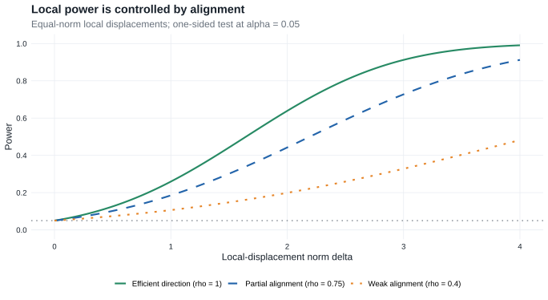

# Chapter 15: Efficiency of Tests

Chapter 15 develops the parametric testing template used later in [Section 25.6](chapter-25.qmd#sec-testing): represent limiting power in a [Gaussian limit experiment](glossary.qmd#glossary-limit-experiment), solve the optimal Gaussian testing problem, and transfer the resulting bound back to the original experiments.

::: {.callout-tip title="Why this chapter is here"}

- **Prerequisites:** [Theorem 8.3](chapter-8.qmd#theorem-limit-experiment-reduction), which reduces local estimation problems to Gaussian shift experiments; testing uses the same reduction for limiting power.
- **Purpose:** solve the one-sided Gaussian testing problem once, then transfer its power envelope back through LAN.
- **Chapter 25 payoff:** [Theorem 25.44](chapter-25.qmd#theorem-25-44) repeats this argument along a semiparametric tangent direction, and [Lemma 25.45](chapter-25.qmd#lemma-25-45) turns an efficient estimator into an efficient test.

:::

::: {.callout-note title="Companion readings"}

For parallel treatments of Gaussian testing, LAN power, and rank procedures, see [@bailie2021, §§15--19] and [@dasgupta2008, §§24.4, 24.9, and 25.2].

:::

## Reading guide

Only a selective part of Chapter 15 is needed for Chapter 25:

- **Section 15.1 is essential:** limiting power functions must be power functions of tests in the limit experiment.
- **Only the first part of Section 15.2 is essential:** Proposition 15.2 gives the uniformly most powerful test for a one-sided linear hypothesis in a Gaussian shift experiment.
- **Section 15.3 is essential:** Theorem 15.4 turns the Gaussian result into a local asymptotic power bound under LAN, and Addendum 15.5 shows how an efficient statistic attains that bound.
- **Section 15.4 is an optional application:** its signed-rank construction is not needed for the proof in Chapter 25, but its unknown-density problem returns in [§25.8.1](chapter-25.qmd#sec-25-8-symmetric-location).
- **Section 15.5 is compressed to two bridges:** Wilcoxon supplies a parametric two-sample analogue of [Example 25.46](chapter-25.qmd#example-25-46), while the log-rank test points toward the Cox-model thread.
- The two-sided, multidimensional-null, and detailed rank-score calculations are omitted from the Chapter 25 route.

::: {.callout-note title="From Chapter 15 to Chapter 25"}

| Chapter 15: parametric LAN | Chapter 25: semiparametric model |
|---|---|
| Local parameter vector $h$ | Path $t\mapsto P_{t,g}$ with score $g$ |
| Gradient of the parameter | Pathwise derivative $\dot\psi_Pg=P\widetilde\psi_Pg$ |
| Parametric efficiency bound | $P\widetilde\psi_P^2$ |
| Theorem 15.4 | [Theorem 25.44](chapter-25.qmd#theorem-25-44) |
| Addendum 15.5 | [Lemma 25.45](chapter-25.qmd#lemma-25-45) |

The finite-dimensional LAN proof from Chapter 15 is the template. Chapter 25 replaces the parametric gradient and information matrix by a tangent space and the efficient influence function.

:::

## 15.1 Asymptotic Representation Theorem {#sec-chapter-15-representation}

A randomized test is a measurable function $\phi:\mathcal X\to[0,1]$. Its power function is

$$
\pi(h)=E_h\phi(X),
$$

and it has level $\alpha$ for a null set $H_0$ when

$$
\sup_{h\in H_0}\pi(h)\leq\alpha.
$$

::: {.callout-note title="Theorem"}
### Theorem 15.1: Limiting power is power in the limit experiment {#theorem-15-1}

Let $\mathcal E_n=(P_{n,h}:h\in H)$ converge to a dominated experiment $\mathcal E=(P_h:h\in H)$. Suppose the power functions $\pi_n$ of tests in $\mathcal E_n$ converge pointwise to a function $\pi$:

$$
\pi_n(h)\longrightarrow\pi(h),
\qquad h\in H.
$$

Then there exists a test $\phi$ in the limit experiment such that

$$
\pi(h)=E_h\phi(X),
\qquad h\in H.
$$

:::

For a limsup argument, select a subsequence on which the relevant powers converge and apply the theorem to that subsequence. This is the testing counterpart of the asymptotic representation result in [Theorem 7.10](chapter-7.qmd#theorem-normal-limit-experiment) and the estimator reduction in [Theorem 8.3](chapter-8.qmd#theorem-limit-experiment-reduction).

**Proof roadmap.** First solve every finite restriction of the limit experiment by finite asymptotic representation and condition away its auxiliary randomization. Then regard the tests with each prescribed power as weak-* closed subsets of the weak-* compact order interval $[0,1]\subset L_\infty(\mu)$. The finite-intersection property produces one test with all the required powers.

Complete proof of Theorem 15.1

**Derivation in these notes.**

Because the limit experiment is dominated, choose a probability measure $\mu$ dominating every $P_h$, and write $p_h=dP_h/d\mu$. For each finite set $I\subset H$, restrict both the converging experiments and the power functions to $I$. The finite asymptotic-representation result gives a randomized statistic $T_I=T_I(X,U)$ in the restricted limit experiment such that

$$
E_hT_I(X,U)=\pi(h),
\qquad h\in I.
$$

The statistic may be chosen in $[0,1]$, because the original statistics are tests. Condition away the auxiliary randomization:

$$
\phi_I(x)=E\{T_I(X,U)\mid X=x\}.
$$

Then $0\leq\phi_I\leq1$ and, by iterated expectation,

$$
\int\phi_Ip_h\,d\mu
=E_h\phi_I(X)
=E_hT_I(X,U)
=\pi(h),
\qquad h\in I.
\tag{15.1a}
$$

It remains to choose one test that satisfies these identities simultaneously for every $h\in H$. In $L_\infty(\mu)$, define

$$
K=\{\phi:0\leq\phi\leq1\ \mu\text{-almost everywhere}\}
$$

and, for each $h\in H$,

$$
C_h
=\left\{\phi\in K:\int\phi p_h\,d\mu=\pi(h)\right\}.
$$

Give $L_\infty(\mu)$ its weak-* topology $\sigma\{L_\infty(\mu),L_1(\mu)\}$. The set $K$ is weak-* compact: it is a weak-* closed subset of the unit ball, which is weak-* compact by Banach--Alaoglu. To see closedness, note that $\phi\geq0$ almost everywhere is equivalent to

$$
\int\phi g\,d\mu\geq0
\qquad\text{for every nonnegative }g\in L_1(\mu),
$$

and apply the same characterization to $1-\phi$. Each $C_h$ is weak-* closed in $K$, because $p_h\in L_1(\mu)$ makes $\phi\mapsto\int\phi p_h\,d\mu$ weak-* continuous.

For every finite $I\subset H$, equation (15.1a) shows that

$$
\phi_I\in\bigcap_{h\in I}C_h.
$$

Thus the family $(C_h:h\in H)$ has the finite-intersection property. Compactness of $K$ implies

$$
\bigcap_{h\in H}C_h\neq\varnothing.
$$

Choose $\phi$ in this intersection. Then $0\leq\phi\leq1$ and

$$
E_h\phi(X)=\int\phi p_h\,d\mu=\pi(h)
$$

for every $h\in H$. Hence $\phi$ is the required test in the limit experiment.

::: {.callout-important title="Practical consequence"}

To bound the asymptotic power of every valid sequence of tests, find the best level-$\alpha$ test in the limit experiment.

:::

## 15.2 Testing Normal Means {#sec-chapter-15-gaussian-test}

Suppose that the limit observation satisfies

$$
X\sim N_k(h,\Sigma),
$$

where $\Sigma$ is known. For a fixed vector $c$, begin with the boundary problem $H_0:c^Th=0$ versus $H_1:c^Th>0$.

::: {.callout-note title="Proposition"}
### Proposition 15.2: One-sided Gaussian test {#proposition-15-2}

Suppose $\Sigma$ is nonnegative definite and $c^T\Sigma c>0$. The uniformly most powerful level-$\alpha$ test rejects when

$$
Z_c=\frac{c^TX}{(c^T\Sigma c)^{1/2}}\geq z_\alpha,
$$

where $1-\Phi(z_\alpha)=\alpha$. Its power at $h$ is

$$
1-\Phi\left(z_\alpha-\frac{c^Th}{(c^T\Sigma c)^{1/2}}\right).
$$

:::

The same critical value gives a level-$\alpha$ test for the larger null $c^Th\leq0$, because its rejection probability increases with $c^Th$ and is largest on the null boundary.

**Proof roadmap.** Reduce each alternative to a simple Gaussian likelihood-ratio test against a point on the null boundary, apply the Neyman--Pearson lemma, and observe that the resulting rejection rule is independent of the chosen pair.

Complete proof of Proposition 15.2

Fix any alternative $h_1$ with $c^Th_1>0$, and set

$$
h_0=h_1-\frac{c^Th_1}{c^T\Sigma c}\Sigma c.
$$

Then $c^Th_0=0$. The log likelihood ratio for testing the two simple hypotheses $h=h_0$ and $h=h_1$ is

$$
\log\frac{dN_k(h_1,\Sigma)}{dN_k(h_0,\Sigma)}(X)
=\frac{c^Th_1}{c^T\Sigma c}c^TX
-\frac12\frac{(c^Th_1)^2}{c^T\Sigma c},
$$

interpreted on the common support if $\Sigma$ is singular. It is strictly increasing in $c^TX$. By the Neyman--Pearson lemma, the most powerful level-$\alpha$ test for this pair rejects when $c^TX\geq z_\alpha(c^T\Sigma c)^{1/2}$. The rejection rule does not depend on the particular $h_0$ or $h_1$, so it is uniformly most powerful for the composite boundary-null problem. Standardizing $c^TX\sim N(c^Th,c^T\Sigma c)$ gives the displayed power formula.

This is the only normal-testing result from Section 15.2 needed for [Section 25.6](chapter-25.qmd#sec-testing). The two-sided and multidimensional-null discussions are not used there because Chapter 25 considers a scalar, one-sided functional.

::: {#fifteenfig-ch15-local-power}

{fig-alt="At each fixed local-displacement norm, three increasing power curves compare full, partial, and weak alignment. The fully aligned curve is highest and all begin at level 0.05."}

Among equal-norm local displacements, a statistic aligned with the displacement has the greatest Gaussian local power.

:::

The same curves will be reused in [Section 25.6](chapter-25.qmd#sec-testing): the finite-dimensional alignment coefficient becomes the normalized inner product between the efficient influence function and a tangent direction.

## 15.3 Local Asymptotic Normality {#sec-chapter-15-lan-power}

In a parametric LAN model, the local experiments converge to a Gaussian shift experiment. [Theorem 15.1](#theorem-15-1) transfers any limiting power function to that Gaussian experiment, and [Proposition 15.2](#proposition-15-2) bounds it by the Gaussian uniformly most powerful test.

Following the source, let $(P_{n,\theta}:\theta\in\Theta)$ be LAN at $\theta_0$ with scalar norming constants $r_n\to\infty$ if

$$
\log\frac{dP_{n,\theta_0+r_n^{-1}h}}{dP_{n,\theta_0}}
=h^T\Delta_{n,\theta_0}-\frac12h^TI_{\theta_0}h
+o_{P_{n,\theta_0}}(1),
\tag{15.3}
$$

where $\Delta_{n,\theta_0}\rightsquigarrow N_k(0,I_{\theta_0})$ under $P_{n,\theta_0}$.

::: {.callout-note title="Theorem"}
### Theorem 15.4: Local asymptotic power bound {#theorem-15-4}

Let $\Theta\subset\mathbb R^k$ be open and let $\psi:\Theta\to\mathbb R$ be differentiable at $\theta_0$, with nonzero gradient $\dot\psi_{\theta_0}$ and $\psi(\theta_0)=0$. Suppose $(P_{n,\theta}:\theta\in\Theta)$ is LAN at $\theta_0$ as in (15.3), with nonsingular $I_{\theta_0}$. If $\pi_n(\theta)$ is the power function of any level-$\alpha$ test of

$$
H_0:\psi(\theta)\leq0
\qquad\text{against}\qquad
H_1:\psi(\theta)>0,
$$

then, for every $h$ such that $\dot\psi_{\theta_0}h>0$,

$$
\limsup_{n\to\infty}\pi_n\left(\theta_0+\frac h{r_n}\right)
\leq
1-\Phi\!\left(
z_\alpha-
\frac{\dot\psi_{\theta_0}h}
{\{\dot\psi_{\theta_0}I_{\theta_0}^{-1}\dot\psi_{\theta_0}^T\}^{1/2}}
\right).
$$

:::

::: {.callout-important title="Addendum"}
### Addendum 15.5: Attainment of the bound {#addendum-15-5}

If statistics $T_n$ satisfy

$$
T_n=
\frac{\dot\psi_{\theta_0}I_{\theta_0}^{-1}\Delta_{n,\theta_0}}
{\{\dot\psi_{\theta_0}I_{\theta_0}^{-1}\dot\psi_{\theta_0}^T\}^{1/2}}
+o_{P_{n,\theta_0}}(1),
$$

then the tests that reject when $T_n\geq z_\alpha$ attain the bound in Theorem 15.4: for every fixed $h$, their power under $P_{n,\theta_0+h/r_n}$ converges to the theorem's power envelope.

:::

**Proof roadmap.** The argument has three steps:

1. use LAN to obtain a Gaussian limit experiment;
2. use Theorem 15.1 to represent the limiting power by a test in that experiment;
3. use Proposition 15.2 to bound the limiting power, with Addendum 15.5 showing how to reach the bound.

Complete proof of Theorem 15.4 and Addendum 15.5

The localized experiments $(P_{n,\theta_0+r_n^{-1}h}:h\in\mathbb R^k)$ converge to the Gaussian location experiment $(N_k(h,I_{\theta_0}^{-1}):h\in\mathbb R^k)$.

Fix $h_1$ with $\dot\psi_{\theta_0}h_1>0$, and choose a subsequence along which the limsup in Theorem 15.4 is attained. Along a further subsequence, Theorem 15.1 gives a limiting power function $\pi(h)$ in the Gaussian experiment. If $\dot\psi_{\theta_0}h<0$, differentiability implies

$$
\psi(\theta_0+r_n^{-1}h)
=r_n^{-1}\{\dot\psi_{\theta_0}h+o(1)\}<0
$$

eventually. These parameters belong to the null, so $\pi(h)\leq\alpha$. Continuity of Gaussian power functions extends this inequality to $\dot\psi_{\theta_0}h=0$. Thus $\pi$ is a level-$\alpha$ power function for the Gaussian problem

$$
H_0:\dot\psi_{\theta_0}h\leq0
\qquad\text{against}\qquad
H_1:\dot\psi_{\theta_0}h>0.
$$

Apply Proposition 15.2 with $c=\dot\psi_{\theta_0}^T$ and $\Sigma=I_{\theta_0}^{-1}$. Its power envelope is exactly the right side of Theorem 15.4. Since the initial subsequence attained the limsup, this proves the theorem.

For the addendum, LAN and the central limit theorem give, under $P_{n,\theta_0}$,

$$
\left(
\Delta_{n,\theta_0},
\log\frac{dP_{n,\theta_0+r_n^{-1}h}}{dP_{n,\theta_0}}
\right)
\rightsquigarrow
\left(\Delta,h^T\Delta-\frac12h^TI_{\theta_0}h\right),
$$

where $\Delta\sim N_k(0,I_{\theta_0})$. Le Cam's third lemma shifts the distribution of $\Delta_{n,\theta_0}$ under $P_{n,\theta_0+r_n^{-1}h}$ to $N_k(I_{\theta_0}h,I_{\theta_0})$. Substitution into the expansion in Addendum 15.5 yields

$$
T_n\rightsquigarrow
N\!\left(
\frac{\dot\psi_{\theta_0}h}
{\{\dot\psi_{\theta_0}I_{\theta_0}^{-1}\dot\psi_{\theta_0}^T\}^{1/2}},
1
\right).
$$

The probability of exceeding $z_\alpha$ is the power envelope in Theorem 15.4, which proves attainment.

For the semiparametric path $P_{h/\sqrt n,g}$ in Chapter 25, the normalized mean shift becomes

$$
h\frac{P\widetilde\psi_Pg}{(P\widetilde\psi_P^2)^{1/2}}.
$$

Substituting this signal-to-noise ratio into the Gaussian power function gives [Theorem 25.44](chapter-25.qmd#theorem-25-44). Thus Theorem 25.44 is the semiparametric extension of Theorem 15.4, while [Lemma 25.45](chapter-25.qmd#lemma-25-45) extends Addendum 15.5.

::: {.callout-tip title="Example"}
### Example 15.6: Wald tests {#example-15-6}

Let $X_1,\ldots,X_n$ be sampled from a DQM model $(P_\theta:\theta\in\Theta)$ with nonsingular information. The i.i.d. local experiments have $r_n=\sqrt n$ and

$$
\Delta_{n,\theta}=\frac1{\sqrt n}\sum_{i=1}^n\dot\ell_\theta(X_i).
$$

An efficient estimator $\widehat\theta_n$ satisfies

$$
\sqrt n(\widehat\theta_n-\theta)
=I_\theta^{-1}\Delta_{n,\theta}+o_{P_\theta}(1).
$$

If $\theta\mapsto I_\theta$ is continuous and $\psi$ is continuously differentiable with nonzero gradient, then the test of $H_0:\psi(\theta)\leq0$ that rejects when

$$
\sqrt n\,\psi(\widehat\theta_n)
\geq z_\alpha
\left\{\dot\psi_{\widehat\theta_n}
I_{\widehat\theta_n}^{-1}
\dot\psi_{\widehat\theta_n}^T\right\}^{1/2}
$$

is locally asymptotically optimal at every boundary point $\theta_0$ with $\psi(\theta_0)=0$, and it is consistent at every fixed $\theta$ with $\psi(\theta)>0$. This follows from the delta method, Slutsky's lemma, and Addendum 15.5. When $\widehat\theta_n$ is the maximum likelihood estimator, this is the Wald test.

The structural message survives in Chapter 25: an efficient estimator, standardized by its efficient variance, produces an efficient test. [Lemma 25.45](chapter-25.qmd#lemma-25-45) states that conclusion without requiring a finite-dimensional estimator of the full parameter.

:::

## 15.4 One-Sample Location

Section 15.4 applies the preceding theory to one-sample location models and constructs asymptotically optimal signed-rank procedures. It is a useful example of the theory, but it is not required for the testing argument in Chapter 25.

For observations from $f(x-\theta)$, with $f$ symmetric and with finite Fisher information for location $I_f$, the best asymptotic level-$\alpha$ power against $\theta=h/\sqrt n$ is

$$
1-\Phi(z_\alpha-h\sqrt{I_f}).
$$

Statistics satisfying the source's expansion

$$
T_n=-\frac1{\sqrt{nI_f}}\sum_{i=1}^n\frac{f'}f(X_i)
+o_{P_0}(1)
\tag{15.7}
$$

attain this power. A linear signed-rank statistic can reproduce the same first-order term when its score-generating function is chosen as

$$
\phi(u)=-\frac1{\sqrt{I_f}}
\frac{f'}f\!\left\{(F^+)^{-1}(u)\right\},
\qquad F^+(x)=P_f(|X|\leq x).
$$

Thus signs and absolute ranks retain, asymptotically, the information needed for efficient location testing at a fixed symmetric density.

The model returns in [Section 25.8.1](chapter-25.qmd#sec-25-8-symmetric-location), where the emphasis changes from deriving a parametric power envelope to estimating the efficient score when the symmetric error density is unknown.

::: {.callout-note title="What is compressed"}
The detailed $t$-test, Laplace, normal-score, and adaptive signed-rank examples are omitted. Their common lesson is represented by the display above: once the estimated score is close enough to the efficient location score, its test attains the same local Gaussian power envelope. Section 25.8.1 addresses the harder step of estimating that score without knowing $f$.
:::

## 15.5 Two-Sample Problems {#sec-chapter-15-two-sample}

Section 15.5 develops the corresponding theory for two independent samples. The local two-sample experiment is LAN, so suitably chosen rank statistics can attain the parametric local-power bound.

::: {.callout-tip title="Example"}
### Example 15.15: Wilcoxon rank-sum statistic {#example-15-15}

For two logistic location distributions with different means, the optimal rank scores are proportional to the ranks themselves. The Wilcoxon rank-sum, or Mann--Whitney, statistic is therefore asymptotically uniformly most powerful for detecting a location difference in this parametric model.

This is narrower than [Example 25.46](chapter-25.qmd#example-25-46). Chapter 25 treats $F$ and $G$ as completely unknown and shows that the same statistic is efficient for the nonparametric functional $\int F\,dG=P(X\leq Y)$.

:::

::: {.callout-tip title="Example"}
### Example 15.16: Log-rank test {#example-15-16}

The log-rank test is asymptotically optimal for proportional-hazards alternatives for any baseline distribution. Its statistic is the testing counterpart of the efficient Cox regression score: observed events are compared with their risk-set expectations, while the unknown baseline hazard is removed as a nuisance.

This gives an early testing view of the Cox thread that returns as nuisance-score projection in [Example 25.17](chapter-25.qmd#example-25-17), as profile likelihood in [Example 25.69](chapter-25.qmd#example-25-69), and as a joint likelihood-equation calculation in [§25.12.1](chapter-25.qmd#sec-25-12-cox-model).

:::
