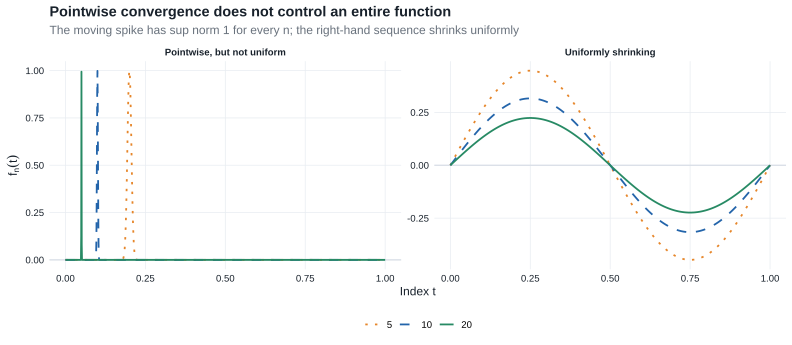

# Chapter 18: Stochastic Convergence in Metric Spaces

This chapter extends stochastic convergence from Euclidean random vectors to random functions and other objects in metric spaces. Its central lesson is that convergence of every fixed coordinate is not enough: a process limit also requires uniform control between coordinates.

::: {.callout-tip title="Why this chapter is here"}

- **Prerequisites:** the scalar and vector convergence tools in [Chapter 2](chapter-2.qmd#sec-convergence).
- **Purpose:** define weak convergence, tightness, and continuous mapping for possibly nonmeasurable maps into function spaces, then characterize convergence in $\ell^\infty(T)$ by finite-dimensional convergence and finite approximation.
- **Chapter 25 payoff:** [§25.7](chapter-25.qmd#sec-efficiency-delta-method) uses differentiable maps between normed spaces, and [§25.12](chapter-25.qmd#sec-likelihood-equations) linearizes Banach-space-valued likelihood equations. [Chapter 19](chapter-19.qmd#donsker-classes) turns the present process theory into empirical-process tools.

:::

::: {.callout-note title="Companion readings"}

For a gentler process-level development, see §§9.2–10.1 of @sen2022. For systematic treatments of weak convergence in metric spaces, see chs. 6–7 of @kosorok2008 and @vanDerVaartWellner1996. The measurable-map and image-measure viewpoint is developed in §§2.2 and 2.9 of @pollard2002.

:::

::: {.callout-note title="Reading guide"}

- **Core — §18.1, Definition 18.1, Lemma 18.2, and Examples 18.5, 18.7, and 18.8:** metric-space definitions and selected function spaces used in [Chapter 19](chapter-19.qmd#donsker-classes) and [§25.7](chapter-25.qmd#sec-efficiency-delta-banach).
- **Core — §18.2, Lemma 18.9, and Theorems 18.10–18.11:** outer-probability conventions, modes of convergence, and the process-level continuous mapping theorem; identical Chapter 2 arguments are linked rather than repeated.
- **Core — §18.3, Theorem 18.14, and Lemma 18.15:** finite-dimensional convergence, asymptotic equicontinuity, and the Gaussian semimetric used by Donsker theory and [Z-estimation](chapter-19.qmd#theorem-19-26-infinite-dimensional-z-estimation).
- **Compressed — Theorem 18.12:** the exact tightness statement is retained, while its proof remains deferred as in the source.
- **Omitted/deferred — Examples 18.3, 18.4, and 18.6 and Lemma 18.13:** material that adds no further prerequisite for the route to Chapter 25.

:::

## 18.1 Metric and Normed Spaces

A metric space is a set $\mathbb D$ equipped with a function $d:\mathbb D\times\mathbb D\to[0,\infty)$ such that, for all $x,y,z\in\mathbb D$,

1. $d(x,y)=d(y,x)$;
2. $d(x,z)\leq d(x,y)+d(y,z)$; and
3. $d(x,y)=0$ if and only if $x=y$.

Following the source, a **semimetric** satisfies the first two properties but need not satisfy the third. A space is **separable** if it contains a countable dense subset. A set is **totally bounded** if, for every $\varepsilon>0$, it can be covered by finitely many balls of radius $\varepsilon$. In a complete semimetric space, a subset is compact exactly when it is closed and totally bounded.

A normed space is a vector space $\mathbb D$ with a norm $\|\cdot\|$. Every norm induces the metric $d(x,y)=\|x-y\|$. A seminorm may assign distance zero to distinct vectors, just as a semimetric may fail to separate points.

::: {.callout-note title="Definition"}
### Definition 18.1: Borel measurability and random elements {#sec-random-elements}

The **Borel $\sigma$-field** on a metric space $\mathbb D$ is the smallest $\sigma$-field containing every open set. A Borel-measurable map

$$
X:(\Omega,\mathcal A,P)\to\mathbb D
$$

is a **random element** with values in $\mathbb D$. Random variables, random vectors, and random functions are all instances of this definition.
:::

The [measurability diagram in the glossary](glossary.qmd#glossary-measurability) shows the same pullback construction: target Borel sets must have measurable inverse images in the probability space.

::: {.callout-important title="Lemma"}
### Lemma 18.2: continuous maps are Borel measurable {#lemma-18.2}

Every continuous map between metric spaces is Borel measurable.
:::

**Proof roadmap.**

Continuity makes the inverse image of each open set open. Since open sets generate the target Borel $\sigma$-field, their inverse images generate only sets in the source Borel $\sigma$-field.

Complete proof

Let $g:\mathbb D\to\mathbb E$ be continuous. For every open $G\subset\mathbb E$, the inverse image $g^{-1}(G)$ is open in $\mathbb D$, hence Borel. The collection

$$
\{B\subset\mathbb E:g^{-1}(B)\text{ is Borel in }\mathbb D\}
$$

is a $\sigma$-field containing all open subsets of $\mathbb E$. It therefore contains the Borel $\sigma$-field of $\mathbb E$, which proves that $g$ is Borel measurable.

This lemma makes continuous functionals of random elements ordinary random variables whenever the input map is Borel measurable. The outer conventions in §18.2 cover the cases in which the input map itself is not measurable.

::: {.callout-tip title="Example"}
### Example 18.5: uniform norm {#example-18-5}

For an arbitrary index set $T$,

$$
\ell^\infty(T)=\left\{z:T\to\mathbb R:\sup_{t\in T}|z(t)|<\infty\right\}
$$

is the space of bounded functions on $T$. With the uniform norm

$$
\|z\|_T=\sup_{t\in T}|z(t)|,
$$

convergence in $\ell^\infty(T)$ is uniform convergence. The space is separable if and only if $T$ is finite.
:::

::: {#eighteenfig-ch18-pointwise-uniform}

{fig-alt="The left panel shows increasingly narrow spikes whose maximum remains one; the right panel shows sinusoidal functions whose maximum magnitude shrinks toward zero."}

Pointwise convergence can miss a moving spike, whereas uniform convergence controls the largest discrepancy over the whole index set.

:::

The moving spike is the warning that motivates Theorem 18.14: limits at each fixed $t$ do not control behavior at an index $t_n$ that changes with $n$.

::: {.callout-tip title="Example"}
### Example 18.7: uniformly continuous functions {#example-18-7}

Let $(T,\rho)$ be totally bounded. The space $UC(T,\rho)$ consists of functions $z:T\to\mathbb R$ that are uniformly $\rho$-continuous. Such functions are bounded, so

$$
UC(T,\rho)\subset\ell^\infty(T).
$$

Equipped with the uniform norm, $UC(T,\rho)$ is complete and separable. Its Borel $\sigma$-field is generated by the coordinate projections $z\mapsto z(t)$.
:::

::: {.callout-tip title="Example"}
### Example 18.8: product-space measurability {#example-18-8-product-spaces}

For metric spaces $(\mathbb D,d)$ and $(\mathbb E,e)$, equip $\mathbb D\times\mathbb E$ with

$$
f\{(x_1,y_1),(x_2,y_2)\}
=d(x_1,x_2)\vee e(y_1,y_2).
$$

There are then two natural $\sigma$-fields: the product of the two Borel $\sigma$-fields and the Borel $\sigma$-field generated by $f$. The latter can be larger. Consequently, Borel measurability of $X:\Omega\to\mathbb D$ and $Y:\Omega\to\mathbb E$ always makes $(X,Y)$ measurable for the product $\sigma$-field, but need not make it Borel measurable for the product metric.

A concrete safe case is

$$
X:\Omega\to UC(T,\rho),
\qquad
Y:\Omega\to\mathbb R^p.
$$

Both ranges are separable, so the two product $\sigma$-fields agree and $(X,Y)$ is a random element. By contrast, for processes viewed in the generally nonseparable space $\ell^\infty(T)$, coordinatewise measurability alone does not settle Borel measurability of the whole process or of a pair of processes. This is one reason the outer notation below is not cosmetic.
:::

## 18.2 Basic Properties

Distribution functions do not extend naturally to arbitrary metric spaces. Van der Vaart therefore defines weak convergence through bounded continuous test functions and allows the approximating maps to be nonmeasurable.

### Outer expectation and probability {#sec-outer-expectation}

For an arbitrary map $Z:\Omega\to\overline{\mathbb R}$, define its **outer expectation** by

$$
E^*Z
=\inf\{EU:U\text{ is measurable},\ U\geq Z,\ EU\text{ exists}\}.
$$

The inner expectation is $E_*Z=-E^*(-Z)$. For an arbitrary subset $A\subset\Omega$, its outer probability is

$$
P^*(A)
=E^*\mathbf 1_A
=\inf\{P(B):A\subset B,\ B\in\mathcal A\}.
$$

If $Z$ or $A$ is measurable, the outer quantity equals the ordinary expectation or probability. The star records that a measurable majorant or cover may be needed.

For arbitrary maps $X_n:\Omega_n\to\mathbb D$ and a Borel random element $X$ in $\mathbb D$:

1. **Weak convergence:** $X_n\rightsquigarrow X$ means

   $$
   E^*f(X_n)\to Ef(X)
   $$

   for every bounded continuous $f:\mathbb D\to\mathbb R$.
2. **Convergence in probability:** $X_n\overset P\to X$ means

   $$
   P^*\{d(X_n,X)>\varepsilon\}\to0
   $$

   for every $\varepsilon>0$.
3. **Outer almost-sure convergence:** $X_n\overset{\mathrm{as}^*}\longrightarrow X$ means that measurable random variables $\Delta_n$ exist such that

   $$
   d(X_n,X)\leq\Delta_n,
   \qquad
   \Delta_n\overset{\mathrm{as}}\longrightarrow0.
   $$

The last definition is deliberately stronger than merely asserting pointwise convergence outside a possibly nonmeasurable set.

::: {.callout-important title="Lemma"}
### Lemma 18.9: Portmanteau {#lemma-18-9}

For arbitrary maps $X_n:\Omega_n\to\mathbb D$ and every random element $X$ in $\mathbb D$, the following are equivalent:

1. $E^*f(X_n)\to Ef(X)$ for every bounded continuous $f$;
2. $E^*f(X_n)\to Ef(X)$ for every bounded Lipschitz $f$;
3. $\liminf_nP^*(X_n\in G)\geq P(X\in G)$ for every open $G$;
4. $\limsup_nP^*(X_n\in F)\leq P(X\in F)$ for every closed $F$; and
5. $P^*(X_n\in B)\to P(X\in B)$ for every Borel $B$ with $P(X\in\partial B)=0$.
:::

The proof is the metric-space version of [Lemma 2.2](chapter-2.qmd#lemma-portmanteau). The same Lipschitz approximation

$$
f_m(x)=m\,d(x,G^c)\wedge1
$$

handles open sets, and the remaining complement and boundary arguments are identical. Outer expectations and probabilities replace ordinary ones wherever an approximating map may be nonmeasurable; no new analytic step is required.

::: {.callout-note title="Theorem"}
### Theorem 18.10: relations among modes of stochastic convergence {#theorem-18-10}

For arbitrary maps $X_n,Y_n:\Omega_n\to\mathbb D$ and every random element $X$ in $\mathbb D$:

1. $X_n\overset{\mathrm{as}^*}\longrightarrow X$ implies $X_n\overset P\to X$;
2. $X_n\overset P\to X$ implies $X_n\rightsquigarrow X$;
3. $X_n\overset P\to c$ for a constant $c$ if and only if $X_n\rightsquigarrow c$;
4. if $X_n\rightsquigarrow X$ and $d(X_n,Y_n)\overset P\to0$, then $Y_n\rightsquigarrow X$;
5. if $X_n\rightsquigarrow X$ and $Y_n\overset P\to c$, then $(X_n,Y_n)\rightsquigarrow(X,c)$; and
6. if $X_n\overset P\to X$ and $Y_n\overset P\to Y$, then $(X_n,Y_n)\overset P\to(X,Y)$.
:::

These are exactly the relations proved in [Theorem 2.7](chapter-2.qmd#theorem-2-7), with outer probabilities inserted when necessary. The bounded-Lipschitz comparison in the proof of part 4 and the product-metric bound in part 6 already work in arbitrary metric spaces, so duplicating those arguments would add no new step.

::: {.callout-note title="Theorem"}
### Theorem 18.11: continuous mapping {#theorem-18-11}

Let $\mathbb D_n\subset\mathbb D$ be arbitrary subsets and let

$$
g_n:\mathbb D_n\to\mathbb E,
\qquad n\geq0,
$$

be arbitrary maps. Assume that, for every sequence $x_n\in\mathbb D_n$, whenever $x_{n'}\to x$ along a subsequence and $x\in\mathbb D_0$,

$$
g_{n'}(x_{n'})\to g_0(x).
$$

Let $X_n:\Omega_n\to\mathbb D_n$ be arbitrary maps and let $X$ be a random element taking values in $\mathbb D_0$, with $g_0(X)$ a random element in $\mathbb E$. Then:

1. if $X_n\rightsquigarrow X$, then $g_n(X_n)\rightsquigarrow g_0(X)$;
2. if $X_n\overset P\to X$, then $g_n(X_n)\overset P\to g_0(X)$; and
3. if $X_n\overset{\mathrm{as}^*}\longrightarrow X$, then $g_n(X_n)\overset{\mathrm{as}^*}\longrightarrow g_0(X)$.
:::

**Proof roadmap.**

For weak convergence, collect all late inverse images of a closed set and close their union. The sequential hypothesis identifies every point that remains in all such closures. Portmanteau then supplies the closed-set inequality. For probability and outer almost-sure convergence, use the subsequence characterization of convergence in probability and apply the same deterministic sequential hypothesis along almost-surely convergent sample paths.

Complete proof

**Weak convergence.** Let $F\subset\mathbb E$ be closed and define the closed subsets of $\mathbb D$

$$
A_k
=\overline{\bigcup_{m\geq k}
\{x\in\mathbb D_m:g_m(x)\in F\}}.
$$

They decrease with $k$, and

$$
\bigcap_{k=1}^\infty A_k
\subset g_0^{-1}(F)\cup(\mathbb D\setminus\mathbb D_0).
\tag{18.11.1}
$$

To verify the inclusion, take $x$ in the intersection. For each $k$, choose $m_k\geq k$ and $x_{m_k}\in\mathbb D_{m_k}$ so that $m_k\uparrow\infty$, $d(x_{m_k},x)<1/k$, and $g_{m_k}(x_{m_k})\in F$. If $x\in\mathbb D_0$, the sequential hypothesis gives $g_{m_k}(x_{m_k})\to g_0(x)$. Closedness of $F$ then gives $g_0(x)\in F$, proving (18.11.1).

For fixed $k$ and every $n\geq k$,

$$
\{g_n(X_n)\in F\}\subset\{X_n\in A_k\}.
$$

If $X_n\rightsquigarrow X$, the closed-set form of Portmanteau gives

$$
\limsup_nP^*\{g_n(X_n)\in F\}
\leq P(X\in A_k).
$$

Let $k\to\infty$. Continuity from above and (18.11.1), together with $P(X\in\mathbb D_0)=1$, yield

$$
\limsup_nP^*\{g_n(X_n)\in F\}
\leq P\{g_0(X)\in F\}.
$$

Portmanteau in $\mathbb E$ proves $g_n(X_n)\rightsquigarrow g_0(X)$.

**Convergence in probability.** Use the outer-probability subsequence criterion: $Z_n\overset P\to0$ if and only if every subsequence has a further subsequence that converges to zero in the outer almost-sure sense. For the forward implication, select indices so that $P^*(Z_{n_j}>2^{-j})<2^{-j}$, cover these events by measurable sets with summable probabilities, and apply Borel--Cantelli. The converse follows because outer almost-sure convergence implies convergence in outer probability.

Starting from any subsequence of $X_n$, this criterion and $X_n\overset P\to X$ give a further subsequence, again denoted $X_{n'}$, such that $d(X_{n'},X)\to0$ in the outer almost-sure sense. Outside one measurable null set, set

$$
x_{n'}=X_{n'}(\omega),
\qquad x=X(\omega)\in\mathbb D_0.
$$

The sequential hypothesis gives

$$
g_{n'}\{X_{n'}(\omega)\}\to g_0\{X(\omega)\}.
$$

The measurable-majorant convention encoded by $\mathrm{as}^*$ transfers this pathwise conclusion to outer almost-sure convergence of the output subsequence. The subsequence criterion now gives $g_n(X_n)\overset P\to g_0(X)$.

**Outer almost-sure convergence.** If $d(X_n,X)\leq\Delta_n$ with measurable $\Delta_n\to0$ almost surely, then outside one null set $X_n(\omega)\to X(\omega)\in\mathbb D_0$. The sequential hypothesis again gives pointwise convergence of the transformed maps. Taking measurable envelopes of the tail output distances gives the majorants required in the definition of $\mathrm{as}^*$, and these majorants decrease to zero almost surely.

Van der Vaart prints the weak-convergence argument above and notes that the other refinements are not needed later in the source. The final two paragraphs complete the other two stated conclusions using the same outer subsequence device as Theorem 18.10.

When $\mathbb D_n=\mathbb D$ and $g_n=g_0$, the sequential condition is ordinary continuity on the support of $X$, so this result reduces to [Theorem 2.3](chapter-2.qmd#theorem-continuous-mapping). Allowing both the domain and the map to vary is the form used in the functional delta method in Chapter 20.

### Tightness {#sec-tightness}

A Borel random element $X$ in $\mathbb D$ is **tight** if, for every $\varepsilon>0$, there is a compact $K\subset\mathbb D$ such that

$$
P(X\notin K)<\varepsilon.
$$

An arbitrary sequence $X_n:\Omega_n\to\mathbb D$ is **asymptotically tight** if, for every $\varepsilon>0$, there is compact $K$ such that, for every $\delta>0$,

$$
\limsup_nP^*(X_n\notin K^\delta)<\varepsilon,
\qquad
K^\delta=\{y:d(y,K)<\delta\}.
$$

It is **asymptotically measurable** if, for every bounded continuous $f$,

$$
E^*f(X_n)-E_*f(X_n)\to0.
$$

::: {.callout-note title="Theorem"}
### Theorem 18.12: Prokhorov {#theorem-18-12}

Let $X_n:\Omega_n\to\mathbb D$ be arbitrary maps into a metric space.

1. If $X_n\rightsquigarrow X$ for a tight random element $X$, then $\{X_n:n\in\mathbb N\}$ is asymptotically tight and asymptotically measurable.
2. If $X_n$ is asymptotically tight and asymptotically measurable, then some subsequence converges weakly to a tight random element.
:::

Van der Vaart states that this version is not used in the source text and refers elsewhere for its proof. The complete Euclidean argument—where compact sets can be taken to be closed bounded rectangles—appears in [Theorem 2.4](chapter-2.qmd#theorem-2-4) and [Lemma 2.5](chapter-2.qmd#lemma-2-5). The metric-space result is recorded here because the compact-set language clarifies the necessity half of Theorem 18.14 and because tight subsequences reappear in [§25.7](chapter-25.qmd#sec-efficiency-delta-banach).

## 18.3 Bounded Stochastic Processes

A stochastic process $X=\{X_t:t\in T\}$ is a collection of random variables on one probability space. For fixed $\omega$, the function $t\mapsto X_t(\omega)$ is a sample path. If every sample path is bounded, the entire process can be viewed as one map

$$
X:\Omega\to\ell^\infty(T).
$$

::: {.callout-tip title="Running example: the empirical CDF"}

For i.i.d. observations $Z_1,\ldots,Z_n$ with distribution function $F$, the empirical CDF is the bounded random function

$$
F_n(t)=\frac1n\sum_{i=1}^n\mathbf 1\{Z_i\leq t\},
\qquad t\in\mathbb R.
$$

Each fixed coordinate $F_n(t)$ is measurable, but the whole map into the nonseparable space $\ell^\infty(\mathbb R)$ need not be Borel measurable. The outer conventions therefore let us state both

$$
\|F_n-F\|_{\mathbb R}\overset P\longrightarrow0
$$

and the process limit for

$$
\alpha_n(t)=\sqrt n\{F_n(t)-F(t)\}
$$

without pretending that coordinatewise measurability resolves the function-space issue.

Finite-dimensional central limit theorems handle $(\alpha_n(t_1),\ldots,\alpha_n(t_k))$. Theorem 18.14 identifies the additional finite-approximation condition needed for convergence of the entire process. Its Gaussian limit can be written $G_F(t)=B\{F(t)\}$ for a Brownian bridge $B$. With $\delta=|F(t)-F(s)|$, its natural semimetric is

$$
\rho_F(s,t)^2
=E\{G_F(s)-G_F(t)\}^2
=\delta(1-\delta).
$$

[Chapter 19](chapter-19.qmd#glivenko-cantelli-classes) develops the Glivenko--Cantelli and Donsker versions of this example.

:::

::: {.callout-note title="Theorem"}
### Theorem 18.14: weak convergence of stochastic processes {#theorem-weak-convergence-processes}

A sequence of arbitrary maps $X_n:\Omega_n\to\ell^\infty(T)$ converges weakly to a tight random element if and only if both conditions hold:

1. for every finite set $t_1,\ldots,t_k\in T$, the sequence

   $$
   (X_{n,t_1},\ldots,X_{n,t_k})
   $$

   converges in distribution in $\mathbb R^k$;
2. for every $\varepsilon,\eta>0$, there is a partition $T_1,\ldots,T_k$ of $T$ such that

   $$
   \limsup_{n\to\infty}
   P^*\left(
   \max_{1\leq j\leq k}
   \sup_{s,t\in T_j}|X_{n,s}-X_{n,t}|
   \geq\varepsilon
   \right)
   \leq\eta.
   $$
:::

**Proof roadmap.**

Necessity follows because coordinate projections are continuous and compact subsets of $\ell^\infty(T)$ admit finite uniform approximations. For sufficiency, nested finite partitions generate a totally bounded semimetric $\rho$ on $T$. Finite-dimensional limits first construct a process on a countable $\rho$-dense set; the oscillation condition and Borel--Cantelli make its paths uniformly continuous. Finite projections then approximate both $X_n$ and the constructed limit.

Complete proof

**Necessity.** Suppose $X_n\rightsquigarrow X$ for a tight random element $X$ in $\ell^\infty(T)$. For fixed $t_1,\ldots,t_k$, the coordinate map

$$
z\mapsto\{z(t_1),\ldots,z(t_k)\}
$$

is continuous. [Theorem 18.11](#theorem-18-11) therefore gives condition 1.

Fix $\varepsilon,\eta>0$. Tightness supplies compact $K\subset\ell^\infty(T)$ with $P(X\notin K)<\eta$. For any $a>0$, the bounded Lipschitz function

$$
h_a(z)=\{d(z,K)/a\}\wedge1
$$

equals one outside $K^a$ and zero on $K$. Weak convergence gives

$$
\limsup_nP^*(X_n\notin K^a)
\leq\lim_nE^*h_a(X_n)
=Eh_a(X)
\leq P(X\notin K)
<\eta.
\tag{18.14.1}
$$

Because $K$ is compact, choose $z_1,\ldots,z_N\in K$ forming an $\varepsilon/8$-net in the uniform norm. The vector

$$
t\mapsto\{z_1(t),\ldots,z_N(t)\}
$$

has bounded range in $\mathbb R^N$. Partition that bounded range into finitely many cubes of side $\varepsilon/4$ and take their inverse images in $T$. If $s,t$ are in the same resulting cell, then

$$
\max_{1\leq j\leq N}|z_j(s)-z_j(t)|\leq\varepsilon/4.
$$

If $z\in K^{\varepsilon/8}$, choose $y\in K$ with $\|z-y\|_T<\varepsilon/8$ and then $z_j$ with $\|y-z_j\|_T<\varepsilon/8$. For $s,t$ in the same cell,

$$
|z(s)-z(t)|
\leq2\|z-z_j\|_T+|z_j(s)-z_j(t)|
<3\varepsilon/4.
$$

Thus an oscillation of at least $\varepsilon$ forces $X_n\notin K^{\varepsilon/8}$. Equation (18.14.1) proves condition 2.

**Sufficiency.** For each $m\geq1$, apply condition 2 with $\varepsilon=\eta=2^{-m}$. Refine the partitions successively, which can only reduce their within-cell oscillations. Write the level-$m$ partition as

$$
T_1^m,\ldots,T_{k_m}^m.
$$

Define a semimetric

$$
\rho_m(s,t)=
\begin{cases}
0,&s,t\text{ are in the same level-}m\text{ cell},\\
1,&\text{otherwise},
\end{cases}
$$

and set

$$
\rho(s,t)=\sum_{m=1}^\infty2^{-m}\rho_m(s,t).
$$

The nesting makes $\rho_1\leq\rho_2\leq\cdots$. Every level-$m$ cell has $\rho$-diameter at most $\sum_{j>m}2^{-j}=2^{-m}$, so $(T,\rho)$ is totally bounded. Choose one representative from every cell at every level; the resulting countable set $T_0$ is $\rho$-dense in $T$.

Condition 1 and consistency of finite-dimensional limits permit Kolmogorov's consistency theorem to construct a process $\{X_t:t\in T_0\}$ satisfying

$$
(X_{n,t_1},\ldots,X_{n,t_k})
\rightsquigarrow
(X_{t_1},\ldots,X_{t_k})
$$

for every finite subset of $T_0$. For a finite $S\subset T_0$, Portmanteau and the level-$m$ oscillation bound give

$$
P\left(
\max_j\sup_{s,t\in T_j^m\cap S}|X_s-X_t|>2^{-m}
\right)
\leq2^{-m}.
$$

Increase $S$ through finite subsets of $T_0$ and use monotone convergence of the events. If $\rho(s,t)<2^{-m}$, then $\rho_m(s,t)=0$, so $s$ and $t$ lie in the same level-$m$ cell. Consequently,

$$
P\left(
\sup_{\substack{s,t\in T_0\\\rho(s,t)<2^{-m}}}
|X_s-X_t|>2^{-m}
\right)
\leq2^{-m}.
\tag{18.14.2}
$$

The right sides are summable. By Borel--Cantelli, almost every sample path on $T_0$ is uniformly $\rho$-continuous. Extend each such path uniquely to $T$. The resulting process $X$ has paths in $UC(T,\rho)$. This space is complete and separable, its Borel $\sigma$-field is generated by coordinates, and every Borel probability on it is tight. Hence $X$ is a tight random element of $\ell^\infty(T)$.

For each $m$, let $\pi_m:T\to T_0$ send every level-$m$ cell to its selected representative. Uniform continuity and the cell-diameter bound imply

$$
\|X\circ\pi_m-X\|_T\overset{\mathrm{as}}\longrightarrow0.
$$

For fixed $m$, both $X_n\circ\pi_m$ and $X\circ\pi_m$ are determined by $k_m$ coordinates, so condition 1 gives

$$
X_n\circ\pi_m\rightsquigarrow X\circ\pi_m
\qquad(n\to\infty).
$$

Let $f:\ell^\infty(T)\to[0,1]$ be Lipschitz. For every $a>0$,

$$
\begin{aligned}
|E^*f(X_n)-Ef(X)|
&\leq |E^*f(X_n)-E^*f(X_n\circ\pi_m)|\\
&\quad+|E^*f(X_n\circ\pi_m)-Ef(X\circ\pi_m)|\\
&\quad+|Ef(X\circ\pi_m)-Ef(X)|\\
&\leq \|f\|_{\mathrm{Lip}}a
+P^*\{\|X_n-X_n\circ\pi_m\|_T>a\}
+o(1),
\end{aligned}
$$

where $o(1)$ first lets $n\to\infty$ at fixed $m$ and then uses $X\circ\pi_m\to X$. Set $a=2^{-m}$. The partition construction bounds the limiting upper probability by $2^{-m}$, so

$$
\limsup_n|E^*f(X_n)-Ef(X)|
\leq(\|f\|_{\mathrm{Lip}}+1)2^{-m}+o_m(1).
$$

Let $m\to\infty$. The bounded-Lipschitz form of Portmanteau gives $X_n\rightsquigarrow X$.

Van der Vaart prints the constructive sufficiency argument. The compact-net argument at the start supplies the necessity direction that the source states but does not print.

The theorem can be read as

$$
\text{finite-dimensional convergence}
+\text{finite approximation}
\quad\Longleftrightarrow\quad
\text{weak convergence of the whole process}.
$$

Condition 2 is also called asymptotic tightness or asymptotic equicontinuity. It prevents the moving-spike behavior in @eighteenfig-ch18-pointwise-uniform.

::: {.callout-important title="Lemma"}
### Lemma 18.15: the natural semimetric of the limit {#lemma-18.15-the-natural-semimetric-of-the-limit}

Under conditions 1 and 2 of [Theorem 18.14](#theorem-weak-convergence-processes), there is a semimetric $\rho$ on $T$ such that $(T,\rho)$ is totally bounded and the weak limit can be constructed with almost every sample path in $UC(T,\rho)$. If the weak limit $X$ is zero-mean Gaussian, one may take

$$
\rho(s,t)=\operatorname{sd}(X_s-X_t).
$$
:::

**Proof roadmap.**

Theorem 18.14 already constructs one totally bounded semimetric supporting uniformly continuous paths. For a Gaussian process, compare that semimetric with the intrinsic standard-deviation semimetric. Compactness transfers by subsequences, and path continuity can fail only if two points at intrinsic distance zero have unequal process values. Separability reduces those possible pairs to a countable null union.

Complete proof

The proof of Theorem 18.14 constructs a semimetric $\rho$ for which $T$ is totally bounded and almost every path of $X$ belongs to $UC(T,\rho)$. This proves the first assertion.

Now suppose $X$ is zero-mean Gaussian and define

$$
\rho_2(s,t)=\operatorname{sd}(X_s-X_t)
=\{E(X_s-X_t)^2\}^{1/2}.
$$

Complete $(T,\rho)$ and extend the uniformly $\rho$-continuous paths. The completion is compact, so it is enough to work as if $(T,\rho)$ were compact and every path were $\rho$-continuous outside one null set.

Take any sequence $t_n\in T$. Compactness gives a subsequence $t_{n'}\to t$ in $\rho$. Path continuity implies

$$
X_{t_{n'}}\to X_t
\qquad\text{almost surely}.
$$

The differences $X_{t_{n'}}-X_t$ are zero-mean Gaussian and converge to zero in probability. Their variances must therefore converge to zero, so

$$
\rho_2(t_{n'},t)^2
=E(X_{t_{n'}}-X_t)^2
\to0.
$$

Every sequence thus has a $\rho_2$-convergent subsequence, which makes $(T,\rho_2)$ compact and hence totally bounded.

It remains to prove path continuity in $\rho_2$. Suppose a $\rho$-continuous sample path is not $\rho_2$-continuous. Then for some $t\in T$, $\varepsilon>0$, and sequence $t_n$,

$$
\rho_2(t_n,t)\to0,
\qquad
|X_{t_n}(\omega)-X_t(\omega)|\geq\varepsilon.
$$

By $\rho$-compactness, pass to a subsequence with $t_{n'}\to s$ in $\rho$. Then $X_{t_{n'}}(\omega)\to X_s(\omega)$, and the preceding subsequence argument also gives $\rho_2(t_{n'},s)\to0$. The triangle inequality implies $\rho_2(s,t)=0$, while

$$
|X_s(\omega)-X_t(\omega)|\geq\varepsilon.
$$

Therefore discontinuity can occur only on

$$
N=\{\omega:\text{some }s,t\in T\text{ satisfy }\rho_2(s,t)=0
\text{ but }X_s(\omega)\neq X_t(\omega)\}.
$$

The set $\{(s,t):\rho_2(s,t)=0\}$ has a countable $\rho$-dense subset $A$. Because paths are $\rho$-continuous, the event $N$ is unchanged if the pair $(s,t)$ is restricted to $A$. For every fixed pair in $A$ with $\rho_2(s,t)=0$,

$$
E(X_s-X_t)^2=0,
$$

so $X_s=X_t$ almost surely. A countable union of these null events is null. Hence $P(N)=0$, almost every path is $\rho_2$-continuous, and compactness makes that continuity uniform.

The intrinsic semimetric turns covariance into geometry: two indices are close when the Gaussian process cannot distinguish them in mean square. In the empirical-CDF example, this is exactly the Brownian-bridge semimetric $\rho_F$.

::: {.callout-tip title="Chapter takeaway"}

For an empirical process, the index $t$ becomes a function $f\in\mathcal F$, and the limit is a Gaussian process indexed by $\mathcal F$. Lemma 18.15 gives uniformly continuous sample paths under the natural variance semimetric. [Chapter 19](chapter-19.qmd#donsker-classes) uses that geometry to control empirical processes evaluated at estimated functions; [§25.8](chapter-25.qmd#sec-efficient-score-equations) then uses the resulting stochastic equicontinuity in efficient score equations.

$$
\text{random variables}
\longrightarrow
\text{random functions in }\ell^\infty(T)
\longrightarrow
\text{finite-dimensional convergence plus equicontinuity}
\longrightarrow
\text{weak process convergence}.
$$

:::
