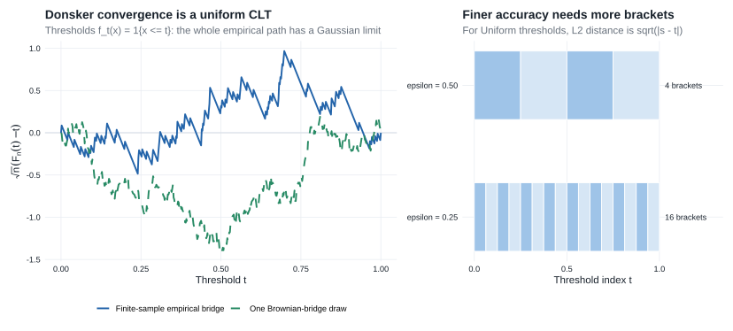
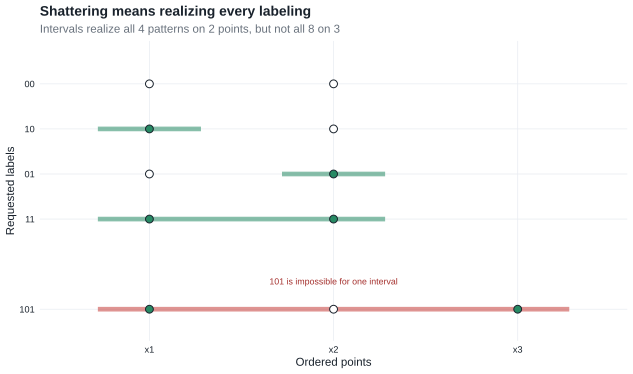
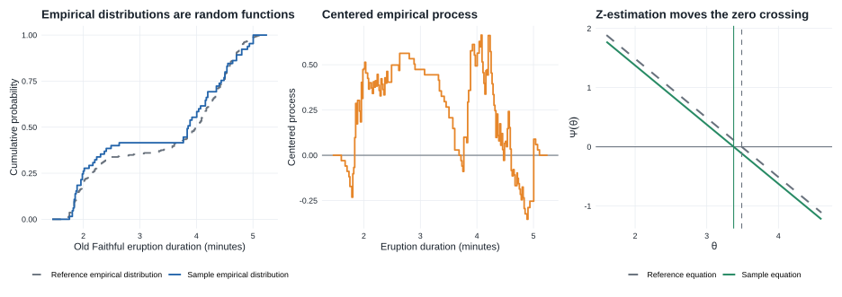

# Chapter 19: Empirical Processes

This chapter makes the ordinary law of large numbers and central limit theorem uniform over classes of functions. Its central objects are the [empirical measure](glossary.qmd#glossary-empirical-measure) $\mathbb P_n$ and [empirical process](glossary.qmd#glossary-empirical-process) $\mathbb G_n$.

::: {.callout-tip title="Why this chapter is here"}

- **Prerequisites:** [Chapter 18](chapter-18.qmd#theorem-weak-convergence-processes), which explains finite-dimensional convergence, tightness, and asymptotic equicontinuity for random functions.
- **Purpose:** turn those abstract tools into uniform laws for sample averages indexed by function classes.
- **Chapter 25 payoff:** Donsker theory controls estimated scores in [§25.8](chapter-25.qmd#sec-efficient-score-equations), supplies nuisance-rate bounds in [§25.11](chapter-25.qmd#sec-approximately-least-favorable-submodels), and gives the Gaussian process used to linearize [likelihood equations in §25.12](chapter-25.qmd#sec-likelihood-equations).

:::

The chapter develops two levels of uniformity:

- A [**Glivenko–Cantelli class**](glossary.qmd#glossary-glivenko-cantelli) supports a uniform law of large numbers.
- A [**Donsker class**](glossary.qmd#glossary-donsker) supports a uniform central limit theorem.

Donsker conditions also control empirical processes evaluated at estimated random functions, including functions that depend on nuisance estimates.

::: {.callout-note title="Companion readings"}

For complementary introductions, see §§1.3–4 and ch. 11 of @sen2022, chs. 8–10 and §13.2 of @kosorok2008, and ch. 7 of @jiang2022. The standard comprehensive reference is @vanDerVaartWellner1996.

:::

::: {.callout-note title="Reading guide"}

- **Core — §§19.1–19.2:** empirical measures, Glivenko–Cantelli and Donsker classes, the complete bracketing route to Theorem 19.5, and selected entropy examples used throughout Chapter 25.
- **Core — §19.4:** Lemma 19.24, Example 19.25, and Theorem 19.26 for estimated random functions and infinite-dimensional estimating equations.
- **Supporting — §§19.5–19.6:** orientation to changing classes, Bernstein's inequality, finite maxima, the bracketing maximal inequality, and the bounded-class Lemma 19.36 used in nuisance-rate calculations.
- **Compressed — smoothness and VC material:** selected entropy conditions, the meaning of shattering, and practical verification rules without the source's longer combinatorial development.
- **Omitted/deferred — §19.3 and additional specialized results:** goodness-of-fit limits and other results not needed for the score and likelihood equations in Chapter 25.

:::

::: {.callout-note title="Chapter 19 destinations in Chapter 25"}

| Chapter 19 tool | What it does in Chapter 25 |
|---|---|
| [Donsker classes](#donsker-classes) | Control estimated score functions in [§25.8](chapter-25.qmd#sec-efficient-score-equations) and the score systems in [§25.12](chapter-25.qmd#sec-likelihood-equations). |
| [Lemma 19.24](#lemma-19.24) | Replaces an estimated efficient score by its population limit in [Theorem 25.54](chapter-25.qmd#theorem-25-54). |
| [Theorem 19.26](#theorem-19-26-infinite-dimensional-z-estimation) | Supplies the empirical-process/population linearization used for efficient score equations and [Theorem 25.90](chapter-25.qmd#theorem-25-90). |
| [Bounded-variation classes](#example-19.11-bounded-variation) | Verify the joint score class for the [Cox likelihood equations](chapter-25.qmd#sec-25-12-cox-model). |
| [Lemma 19.36](#lemma-19.36) | Converts local entropy control into the nuisance rate in the [current-status Cox model](chapter-25.qmd#sec-25-11-current-status-cox). |

:::

## 19.1 Empirical Distribution Functions

For i.i.d. observations $X_1,\ldots,X_n$ with distribution function $F$, define the empirical distribution function

$$
\mathbb F_n(t)=\frac1n\sum_{i=1}^n\mathbf 1\{X_i\leq t\}.
$$

For each fixed $t$, the ordinary law of large numbers and central limit theorem give

$$
\mathbb F_n(t)\overset{\mathrm{a.s.}}{\longrightarrow}F(t),
\qquad
\sqrt n\{\mathbb F_n(t)-F(t)\}
\rightsquigarrow
N(0,F(t)(1-F(t))).
$$

The results in this section strengthen these pointwise statements to conclusions that hold simultaneously over all $t$.

::: {.callout-note title="Definition"}
### Kolmogorov–Smirnov statistic

$$
\sqrt n\,\|\mathbb F_n-F\|_\infty=\sup_t\left|\sqrt n\bigl(\mathbb F_n(t)-F(t)\bigr)\right|.
$$

:::

::: {.callout-note title="Theorem"}
### Theorem 19.1: Glivenko–Cantelli {#theorem-19-1}

If $X_1,X_2,\ldots$ are i.i.d. with distribution function $F$, then the
empirical CDF based on the first $n$ observations satisfies

$$
\|\mathbb F_n-F\|_\infty
=\sup_t|\mathbb F_n(t)-F(t)|
\overset{\mathrm{a.s.}}{\longrightarrow}0.
$$
:::

**Proof roadmap.** Choose finitely many cut points whose intervening open
intervals carry less than $\varepsilon$ probability. Apply the strong law to
the empirical CDF and its left limits at those cut points, then use
monotonicity to squeeze every value between the corresponding endpoint
values.

Complete proof

Fix $\varepsilon>0$. First construct a finite partition

$$
-\infty=t_0<t_1<\cdots<t_k=\infty
$$

such that

$$
F(t_i-)-F(t_{i-1})<\varepsilon,
\qquad i=1,\ldots,k.
\tag{19.1a}
$$

For completeness, choose an integer $m$ with $1/m<\varepsilon$ and consider
the quantiles

$$
q_j=\inf\{x:F(x)\geq j/m\},
\qquad j=1,\ldots,m-1.
$$

Keep the distinct $q_j$'s in increasing order and adjoin $-\infty$ and
$\infty$. If $a<b$ are two successive distinct finite cut points and $s$
is the first index for which $q_s=b$, then $q_{s-1}=a$. Hence

$$
F(a)\geq (s-1)/m,
\qquad
F(b-)\leq s/m,
$$

so $F(b-)-F(a)\leq1/m<\varepsilon$. The same argument gives
$F(t_1-)\leq1/m$ for the left tail and
$1-F(t_{k-1})\leq1/m$ for the right tail. Thus (19.1a) holds. Jumps large
enough to cross one or more grid levels become cut points; smaller jumps
may remain inside an interval but are already included in its bound of
$1/m$.

For every fixed finite cut point $t_i$, the strong law applied to
$\mathbf 1\{X_j\leq t_i\}$ and $\mathbf 1\{X_j<t_i\}$ gives

$$
\mathbb F_n(t_i)\longrightarrow F(t_i),
\qquad
\mathbb F_n(t_i-)\longrightarrow F(t_i-)
\quad\text{almost surely}.
\tag{19.1b}
$$

Because there are only finitely many cut points, all convergences in
(19.1b) hold simultaneously on an event of probability one. If
$t_{i-1}\leq t<t_i$, monotonicity of $\mathbb F_n$ and $F$, together with
(19.1a), yields

$$
\begin{aligned}
\mathbb F_n(t)-F(t)
&\leq \mathbb F_n(t_i-)-F(t_{i-1})\\
&=\{\mathbb F_n(t_i-)-F(t_i-)\}
  +\{F(t_i-)-F(t_{i-1})\}\\
&<\mathbb F_n(t_i-)-F(t_i-)+\varepsilon,
\end{aligned}
$$

and

$$
\begin{aligned}
\mathbb F_n(t)-F(t)
&\geq \mathbb F_n(t_{i-1})-F(t_i-)\\
&=\{\mathbb F_n(t_{i-1})-F(t_{i-1})\}
  -\{F(t_i-)-F(t_{i-1})\}\\
&>\mathbb F_n(t_{i-1})-F(t_{i-1})-\varepsilon.
\end{aligned}
$$

The finitely many errors at finite endpoints converge almost surely to zero
by (19.1b), while the errors at $-\infty$ and $\infty$ are identically
zero. Therefore

$$
\limsup_{n\to\infty}\|\mathbb F_n-F\|_\infty\leq\varepsilon
\quad\text{almost surely}.
$$

Apply this conclusion for $\varepsilon=1/r$, $r=1,2,\ldots$, and intersect
the resulting probability-one events. The limit superior is then zero
almost surely, which proves the theorem.

Unlike the pointwise law of large numbers, the theorem controls the largest
discrepancy over the entire index set. Its proof is the elementary version
of the finite-approximation principle used in
[Theorem 18.14](chapter-18.qmd#theorem-weak-convergence-processes): control a
finite set of coordinates and then control what happens between them.

::: {.callout-note title="Theorem"}
### Theorem 19.3: Donsker {#theorem-19-3}

The process $\sqrt n(\mathbb F_n-F)$ converges as a random function to an $F$-Brownian bridge $\mathbb G_F$. The limit is a zero-mean Gaussian process with covariance

$$
E\{\mathbb G_F(s)\mathbb G_F(t)\}
=F(s\wedge t)-F(s)F(t).
$$

This is the functional, uniform analogue of the central limit theorem. §19.2 develops conditions under which the same conclusion holds for more general function classes.
:::

The rest of the chapter generalizes these two results from the indicator class $\{\mathbf 1_{(-\infty,t]}:t\in\mathbb R\}$ to arbitrary classes of functions.

## 19.2 Empirical Distributions

::: {.callout-note title="Definition"}
### Empirical measure notation

Let $P$ be the common distribution of $X_1,\ldots,X_n$. The empirical distribution is

$$
\mathbb P_n=\frac1n\sum_{i=1}^n\delta_{X_i}.
$$

For a measurable function $f$,

$$
\mathbb P_nf=\frac1n\sum_{i=1}^nf(X_i),
\qquad
Pf=\int f\,dP.
$$

Thus $\mathbb P_nf$ is the sample average of $f(X)$.

### Empirical process notation

The empirical process is

$$
\mathbb G_nf
=\sqrt n(\mathbb P_n-P)f
=\frac1{\sqrt n}\sum_{i=1}^n\{f(X_i)-Pf\}.
$$

For one fixed $f$ with $Pf^2<\infty$, the ordinary central limit theorem gives

$$
\mathbb G_nf\rightsquigarrow N(0,Pf^2-(Pf)^2).
$$

Uniform statements treat $f\mapsto\mathbb G_nf$ as a single random function in $\ell^\infty(\mathcal F)$.
:::

::: {.callout-note title="Source convention: vector-valued classes"}

For a class $\mathcal F$ of functions $f=(f_1,\ldots,f_k):\mathcal X\to\mathbb R^k$, the source calls $\mathcal F$ Glivenko–Cantelli or Donsker when each coordinate class

$$
\mathcal F_j=\{f_j:f=(f_1,\ldots,f_k)\in\mathcal F\},
\qquad j=1,\ldots,k,
$$

has the corresponding property. Equivalently, the finite union $\bigcup_{j=1}^k\mathcal F_j$ is Glivenko–Cantelli or Donsker. Thus later vector score equations are handled coordinate by coordinate; no new meaning of *Donsker* is introduced.

:::

::: {.callout-note title="Definition"}
### Glivenko–Cantelli classes {#glivenko-cantelli-classes}

A class $\mathcal F$ is $P$-Glivenko–Cantelli if

$$
\|\mathbb P_n-P\|_{\mathcal F}
=\sup_{f\in\mathcal F}|\mathbb P_nf-Pf|
\overset{\mathrm{a.s.}^*}{\longrightarrow}0.
$$

This is the law of large numbers uniformly over $\mathcal F$.
:::

A finite class of integrable functions is automatically Glivenko–Cantelli. For a larger class, pointwise laws of large numbers need not combine into a uniform result, so the size or complexity of $\mathcal F$ must be controlled.

::: {.callout-note title="Definition"}
### Donsker classes {#donsker-classes}

A class $\mathcal F$ is $P$-Donsker if $\{\mathbb G_nf:f\in\mathcal F\}$ converges weakly in $\ell^\infty(\mathcal F)$ to a tight Gaussian process $\mathbb G_P$. This $P$-Brownian bridge has mean zero and covariance

$$
E(\mathbb G_Pf\,\mathbb G_Pg)=Pfg-PfPg.
$$
:::

For each finite set $f_1,\ldots,f_k$, the ordinary multivariate central limit theorem gives convergence of $(\mathbb G_nf_1,\ldots,\mathbb G_nf_k)$. The Donsker property adds the equicontinuity needed for convergence of the entire process:

$$
\text{finite-dimensional CLT}+\text{asymptotic equicontinuity}\Rightarrow\text{Donsker convergence}
$$

::: {.callout-warning title="Definition versus verification"}

The exact Donsker property is the weak-convergence statement above. Saying that $\mathcal F$ is “not too rich” is useful intuition, but it is not a definition. Bracketing entropy, covering entropy, smoothness, and VC dimension are different **sufficient routes** for proving the tightness and equicontinuity that the definition requires. A class may be Donsker even when one particular sufficient entropy integral is unavailable.

:::

::: {.callout-note title="Definition"}
### Envelope function

An envelope for $\mathcal F$ is a function $F$ such that $|f(x)|\leq F(x)$ for every $f\in\mathcal F$ and every $x$. Moment conditions on $F$ control the magnitude of functions in the class.

This follows the source notation: $F$ denotes an envelope here but a distribution function in §19.1; $\mathcal F$ continues to denote the function class.
:::

::: {.callout-note title="Definition"}
### Brackets

Given functions $l$ and $u$ with $l\leq u$, the bracket $[l,u]$ contains all $f$ satisfying $l\leq f\leq u$. It is an $\varepsilon$-bracket in $L_r(P)$ when

$$
\|u-l\|_{P,r}<\varepsilon,
\qquad
\|f\|_{P,r}=(P|f|^r)^{1/r}.
$$

The **bracketing number** $N_{[]}(\varepsilon,\mathcal F,L_r(P))$ is the minimum number of such brackets needed to cover $\mathcal F$. Smaller bracketing numbers indicate lower effective complexity.
:::

Bracketing replaces the possibly infinite class $\mathcal F$ by finitely many approximations. Uniform control becomes possible when sufficiently few brackets are needed at increasingly fine scales.

::: {.callout-note title="Theorem"}
### Theorem 19.4: Glivenko–Cantelli via bracketing {#theorem-19-4}

If $N_{[]}(\varepsilon,\mathcal F,L_1(P))<\infty$ for every $\varepsilon>0$, then $\mathcal F$ is $P$-Glivenko–Cantelli. At every desired accuracy, finitely many brackets reduce the uniform claim to finitely many ordinary laws of large numbers.
:::

**Proof roadmap.** Cover the class by finitely many $L_1(P)$ brackets, squeeze every empirical average between its two bracket endpoints, and apply the strong law to that finite collection.

Complete proof

Fix $\varepsilon>0$ and cover $\mathcal F$ by finitely many $L_1(P)$ brackets $[l_j,u_j]$ satisfying $P(u_j-l_j)<\varepsilon$. If $f\in[l_j,u_j]$, then

$$
(\mathbb P_n-P)f
\leq(\mathbb P_n-P)u_j+P(u_j-l_j)
<(\mathbb P_n-P)u_j+\varepsilon,
$$

and, similarly,

$$
(\mathbb P_n-P)f
\geq(\mathbb P_n-P)l_j-P(u_j-l_j)
>(\mathbb P_n-P)l_j-\varepsilon.
$$

Consequently,

$$
\|\mathbb P_n-P\|_{\mathcal F}
\leq
\max_j\bigl\{|(\mathbb P_n-P)l_j|,|(\mathbb P_n-P)u_j|\bigr\}
+\varepsilon.
$$

There are only finitely many bracket endpoints. The ordinary strong law makes the maximum on the right converge almost surely to zero. Therefore the almost-sure outer limit superior of $\|\mathbb P_n-P\|_{\mathcal F}$ is at most $\varepsilon$. Letting $\varepsilon\downarrow0$ proves the theorem.

::: {.callout-note title="Theorem"}
### Theorem 19.5: Donsker via bracketing entropy {#theorem-19-5}

Define the bracketing entropy integral

$$
J_{[]}(\delta,\mathcal F,L_2(P))
=\int_0^\delta
\sqrt{\log N_{[]}(\varepsilon,\mathcal F,L_2(P))}\,d\varepsilon.
$$

If $J_{[]}(1,\mathcal F,L_2(P))<\infty$, then $\mathcal F$ is $P$-Donsker.
:::

For a uniform central limit theorem, finite approximation at each scale is not enough: the complexity cannot grow too quickly as $\varepsilon\downarrow0$. The entropy integral accumulates that complexity across increasingly fine scales.

**Proof roadmap.** Use nested brackets and the maximal inequality in [Lemma 19.34](#lemma-19.34) to obtain asymptotic equicontinuity; combine that uniform control with the finite-dimensional central limit theorem and [Theorem 18.14](chapter-18.qmd#theorem-weak-convergence-processes).

Complete proof

Let

$$
\mathcal G=\{f-g:f,g\in\mathcal F\}.
$$

If $[l_i,u_i]$ and $[l_j,u_j]$ are $\varepsilon/2$-brackets for $\mathcal F$, then

$$
[l_i-u_j,u_i-l_j]
$$

is an $\varepsilon$-bracket for the differences of functions in those two brackets. Hence

$$
N_{[]}(\varepsilon,\mathcal G,L_2(P))
\leq
N_{[]}(\varepsilon/2,\mathcal F,L_2(P))^2.
\tag{19.5a}
$$

Taking square roots after logarithms and changing variables shows that the bracketing entropy integral of $\mathcal G$ is bounded by a universal multiple of that of $\mathcal F$.

Fix a small $\delta>0$. A finite collection of $\delta$-brackets partitions $\mathcal F$ into sets $\mathcal F_1,\ldots,\mathcal F_m$ whose $L_2(P)$ diameters are at most $\delta$. The local increment class

$$
\mathcal G_\delta
=\bigcup_{i=1}^m\{f-g:f,g\in\mathcal F_i\}
$$

therefore consists of functions with $L_2(P)$ norm at most $\delta$. By (19.5a), its bracketing integral is bounded by a constant multiple of $J_{[]}(\delta,\mathcal F,L_2(P))$. Apply [Lemma 19.34](#lemma-19.34) to $\mathcal G_\delta$. It gives a positive finite number $a(\delta)$ such that

$$
\begin{aligned}
E^*\max_{1\leq i\leq m}
\sup_{f,g\in\mathcal F_i}|\mathbb G_n(f-g)|
\lesssim{}&J_{[]}(\delta,\mathcal F,L_2(P))\\
&+\sqrt n\,P^*F\,\mathbf 1\{F>a(\delta)\sqrt n\}.
\end{aligned}
\tag{19.5b}
$$

Here $F$ can be chosen as the supremum of the absolute values of the endpoints in a finite set of brackets of size $1$ covering $\mathcal F$. Those endpoints are in $L_2(P)$, so $PF^2<\infty$.

For fixed $\delta$,

$$
\sqrt n\,P^*F1\{F>a(\delta)\sqrt n\}
\leq
\frac1{a(\delta)}P^*F^2 \mathbf 1\{F>a(\delta)\sqrt n\}
\longrightarrow0.
$$

Moreover, finiteness of $J_{[]}(1,\mathcal F,L_2(P))$ implies

$$
J_{[]}(\delta,\mathcal F,L_2(P))\longrightarrow0
\qquad\text{as }\delta\downarrow0.
$$

Thus Markov's inequality applied to (19.5b) gives asymptotic equicontinuity of $\mathbb G_n$ in the $L_2(P)$ semimetric. Finite-dimensional convergence follows from the ordinary multivariate central limit theorem. [Theorem 18.14](chapter-18.qmd#theorem-weak-convergence-processes) now yields weak convergence in $\ell^\infty(\mathcal F)$ to the tight $P$-Brownian bridge. Hence $\mathcal F$ is $P$-Donsker.

The proof's reusable chain is

$$
\boxed{\text{brackets}\Rightarrow\text{maximal inequality}\Rightarrow
\text{equicontinuity}\Rightarrow\text{Donsker}.}
$$

Figure @nineteenfig-ch19-donsker-entropy connects this chain to the threshold class and its Brownian-bridge limit.

::: {#nineteenfig-ch19-donsker-entropy}

{fig-alt="Two-panel diagram for threshold indicators under a uniform distribution. The first panel compares a finite-sample empirical bridge with a Brownian-bridge draw, illustrating process-level convergence. The second partitions the threshold index into four cells at L2 accuracy one half and sixteen cells at accuracy one quarter, illustrating how finer approximation requires more brackets."}

For the threshold class $f_t(x)=\mathbf 1\{x\leq t\}$ under $P=\operatorname{Unif}(0,1)$, the empirical process is the entire path $\sqrt n\{\mathbb F_n(t)-t\}$ and its limit is a Brownian bridge. Moreover,

$$
\|f_s-f_t\|_{P,2}=\sqrt{|s-t|},
$$

so a grid with spacing $\varepsilon^2$ gives an $L_2(P)$ bracketing cover of order $\varepsilon^{-2}$. The picture makes “manageable at finer scales” concrete, but the entropy integral in Theorem 19.5 remains a sufficient verification route rather than the definition of Donsker.

:::

::: {.callout-tip title="Example"}
### Example 19.6: distribution functions {#example-19-6}

Let

$$
\mathcal F=\{f_t:t\in\mathbb R\},
\qquad
f_t=\mathbf 1_{(-\infty,t]}.
$$

Choose points $-\infty=t_0<t_1<\cdots<t_k=\infty$ so that

$$
F(t_i-)-F(t_{i-1})<\varepsilon,
\qquad i=1,\ldots,k,
$$

with $k<2/\varepsilon$. The factor $2$ accommodates jumps of $F$. The brackets

$$
\left[\mathbf 1_{(-\infty,t_{i-1}]},\mathbf 1_{(-\infty,t_i)}\right]
$$

cover the indicators with endpoints between $t_{i-1}$ and $t_i$; an indicator at $t_i$ is the lower endpoint of the next bracket. Their $L_1(F)$ size is less than $\varepsilon$. Because the difference of two bracket endpoints is itself an indicator,

$$
\|u_i-l_i\|_{F,2}^2
=\int(u_i-l_i)\,dF
<\varepsilon.
$$

Therefore

$$
N_{[]}(\sqrt\varepsilon,\mathcal F,L_2(F))
\leq\frac2\varepsilon.
$$

Writing $r=\sqrt\varepsilon$ gives

$$
N_{[]}(r,\mathcal F,L_2(F))\leq\frac2{r^2},
$$

and hence

$$
J_{[]}(1,\mathcal F,L_2(F))
\leq
\int_0^1\sqrt{\log(2/r^2)}\,dr
<\infty.
$$

Thus Theorems 19.4 and 19.5 recover the classical Glivenko–Cantelli and Donsker theorems, including distributions with atoms.
:::

::: {.callout-tip title="Example"}
### Example 19.7: parametric classes {#example-19-7}

Suppose $\mathcal F=\{f_\theta:\theta\in\Theta\subset\mathbb R^d\}$ and

$$
|f_{\theta_1}(x)-f_{\theta_2}(x)|
\leq m(x)|\theta_1-\theta_2|.
$$

If $Pm^2<\infty$ and $\Theta$ is bounded, the class has polynomially growing bracketing numbers and is Donsker. Thus smooth finite-dimensional parametric families are typically Donsker under mild moment conditions.
:::

::: {.callout-tip title="Examples"}
### Examples 19.9–19.10: smooth function classes {#examples-19-9-19-10}

Sufficiently smooth infinite-dimensional classes also have controlled entropy. Greater smoothness reduces effective complexity, and sufficiently smooth classes are Donsker.
:::

::: {.callout-tip title="Example"}
### Example 19.11: bounded variation {#example-19.11-bounded-variation}

Uniformly bounded classes of monotone functions, and classes whose total variation and value at one fixed point are uniformly bounded, are Donsker under the usual measurability and envelope conditions. The [Cox likelihood equations in §25.12](chapter-25.qmd#sec-25-12-cox-model) use such variation control to verify a joint score class.
:::

### VC classes {#sec-vc-classes}

VC classes provide a combinatorial way to control complexity.

#### What it means to shatter a finite set {#sec-shattering}

Let $\mathcal A$ be a class of subsets of $\mathcal X$, and fix

$$
S=\{x_1,\ldots,x_m\}.
$$

The class $\mathcal A$ **shatters** $S$ when its intersections with $S$ realize every subset of $S$:

$$
\{A\cap S:A\in\mathcal A\}=2^S.
$$

Equivalently, for every binary labeling $(b_1,\ldots,b_m)\in\{0,1\}^m$, there is some $A\in\mathcal A$ such that

$$
\mathbf 1\{x_i\in A\}=b_i,
\qquad i=1,\ldots,m.
$$

Thus shattering $m$ points means realizing all $2^m$ possible include/exclude patterns—not merely separating the points in one particular way. The **VC dimension** is the largest $m$ for which some $m$-point set is shattered; it is infinite if sets of every finite size can be shattered.

Two one-dimensional examples make the definition concrete:

- The half-lines $\{(-\infty,t]:t\in\mathbb R\}$ have VC dimension $1$. They can include or exclude one point, but for $x_1<x_2$ they cannot realize the labeling $(0,1)$: any lower half-line containing $x_2$ also contains $x_1$.
- The intervals $\{[a,b]:a\leq b\}$ have VC dimension $2$. They realize all four labelings of two ordered points. They cannot shatter three ordered points because the labeling $(1,0,1)$ would require one interval to contain the two outer points but exclude the point between them.

This is a property of the class itself, independent of the probability law $P$. For a real-valued function class, the analogous notion is applied to its subgraphs and is called the **VC-subgraph** property.

Finite VC dimension yields polynomial covering-number bounds. For indicator classes the envelope is automatically bounded by one; more generally, suitable measurability and envelope moment conditions are still required before concluding Glivenko–Cantelli or Donsker behavior:

$$
\boxed{
\text{finite VC dimension}
+\text{measurability and envelope control}
\Longrightarrow
\text{polynomial entropy}
\Longrightarrow
\text{GC/Donsker}
}.
$$

Figure @nineteenfig-ch19-shattering shows the distinction between shattering two ordered points and failing to shatter three.

::: {#nineteenfig-ch19-shattering}

{fig-alt="Diagram showing intervals realizing all four binary inclusion patterns on two ordered points. A final row requests the pattern one-zero-one on three ordered points; a red interval spanning the two selected outer points necessarily passes through the excluded middle point, showing that the pattern is impossible."}

Intervals shatter two ordered points because all four rows are achievable. For three ordered points, the red row exposes the obstruction: an interval containing $x_1$ and $x_3$ must also contain $x_2$, so the labeling $(1,0,1)$ is impossible. See @vanDerVaartWellner1996, §§2.5–2.6, for the general entropy and VC theory.

:::

::: {.callout-tip title="Example"}
### Example 19.20: stability under Lipschitz transformations {#example-19-20}

Donsker classes remain Donsker under many simple transformations. If $\mathcal F$ and $\mathcal G$ are Donsker with suitable envelopes, then classes formed by sums, minima, maxima, and—under boundedness conditions—products can also be Donsker. Complicated estimating functions can therefore be assembled from simpler known classes.
:::

## 19.3 Goodness-of-Fit Statistics (omitted) {#sec-19-3-omitted}

Van der Vaart's §19.3 develops goodness-of-fit statistics from empirical-process limits. This route omits the section because those applications are not needed for the Chapter 25 development; the next required ingredient is the treatment of estimated random functions in §19.4.

## 19.4 Random Functions

Donsker theory initially controls $\mathbb G_nf$ uniformly over deterministic $f\in\mathcal F$. Statistical applications instead evaluate the process at an estimated function such as $\widehat f_n=f_{\widehat\theta_n}$. Because $\widehat f_n$ may depend on the same observations that define $\mathbb G_n$, an ordinary conditional central limit theorem does not apply directly. Stochastic equicontinuity supplies the replacement argument.

::: {.callout-important title="Lemma"}
### Lemma 19.24: substituting an estimated index {#lemma-19.24}

Suppose:

- $\mathcal F$ is $P$-Donsker;
- the random functions $f_n$ take their values in $\mathcal F$;
- $P(f_n-f_0)^2\overset P\longrightarrow0$ for some $f_0\in L_2(P)$.

Then:

$$
\boxed{\mathbb G_n(f_n-f_0)\overset P\longrightarrow0}
$$

and consequently

$$
\boxed{\mathbb G_nf_n=\mathbb G_nf_0+o_P(1)
\rightsquigarrow\mathbb G_Pf_0.}
$$

:::

If $f_n$ is close to $f_0$ in $L_2(P)$, the two functions are close in the natural variance semimetric of the limiting Gaussian process. Because $\mathcal F$ is Donsker, the limiting Brownian bridge has uniformly continuous sample paths in this semimetric. The empirical process therefore cannot distinguish $f_n$ from $f_0$ asymptotically.

Thus:

$$
\boxed{L_2(P)\text{ closeness of functions}+\text{Donsker equicontinuity}\Rightarrow\text{empirical-process closeness}.}
$$

**Proof roadmap.** Jointly converge the empirical process and its random index, use $L_2(P)$ continuity of the limiting Brownian bridge, and apply the continuous mapping theorem to evaluation at that index.

Complete proof

Adjoin $f_0$ to $\mathcal F$ if necessary; adding one square-integrable function preserves the Donsker property. Give $\mathcal F$ the $L_2(P)$ semimetric and define

$$
g:\ell^\infty(\mathcal F)\times\mathcal F\to\mathbb R,
\qquad
g(z,f)=z(f)-z(f_0).
$$

The map $g$ is continuous at every $(z,f_0)$ for which $f\mapsto z(f)$ is $L_2(P)$-continuous at $f_0$. Indeed, if $z_n\to z$ uniformly and $f_n\to f_0$ in $L_2(P)$, then

$$
|z_n(f_n)-z(f_0)|
\leq\|z_n-z\|_{\mathcal F}+|z(f_n)-z(f_0)|\longrightarrow0.
$$

The Donsker assumption gives $\mathbb G_n\rightsquigarrow\mathbb G_P$ in $\ell^\infty(\mathcal F)$, while the assumed quadratic-mean convergence gives $f_n\overset P\to f_0$ in the indexing semimetric. Hence Slutsky's lemma gives

$$
(\mathbb G_n,f_n)
\rightsquigarrow
(\mathbb G_P,f_0).
$$

By [Lemma 18.15](chapter-18.qmd#lemma-18.15-the-natural-semimetric-of-the-limit), almost every path $f\mapsto\mathbb G_Pf$ is continuous in the relevant semimetric. Applying the continuous mapping theorem to $g$ gives

$$
\mathbb G_n(f_n-f_0)
\rightsquigarrow
\mathbb G_Pf_0-\mathbb G_Pf_0=0.
$$

Convergence in distribution to a constant is equivalent to convergence in probability. Adding $\mathbb G_nf_0$ and applying the ordinary central limit theorem gives the second conclusion.

::: {.callout-tip title="Example"}
### Example 19.25: mean absolute deviation {#example-19-25}

Let $F$ be the distribution of the observations and retain the source convention $Ff=\int f\,dF$. Assume $Fx=0$ and $Fx^2<\infty$, and define

$$
M_n=\frac1n\sum_{j=1}^n|X_j-\overline X_n|
=\mathbb P_n|x-\overline X_n|.
$$

On any compact interval containing zero, the class $\{|x-\theta|:\theta\in[-1,1]\}$ is $F$-Donsker by Example 19.7. Since $\overline X_n\overset P\to0$, it belongs to this interval with probability tending to one; it may be redefined on the complementary event. The triangle inequality gives

$$
F\!\left[\left\{|x-\overline X_n|-|x|\right\}^2\right]
\leq|\overline X_n|^2
\overset P\longrightarrow0.
$$

Lemma 19.24 therefore yields

$$
\mathbb G_n|x-\overline X_n|
=\mathbb G_n|x|+o_P(1).
\tag{19.25a}
$$

If $\theta\mapsto F|x-\theta|$ is differentiable at zero, its derivative is $2F(0)-1$, where $F(0)$ is now the CDF value. Since $\sqrt n\,\overline X_n=\mathbb G_nx$,

$$
\sqrt n\{M_n-F|x|\}
=\mathbb G_n\left[|x|+\{2F(0)-1\}x\right]+o_P(1).
\tag{19.25b}
$$

Thus the asymptotic variance is the variance under $F$ of $|X|+\{2F(0)-1\}X$. If the mean and median agree, so that $F(0)=1/2$, estimating the center has no first-order effect. This is a concrete instance of Lemma 19.24 removing a random estimated function from an empirical-process term.

:::

In semiparametric models, efficient scores and influence functions depend on unknown nuisance parameters. Lemma 19.24 gives conditions under which

$$
\mathbb G_n\widetilde\ell_{\widehat\eta_n}
=\mathbb G_n\widetilde\ell_{\eta_0}+o_P(1).
$$

Once the estimated score has been replaced by its population counterpart, an ordinary central limit theorem can often complete the argument. [Theorem 25.54](chapter-25.qmd#theorem-25-54) uses precisely this step.

::: {.callout-note title="Theorem"}
### Theorem 19.26: infinite-dimensional Z-estimation {#theorem-19-26-infinite-dimensional-z-estimation}

For each $\theta$ in a subset $\Theta$ of a normed space and every $h$ in an arbitrary set $H$, let $x\mapsto\psi_{\theta,h}(x)$ be measurable. Write

$$
\psi_\theta(x):h\mapsto\psi_{\theta,h}(x),
\qquad
P\psi_\theta:h\mapsto P\psi_{\theta,h},
$$

and $\|z\|_H=\sup_{h\in H}|z(h)|$. Assume:

1. for some $\delta>0$, the local class

    $$
    \{\psi_{\theta,h}:\|\theta-\theta_0\|<\delta, h\in H\}
    \tag{19.26a}
    $$

    is $P$-Donsker and has a finite envelope;
2. as a map into $\ell^\infty(H)$, $\theta\mapsto P\psi_\theta$ is Fréchet differentiable at a zero $\theta_0$, with derivative

    $$
    V:\operatorname{lin}\Theta\to\ell^\infty(H)
    $$

    that is one-to-one and has a continuous inverse on its range;
3. the local $L_2(P)$ continuity condition

    $$
    \left\|P(\psi_{\theta,h}-\psi_{\theta_0,h})^2\right\|_H
    \longrightarrow0
    \qquad\text{as }\theta\to\theta_0
    \tag{19.26b}
    $$

    holds;
4. $\widehat\theta_n\overset P\to\theta_0$ and approximately solves the full empirical system:

    $$
    \|\mathbb P_n\psi_{\widehat\theta_n}\|_H
    =o_P(n^{-1/2}).
    \tag{19.26c}
    $$

Then, in $\ell^\infty(H)$,

$$
V\sqrt n(\widehat\theta_n-\theta_0)=-\mathbb G_n\psi_{\theta_0}+o_P(1).
\tag{19.26d}
$$

:::

The theorem is the infinite-dimensional version of Theorem 5.21. The index $h$ labels an entire system of equations; the parameter $\theta$ itself may also be infinite-dimensional.

**Proof roadmap.** Donsker equicontinuity removes the random change in the estimating function, the approximate-root condition turns the empirical equation into a population drift plus one empirical-process term, and Fréchet differentiability with a continuous inverse converts that drift into the stated linear expansion.

Complete proof

By consistency, the estimator lies in $\Theta_\delta=\{\theta\in\Theta:\|\theta-\theta_0\|<\delta\}$ with probability tending to one. Redefining it on the complementary event does not affect the conclusion, so suppose $\widehat\theta_n\in\Theta_\delta$.

First establish a uniform version of Lemma 19.24. Let $\mathbb G_n\psi$ denote the empirical process indexed by $(\theta,h)\in\Theta_\delta\times H$, and define

$$
g:\ell^\infty(\Theta_\delta\times H)\times\Theta_\delta
\to\ell^\infty(H),
\qquad
g(z,\theta)(h)=z(\theta,h)-z(\theta_0,h).
$$

This map is continuous at $(z,\theta_0)$ whenever

$$
\sup_{h\in H}|z(\theta,h)-z(\theta_0,h)|\longrightarrow0
\qquad\text{as }\theta\to\theta_0.
$$

The local Donsker assumption gives

$$
\mathbb G_n\psi\rightsquigarrow\mathbb G_P\psi
\quad\text{in }\ell^\infty(\Theta_\delta\times H).
$$

Condition (19.26b) makes $\theta\mapsto(\psi_{\theta,h}:h\in H)$ continuous at $\theta_0$ in the limiting process's variance semimetric, uniformly in $h$. The uniform continuity of the Brownian-bridge sample paths therefore gives

$$
\sup_{h\in H}
|\mathbb G_P\psi_{\theta,h}-\mathbb G_P\psi_{\theta_0,h}|
\longrightarrow0
$$

almost surely. Since $\widehat\theta_n\overset P\to\theta_0$, the continuous mapping theorem yields

$$
\|\mathbb G_n(\psi_{\widehat\theta_n}-\psi_{\theta_0})\|_H
=o_P(1).
\tag{19.26e}
$$

Now use the approximate equations. Uniformly over $h$,

$$
\begin{aligned}
o_P(1)
&=\sqrt n\,\mathbb P_n\psi_{\widehat\theta_n}\\
&=\mathbb G_n\psi_{\widehat\theta_n}
+\sqrt n\,P\psi_{\widehat\theta_n}\\
&=\mathbb G_n\psi_{\theta_0}
+\sqrt n\,P\psi_{\widehat\theta_n}+o_P(1),
\end{aligned}
\tag{19.26f}
$$

where (19.26e) gives the last equality. Fréchet differentiability at the zero $P\psi_{\theta_0}=0$ gives

$$
P\psi_{\widehat\theta_n}
=V(\widehat\theta_n-\theta_0)
+o_P(\|\widehat\theta_n-\theta_0\|)
\quad\text{in }\ell^\infty(H).
\tag{19.26g}
$$

Combining (19.26f) and (19.26g),

$$
V\sqrt n(\widehat\theta_n-\theta_0)
=-\mathbb G_n\psi_{\theta_0}
+o_P(1)
+o_P\{\sqrt n\|\widehat\theta_n-\theta_0\|\}.
\tag{19.26h}
$$

Because the local class has a finite envelope, $\|\mathbb G_n\psi_{\theta_0}\|_H=O_P(1)$. Continuity of $V^{-1}$ on its range gives a constant $C<\infty$ such that $\|u\|\leq C\|Vu\|_H$ for $u\in\operatorname{lin}\Theta$. Apply this bound to (19.26h) and absorb the smaller-order multiple to obtain

$$
\sqrt n\|\widehat\theta_n-\theta_0\|=O_P(1).
$$

Substitute this rate back into (19.26h). Its final remainder is now $o_P(1)$, which proves (19.26d).

$$
\boxed{\text{empirical-process linearization}+\text{population linearization}
\Rightarrow\text{asymptotic linearity}.}
$$

::: {#nineteenfig-ch19-empirical-z}

{fig-alt="Three panels show reference and sample empirical distribution functions for Old Faithful eruption durations, their centered empirical process, and reference versus sample estimating equations with different zero crossings."}

The empirical-distribution example and a Z-estimator share the same structure: a random function fluctuates around its population counterpart, and the estimator is the resulting shifted zero crossing.

:::

Figure @nineteenfig-ch19-empirical-z links the empirical-CDF thread to Chapter 25: [Example 25.24](chapter-25.qmd#example-25-24) uses empirical averages as efficient estimators, while [Theorem 25.90](chapter-25.qmd#theorem-25-90) applies the same two-part Z-linearization to a full semiparametric likelihood system.

## 19.5 Changing Classes

The preceding results use a fixed class $\mathcal F$. After local rescaling around an estimated parameter, however, the relevant class may change with $n$ and must be treated as a sequence $\mathcal F_n$.

::: {.callout-note title="Theorem"}
### Theorem 19.28: Donsker convergence for changing classes {#theorem-19.28}

The theorem extends Donsker-type weak convergence to changing classes $\mathcal F_n$. Its ingredients remain finite-dimensional Gaussian convergence, entropy control for the changing classes, and asymptotic equicontinuity.
:::

## 19.6 Maximal Inequalities

To prove asymptotic equicontinuity, one must control suprema such as $\sup_{f\in\mathcal F}|\mathbb G_nf|$. A **maximal inequality** supplies an expectation bound for this supremum, providing the technical bridge from the entropy of a function class to uniform control of its empirical process.

The source writes $A\lesssim B$ when $A$ is bounded by a universal constant times $B$, and writes

$$
\operatorname{Log}x=1\vee\log x.
$$

Using $\operatorname{Log}$ rather than $\log$ avoids a degenerate singleton edge case. Equivalently, one may adjoin the zero function to every class. This changes the displayed entropy integrals only up to the universal constants hidden by $\lesssim$.

### Maximal-inequality roadmap

| Result | Operation | Used for |
|---|---|---|
| Lemma 19.32 | Exponential tail for one empirical average | Starting point |
| Lemma 19.33 | Integrate a union bound over a finite class | One link in a chain |
| Lemma 19.34 | Chain nested bracketing approximations | [Theorem 19.5](#theorem-19-5) |
| Lemma 19.36 | Use uniform boundedness to remove the envelope-tail term | Current-status and profile-likelihood rates in Chapter 25 |

$$
\boxed{\text{Bernstein tail}\rightarrow\text{finite maxima}
\rightarrow\text{bracketing chain}\rightarrow\text{local rate bound}.}
$$

::: {.callout-important title="Lemma"}
### Lemma 19.32: Bernstein's inequality {#lemma-19.32}

For every bounded measurable $f$ and every $x>0$,

$$
P_P\{|\mathbb G_nf|>x\}
\leq
2\exp\left\{-\frac14
\frac{x^2}{Pf^2+x\|f\|_\infty/\sqrt n}
\right\}.
\tag{19.32}
$$

:::

**Proof roadmap.** Center the summand, bound its moment-generating function using boundedness and its second moment, optimize the exponential Markov bound, and repeat for the lower tail.

Complete proof

It is enough to bound the right tail; applying the same argument to $-f$ supplies the factor $2$. Let $Y=f-Pf$. For every $\lambda>0$, Markov's inequality and independence give

$$
P(\mathbb G_nf>x)
\leq
e^{-\lambda x}
\left\{P\exp(\lambda Y/\sqrt n)\right\}^n.
\tag{19.32a}
$$

The first-order term in the exponential series vanishes because $PY=0$. Moreover,

$$
|PY^k|\leq Pf^2(2\|f\|_\infty)^{k-2},
\qquad k\geq2.
\tag{19.32b}
$$

Choose

$$
\lambda
=\frac12\frac{x}{Pf^2+x\|f\|_\infty/\sqrt n}
\leq
\frac12\left(\frac{x}{Pf^2}\wedge
\frac{\sqrt n}{\|f\|_\infty}
\right).
\tag{19.32c}
$$

Insert (19.32b) into the power series in (19.32a). The two upper bounds in (19.32c) control respectively the variance factor and every higher-order factor, giving

$$
P\exp(\lambda Y/\sqrt n)
\leq1+\frac{\lambda x}{2n}
\leq\exp\left(\frac{\lambda x}{2n}\right).
$$

Consequently, (19.32a) is at most $\exp(-\lambda x/2)$. Substituting (19.32c) gives the displayed right-tail bound. Apply it to both $f$ and $-f$ to finish.

::: {.callout-important title="Lemma"}
### Lemma 19.33: a finite maximum {#lemma-19.33}

For every finite class $\mathcal F$ of bounded, measurable, square-integrable functions,

$$
E_P\|\mathbb G_n\|_{\mathcal F}
\lesssim
\max_{f\in\mathcal F}\frac{\|f\|_\infty}{\sqrt n}
\log(1+|\mathcal F|)
+
\max_{f\in\mathcal F}\|f\|_{P,2}
\sqrt{\log(1+|\mathcal F|)}.
\tag{19.33}
$$

:::

**Proof roadmap.** Apply Bernstein's inequality to each element of the finite class, use a union bound, and integrate the resulting sub-Gaussian/sub-exponential tail in its two natural ranges.

Complete proof

Set

$$
b=\max_{f\in\mathcal F}Pf^2,
\qquad
m=\max_{f\in\mathcal F}\|f\|_\infty,
\qquad
N=|\mathcal F|.
$$

Lemma 19.32 and a union bound give

$$
P\{\|\mathbb G_n\|_{\mathcal F}>x\}
\leq
2N\exp\left\{-\frac14
\frac{x^2}{b+x m/\sqrt n}\right\}.
\tag{19.33a}
$$

If $x\leq b\sqrt n/m$, the exponent is bounded above by $-x^2/(8b)$; if $x>b\sqrt n/m$, it is bounded above by $-x\sqrt n/(8m)$. Thus the maximum has a sub-Gaussian part on scale $\sqrt b$ and a sub-exponential part on scale $m/\sqrt n$.

Integrate (19.33a) using $E Z=\int_0^\infty P(Z>x)\,dx$ for nonnegative $Z$. Splitting at constant multiples of

$$
\sqrt{b\log(1+N)}
\quad\text{and}\quad
\frac{m}{\sqrt n}\log(1+N)
$$

gives

$$
E_P\|\mathbb G_n\|_{\mathcal F}
\lesssim
\sqrt{b\log(1+N)}
+\frac{m}{\sqrt n}\log(1+N),
$$

which is (19.33).

::: {.callout-important title="Lemma"}
### Lemma 19.34: the bracketing maximal inequality {#lemma-19.34}

Let $\mathcal F$ be any class of measurable real functions satisfying $Pf^2<\delta^2$ for every $f\in\mathcal F$. Let $F$ be an envelope and set

$$
a(\delta)
=\frac{\delta}
{\sqrt{\operatorname{Log}N_{[]}(\delta,\mathcal F,L_2(P))}}.
$$

Then

$$
E_P^*\|\mathbb G_n\|_{\mathcal F}
\lesssim
J_{[]}(\delta,\mathcal F,L_2(P))
+\sqrt n\,P^*F1\{F>\sqrt n\,a(\delta)\}.
\tag{19.34}
$$

:::

**Proof roadmap.** Remove the large-envelope region, approximate every remaining function along a nested bracketing chain, apply the finite-class maximum bound to each link, and sum the entropy contributions across scales.

Complete proof

#### 1. Remove the large-envelope region

For $t=\sqrt n\,a(\delta)$ and $|f|\leq F$,

$$
|\mathbb G_n(f1\{F>t\})|
\leq\sqrt n(\mathbb P_n+P)F1\{F>t\}.
$$

Taking outer expectations bounds this contribution by

$$
2\sqrt n\,P^*F1\{F>t\}.
\tag{19.34a}
$$

Truncating every function to $\{F\leq t\}$ cannot increase its bracketing numbers. It therefore remains to prove the entropy term under the additional bound $|f|\leq\sqrt n\,a(\delta)$.

#### 2. Build nested brackets

Choose an integer $q_0$ with

$$
4\delta\leq2^{-q_0}\leq8\delta.
$$

At every level $q\geq q_0$, cover $\mathcal F$ by $L_2(P)$ brackets of radius $2^{-q}$ and refine the successive covers into nested partitions

$$
\mathcal F=\bigcup_{i=1}^{N_q}\mathcal F_{q,i}.
$$

The construction can be made so that each cell has a measurable width $\Delta_{q,i}$ satisfying

$$
\sup_{f,g\in\mathcal F_{q,i}}|f-g|\leq\Delta_{q,i},
\qquad
P\Delta_{q,i}^2<2^{-2q},
\tag{19.34b}
$$

and

$$
\sum_{q=q_0}^\infty2^{-q}\sqrt{\operatorname{Log}N_q}
\lesssim
J_{[]}(\delta,\mathcal F,L_2(P)).
\tag{19.34c}
$$

To see (19.34c), first use minimal brackets at each dyadic radius. Replacing each cover by its intersections with all coarser covers makes the partitions nested. The square root of the logarithm of a product is bounded by the sum of the square roots of the logarithms, and rearranging the resulting dyadic sum gives the entropy integral.

Choose one representative $\pi_qf$ from the cell containing $f$, and write $\Delta_qf$ for that cell's width. Define

$$
a_q=\frac{2^{-q}}{\sqrt{\operatorname{Log}N_{q+1}}}.
$$

For $q>q_0$, let $A_{q-1}f$ indicate that every width through level $q-1$ is at most $\sqrt n\,a_p$ at its corresponding level, and let $B_qf$ indicate that this is the first level at which $\Delta_qf>\sqrt n\,a_q$. Nestedness gives the pointwise decomposition

$$
\begin{aligned}
A_{q-1}f
&=\mathbf 1\{\Delta_{q_0}f\leq\sqrt n\,a_{q_0},\ldots,
\Delta_{q-1}f\leq\sqrt n\,a_{q-1}\},\\
B_qf
&=\mathbf 1\{\Delta_{q_0}f\leq\sqrt n\,a_{q_0},\ldots,
\Delta_{q-1}f\leq\sqrt n\,a_{q-1},
\Delta_qf>\sqrt n\,a_q\}.
\end{aligned}
$$

Either every $B_qf$ is zero and the ordinary chain continues indefinitely, or exactly one $B_qf$ is one and the chain stops at that first oversized width. Therefore

$$
f-\pi_{q_0}f
=\sum_{q>q_0}(f-\pi_qf)B_qf
+\sum_{q>q_0}(\pi_qf-\pi_{q-1}f)A_{q-1}f.
\tag{19.34d}
$$

The first sum records the first oversized link; the second is the ordinary telescoping chain while all links remain below their thresholds.

#### 3. Bound the first-oversized-link series

At level $q$, the first-series terms are dominated by one of the $N_q$ cell widths. More precisely,

$$
|\mathbb G_n\{(f-\pi_qf)B_qf\}|
\leq
|\mathbb G_n(\Delta_qfB_qf)|
+2\sqrt n\,P(\Delta_qfB_qf).
$$

On $B_qf$ the width is bounded by the preceding width $\Delta_{q-1}f\leq\sqrt n\,a_{q-1}$, while (19.34b) gives its $L_2(P)$ size of order $2^{-q}$. Lemma 19.33, together with

$$
P(\Delta_qfB_qf)
\leq
\frac{P\Delta_q^2f}{\sqrt n\,a_q}
\leq
\frac{2^{-2q}}{\sqrt n\,a_q},
$$

therefore bounds the expected supremum of this level by a constant multiple of

$$
a_{q-1}\operatorname{Log}N_q
+2^{-q}\sqrt{\operatorname{Log}N_q}
+\frac{2^{-2q}}{a_q}.
\tag{19.34e}
$$

By the definition of $a_q$, each term in (19.34e) is bounded by neighboring terms of the series in (19.34c). Summing over $q>q_0$ is therefore bounded by a universal multiple of the bracketing integral.

#### 4. Bound the ordinary-link series and the base level

At level $q$, the links $(\pi_qf-\pi_{q-1}f)A_{q-1}f$ take at most $N_q$ values, have $L_2(P)$ size at most a constant times $2^{-q}$, and are bounded by $\sqrt n\,a_{q-1}$. Lemma 19.33 bounds their expected maximum by

$$
a_{q-1}\operatorname{Log}N_q
+2^{-q}\sqrt{\operatorname{Log}N_q}.
$$

Again, the sum over $q$ is controlled by (19.34c). The construction and the choice of $q_0$ also ensure $2a(\delta)\leq a_{q_0}$. Thus the base approximations $\pi_{q_0}f$ take only $N_{q_0}$ values, have $L_2(P)$ norm at most a constant multiple of $\delta$, and are bounded by $\sqrt n\,a_{q_0}$. One last application of Lemma 19.33 controls their maximum by the first few terms of (19.34c).

Combining the base, the two series in (19.34d), and the tail contribution (19.34a) proves (19.34).

The maximal inequality is exactly the missing link in the proof of Theorem 19.5: local $L_2(P)$ size gives $\delta$, bracketing controls the chain, and square-integrability makes the envelope-tail term disappear in the iterated limit.

::: {.callout-important title="Lemma"}
### Lemma 19.36: uniformly bounded local classes {#lemma-19.36}

For every class $\mathcal F$ of measurable functions satisfying

$$
Pf^2<\delta^2,
\qquad
\|f\|_\infty\leq M,
\qquad f\in\mathcal F,
$$

the source's bound is

$$
E_P^*\|\mathbb G_n\|_{\mathcal F}
\lesssim
J_{[]}(\delta,\mathcal F,L_2(P))
\left\{
1+
\frac{J_{[]}(\delta,\mathcal F,L_2(P))}{\delta^2\sqrt n}M
\right\}.
\tag{19.36}
$$

:::

**Proof roadmap.** Apply Lemma 19.34 at a slightly enlarged radius chosen so the constant envelope never enters its tail term, then bound the enlarged entropy integral by the original integral and its quadratic correction.

Complete adapted derivation

**Derivation in these notes.**

The source states Lemma 19.36 without proof and directs the reader to Lemmas 3.4.2–3.4.3 and §2.14 of @vanDerVaartWellner1996. The derivation here follows that bracketing maximal-inequality route but obtains the bounded-class specialization directly from Lemma 19.34.

Write

$$
H(\varepsilon)
=\operatorname{Log}N_{[]}(\varepsilon,\mathcal F,L_2(P)),
\qquad
J(\delta)=\int_0^\delta\sqrt{H(\varepsilon)}\,d\varepsilon.
$$

As noted at the start of §19.6, this augmented integral is equivalent, up to the universal constants hidden by $\lesssim$, to the source's $J_{[]}$ convention.

Increase the radius from $\delta$ to

$$
\eta
=\delta\vee\frac{M\sqrt{H(\delta)}}{\sqrt n}.
\tag{19.36a}
$$

Because $H$ is nonincreasing,

$$
\sqrt n\,
\frac{\eta}{\sqrt{H(\eta)}}
\geq
\sqrt n\,
\frac{\eta}{\sqrt{H(\delta)}}
\geq M.
\tag{19.36b}
$$

The assumptions $Pf^2<\delta^2\leq\eta^2$ permit Lemma 19.34 to be applied at radius $\eta$. Take the constant envelope $F=M$. By (19.36b), the envelope-tail event in Lemma 19.34 is empty, so

$$
E_P^*\|\mathbb G_n\|_{\mathcal F}
\lesssim J(\eta).
\tag{19.36c}
$$

Monotonicity of $H$ gives

$$
\begin{aligned}
J(\eta)
&=J(\delta)+\int_\delta^\eta\sqrt{H(\varepsilon)}\,d\varepsilon\\
&\leq J(\delta)+(\eta-\delta)_+\sqrt{H(\delta)}\\
&\leq J(\delta)+\frac{M}{\sqrt n}H(\delta).
\end{aligned}
\tag{19.36d}
$$

Finally, because $H(\varepsilon)\geq H(\delta)$ for $0<\varepsilon\leq\delta$,

$$
J(\delta)
\geq\delta\sqrt{H(\delta)},
\qquad
H(\delta)\leq\frac{J(\delta)^2}{\delta^2}.
\tag{19.36e}
$$

Substituting (19.36e) into (19.36d), then into (19.36c), gives

$$
E_P^*\|\mathbb G_n\|_{\mathcal F}
\lesssim
J(\delta)
+\frac{M J(\delta)^2}{\delta^2\sqrt n},
$$

which is exactly (19.36).

::: {.callout-tip title="How Lemma 19.36 becomes a rate condition"}

If a local class $\mathcal F_\delta$ has $Pf^2\lesssim\delta^2$, a fixed uniform bound $M$, and

$$
J_{[]}(\delta,\mathcal F_\delta,L_2(P))\lesssim\delta^\beta,
$$

then Lemma 19.36 gives

$$
E^*\|\mathbb G_n\|_{\mathcal F_\delta}
\lesssim
\delta^\beta
+\frac{M}{\sqrt n}\delta^{2\beta-2}.
\tag{19.36f}
$$

This is the quantity balanced against deterministic criterion curvature in Theorem 5.55 and [Theorem 25.81](chapter-25.qmd#theorem-25-81). The [current-status Cox calculation](chapter-25.qmd#sec-25-11-current-status-cox) is a concrete instance.

:::

::: {.callout-note title="Lemma"}
### Lemma 19.37: stronger tail control {#lemma-19-37}

The source next replaces the $L_2(P)$ bracket size by the Bernstein gauge

$$
\|f\|_{P,B}^2=2P(e^{|f|}-1-|f|).
$$

This removes the uniform boundedness restriction at the cost of measuring brackets in a stronger scale. It is useful in specialized Chapter 25 likelihood arguments, but Lemma 19.36 is the route's principal quantitative bound.

:::

::: {.callout-tip title="Chapter takeaway"}

The empirical process $\mathbb G_n=\sqrt n(\mathbb P_n-P)$ turns a collection of centered sample averages into one random function. The chapter's main chain is

$$
\text{entropy, bracketing, or VC control}
\longrightarrow
\text{Donsker property}
\longrightarrow
\text{stochastic equicontinuity}.
$$

Consequently,

$$
\widehat f_n\to f_0\text{ in }L_2(P)
\quad\Longrightarrow\quad
\mathbb G_n(\widehat f_n-f_0)=o_P(1)
$$

under the conditions of Lemma 19.24. This first-order replacement of an estimated nuisance-dependent function by its population counterpart is the empirical-process step used throughout [Chapter 25's estimator constructions](chapter-25.qmd#sec-efficient-score-equations).

:::
