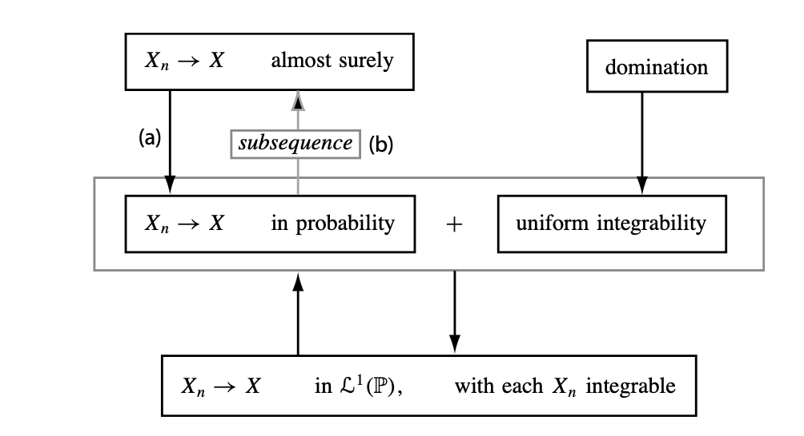

# Chapter 2: Stochastic Convergence {#sec-convergence}

## 2.1 Basic Theory

Convergences:

- **convergence in distribution/weak convergence/convergence in law**
$X_n \rightsquigarrow X$ iff :
$\text{P}(X_n \leq x) \rightarrow \text{P}(X\leq x)$ for every **x** at which the limit distribution function $x \mapsto \text{P}(X\le x)$ is continuous
- **convergence in probability**
$X_n \overset{\text{P}}{\to} X$ iff :
$\text{P}(d(X_n, X) > \epsilon) \to 0$
Equivalently, $d(X_n, X) \overset{\text{P}}{\to} 0$
- **almost sure convergence**
$X_n \overset{\text{a.s.}}{\to}X$ iff $\text{P}(\lim_{n\to\infty} d(X_n,X)=0)=1$.

Convergence in probability and almost-sure convergence require $X_n$ and $X$ to be defined on the same probability space; convergence in distribution does not.

::: {.callout-important title="Lemma"}
### 2.2 Lemma (Portmanteau) {#lemma-portmanteau}

Let $X_n$ and $X$ be random elements in a metric space, here random vectors in $\mathbb R^k$. The following are equivalent:

- (i) $\text{P}(X_n \leq x) \rightarrow \text{P}(X\leq x)$ for all continuity points of $x \mapsto P(X\le x)$
- (ii) $\text{E}f(X_n) \to \text{E}f(X)$ for all bounded continuous functions $f$.
- (iii) $\text{E}f(X_n) \to \text{E}f(X)$ for all bounded, Lipschitz$^*$, functions $f$
- (iv) $\liminf_{n\to\infty}\text{E}f(X_n) \ge \text{E}f(X)$ for all nonnegative, continuous functions $f$.
- (v) $\liminf_{n\to\infty}\text{P}(X_n\in G)\geq \text{P}(X\in G)$ for every open set $G$.
- (vi) $\limsup_{n\to\infty}\text{P}(X_n\in F)\leq \text{P}(X\in F)$ for every closed set $F$.
- (vii) $\text{P}(X_n\in B)\to\text{P}(X\in B)$ for every Borel set $B$ such that $\text{P}(X\in\partial B)=0$.
:::

Working through the proofs :

(i) this is the definition we started with.

(i) $\to$ (ii) reframe this as indicator functions over rectangles; this is basically starting to move us into the orientation of taking expectations over indicator functions

$$
1_A(x)=\begin{cases}1, & \text{if } x \in A,\\0, & \text{if } x \in A^c.\end{cases}
$$

(iii) $\to$(v):

For an open set $G$, we define Lipschitz functions with $0 \le f_m \uparrow 1_G$.

E.g., $f_m(x) = m d(x, G^C) \wedge 1$

$^*$ for (iii) why does it matter that the function is Lipschitz? We think primarily to drive this kind of example

For all x $f_m(x)$ is going to be 0 if x is outside of $G$, in $G^C$, and then if it’s inside of $G$, it’s going to be the minimum of the scaled distance from $x$ to $G^C$ and 1. So:

$0 \le f_m(x) \le 1_G(x)$.

Then, for every fixed $m$,

$\underset{n \to \infty}{\liminf}  \text{P} (X_n \in G) \ge \underset{n \to \infty}{\liminf} \text{E} f_m (X_n)= \text{E}f_m(X).$

- The first inequality is true because we’ve chosen the function so that for all $x$, it’s less than or equal to the indicator function.
- The equality on the right-hand side holds because we said $X_n\rightsquigarrow X$ and our function is bounded and continuous so this holds by (ii). This then is equivalent to $\text{P}(X\in G)$ by the monotone convergence theorem, i.e., we can take the limit inside the expectation.

::: {.callout-note title="Theorem"}
### Monotone convergence theorem for integrals

Let $(f_m)_{m\in\mathbb{N}}$ be a sequence of measurable functions such that  $0 \leq f_1(x) \leq f_2(x) \leq \cdots$ and $f_m(x) \to f(x)$ for every $x$. Then

$$
\lim_{m\to\infty}\int f_m\,d\mu
=
\int \lim_{m\to\infty}f_m\,d\mu
=
\int f\,d\mu.
$$

Equivalently, for random variables,

$$
0 \leq Y_n \uparrow Y
\quad \Longrightarrow \quad
\lim_{n\to\infty}\text{E}[Y_n]=\text{E}[Y].
$$

:::

- (v) $\to$(vi) similar to the above, follows by complements
- (v) + (vi) $\to$ (vii) Basically we approach the open and closed sets from opposite directions; as we close in, the inequalities become equalities.
    - UGMTP: “Theorems that work for lim sups of sequences of functions automatically carry over to theorems about sets”

::: {.callout-note title="Theorem"}
### 2.3 Theorem (Continuous mapping theorem) {#theorem-continuous-mapping}

This is what gives us convergence of statistics.

Let $g:\mathbb{R}^k\to\mathbb{R}^m$ be continuous at every point of a set $C$ such that $\text{P}(X\in C)=1.$

Then:

- If $X_n\rightsquigarrow X$, then $g(X_n)\rightsquigarrow g(X)$.
- If $X_n\overset{\text{P}}{\to}X$, then $g(X_n)\overset{\text{P}}{\to}g(X)$.
- If $X_n\overset{\text{a.s.}}{\to}X$, then $g(X_n)\overset{\text{a.s.}}{\to}g(X)$.

I.e., if $X_n$ gets close to $X$, and $g$ is continuous where $X$ takes values, then $g(X_n)$ gets close to $g(X)$ in the same kind of convergence.

:::

- Continuity means that small changes in the input produce small changes in the output: $x_n\to x \quad\Longrightarrow\quad g(x_n)\to g(x)$.
Without continuity, $X_n$ can approach $X$, while $g(X_n)$ fails to approach $g(X)$ (trees vs. forests)
    - Counter-example: let $X_n=\frac{1}{n},\  X=0$, and $g(x)=1_{\{x>0\}}$. Then $X_n\to 0$, but $g(X_n)=1$ for every $n$, while $g(X)=0$. The problem is that $g$ is discontinuous at 0.

If $X_n\overset{\text{P}}{\to}X$, then for continuous operations:

- $X_n^2\overset{\text{P}}{\to}X^2$,
- $\exp(X_n)\overset{\text{P}}{\to}\exp(X)$,
- and, if $X\neq 0$ with probability one, $\frac{1}{X_n}\overset{\text{P}}{\to}\frac{1}{X}$.

**Proof.**

(i) By the Portmanteau lemma, it is enough to show that for every closed set $F,$ we have $\limsup_{n\to\infty} \text{P}\bigl(g(X_n)\in F\bigr) \leq \text{P}\bigl(g(X)\in F\bigr).$

- ${g(X_n)\in F}$ and ${X_n\in g^{-1}(F)}$ are identical by the definition of a pre-image. But we don’t assume $g^{-1}(F)$ is closed/that the function is continuous everywhere.
- Instead, use $g^{-1}(F) \subseteq \overline{g^{-1}(F)} \subseteq g^{-1}(F)\cup C^c.$
    - For the second inclusion, take $x\in\overline{g^{-1}(F)}.$ By the definition of closure, there is a sequence $x_m\to x$ such that $g(x_m)\in F$ for every $m.$ There are two possibilities.
        - If $x\in C,$ then continuity gives $g(x_m)\to g(x).$ Because $F$ is closed, this implies $g(x)\in F.$ Therefore, $x\in g^{-1}(F).$
        - If$x\notin C,$ then$x\in C^c.$ Thus every point in the closure belongs either to the pre-image or to the set where continuity is not assumed.
- Then apply the closed-set condition from the Portmanteau lemma:
$\begin{aligned} \limsup_{n\to\infty} \text{P}\bigl(g(X_n)\in F\bigr) &= \limsup_{n\to\infty} \text{P}\bigl(X_n\in g^{-1}(F)\bigr)\\ &\leq \limsup_{n\to\infty} \text{P}\bigl(X_n\in\overline{g^{-1}(F)}\bigr)\\ &\leq \text{P}\bigl(X\in\overline{g^{-1}(F)}\bigr)\\ &\leq \text{P}\bigl(X\in g^{-1}(F)\cup C^c\bigr). \end{aligned}$
- Because $\text{P}(X\in C^c)=0,$ the last expression equals $\text{P}\bigl(X\in g^{-1}(F)\bigr).$
By the definition of a pre-image, $\text{P}\bigl(X\in g^{-1}(F)\bigr)= \text{P}\bigl(g(X)\in F\bigr).$
Therefore, $\limsup_{n\to\infty} \text{P}\bigl(g(X_n)\in F\bigr) \leq \text{P}\bigl(g(X)\in F\bigr).$
By the Portmanteau lemma, $g(X_n)\rightsquigarrow g(X).$

(ii) Convergence in probability

- Fix $\epsilon>0.$
For each $\delta>0,$ define $B_\delta = \{ x: \text{there exists }y\text{ such that } d(x,y)<\delta \text{ and } d\bigl(g(x),g(y)\bigr)>\epsilon \}.$
This is the set of points around which the function can change by more than $\epsilon$ even when the input changes by less than $\delta.$
- Suppose $X\notin B_\delta$ but $d\bigl(g(X_n),g(X)\bigr)>\epsilon.$
Because $X\notin B_\delta,$ the inputs cannot be within $\delta$ of one another.
Therefore, $d(X_n,X)\geq\delta.$ This gives the probability bound: $\text{P}\left( d\bigl(g(X_n),g(X)\bigr)>\epsilon \right) \leq \text{P}(X\in B_\delta) + \text{P}\bigl(d(X_n,X)\geq\delta\bigr).$
- Consider the two terms separately.
For every fixed positive value of $\delta,$ we have $\text{P}\bigl(d(X_n,X)\geq\delta\bigr)\to0$ because $X_n\overset{\text{P}}{\to}X.$
Also, as $\delta\downarrow0,$ continuity implies $B_\delta\cap C\downarrow\varnothing.$
Since $\text{P}(X\in C)=1,$ then $\text{P}(X\in B_\delta)\to0.$
So both terms on the right can be made arbitrarily small.
- Therefore, $\text{P}\left( d\bigl(g(X_n),g(X)\bigr)>\epsilon \right)\to0.$ So, $g(X_n)\overset{\text{P}}{\to}g(X).$

(iii) Almost-sure convergence

- Suppose $X_n\overset{\text{a.s.}}{\to}X.$ Then, with probability one, $X_n\to X.$ Also, with probability one, $X\in C.$
- Because the function is continuous at every point in $C,$ ordinary continuity gives $g(X_n)\to g(X)$ with probability one.
- Therefore,$g(X_n)\overset{\text{a.s.}}{\to}g(X).$

::: {.callout-note title="Theorem"}
### 2.4 Theorem (Prokhorov’s theorem)

Let $X_n$ be random vectors in $\mathbb R^k$.

1. If $X_n \rightsquigarrow X$ for some $X$, then $\{X_n:n\in\mathbb N\}$ is uniformly tight.
2. If $X_n$ is uniformly tight, then there exists a subsequence with $X_{n_j} \rightsquigarrow X$ as $j \to \infty$ for some $X$.
:::

::: {.callout-important title="Lemma"}
### 2.5 Lemma (Helly’s lemma)

Each given sequence $F_n$ of cumulative distribution functions on $\mathbb R^k$ possesses a subsequence $F_n,$ with the property that $F_{n_j} (x) \to F(x)$ at each continuity point $x$ of a possibly defective distribution function $F$.

:::

::: {.callout-tip title="Example"}
### 2.6 Example (Markov’s inequality)

A sequence $X_n$ of random variables with $\text E {|X_n|}^p = O(1)$ for some $p>0$ is uniformly tight. This follows because, by Markov’s inequality,

$$
P(|X_n|>M)\leq \frac{E|X_n|^p}{M^p}=O(M^{-p})\to0\qquad(M\to\infty).
$$

:::

::: {.callout-note title="Theorem"}
### 2.7 Theorem

Let $X_n$, $X$, and $Y_n$ be random vectors. Then:

1. $X_n \overset{a.s.}{\to} X$ implies $X_n \overset{P}{\to} X$;
2. $X_n \overset{P}{\to} X$ implies $X_n \rightsquigarrow X$;
3. $X_n \overset{P}{\to} c$ for a constant $c$ iff $X_n \rightsquigarrow c$;
4. if $X_n \rightsquigarrow X$  and $d(X_n, Y_n) \overset{P}{\to} 0$, then $Y_n \rightsquigarrow X$;
5. if $X_n \rightsquigarrow X$ and $Y_n \overset{P}{\to} c$ for a constant $c$, then $(X_n, Y_n) \rightsquigarrow (X, c)$;
6. if $X_n \overset{P}{\to} X$ and $Y_n \overset{P}{\to} Y$, then $(X_n, Y_n) \overset{P}{\to} (X, Y)$.
:::

::: {.callout-important title="Lemma"}
### 2.8 Lemma (Slutsky) {#lemma-slutsky}

Let $X_n$, $X$, and $Y_n$ be random vectors or variables.

If $X_n \rightsquigarrow X$ and $Y_n \rightsquigarrow c$ for a constant $c$, then:

1. $X_n + Y_n \rightsquigarrow X + c$;
2. $Y_nX_n \rightsquigarrow cX$;
3. $Y_n^{-1}X_n \rightsquigarrow c^{-1}X$ provided $c \neq 0$.
:::
