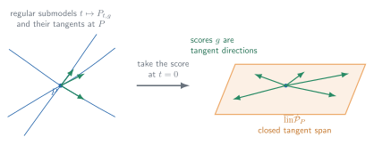
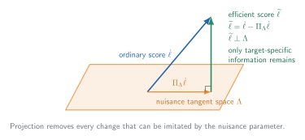
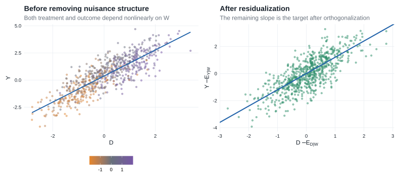

# Chapter 25: Semiparametric Models

## 25.1 Introduction

Chapter 25 is where the book's [local-experiment and empirical-process routes](index.qmd#route-to-chapter-25) meet. It reduces an infinite-dimensional estimation problem to many local one-dimensional parametric problems, then applies the Chapter 7–8 machinery along those paths while using Chapters 18–19 to control the resulting random functions.

::: {.callout-important title="How the chapter fits together"}

| Block | Sections | Main question |
|---|---|---|
| Geometry and lower bounds | [§25.2](#banach-and-hilbert-spaces)–[§25.7](#sec-efficiency-delta-method) | What are the allowable local directions, what information about the target survives nuisance variation, and what performance can any regular procedure attain? |
| Estimating equations | [§25.8](#sec-efficient-score-equations)–[§25.9](#sec-general-estimating-equations) | How can an efficient influence function or another valid influence function be turned into an estimator? |
| Likelihood constructions | [§25.10](#sec-maximum-likelihood-estimators)–[§25.12](#sec-likelihood-equations) | When does a semiparametric likelihood exist, and how do its score equations recover the efficient expansion? |

The first block identifies the target. The second constructs target-focused estimators. The third asks when likelihood maximization reaches the same target, either through an approximately least-favorable path or by linearizing the full target–nuisance system.

:::

::: {.callout-note title="Reading guide" collapse="true"}

- **Core — §§25.1–25.12:** geometry and lower bounds, estimating equations, and likelihood constructions, including the numbered results and examples used on the main route.
- **Supporting — model-specific examples:** empirical distributions, regression, Cox models, missingness, testing, and mixtures show how the general geometry becomes an estimator or likelihood calculation.
- **Compressed — long technical and historical material:** technical verifications and source notes are shortened where the main assumptions, proof mechanism, and conclusion can be retained without reproducing every detail.
- **Omitted/deferred — end-of-chapter exercises:** exercises are not part of this companion's main route.

:::

::: {.callout-tip title="Four running threads" collapse="true"}

| Thread | First calculation | Later returns | Destination |
|---|---|---|---|
| Empirical CDF and empirical measure | [Example 25.24](#example-25-24) | [empirical-distribution NPMLE](#example-25-68) and [random censoring](#sec-25-10-random-censoring) | Efficient functionals and likelihoods built from empirical measures |
| Regression and residualization | [Example 25.28](#example-25-28) | [general regression equations](#example-25-66) and [partially linear regression](#sec-25-11-partially-linear-regression) | Orthogonal scores, product-rate bias, and DML |
| Cox regression | [Example 25.7](#example-25-7) | [Cox tangent scores](#example-25-17), [profile likelihood](#example-25-69), and [current-status Cox](#sec-25-11-current-status-cox) | The [joint Cox likelihood equations](#sec-25-12-cox-model) |
| Missingness and information loss | [binary MAR](#example-25-43) | [augmented estimating equations](#example-25-67) | Double robustness and [partially missing-data likelihoods](#sec-25-12-partially-missing-data) |

Symmetric location, Wilcoxon rank-sum, and latent mixtures are secondary threads: they supply compact examples of adaptivity, efficient testing, and score operators without carrying the full chapter narrative.

:::

### Semiparametric models {#semiparametric-models}

A semiparametric model is a statistical model whose parameter space is infinite-dimensional, or at least too large to be represented by a finite-dimensional Euclidean vector.

The most general setup is a collection of probability measures $\mathcal P$ and a target functional

$$
\psi:\mathcal P\to\mathbb R^k.
$$

Two important special cases are:

- **Nonparametric model:** $\mathcal P$ contains all probability measures on the sample space.
- **Semiparametric model in the strict sense:** the model is parametrized as

$$
\{P_{\theta,\eta}:\theta\in\Theta,\eta\in H\},
$$

where:

- $\theta\in\mathbb R^k$ is the finite-dimensional parameter of interest;
- $\eta$ is an infinite-dimensional nuisance parameter.

The chapter concentrates on parameters that can be estimated at the usual parametric rate $\sqrt n$.

::: {.callout-tip title="Key objects at a glance" collapse="true"}

The main chain is

$$
\text{regular path}
\longrightarrow \text{score}
\longrightarrow \text{tangent set or space}
\longrightarrow \text{pathwise derivative}
\longrightarrow \text{influence function}
\longrightarrow \text{efficient influence function and bound}.
$$

| Object | Role | Formal treatment |
|---|---|---|
| [Differentiability in quadratic mean](#sec-dqm) ([glossary](glossary.qmd#glossary-dqm)) | Makes a path locally quadratic and gives it a score $g$ | [§25.3](#sec-dqm) |
| [Tangent set or space](#sec-tangent-space) ([glossary](glossary.qmd#glossary-tangent-space)) | Collects the scores of the admissible local paths | [§25.3](#sec-tangent-space) |
| [Pathwise derivative](#sec-pathwise-differentiability) ([glossary](glossary.qmd#glossary-pathwise-derivative)) | Records the first-order change $\dot\psi_Pg$ of the target along every score direction | [§25.3](#sec-pathwise-differentiability) |
| [Influence function](#sec-influence-functions) ([glossary](glossary.qmd#glossary-influence-function)) | Represents that derivative as $\dot\psi_Pg=P\psi_P^\dagger g$ | [§25.3](#sec-influence-functions) |
| [Efficient influence function](#efficient-influence-function) ([glossary](glossary.qmd#glossary-efficient-influence-function)) | Projects an influence function into the closed tangent space and gives the smallest covariance bound | [§25.3](#efficient-influence-function) |

When the model is partitioned into target and nuisance parameters, a second branch computes the same object:

$$
\text{target score}
\xrightarrow{\text{remove nuisance projection}}
\text{efficient score}
\xrightarrow{\text{normalize by efficient information}}
\text{efficient influence function}.
$$

| Object | Role | Formal treatment |
|---|---|---|
| [Efficient score](#sec-efficient-score) ([glossary](glossary.qmd#glossary-efficient-score)) | The part of the target score orthogonal to nuisance scores | [§25.4](#sec-efficient-score) |
| [Efficient information](#sec-efficient-score) ([glossary](glossary.qmd#glossary-efficient-information)) | The covariance of the efficient score | [§25.4](#sec-efficient-score) |
| [Score operator](#sec-score-operator) ([glossary](glossary.qmd#glossary-score-operator)) | Maps parameter directions into observed-data scores | [§25.5](#sec-score-operator) |
| [Neyman orthogonality](#sec-neyman-orthogonality) ([glossary](glossary.qmd#glossary-neyman-orthogonality)) | Expresses first-order insensitivity of a moment to nuisance perturbations | [§25.4](#sec-neyman-orthogonality) |

**What the machinery delivers.** A [regular estimator](#sec-regular-estimator) ([glossary](glossary.qmd#glossary-regular-estimator)) is efficient when its first-order summand is the efficient influence function; [§25.6](#sec-testing) then shows that standardizing such an estimator also yields an efficient test.

:::

::: {.callout-note title="Notation used in this chapter" collapse="true"}

The notation continues to follow van der Vaart, including a few deliberate reuses. The functional $\psi(P)$ is the statistical target. In the modern DML asides, $\psi(W;\theta,\eta)$ instead denotes a moment or score, following that literature; its displayed arguments distinguish it from the target functional. Likewise, $A_\eta$ and $A_{\theta,\eta}$ denote score operators in §§25.5 and 25.12. §25.9 therefore uses $J_{\theta,\tau}$ for the derivative normalization of an estimating equation, a notation local to these notes that avoids confusing that matrix with the book's score operator.

On a fixed path, the source writes $P_t$; these notes write $P_{t,g}$ when the score index must be explicit. In §25.6, $g$ is the tangent direction and $h$ is the scalar local displacement. §25.12 reuses $h$ as an index for a nuisance likelihood equation.

Vector-valued targets are treated as column vectors. Thus, when $\psi:\mathcal P\to\mathbb R^k$, an influence function has $k$ coordinates and $P\widetilde\psi_P\widetilde\psi_P^T$ is a $k\times k$ covariance matrix.

:::

### Why semiparametric efficiency is harder

In a parametric model, the score is finite-dimensional and Fisher information is a matrix. A semiparametric model adds infinitely many possible nuisance directions, so target information is the part of the target score that remains distinguishable from every nuisance perturbation. The resulting lower-bound theory is broad, but attaining the bound requires an estimator whose first-order behavior matches that geometry; such an estimator need not exist in every model.

::: {.callout-note title="Companion routes through the material" collapse="true"}

- For a concise causal-inference route through tangent spaces, pathwise derivatives, influence functions, and empirical-process conditions, see @kennedy2016, §§3.1–3.5 and §4.4.
- For a practical route from parametric submodels to constructing influence functions and influence-function-based estimators, see @kennedy2022, §§3.1–3.4 and §§4.1–4.3.
- For a visual explanation of paths, first-order corrections, and second-order remainders, see @fisherKennedy2021, §§2–4. The notes below point to what their figures are doing without reproducing them.
- For a systematic treatment of semiparametric models, efficiency, and empirical processes—with additional model-specific examples—see @kosorok2008, Chapters 17–19 and the relevant application chapters.
- For the foundational projection-and-information treatment of efficient and adaptive estimation, see @bickelEtAl1993, especially the chapters on information bounds and nuisance tangent spaces.
- For observed-data influence functions, missing-data models, and augmentation, see @tsiatis2006; it is particularly useful beside [§25.5.3](#sec-missing-coarsening-random) and [Example 25.67](#example-25-67).
- For the nonparametric-estimation background behind smoothness, approximation, and nuisance rates, see @tsybakov2009, §§1.2 and 1.5–1.7.
- For the modern orthogonal-moment and cross-fitting formulation used in the DML asides below, see @chernozhukovEtAl2018, §§2.1–2.2.

These are alternative entrances and supporting explanations; the notation and theorem numbering in this chapter continue to follow van der Vaart.

:::

::: {.callout-tip title="A modern machine-learning route through the chapter" collapse="true"}

For a reader who ultimately wants to use flexible nuisance learners, the division of labor is:

$$
\boxed{
\text{machine learning estimates nuisance features}
\quad+
\text{semiparametric theory supplies the target-specific correction}
}.
$$

| Stage | Read here | What it contributes |
|---|---|---|
| Turn a large model into local parametric probes | [§25.3](#tangent-spaces-and-information) and @kennedy2022, §§3.1–3.3 | Paths, scores, lower bounds, and the efficient influence function as the benchmark |
| Construct and verify a candidate influence function | [the derivation recipe below](#sec-if-construction) and @kennedy2022, §3.4 | A repeatable calculation rather than a formula to guess |
| Remove nuisance directions | [§25.4](#efficient-score-functions)–[§25.5](#score-and-information-operators) | Projection and adjoint equations that identify the efficient correction in a restricted model |
| Turn the correction into an estimator | [§25.8](#sec-efficient-score-equations) and @kennedy2022, §§4.1–4.3 | One-step estimation and the separation of empirical-process error from second-order bias |
| Use modern nuisance learners | [sample splitting](#sec-25-8-one-step), [missing-data/AIPW equations](#example-25-67), and [partially linear regression](#sec-25-11-partially-linear-regression) | Cross-fitting, orthogonality, product-rate conditions, double robustness, and DML |

The resulting workflow is

$$
\text{path}
\longrightarrow\text{derivative}
\longrightarrow\text{influence function}
\longrightarrow\text{efficient projection}
\longrightarrow\text{one-step correction}
\longrightarrow\text{remainder control}
\longrightarrow\text{cross-fitted estimation}.
$$

DML is therefore an estimator-construction layer built on the geometry and lower-bound theory developed here. It does not replace the need to identify the correct influence function or verify its remainder.

:::

### Examples

::: {.callout-tip title="Example"}
#### Example 25.1: regression {#example-25-1}

The model is $Y=\mu_\theta(Z)+\sigma_\theta(Z)e$, where $e$ is independent of $Z$.

It becomes semiparametric if the distribution of $e$ is unknown but restricted, for example, to distributions that:

- have mean zero; or
- are symmetric about zero.

**Related example:** [Example 25.28: regression with conditional mean zero](#example-25-28).

:::

::: {.callout-tip title="Example"}
#### Example 25.2: projection pursuit regression {#example-25-2}

The model is $Y=\eta(\theta^TZ)+e$.

The unknown regression function $\eta$ is infinite-dimensional. The direction of $\theta$ may be identifiable up to sign even though $\theta$ and $\eta$ are partly confounded.

:::

::: {.callout-tip title="Example"}
#### Example 25.3: semiparametric logistic regression {#example-25-3}

Here $P(Y=1\mid Z)=\frac{1}{1+e^{-r(Z)}}$, where $r(Z_1,Z_2)=\eta(Z_1)+\theta^TZ_2$.

The response is linear in one part of the covariates and nonparametric in another.

:::

::: {.callout-tip title="Example"}
#### Example 25.4: paired exponential model {#example-25-4}

Conditional on an unobservable variable $Z$, the variables $X_1$ and $X_2$ are independent exponentials with parameters $Z$ and $Z\theta$.

The target $\theta$ is a hazard ratio, while the distribution of $Z$ is unrestricted.

**Related example:** [Example 25.36: semiparametric mixtures](#example-25-36).

:::

::: {.callout-tip title="Example"}
#### Example 25.5: errors-in-variables {#example-25-5}

$$
X_1=Z+e,
$$

$$
X_2=\alpha+\beta Z+f,
$$

where $(e,f)$ is normal with unknown covariance matrix and the distribution of the unobserved $Z$ is unknown.

:::

::: {.callout-tip title="Example"}
#### Example 25.6: transformation regression {#example-25-6}

The model is $\eta(Y)=\theta^TZ+e$.

The transformation $\eta$ is unknown and may range over all monotone functions.

**Related example:** [Example 25.18: Transformation regression model](#example-25-18).

:::

::: {.callout-tip title="Example"}
#### Example 25.7: Cox model {#example-25-7}

The [Cox proportional-hazards model](https://en.wikipedia.org/wiki/Proportional_hazards_model) specifies the conditional hazard of a survival time $T$ given $Z$ as $\lambda_{T\mid Z}(t)=e^{\theta^TZ}\lambda(t)$, where $\lambda$ is an unknown baseline hazard.

**Related example:** [Example 25.17: Cox model](#example-25-17).

:::

::: {.callout-tip title="Example"}
#### Example 25.8: copula model {#example-25-8}

The joint distribution of $X=(X_1,X_2)$ is $C_\theta\bigl(G_1(X_1),G_2(X_2)\bigr)$, where $C_\theta$ is a parametric copula and the marginal distributions $G_1,G_2$ may be unknown.

:::

::: {.callout-tip title="Example"}
#### Example 25.9: frailty model {#example-25-9}

Conditional on an unobserved frailty $W$ and observed covariate $Z$, survival times have hazard $We^{\theta^TZ}\lambda(t)$.

The frailty introduces unobserved heterogeneity.

**Related example:** [Example 25.36: semiparametric mixtures](#example-25-36).

:::

::: {.callout-tip title="Example"}
#### Example 25.10: random censoring {#example-25-10}

The observed data are $(T\wedge C,\mathbf 1\{T\leq C\})$, where the event time $T$ and censoring time $C$ are independent and both distributions may be unknown.

**Related example:** [Example 25.37: random censoring](#example-25-37).

:::

::: {.callout-tip title="Example"}
#### Example 25.11: interval or current-status censoring {#example-25-11}

The observed data are $(C,\mathbf 1\{T\leq C\})$, which reveal only whether the event occurred before a check-up time.

**Related example:** [Example 25.38: current-status censoring](#example-25-38).

:::

::: {.callout-tip title="Example"}
#### Example 25.12: truncation {#example-25-12}

The pair $(Y,C)$ is observed only when $Y>C$.

The observed distribution is the conditional distribution of $(Y,C)$ given this event.

The common feature of these examples is a finite-dimensional target combined with an unknown function, distribution, hazard, transformation, or latent-variable distribution.

:::

## 25.2 Banach and Hilbert Spaces {#banach-and-hilbert-spaces}

§25.2 supplies the functional-analytic language used throughout the chapter. Banach-space norms make infinite-dimensional differentiation and convergence precise, while Hilbert-space geometry supplies the projections, adjoints, and orthogonal decompositions used to identify efficient scores and influence functions.

::: {.callout-note title="Definition"}
### $L_2(P)$

$L_2(P)$ consists of measurable functions $g$ satisfying $Pg^2=\int g^2\,dP<\infty$, where functions that are equal almost surely are identified.

It is a Hilbert space under the inner product $\langle g_1,g_2\rangle_P=Pg_1g_2$ and norm $|g|_P=\sqrt{Pg^2}$.

:::

::: {.callout-important title="Lemma"}
### Projection lemma

Let $\mathbb H$ be a Hilbert space and let $C\subset\mathbb H$ be convex and closed. For every $g\in\mathbb H$, there is a unique [orthogonal projection](https://en.wikipedia.org/wiki/Projection_(linear_algebra)#Orthogonal_projections) $\Pi_Cg\in C$ minimizing $c\mapsto\|g-c\|_{\mathbb H}$.

When $C$ is a closed linear subspace, the projection is characterized by

$$
\langle g-\Pi_Cg,c\rangle=0\qquad\text{for every }c\in C.
$$

Thus:

- the projection error is orthogonal to the space;
- projection gives the closest element in squared norm;
- the projection onto an orthogonal sum is the sum of the separate projections.

If $C_1\subset C_2$ are closed subspaces, then projecting first onto $C_2$ and then onto $C_1$ gives the projection onto $C_1$.

The orthogonal complement of $C$ is $C^\perp=\{g:\langle g,c\rangle=0\text{ for every }c\in C\}$.

This projection geometry is the basis for efficient scores and efficient influence functions.

:::

::: {.callout-note title="Definition"}
### Banach spaces and dual spaces {#banach-spaces-and-dual-spaces}

A Banach space is a complete normed space.

The [dual space](https://en.wikipedia.org/wiki/Dual_space#Continuous_dual_space) $\mathbb B^*$ consists of all continuous linear maps $b^*:\mathbb B\to\mathbb R$. The norm of a dual element is

$$
\|b^*\|=\sup_{\|b\|\leq1}|b^*(b)|.
$$

:::

::: {.callout-important title="Hahn--Banach consequences"}

The [Hahn--Banach theorem](https://en.wikipedia.org/wiki/Hahn%E2%80%93Banach_theorem) extends a bounded linear functional from a linear subspace to the entire normed space without increasing its norm. Two consequences are especially useful here.

**Continuous linear functionals separate points from closed subspaces.** If $M\subset\mathbb B$ is a closed linear subspace and $d\notin M$, then there exists $d^*\in\mathbb B^*$ such that

$$
d^*(m)=0\quad\text{for every }m\in M,
\qquad
d^*(d)\neq0.
$$

The functional cannot distinguish points within $M$, but it detects that $d$ lies outside $M$. More precisely, it can be chosen with $\|d^*\|=1$ and

$$
|d^*(d)|=\operatorname{dist}(d,M).
$$

**The dual determines the norm.** For every $d\in\mathbb B$,

$$
\boxed{
\|d\|
=\sup_{\substack{d^*\in\mathbb B^*\\\|d^*\|\leq1}}
|d^*(d)|
}.
$$

The inequality $\sup_{\|d^*\|\leq1}|d^*(d)|\leq\|d\|$ follows directly from the definition of the operator norm. Hahn--Banach gives the reverse inequality by producing a norm-one functional satisfying $|d^*(d)|=\|d\|$.

These facts explain why scalar projections $d^*T_n$ can characterize a Banach-valued estimator: continuous linear functionals detect every nonzero direction, and a sufficiently rich family of them controls the full norm.

:::

For a Hilbert space, the [Riesz representation theorem](https://en.wikipedia.org/wiki/Riesz_representation_theorem) says that every continuous linear functional has the form $h\mapsto\langle h,h^*\rangle$ for a unique $h^*$ in the Hilbert space. Thus, a Hilbert space can be identified with its own dual. Every Hilbert space is a Banach space, but not every Banach space is a Hilbert space.

Riesz representation is what turns a continuous pathwise derivative into an influence function. Banach-space structure supplies norms, convergence, and differentiation; Hilbert-space structure adds orthogonality and projection.

### Linear operators and adjoints {#sec-linear-operators-adjoints}

A continuous linear operator

$$
A:\mathbb B_1\to\mathbb B_2
$$

satisfies

$$
\|Ab\|_{\mathbb B_2}\leq\|A\|\,\|b\|_{\mathbb B_1}.
$$

When the domain and codomain are Hilbert spaces, write the same operator as $A:\mathbb H_1\to\mathbb H_2$. Its [adjoint](https://en.wikipedia.org/wiki/Hermitian_adjoint) is the unique continuous linear operator

$$
A^*:\mathbb H_2\to\mathbb H_1
$$

such that

$$
\langle Ah_1,h_2\rangle_{\mathbb H_2}=\langle h_1,A^*h_2\rangle_{\mathbb H_1}.
$$

For real Euclidean spaces with their usual inner products, $A^*$ is the matrix transpose $A^T$.

### Range and kernel

The range and kernel of $A$ are

$$
R(A)=\{Ab:b\in\mathbb B_1\},
\qquad
N(A)=\{b:Ab=0\}.
$$

The kernel $N(A)$ is always closed, whereas the range $R(A)$ need not be. For an operator between Hilbert spaces,

$$
R(A)^\perp=N(A^*).
$$

Moreover,

$$
R(A)\text{ is closed}
\quad\Longleftrightarrow\quad
R(A^*)\text{ is closed}
\quad\Longleftrightarrow\quad
R(A^*A)\text{ is closed}.
$$

When these ranges are closed,

$$
R(A^*)=R(A^*A).
$$

If $A^*A$ is continuously invertible, then

$$
A(A^*A)^{-1}A^*
$$

is the orthogonal projection onto $R(A)$.

### Section takeaway {#sec-25-2-takeaway}

Keep three operations in view: **project** onto a closed space, **move** an operator across an inner product with its adjoint, and **invert** the resulting information operator when that inversion is stable. §§25.3–25.5 use projection and adjoints to identify efficient influence functions; [§25.12](#sec-likelihood-equations) returns to stable inversion when it linearizes joint likelihood equations in a Banach space.

## 25.3 Tangent Spaces and Information

§25.3 turns regular paths into tangent directions, differentiates the target along those directions, and identifies the efficient influence function as the object that determines the sharp asymptotic covariance bound.

Suppose the true distribution is $P\in\mathcal P$ and the target is $\psi(P)$.

Estimating $\psi(P)$ over the full model cannot be easier than estimating it over a smaller parametric submodel. Therefore:

- every smooth parametric submodel produces a parametric information bound;
- the full-model information cannot exceed the information in the hardest submodel;
- a submodel attaining the smallest information is called **least favorable**.

Equivalently, its Cramér–Rao variance bound is the largest among the submodels.

::: {.callout-note title="Definition"}
### Differentiability in quadratic mean {#sec-dqm}

Consider a path $t\mapsto P_t$ through $P=P_0$.

It is differentiable in quadratic mean at $t=0$ with score $g$ if

$$
\int\left[\frac{dP_t^{1/2}-dP^{1/2}}{t}-\frac12g\,dP^{1/2}\right]^2\to0. \tag{25.13}
$$

In dominated models this can be written using densities:

$$
\int\left[\frac{p_t^{1/2}-p^{1/2}}{t}-\frac12gp^{1/2}\right]^2d\mu\to0.
$$

Usually, the score is obtained pointwise as

$$
g(x)=\left.\frac{\partial}{\partial t}\right|_{t=0}\log dP_t(x),
$$

where $dP_t(x)$ is the source's density-or-mass-element shorthand; in a dominated model this is $\log p_t(x)$. The quadratic-mean condition is the substantive regularity condition.

**Builds on.** This is the pathwise version of [Equation (7.1): differentiability in quadratic mean](chapter-7.qmd#eq-differentiability-quadratic-mean).

:::

::: {.callout-note title="Definition"}
### Tangent set {#sec-tangent-space}

The collection of scores generated by selected differentiable paths through $P$ is the tangent set $\dot{\mathcal P}_P\subset L_2(P)$.

If this set is a linear space, it is called the tangent space.

Geometrically:

- view $dP^{1/2}$ as a point on the unit sphere of an $L_2$ space;
- then the objects $\frac12g\,dP^{1/2}$ are tangent directions to the model at $P$.

Every score satisfies

$$
Pg=0,
$$

$$
Pg^2<\infty.
$$

The maximal tangent set is a cone because, if $g$ is a score, then $ag$ is a score for every $a\geq0$ after rescaling the path.

:::

::: {#twentyfivefig-ch25-tangent-space}

{fig-alt="The left panel shows several curved regular submodels through P with aligned tangent arrows. A score map leads to the right panel, where green score vectors lie in a shaded plane representing their closed linear span."}

Chapter 25 replaces Chapter 7's single smooth curve with many regular submodels through $P$; taking their scores produces tangent directions whose closed linear span is the tangent space.

:::

Compare @twentyfivefig-ch25-tangent-space with the single parametric path in @sevenfig-ch7-dqm-geometry. The new difficulty is not the LAN expansion along any one path; it is satisfying the derivative and regularity requirements simultaneously over their entire span.

::: {.callout-important title="Lemma"}
### Lemma 25.14: local asymptotic normality along a path {#lemma-25.14-local-asymptotic-normality-along-a-path}

If the path satisfies the quadratic-mean condition (25.13), then $Pg=0$, $Pg^2<\infty$, and

$$
\log\prod_{i=1}^n\frac{dP_{1/\sqrt n}}{dP}(X_i)=\frac{1}{\sqrt n}\sum_{i=1}^ng(X_i)-\frac12Pg^2+o_P(1).
$$

Thus every smooth one-dimensional path produces a locally asymptotically normal experiment.

:::

**Proof roadmap.** Treat the path parameter $t$ as an ordinary one-dimensional parameter, verify the two score moment conditions from the normalization of the square-root densities, and apply the DQM-to-LAN argument in [Theorem 7.2](chapter-7.qmd#theorem-lan-iid).

Complete proof

For each $t$, dominate $P_t$ and $P$ by $\mu_t=P_t+P$, and write their densities as $p_t$ and $p$. The quadratic-mean condition is

$$
\sqrt{p_t}=\sqrt p+\frac t2g\sqrt p+r_t,
\qquad
\int r_t^2\,d\mu_t=o(t^2).
$$

Both densities integrate to one. Squaring the expansion and subtracting $\int p\,d\mu_t=1$ gives

$$
0=tPg
+2\int r_t\sqrt p\,d\mu_t
+t\int g\sqrt p\,r_t\,d\mu_t
+\frac{t^2}{4}Pg^2
+\int r_t^2\,d\mu_t.
$$

Cauchy–Schwarz gives $\int r_t\sqrt p\,d\mu_t=o(t)$ and $\int g\sqrt p\,r_t\,d\mu_t=o(t)$. Square integrability of $g$ is part of (25.13). Divide by $t$ and let $t\to0$ to obtain $Pg=0$.

For $t_n=n^{-1/2}$, the one-dimensional family $t\mapsto P_t$ is DQM at zero with score $g$ and information $Pg^2$. The complete likelihood-ratio expansion proved in [Theorem 7.2](chapter-7.qmd#theorem-lan-iid), applied with local parameter one, yields

$$
\sum_{i=1}^n\log\frac{dP_{t_n}}{dP}(X_i)
=\frac1{\sqrt n}\sum_{i=1}^ng(X_i)-\frac12Pg^2+o_P(1),
$$

which is the asserted formula.

::: {.callout-note title="Definition"}
### Pathwise differentiability {#sec-pathwise-differentiability}

The functional $\psi:\mathcal P\to\mathbb R^k$ is differentiable at $P$ relative to $\dot{\mathcal P}_P$ if there is a continuous linear map $\dot\psi_P:L_2(P)\to\mathbb R^k$ such that, for every path with score $g\in\dot{\mathcal P}_P$,

$$
\frac{\psi(P_t)-\psi(P)}{t}\to\dot\psi_Pg.
$$

This definition requires two things:

1. The ordinary derivative along every path exists.
2. The derivatives across different paths are generated by one continuous linear map.

The working tangent set may depend on both the statistical model and the target functional. It need not be the maximal set of every DQM score available in the model: a target can fail to be differentiable on that maximal set while remaining differentiable on a smaller tangent set whose closure is large enough to determine the same efficiency bound. [Example 25.24](#example-25-24) shows why this distinction matters for an unbounded mean functional.
:::

::: {.callout-tip title="Visual companion: a distribution path becomes an ordinary curve" collapse="true"}

Fisher and Kennedy follow one literal mixture path,

$$
P_\varepsilon=(1-\varepsilon)P+\varepsilon\widetilde P,
$$

and plot the ordinary scalar curve $\varepsilon\mapsto T(P_\varepsilon)$. In their Figure 1, one panel shows the distribution changing from the truth $P$ toward an initial estimate $\widetilde P$, while the other records the target value along exactly the same path. Once a path has been chosen, a pathwise derivative is therefore an ordinary slope; the picture does not pretend to draw the whole infinite-dimensional model. See §3 and fig. 1 of @fisherKennedy2021.

Their endpoints serve a different visual purpose from the definition above. Fisher and Kennedy put $P$ at $\varepsilon=0$, put $\widetilde P$ at $\varepsilon=1$, and later differentiate at the estimated endpoint to explain a bias correction. Van der Vaart defines $\dot\psi_P$ at the true endpoint $P_0=P$ and gathers the scores of all admissible paths into a tangent space.

Here $T$ is Fisher and Kennedy's symbol for the target functional; it is not the estimator sequence $T_n$ used later in this chapter.

:::

::: {.callout-note title="Modern translation: the von Mises expansion" collapse="true"}

When a suitable distributional expansion is available, Kennedy writes the same first-order idea as a distributional Taylor, or [von Mises expansion](glossary.qmd#glossary-von-mises). Choose the derivative representative at each law to be centered under that law, so $Q\psi_Q^\dagger=0$:

$$
\psi(Q)-\psi(P)
=(Q-P)\psi_Q^\dagger+R_2(Q,P),
\qquad
(Q-P)\psi_Q^\dagger
=\int\psi_Q^\dagger\,d(Q-P).
\tag{25.3-von-Mises}
$$

This is Kennedy's **reverse** convention: the derivative representative is evaluated at the first distribution $Q$, which is convenient when $Q$ will be an estimate and $Q\psi_Q^\dagger=0$. Other texts expand about $P$ and use $\psi_P^\dagger$ instead; that choice changes the definition, and sometimes the sign, of the remainder.

If $Q=P_t$, the path has score $g$, $\psi_{P_t}^\dagger$ approaches $\psi_P^\dagger$ in the required sense, and $R_2(P_t,P)=o(t)$, then dividing by $t$ and taking the limit gives

$$
\dot\psi_Pg=P\psi_P^\dagger g.
$$

Thus the derivative identity below is the linear term of a local expansion of the target, while $R_2$ measures curvature that a first-order correction does not remove. A von Mises expansion is a stronger, more directly constructive statement than the bare directional definition and should not be assumed automatically. @kennedy2022 uses $\varphi(z;P)$ and the term *influence curve* for this derivative representative. These notes retain van der Vaart's notation $\psi_P^\dagger$ and term *influence function*. At this point the object belongs to the target functional; [Lemma 25.23](#lemma-25-23) later characterizes when the efficient target influence function is also an estimator's first-order summand.

:::

::: {.callout-note title="Definition"}
### Influence functions {#sec-influence-functions}

By the Riesz representation theorem, the derivative can be represented as

$$
\dot\psi_Pg=\langle\psi_P^\dagger,g\rangle_P=P\psi_P^\dagger g
$$

for some vector-valued function $\psi_P^\dagger$.

For a $k$-dimensional target, $P\psi_P^\dagger g$ means the $k$-vector obtained by integrating each coordinate of $\psi_P^\dagger g$.

Any such function is an influence function.

It need not be unique because its inner products are specified only for $g\in\dot{\mathcal P}_P$.

If two influence functions represent the same derivative, their difference is orthogonal to the tangent space:

$$
\psi_P^\dagger-\psi_P^{\ddagger}\in\left(\overline{\operatorname{lin}}\dot{\mathcal P}_P\right)^\perp.
$$

:::

::: {.callout-tip title="Mechanics: deriving and checking an influence function"}

The identity $\dot\psi_Pg=P\psi_P^\dagger g$ is an equation to solve, not merely a definition. The general route in @kennedy2022, §3.4, is:

1. **Specify the target and model.** The admissible paths depend on the model, so an influence-function calculation is never completely separate from model assumptions.
2. **Choose an arbitrary [regular path](glossary.qmd#glossary-regular-submodel)** $P_t$ through $P$ and identify its score $g$.
3. **Differentiate the target:** calculate $\left.d\psi(P_t)/dt\right|_{t=0}$.
4. **Expose the score:** rewrite the result as $P(b_Pg)$.
5. **Center and check:** replace $b_P$ by $b_P-Pb_P$ when needed, verify square integrability, and verify $\dot\psi_Pg=P(b_Pg)$ for every admissible score—not just the path that suggested the formula.
6. **Make it efficient:** in a restricted semiparametric model, project a valid influence function onto $\overline{\operatorname{lin}}\dot{\mathcal P}_P$.

Kennedy's §3.4 gives two useful ways to generate a candidate before the general verification.

- **Point-mass contamination.** Pretend the data are discrete and differentiate

    $$
    \left.
    \frac{d}{d\varepsilon}
    \psi\{(1-\varepsilon)P+\varepsilon\delta_z\}
    \right|_{\varepsilon=0}.
    \tag{25.3-contamination}
    $$

    For a mean-zero derivative representative, this often returns its value at $z$ directly.
- **Derivative algebra.** Treat already-known influence functions as building blocks and use product and chain rules. For example,

    $$
    \operatorname{IF}(\psi_1\psi_2)
    =\operatorname{IF}(\psi_1)\psi_2
    +\psi_1\operatorname{IF}(\psi_2),
    \qquad
    \operatorname{IF}\{f(\psi)\}
    =f'(\psi)\operatorname{IF}(\psi).
    $$

    [§25.7](#sec-efficiency-delta-method) gives the formal chain-rule argument and shows when a smooth transform preserves efficiency.

The contamination calculation is a shortcut, not the final proof: in a continuous or restricted model, the point-mass path may fail to be dominated, DQM, or even admissible. Likewise, Kennedy's $\operatorname{IF}$ here is a heuristic differentiation operator, not the score operator $A_\eta$ introduced in [§25.5](#score-and-information-operators). The safe pattern is

$$
\boxed{\text{derive a candidate}\;\longrightarrow\;\text{verify every score identity}\;\longrightarrow\;\text{project if necessary}.}
$$

[Example 25.24](#example-25-24) gives the elementary mean-functional calculation; [Example 25.67](#example-25-67) later uses the building-block strategy to derive the AIPW influence function.

:::

::: {.callout-note title="Definition"}
### Efficient influence function {#efficient-influence-function}

The efficient influence function $\widetilde\psi_P$ is the unique influence function whose coordinates lie in $\overline{\operatorname{lin}}\dot{\mathcal P}_P$.

Here $\operatorname{lin}\dot{\mathcal P}_P$ consists of finite linear combinations of admissible scores, and the bar adds their $L_2(P)$ limits. The resulting closed linear span is the tangent space used for projection, even when the original tangent set is not itself linear or closed.

Equivalently, it is the projection of any influence function onto the closed linear span of the tangent set:

$$
\widetilde\psi_P=\Pi_{\overline{\operatorname{lin}}\dot{\mathcal P}_P}\psi_P^\dagger.
$$

Consequently, each coordinate is the minimum-norm representative of its derivative, and the resulting covariance matrix is minimal in the positive-semidefinite order among regular influence-function covariances.

For a scalar target,

$$
P(\psi_P^\dagger)^2=P\widetilde\psi_P^2+P(\psi_P^\dagger-\widetilde\psi_P)^2.
$$

Therefore,

$$
P(\psi_P^\dagger)^2\geq P\widetilde\psi_P^2.
$$

:::

::: {.callout-tip title="Example"}
### Example 25.15: parametric models {#example-25-15}

Suppose $P_\theta$ is differentiable in quadratic mean with vector score $\dot\ell_\theta$:

$$
\int\left[p_{\theta+h}^{1/2}-p_\theta^{1/2}-\frac12h^T\dot\ell_\theta p_\theta^{1/2}\right]^2d\mu=o(|h|^2).
$$

Here $\theta\in\mathbb R^m$. The tangent space is

$$
\{h^T\dot\ell_\theta:h\in\mathbb R^m\}.
$$

Define

$$
I_\theta=P_\theta\dot\ell_\theta\dot\ell_\theta^T,
$$

and assume that it is nonsingular. Let

$$
\psi(P_\theta)=\chi(\theta).
$$

If $\chi:\mathbb R^m\to\mathbb R^k$, then $\dot\chi_\theta$ denotes its $k\times m$ Jacobian (with column-vector targets). Consequently, the following product has $k$ coordinates:

$$
\widetilde\psi_{P_\theta}=\dot\chi_\theta I_\theta^{-1}\dot\ell_\theta.
$$

Thus the usual normalized parametric score is a special case of the efficient influence function.

:::

::: {.callout-tip title="Example"}
### Example 25.16: the nonparametric model {#example-25-16}

If $\mathcal P$ contains all probability distributions, then the maximal tangent space is

$$
L_2^0(P)=\{g\in L_2(P):Pg=0\}.
$$

For bounded $g$, paths can be constructed using

$$
p_t(x)=c(t)e^{tg(x)}p(x)
$$

or

$$
dP_t=(1+tg)dP.
$$

For unbounded $g$, a bounded link such as

$$
k(x)=\frac{2}{1+e^{-2x}}
$$

can be used in

$$
p_t(x)=c(t)k(tg(x))p(x).
$$

**What the submodel is—and is not.**

A parametric submodel is a theoretical probe, not a model fitted to the data. The path may depend on the unknown true distribution $P$ because its purpose is to import a parametric lower bound into the larger model. Van der Vaart's $(t,g,P_t)$ play the roles of $(\varepsilon,h,P_\varepsilon)$ in @kennedy2022, §3.1.

The scope of the [derivation shortcuts](#sec-if-construction) is especially clean here. In the full nonparametric model, the tangent space is all of $L_2^0(P)$, so a mean-zero function satisfying the score identity is the unique influence function and is already efficient. In a restricted semiparametric model, several functions can represent the same derivative; the projection in the definition above and the nuisance-space calculation in [§25.4](#efficient-score-functions) are then indispensable. Fisher and Kennedy's §5.1 marks this extra semiparametric step; Chapter 25 supplies its formal geometry [@fisherKennedy2021].

**Related example:** [Example 25.35: mixtures](#example-25-35).

:::

::: {.callout-tip title="Example"}
### Example 25.17: Cox model {#example-25-17}

**Earlier / new here.** [Example 25.7](#example-25-7) introduced the hazard model. Here the new object is its *local score geometry*: changing the regression coefficient, baseline hazard, or covariate law generates a different tangent direction.

The density has the form

$$
p_{\theta,\Lambda,p_Z}(t,z)=e^{-e^{\theta^Tz}\Lambda(t)}\lambda(t)e^{\theta^Tz}p_Z(z).
$$

The score for $\theta$ is

$$
z-ze^{\theta^Tz}\Lambda(t).
$$

A perturbation of the cumulative hazard indexed by a function $a$ gives score

$$
a(t)-e^{\theta^Tz}\int_{[0,t]}a\,d\Lambda.
$$

Perturbing $p_Z$ gives a score $b(z)$.

Thus nuisance scores are naturally obtained by applying an operator to functions such as $a$ and $b$.

**Related example:** [Example 25.7: Cox model](#example-25-7).

:::

::: {.callout-tip title="Example"}
### Example 25.18: transformation regression model {#example-25-18}

If the density is

$$
\phi\bigl(\eta(y)-\theta^Tz\bigr)\eta'(y)p_Z(z),
$$

the scores for $\theta$ and a perturbation $a$ of $\eta$ are

$$
-z\frac{\phi'}{\phi}\bigl(\eta(y)-\theta^Tz\bigr)
$$

and

$$
\frac{\phi'}{\phi}\bigl(\eta(y)-\theta^Tz\bigr)a(y)+\frac{a'(y)}{\eta'(y)}.
$$

Again, the nuisance score is an operator acting on a direction $a$.

**Related example:** [Example 25.6: Transformation regression](#example-25-6).

:::

### Information bound {#sec-information-bound}

For a scalar target and a path with score $g$, the parametric Cramér–Rao bound is

$$
\frac{\left(\left.\frac{d}{dt}\right|_{t=0}\psi(P_t)\right)^2}{Pg^2}=\frac{\langle\widetilde\psi_P,g\rangle_P^2}{\langle g,g\rangle_P}.
$$

Taking the supremum over all available tangent directions gives the semiparametric lower bound.

::: {.callout-important title="Lemma"}
### Lemma 25.19: the tangent-space information bound {#lemma-25.19}

$$
\sup_{\substack{g\in\overline{\operatorname{lin}}\dot{\mathcal P}_P\\g\neq0}}\frac{\langle\widetilde\psi_P,g\rangle_P^2}{\langle g,g\rangle_P}=P\widetilde\psi_P^2.
$$

:::

**Proof roadmap.** Cauchy–Schwarz gives the upper bound; approximating the efficient influence function by finite linear combinations of scores attains it in the limit.

Complete proof

For every nonzero $g$ in $\operatorname{lin}\dot{\mathcal P}_P$, Cauchy–Schwarz gives

$$
\frac{\langle\widetilde\psi_P,g\rangle_P^2}
{\langle g,g\rangle_P}
\leq
\langle\widetilde\psi_P,\widetilde\psi_P\rangle_P
=P\widetilde\psi_P^2.
$$

By definition, $\widetilde\psi_P$ belongs to $\overline{\operatorname{lin}}\dot{\mathcal P}_P$. Hence there are $g_m\in\operatorname{lin}\dot{\mathcal P}_P$ with $|g_m-\widetilde\psi_P|_P\to0$. If the derivative is nonzero, then

$$
\langle\widetilde\psi_P,g_m\rangle_P
\longrightarrow P\widetilde\psi_P^2,
\qquad
Pg_m^2\longrightarrow P\widetilde\psi_P^2,
$$

so the ratios converge to $P\widetilde\psi_P^2$. If $\widetilde\psi_P=0$, every numerator is zero and the result is immediate. Thus the supremum equals the claimed norm.

Kennedy's §3.3 presents the same calculation as the supremum of the Cramér–Rao bound over one-dimensional submodels: Cauchy–Schwarz gives the upper bound, and the score direction aligned with $\widetilde\psi_P$ attains it when available [@kennedy2022]. This is the step at which the derivative representative also becomes the variance benchmark.

For a vector-valued target, the optimal asymptotic covariance matrix is $P\widetilde\psi_P\widetilde\psi_P^T$.

::: {.callout-note title="Definition"}
### Regular estimators {#sec-regular-estimator}

An estimator sequence $T_n$ is regular at $P$ if there is a distribution $L$ such that, for every $g\in\dot{\mathcal P}_P$,

$$
\sqrt n\left(T_n-\psi(P_{1/\sqrt n,g})\right)\rightsquigarrow L
$$

under the local sequence of distributions

$$
P_{1/\sqrt n,g}^n.
$$

The key requirement is that the limiting error distribution is the same for every local direction $g$.

This rules out estimators whose behavior changes discontinuously under local alternatives.

**Builds on.** This is the semiparametric analogue of [regularity in §8.5](chapter-8.qmd#sec-convolution-theorem).

:::

::: {.callout-note title="Theorem"}
### Theorem 25.20: convolution theorem {#theorem-25-20}

For every regular estimator, the asymptotic covariance matrix is bounded below by

$$
P\widetilde\psi_P\widetilde\psi_P^T.
$$

If the tangent set is a convex cone, every regular limit distribution has the form

$$
L=N\left(0,P\widetilde\psi_P\widetilde\psi_P^T\right)*M
$$

for some probability distribution $M$.

Thus every regular estimator has:

- an unavoidable efficient normal component; and
- possibly additional noise represented by $M$.

**Builds on.** This is the tangent-space extension of the [limit-experiment reduction in Theorem 8.3](chapter-8.qmd#theorem-limit-experiment-reduction) and [regularity/convolution framework in §8.5](chapter-8.qmd#sec-convolution-theorem).

:::

::: {.callout-note title="Theorem"}
### Theorem 25.21: local asymptotic minimax theorem {#theorem-25-21}

If the tangent cone is convex, then for any estimator sequence and subconvex loss $\ell$,

$$
\sup_I\liminf_{n\to\infty}\sup_{g\in I}E_{P_{1/\sqrt n,g}^n}\ell\left(\sqrt n\left(T_n-\psi(P_{1/\sqrt n,g})\right)\right)\geq\int\ell\,dN\left(0,P\widetilde\psi_P\widetilde\psi_P^T\right),
$$

where the first supremum is over finite subsets $I$ of the tangent set.

:::

**Proof roadmap for Theorems 25.20–25.21.** Choose a finite orthonormal collection of scores, identify its Gaussian limit experiment, project the efficient influence function onto that score span, apply the Chapter 8 convolution or minimax theorem, and then exhaust the tangent space.

Complete proof

First suppose the working tangent set is a linear space. Choose an orthonormal vector of scores

$$
g_m=(g_1,\ldots,g_m)^T,
\qquad Pg_mg_m^T=I_m,
$$

and, for every $h\in\mathbb R^m$, use a path with score $h^Tg_m$. Lemma 25.14 gives LAN, and [Theorem 7.10](chapter-7.qmd#theorem-normal-limit-experiment) identifies the finite-dimensional limit experiment as

$$
X\sim N_m(h,I_m).
$$

Differentiability of $\psi$ gives

$$
\sqrt n\{\psi(P_{1/\sqrt n,h^Tg_m})-\psi(P)\}
\longrightarrow A_mh,
\qquad
A_m=P\widetilde\psi_Pg_m^T.
$$

The random vector $A_mg_m$ is the orthogonal projection of $\widetilde\psi_P$ onto $\operatorname{span}(g_1,\ldots,g_m)$, and

$$
A_mA_m^T=P(A_mg_m)(A_mg_m)^T.
$$

If $T_n$ is regular, its centered limit is the same at every $h$ in this finite subexperiment. The representation theorem and [Proposition 8.4](chapter-8.qmd#proposition-8-4) therefore imply

$$
L=N_k(0,A_mA_m^T)*M_m
$$

for some distribution $M_m$. In particular,

$$
\operatorname{Cov}(L)\succeq A_mA_m^T.
$$

Choose an increasing sequence of finite score spans whose union is dense in the tangent space. Orthogonal projections converge in $L_2(P)$, so

$$
A_mA_m^T\longrightarrow
P\widetilde\psi_P\widetilde\psi_P^T.
$$

The covariance inequality follows. Characteristic functions give the convolution conclusion: the ratios

$$
\frac{\varphi_L(t)}
{\exp\{-\tfrac12t^TA_mA_m^Tt\}}
$$

are characteristic functions of $M_m$. As $m\to\infty$, they converge pointwise to

$$
\frac{\varphi_L(t)}
{\exp\{-\tfrac12t^T
P\widetilde\psi_P\widetilde\psi_P^Tt\}},
$$

which is continuous at the origin. The Lévy continuity theorem therefore identifies the limit as a characteristic function $\varphi_M$. Hence

$$
\varphi_L(t)
=\exp\left\{-\frac12t^T
P\widetilde\psi_P\widetilde\psi_P^Tt\right\}
\varphi_M(t).
$$

For minimaxity, restrict any estimator sequence to the same finite subexperiment. [Theorem 8.11](chapter-8.qmd#theorem-8-11) gives, for every finite set of local parameters and every subconvex loss, the Gaussian risk lower bound with covariance $A_mA_m^T$. Enlarge the finite parameter sets and then the score spans. Lower semicontinuity of the loss and monotone convergence of the projected Gaussian laws give the bound with covariance $P\widetilde\psi_P\widetilde\psi_P^T$.

For a convex tangent cone, the finite local parameter sets are convex cones rather than all of $\mathbb R^m$. The Gaussian convolution and minimax lemmas remain valid after using priors supported on expanding compact subsets of the cone; their translates become locally flat at every interior point. This is the cone extension invoked by the source. For a nonconvex cone the minimax assertion can fail. Regularity nevertheless gives the covariance bound: along rays spanning the finite score space, the matching Gaussian estimator is unbiased for $A_mh$; differentiating its mean and applying the Gaussian Cramér–Rao inequality yields covariance at least $A_mA_m^T$, and exhaustion completes the argument.

**Builds on.** The finite-dimensional reduction uses the Gaussian limit experiment from [Theorem 7.10](chapter-7.qmd#theorem-normal-limit-experiment), the [reduction in Theorem 8.3](chapter-8.qmd#theorem-limit-experiment-reduction), and the [local asymptotic minimax framework in §8.7](chapter-8.qmd#sec-local-asymptotic-minimax).

::: {.callout-note title="Definition"}
### Asymptotic efficiency

An estimator is asymptotically efficient at $P$ if it is regular and has limiting distribution

$$
N\left(0,P\widetilde\psi_P\widetilde\psi_P^T\right).
$$

:::

::: {.callout-important title="Lemma"}
### Lemma 25.23: efficiency and asymptotic linearity {#lemma-25-23}

An estimator is regular and efficient if and only if

$$
\sqrt n\left(T_n-\psi(P)\right)=\frac{1}{\sqrt n}\sum_{i=1}^n\widetilde\psi_P(X_i)+o_P(1). \tag{25.22}
$$

:::

**Proof roadmap.** Sufficiency is a direct Le Cam third-lemma mean shift. Necessity compares $T_n$ with the canonical empirical average of the efficient influence function inside increasingly rich Gaussian subexperiments; equality in the Gaussian covariance bound forces their difference to disappear.

Complete proof

**Sufficiency.** Suppose (25.22) holds. Fix a path with score $g$. Under $P^n$, the multivariate central limit theorem and Lemma 25.14 give joint convergence of

$$
\left(
\frac1{\sqrt n}\sum_{i=1}^n\widetilde\psi_P(X_i),
\frac1{\sqrt n}\sum_{i=1}^ng(X_i)
\right)
$$

to a centered normal vector whose cross-covariance is

$$
P\widetilde\psi_Pg=\dot\psi_Pg.
$$

Le Cam's third lemma therefore shifts the first component under $P_{1/\sqrt n,g}^n$ by $\dot\psi_Pg$. Pathwise differentiability gives

$$
\sqrt n\{\psi(P_{1/\sqrt n,g})-\psi(P)\}
\longrightarrow\dot\psi_Pg.
$$

Subtracting this deterministic shift from (25.22) shows that, under every local path,

$$
\sqrt n\{T_n-\psi(P_{1/\sqrt n,g})\}
\rightsquigarrow
N_k\left(0,P\widetilde\psi_P\widetilde\psi_P^T\right).
$$

Thus $T_n$ is regular and efficient.

**Necessity.** Define the canonical sequence

$$
S_n=\psi(P)+\frac1n\sum_{i=1}^n\widetilde\psi_P(X_i).
$$

The sufficiency argument shows that $S_n$ is regular and efficient in every finite-dimensional local subexperiment. Choose an orthonormal vector of scores $g_m$ and use the notation $A_m=P\widetilde\psi_Pg_m^T$ from the proof of Theorems 25.20–25.21. Along subsequences, the joint sequence

$$
\sqrt n\bigl(S_n-\psi(P_{1/\sqrt n,h^Tg_m}),
T_n-\psi(P_{1/\sqrt n,h^Tg_m})\bigr)
$$

has a matching randomized limit $(S-A_mh,T-A_mh)$ in the experiment $X\sim N_m(h,I_m)$. Both marginals are efficient normal with covariance

$$
\Sigma=P\widetilde\psi_P\widetilde\psi_P^T,
$$

and regularity gives $E_hS=E_hT=A_mh$.

Differentiate the Gaussian expectation identity at $h=0$. The Gaussian score is $X$, so

$$
E_0(SX^T)=E_0(TX^T)=A_m.
$$

Hence the orthogonal projections of both $S$ and $T$ onto the linear span of the coordinates of $X$ equal $A_mX$. The projection inequality gives

$$
E_0\|S-T\|^2
\leq
4\,\operatorname{tr}(\Sigma-A_mA_m^T).
$$

Choose score spans increasing densely through the tangent space. Then $A_mg_m$ converges in $L_2(P)$ to $\widetilde\psi_P$, so $A_mA_m^T\to\Sigma$. Therefore $S=T$ almost surely in every subsequential limit. It follows that

$$
\sqrt n(S_n-T_n)\overset P\longrightarrow0,
$$

which is exactly (25.22).

The efficient influence function plays the same role as $I_\theta^{-1}\dot\ell_\theta$ in a parametric model.

::: {.callout-tip title="Example"}
### Example 25.24: empirical distribution {#example-25-24}

**Earlier / new here.** [Chapter 19](chapter-19.qmd) introduced the empirical measure as a stochastic process. Here it becomes the simplest possible efficiency calculation: its centered summand is already the efficient influence function.

Let $\psi(P)=Pf$ for a measurable $f$ with $Pf^2<\infty$.

For a general unbounded $f\in L_2(P)$, the functional $P\mapsto Pf$ need not be differentiable relative to every score in the maximal tangent set: along some paths, integrability of $f$ can fail away from $t=0$. Use instead the working tangent set of bounded measurable scores $g$ with $Pg=0$. For such $g$, the path

$$
dP_t=(1+tg)dP
$$

is valid for small $|t|$, $f$ remains integrable, and

$$
\psi(P_t)=Pf+tPfg.
$$

Thus $\dot\psi_Pg=Pfg$ on the working set. Bounded mean-zero scores are dense in $L_2^0(P)$, so their closed linear span is the maximal tangent space. Restricting the paths therefore makes the derivative rigorous without changing the efficient influence function or bound.

An influence function is $f$, but its projection onto the mean-zero tangent space is $\widetilde\psi_P=f-Pf$. The efficiency bound is $P(f-Pf)^2$.

The empirical estimator $\mathbb P_nf=\frac{1}{n}\sum_{i=1}^nf(X_i)$ satisfies exactly

$$
\sqrt n(\mathbb P_nf-Pf)=\frac{1}{\sqrt n}\sum_{i=1}^n\bigl(f(X_i)-Pf\bigr)
$$

There is no remainder term, so the empirical mean is efficient in the nonparametric model.

Taking $f_t(x)=\mathbf 1\{x\leq t\}$ gives $\mathbb P_nf_t=\mathbb F_n(t)$ and $Pf_t=F(t)$. Thus the Chapter 19 empirical CDF is also the running example of an efficient empirical-distribution functional; [Example 25.68](#example-25-68) will recover the whole empirical measure by likelihood maximization.

:::

### Section takeaway {#sec-25-3-takeaway}

A regular path turns one direction through the full model into a LAN experiment. The scores of all selected paths generate the tangent space; the efficient influence function is the tangent-space representative of the target derivative. [Theorem 25.20](#theorem-25-20) and [Theorem 25.21](#theorem-25-21) give the resulting lower bounds, and [Lemma 25.23](#lemma-25-23) says that an estimator attains them exactly when its first-order summand is the efficient influence function. [§25.4](#efficient-score-functions)–[§25.5](#score-and-information-operators) show how to calculate that function.

## 25.4 Efficient Score Functions {#efficient-score-functions}

§25.4 specializes the tangent-space construction to a model with a finite-dimensional target and an infinite-dimensional nuisance parameter. Projecting the ordinary target score away from the nuisance-score space produces the efficient score; normalizing that residual by efficient information produces the efficient influence function.

Consider the semiparametric model $\{P_{\theta,\eta}:\theta\in\Theta,\eta\in H\},$ where $\theta\in\mathbb R^k$ is the target and $\eta$ is the nuisance parameter.

### Scores along joint paths

Consider a joint path $t\mapsto P_{\theta+ta,\eta_t}$, where $a\in\mathbb R^k$ perturbs the target and $t\mapsto\eta_t$ perturbs the nuisance parameter. If $\dot\ell_{\theta,\eta}$ is the ordinary score for $\theta$ with $\eta$ fixed and $g$ is the score generated by the nuisance path, then the joint score is

$$
\left.\frac{\partial}{\partial t}\right|_{t=0}
\log dP_{\theta+ta,\eta_t}
=a^T\dot\ell_{\theta,\eta}+g.
$$

Write \({}_\eta\dot{\mathcal P}_{P_{\theta,\eta}}\) for the tangent set generated by varying $\eta$ while holding $\theta$ fixed.

### Why an influence function for $\theta$ must be orthogonal to nuisance scores

Along a path that changes only $\eta$, the target $\theta$ is constant. An influence function $\psi_{\theta,\eta}^\dagger$ must therefore satisfy

$$
\left\langle\psi_{\theta,\eta}^\dagger,g\right\rangle_{P_{\theta,\eta}}=0
\qquad
\text{for every }
g\in{}_\eta\dot{\mathcal P}_{P_{\theta,\eta}}.
$$

Thus every influence function for $\theta$ lies in the orthogonal complement of the nuisance tangent space.

::: {.callout-note title="Modern connection: Neyman orthogonality in DML"}

The tangent-space condition has an operational counterpart in double/debiased machine learning (DML). For a moment function satisfying

$$
P\psi(W;\theta_0,\eta_0)=0,
$$

Neyman orthogonality requires

$$
\left.
\frac{\partial}{\partial r}
P\psi\{W;\theta_0,\eta_0+r(\eta-\eta_0)\}
\right|_{r=0}
=0.
\tag{25.4-DML-orthogonality}
$$

Thus the population moment is locally insensitive to first-order nuisance perturbations. In regular likelihood settings, a coherently extended target score that has been projected off the nuisance tangent space often produces this cancellation. Under the required differentiability and remainder conditions, the resulting efficient-score moment is therefore a particularly important Neyman-orthogonal score, although a score can be Neyman orthogonal without attaining the semiparametric efficiency bound [@chernozhukovEtAl2018].

Pathwise differentiability and Neyman orthogonality are related but not identical. The first represents how the **target functional** changes along paths of probability laws; the second makes the nuisance derivative of a chosen **estimating moment** vanish. An efficient-influence-function moment is what connects those two operations.

Here $\psi(W;\theta,\eta)$ is the moment notation used in the modern DML literature, not the target functional $\psi(P)$ used elsewhere in the chapter.

:::

::: {.callout-tip title="Efficient score as an orthogonal residual"}
### Efficient score {#sec-efficient-score}

Let $\Pi_{\theta,\eta}$ be the orthogonal projection onto $\overline{\operatorname{lin}}\,{}_{\eta}\dot{\mathcal P}_{P_{\theta,\eta}}.$

The efficient score is $\widetilde\ell_{\theta,\eta}=\dot\ell_{\theta,\eta}-\Pi_{\theta,\eta}\dot\ell_{\theta,\eta}.$ It is the part of the ordinary score that cannot be reproduced by changing the nuisance parameter.

The efficient information matrix is $\widetilde I_{\theta,\eta}=P_{\theta,\eta}\widetilde\ell_{\theta,\eta}\widetilde\ell_{\theta,\eta}^T.$

:::

::: {#twentyfivefig-ch25-efficient-score}

{fig-alt="A blue ordinary-score arrow is decomposed into an orange projection lying in the nuisance tangent plane and a perpendicular green efficient-score residual."}

The efficient score is the orthogonal residual left after projecting the ordinary target score onto the nuisance tangent space.

:::

The geometry in @twentyfivefig-ch25-efficient-score is the semiparametric counterpart of the efficient-component decomposition in @eightfig-ch8-efficient-noise: projection identifies the unavoidable information, while any remaining independent component in an estimator's limit is inefficiency.

::: {.callout-tip title="Where the visual path becomes semiparametric geometry" collapse="true"}

Figures 1–2 of @fisherKennedy2021 explain differentiation and bias correction along individual paths. Their §5.1 then identifies the additional issue created by a restricted semiparametric model: the derivative conditions may have several influence-function representatives, so efficiency requires selecting the minimum-variance one. The diagram above depicts precisely that missing operation—projecting away the nuisance-explainable component. Their efficient $\operatorname{IF}^\star$ corresponds to $\widetilde\psi_P$ here.

:::

::: {.callout-important title="Lemma"}
### Lemma 25.25: efficient influence function from the efficient score {#lemma-25-25}

The efficient influence function is the efficient score normalized by the inverse efficient information.

Suppose every joint score $a^T\dot\ell_{\theta,\eta}+g$ can be realized by a differentiable path, and suppose $\widetilde I_{\theta,\eta}$ is nonsingular.

Then the efficient influence function for $\theta$ is

$$
\widetilde\psi_{\theta,\eta}=\widetilde I_{\theta,\eta}^{-1}\widetilde\ell_{\theta,\eta}
$$

Therefore, an efficient estimator satisfies

$$
\sqrt n(T_n-\theta)=\frac{1}{\sqrt n}\sum_{i=1}^n\widetilde I_{\theta,\eta}^{-1}\widetilde\ell_{\theta,\eta}(X_i)+o_{P_{\theta,\eta}}(1)
$$

**Builds on.** This is the semiparametric version of the normalized-score representation arising from the [Gaussian-shift reduction in Theorem 8.3](chapter-8.qmd#theorem-limit-experiment-reduction).

:::

**Proof roadmap.** Test the proposed influence function against an arbitrary joint target--nuisance score. Orthogonality removes the nuisance component, and the projection identity turns its covariance with the ordinary target score into the efficient information. Membership in the closed tangent span then makes this representative efficient rather than merely valid.

Complete proof

Write $P=P_{\theta,\eta}$ and suppress the parameter subscripts. Let $\mathcal T_\eta$ be the closed linear span of the nuisance scores and let $\Pi_\eta$ be orthogonal projection onto $\mathcal T_\eta$. Then

$$
\widetilde\ell=\dot\ell-\Pi_\eta\dot\ell,
\qquad
\widetilde I=P\widetilde\ell\widetilde\ell^T.
$$

Consider an arbitrary joint path from the hypothesis of the lemma, with target direction $a\in\mathbb R^k$ and nuisance score $g\in\mathcal T_\eta$. Its score is $a^T\dot\ell+g$, while the derivative of the target functional $P_{\theta,\eta}\mapsto\theta$ is $a$. Put

$$
\phi=\widetilde I^{-1}\widetilde\ell.
$$

Because $\widetilde\ell\perp\mathcal T_\eta$,

$$
P\widetilde\ell g=0.
$$

Also, $\dot\ell=\widetilde\ell+\Pi_\eta\dot\ell$ and the two summands are orthogonal, so

$$
P\widetilde\ell\dot\ell^T
=P\widetilde\ell\widetilde\ell^T
=\widetilde I.
$$

Consequently,

$$
\begin{aligned}
P\{\phi(a^T\dot\ell+g)\}
&=\widetilde I^{-1}
\{P\widetilde\ell\dot\ell^T a+P\widetilde\ell g\}\\
&=\widetilde I^{-1}\widetilde I a
=a.
\end{aligned}
$$

Thus $\phi$ represents the derivative along every selected path and is an influence function. It is also in the closed linear span of the joint tangent set: $\dot\ell$ is a target-score direction, $\Pi_\eta\dot\ell$ lies in the closed nuisance-score span, and therefore their residual $\widetilde\ell$ lies in the closed joint span. By uniqueness of the derivative representative in that closed span, $\phi$ is the efficient influence function.

Finally, [Lemma 25.23](#lemma-25-23) says that regular efficiency is equivalent to asymptotic linearity in this efficient influence function, giving the displayed estimator expansion.

### Information loss and adaptivity

Because nuisance projection can only remove components from the ordinary score,

$$
\widetilde I_{\theta,\eta}\preceq I_{\theta,\eta}.
$$

Equality holds exactly when the ordinary score is orthogonal to the nuisance-score space, so the unknown nuisance parameter causes no first-order information loss.

::: {.callout-tip title="Example"}
### Example 25.27: symmetric location {#example-25-27}

Suppose the model consists of densities $x\mapsto\eta(x-\theta),$ where $\eta$ is symmetric about zero.

The ordinary location score is

$$
\dot\ell_{\theta,\eta}(x)=-\frac{\eta'}{\eta}(x-\theta)
$$

Nuisance scores are functions of $|x-\theta|$ and are therefore symmetric, whereas the location score is antisymmetric. Consequently,

$$
E_{\theta,\eta}\left[\frac{\eta'}{\eta}(X-\theta)b(|X-\theta|)\right]=0
$$

for every admissible nuisance direction $b$. The location score is already orthogonal to the nuisance tangent space, so

$$
\widetilde\ell_{\theta,\eta}=\dot\ell_{\theta,\eta}
$$

Knowing the shape $\eta$ therefore does not increase asymptotic information about $\theta$: the symmetry point can be estimated as efficiently with unknown shape as with known shape. This phenomenon is called **adaptivity**.
:::

::: {.callout-tip title="Example"}
### Example 25.28: regression with conditional mean zero {#example-25-28}

**Earlier / new here.** [Example 25.1](#example-25-1) introduced regression with an unknown error law. Here conditional-mean restrictions identify the nuisance tangent space, and residualization turns that geometry into an efficient weighting rule—the template later reused by [general estimating equations](#example-25-66) and [partially linear DML](#sec-25-11-partially-linear-regression).

Suppose $Y=g_\theta(X)+e,$

$$
E(e\mid X)=0
$$

No independence between $e$ and $X$ is required.

Assume $(X,e)$ has density $\eta(x,e)$. The observed density is $\eta\bigl(x,y-g_\theta(x)\bigr).$

A nuisance score $a(X,e)$ must preserve the conditional mean restriction:

$$
E\bigl(ea(X,e)\mid X\bigr)=0
$$

Define

$$
e\mathcal H=\{e\,h(X):h\text{ measurable}\}.
$$

Up to the mean-zero convention for scores, the nuisance tangent space is the orthogonal complement of $e\mathcal H$. Therefore, the efficient score is obtained by projecting the ordinary score onto $e\mathcal H$.

The projection of an arbitrary function $b(X,e)$ onto $e\mathcal H$ is

$$
\Pi_{e\mathcal H}b(X,e)=e\frac{E\bigl(b(X,e)e\mid X\bigr)}{E(e^2\mid X)}
$$

The ordinary score is

$$
\dot\ell_{\theta,\eta}(x,y)=-\frac{\eta_2}{\eta}(x,e)\dot g_\theta(x)
$$

where $\eta_2$ is the derivative with respect to the error coordinate.

The efficient score simplifies to

$$
\widetilde\ell_{\theta,\eta}(X,Y)=\frac{\bigl(Y-g_\theta(X)\bigr)\dot g_\theta(X)}{E(e^2\mid X)}
$$

The efficient information is

$$
\widetilde I_{\theta,\eta}=E\left[\frac{\dot g_\theta(X)\dot g_\theta(X)^T}{E(e^2\mid X)}\right]
$$

Thus efficient estimation weights the regression residual by the inverse conditional variance.

**Related example:** [Example 25.1: Regression](#example-25-1).

:::

### Section takeaway {#sec-25-4-takeaway}

The efficient score is the residual left after projecting the ordinary target score off the nuisance tangent space. Its covariance is the efficient information, and normalizing it by the inverse efficient information produces the efficient influence function. Equality between ordinary and efficient information is the adaptivity case in which the nuisance costs no first-order information. [§25.8](#sec-efficient-score-equations) estimates and solves this score, while [§25.9](#sec-general-estimating-equations) studies valid but potentially less efficient alternatives.

## 25.5 Score and Information Operators {#score-and-information-operators}

§§25.3–25.4 describe efficiency through tangent spaces and projections. §25.5 expresses the same geometry through score operators, a formulation that remains useful when:

- the target is a functional of an infinite-dimensional parameter;
- the observed data are a transformation of latent data;
- the tangent space is naturally indexed by functions.

### General setup {#sec-score-operator}

Suppose the model is $\mathcal P=\{P_\eta:\eta\in H\}$, and let $\dot H_\eta$ be a tangent set for the underlying parameter $\eta$. A path $t\mapsto\eta_t$ in direction $b$ induces a path $t\mapsto P_{\eta_t}$ with observed-data score $g$. The **score operator** is defined by $g=A_\eta b$, so

$$
A_\eta:\overline{\operatorname{lin}}\dot H_\eta\to L_2(P_\eta)
$$

maps parameter-space directions into observable score functions.

The observed-data tangent set is therefore $A_\eta\dot H_\eta$.

### Differentiating a functional of $\eta$

Suppose the target is $\psi(P_\eta)=\chi(\eta)$ and $\chi$ is differentiable along the parameter-space tangent set, with

$$
\left.\frac{\partial}{\partial t}\right|_{t=0}\chi(\eta_t)
=\langle\widetilde\chi_\eta,b\rangle_\eta.
$$

Here $\widetilde\chi_\eta$ is the gradient of $\chi$ in the model for $\eta$ itself. An observed-data influence function $\widetilde\psi_{P_\eta}$ must reproduce the same derivative through observable scores:

$$
\langle\widetilde\psi_{P_\eta},A_\eta b\rangle_{P_\eta}
=\langle\widetilde\chi_\eta,b\rangle_\eta.
$$

::: {.callout-tip title="The adjoint transfers the derivative"}
### Adjoint score equation

By the definition of the adjoint,

$$
\langle h,A_\eta b\rangle_{P_\eta}
=\langle A_\eta^*h,b\rangle_\eta.
$$

Therefore the influence-function equation is

$$
A_\eta^*\widetilde\psi_{P_\eta}=\widetilde\chi_\eta. \tag{25.29}
$$

For a vector target, the equation is read coordinatewise. Its solvability determines whether the target is pathwise differentiable from the observed data; an appropriate solution identifies the influence function.

:::

::: {.callout-note title="Theorem"}
### Theorem 25.31: pathwise differentiability via the adjoint equation {#theorem-25-31}

The target $\psi(P_\eta)=\chi(\eta)$ is pathwise differentiable relative to the tangent set $A_\eta\dot H_\eta$ if and only if every coordinate of $\widetilde\chi_\eta$ belongs to

$$
R(A_\eta^*)
$$

The efficient influence function is the unique solution of

$$
A_\eta^*\widetilde\psi_{P_\eta}=\widetilde\chi_\eta
$$

that lies in

$$
\overline{R(A_\eta)}.
$$

If every coordinate of $\widetilde\chi_\eta$ belongs to $R(A_\eta^*A_\eta)$, then it also has the information-operator representation (25.30).

:::

**Proof roadmap.** Write the derivative identity once in the underlying direction space and once in the observed score space. The adjoint converts equality of those two inner products into the normal equation $A_\eta^*\widetilde\psi=\widetilde\chi_\eta$. The kernel--range orthogonality then selects the unique solution in the closed observed tangent space; solving the stronger normal equation yields (25.30).

Complete proof

Suppress the subscript $\eta$ and let $\mathbb H=\overline{\operatorname{lin}}\dot H_\eta$. For a direction $b\in\dot H_\eta$, the assumed path has observed-data score $Ab$, while differentiability of $\chi$ in the underlying model gives

$$
\left.\frac{d}{dt}\right|_{t=0}\chi(\eta_t)
=\langle\widetilde\chi,b\rangle_{\mathbb H}.
\tag{25.31-underlying-derivative}
$$

If the observed-data target is pathwise differentiable with influence function $h\in L_2(P_\eta)$, the same derivative must equal

$$
\langle h,Ab\rangle_{P_\eta}
=\langle A^*h,b\rangle_{\mathbb H}.
\tag{25.31-observed-derivative}
$$

Equations (25.31-underlying-derivative)--(25.31-observed-derivative) agree for every direction in a dense linear span if and only if

$$
A^*h=\widetilde\chi.
$$

Thus an influence function exists coordinatewise exactly when every coordinate of $\widetilde\chi$ belongs to $R(A^*)$.

Any two solutions differ by an element of $N(A^*)$. Hilbert-space orthogonality gives

$$
N(A^*)=\overline{R(A)}^{\perp}.
$$

Hence every solution decomposes uniquely as its projection onto $\overline{R(A)}$ plus an orthogonal element of $N(A^*)$. The first component still solves the adjoint equation and has the smallest norm; it is therefore the unique efficient influence function.

Finally, suppose $\widetilde\chi\in R(A^*A)$. Choose any $b_0$ satisfying

$$
A^*Ab_0=\widetilde\chi.
$$

Then $h_0=Ab_0$ belongs to $R(A)$ and solves $A^*h_0=\widetilde\chi$. By the uniqueness just proved, $h_0$ is efficient. Writing $b_0=(A^*A)^{-}\widetilde\chi$ gives

$$
\widetilde\psi_{P_\eta}
=A(A^*A)^{-}\widetilde\chi,
$$

which is (25.30).

::: {.callout-tip title="Information as a normal operator"}
### Information operator {#information-operator}

If $\widetilde\chi_\eta\in R(A_\eta^*A_\eta),$ then the efficient influence function can be written

$$
\widetilde\psi_{P_\eta}=A_\eta(A_\eta^*A_\eta)^{-}\widetilde\chi_\eta. \tag{25.30}
$$

The operator $A_\eta^*A_\eta$ is called the information operator.

It is the infinite-dimensional analogue of a Fisher information matrix or the matrix $X^TX$ in least squares.

The generalized inverse notation means that $(A_\eta^*A_\eta)^{-}\widetilde\chi_\eta$ is a solution of

$$
A_\eta^*A_\eta b=\widetilde\chi_\eta
$$

:::

### Why the adjoint equation may fail

The required inclusion

$$
\widetilde\chi_\eta\in R(A_\eta^*)
$$

can fail for two main reasons.

#### 1. Local nonidentification

If $A_\eta$ is not one-to-one, distinct parameter directions can produce the same observed-data score, $A_\eta b_1=A_\eta b_2$. Those underlying changes cannot be distinguished from the observed data.

#### 2. Nonclosed range or ill-posedness

The range $R(A_\eta^*)$ may be dense but not closed. The target gradient can then be approximated arbitrarily well by elements of the range without belonging to it, and solving the inverse problem may require an unbounded operator.

::: {.callout-note title="Theorem"}
### Theorem 25.32: failure of the adjoint equation {#theorem-25-32}

If $\widetilde\chi_\eta\notin R(A_\eta^*),$ then there is no estimator sequence for $\chi(\eta)$ that is regular at $P_\eta$.

Failure of the adjoint equation is therefore a failure of regular root-$n$ estimability, not merely a technical inconvenience.

:::

**Proof roadmap.** Assume a regular estimator exists and restrict it to each one-dimensional LAN path. Regularity and Le Cam's third lemma force the pathwise derivative to be bounded by a constant times the $L_2(P_\eta)$ norm of the observed score $A_\eta b$. That bound turns the derivative into a continuous functional on $R(A_\eta)$; Riesz representation then produces a solution of the adjoint equation, contradicting the premise.

**Derivation in these notes.** The source states the theorem and defers its proof to its reference [140]. The argument below supplies the Gaussian-path contradiction directly from [Lemma 25.14](#lemma-25.14-local-asymptotic-normality-along-a-path) and [Le Cam's third lemma](chapter-6.qmd#lemma-le-cam-third).

Complete proof

It is enough to treat one coordinate of the target; apply the argument coordinatewise for a vector target. Suppose, to the contrary, that $T_n$ is regular for $\chi(\eta)$ at $P_\eta$, with common centered limit law $L$ along every selected local path.

Fix an underlying direction $b$ and write

$$
u=Ab,
\qquad
d(b)=\langle\widetilde\chi_\eta,b\rangle_\eta.
$$

Along the corresponding path, Lemma 25.14 gives LAN with central sequence

$$
\Delta_{n,u}=\frac1{\sqrt n}\sum_{i=1}^nu(X_i)
$$

and information $P_\eta u^2$. Under $P_\eta^n$, take a subsequence along which

$$
\left(
\sqrt n\{T_n-\chi(\eta)\},
\Delta_{n,u}
\right)
\rightsquigarrow(T,Z),
$$

where $T\sim L$ and $Z\sim N(0,P_\eta u^2)$. Such a subsequence exists because both coordinates are tight. Le Cam's third lemma and regularity imply, for every fixed local scalar $s$,

$$
E\exp\left\{itT+sZ-\frac{s^2}{2}P_\eta u^2\right\}
=e^{itsd(b)}\varphi_L(t),
\tag{25.32-characteristic-identity}
$$

where $\varphi_L$ is the characteristic function of $L$. Indeed, the exponential factor on the left performs the Gaussian likelihood tilt, while regularity says that the uncentered statistic gains exactly the target shift $sd(b)$.

Differentiate (25.32-characteristic-identity) at $s=0$. Gaussian exponential integrability justifies differentiation and gives

$$
E\{e^{itT}Z\}
=it\,d(b)\varphi_L(t).
$$

Choose a fixed nonzero $t$ sufficiently close to zero that $\varphi_L(t)\neq0$. Cauchy--Schwarz yields a constant $C<\infty$, independent of $b$, such that

$$
|d(b)|
\leq C\{P_\eta(Ab)^2\}^{1/2}.
\tag{25.32-continuity}
$$

In particular, $Ab=0$ implies $d(b)=0$. Therefore

$$
D(Ab)=d(b)
$$

defines a linear functional on $R(A)$, and (25.32-continuity) makes it continuous in the $L_2(P_\eta)$ norm. Extend $D$ to $\overline{R(A)}$. By the Riesz representation theorem, there exists $h\in\overline{R(A)}$ such that

$$
d(b)=\langle h,Ab\rangle_{P_\eta}
=\langle A^*h,b\rangle_\eta
$$

for every $b$ in the direction span. But $d(b)=\langle\widetilde\chi_\eta,b\rangle_\eta$, so density of that span gives

$$
A^*h=\widetilde\chi_\eta.
$$

This places $\widetilde\chi_\eta$ in $R(A^*)$, contradicting the hypothesis. Hence no regular estimator sequence exists.

### 25.5.1 Semiparametric Models {#sec-semiparametric-score-operators}

§25.5.1 is the operator version of the projection argument in [§25.4](#efficient-score-functions). For the model $\{P_{\theta,\eta}:\theta\in\Theta,\eta\in H\}$, let $\mathbb H_\eta=\overline{\operatorname{lin}}\dot H_\eta$ denote the closed linear span of the nuisance directions. A joint direction $(a,b)$ perturbs the target by $a\in\mathbb R^k$ and the nuisance parameter by $b\in\mathbb H_\eta$. The nuisance score operator

$$
B_{\theta,\eta}:\mathbb H_\eta\longrightarrow L_2(P_{\theta,\eta})
$$

maps $b$ to the nuisance score $B_{\theta,\eta}b$. The full score operator is therefore

$$
A_{\theta,\eta}(a,b)
=a^T\dot\ell_{\theta,\eta}+B_{\theta,\eta}b,
$$

where $\dot\ell_{\theta,\eta}$ is the ordinary target score. The joint direction space uses the inner product

$$
\langle(a,b),(\alpha,\beta)\rangle_\eta
=a^T\alpha+\langle b,\beta\rangle_{\mathbb H_\eta}.
$$

The operator chain is now explicit:

$$
b
\longmapsto B_{\theta,\eta}b
\longmapsto R(B_{\theta,\eta})
\longmapsto
\text{projection of }\dot\ell_{\theta,\eta}\text{ off }R(B_{\theta,\eta}).
$$

#### Efficient score as an operator projection

The nuisance score space is $R(B_{\theta,\eta})$. If $B_{\theta,\eta}^*B_{\theta,\eta}$ is continuously invertible, the orthogonal projection onto this range is

$$
B_{\theta,\eta}
(B_{\theta,\eta}^*B_{\theta,\eta})^{-1}
B_{\theta,\eta}^*.
$$

Therefore

$$
\widetilde\ell_{\theta,\eta}=\left[I-B_{\theta,\eta}(B_{\theta,\eta}^*B_{\theta,\eta})^{-1}B_{\theta,\eta}^*\right]\dot\ell_{\theta,\eta}. \tag{25.33}
$$

The corresponding least favorable nuisance direction is

$$
b_{\mathrm{LF}}=-(B_{\theta,\eta}^*B_{\theta,\eta})^{-1}B_{\theta,\eta}^*\dot\ell_{\theta,\eta}
$$

Changing $\theta$ while moving $\eta$ in this direction gives the submodel with the least information about $\theta$.

#### Adjoint and block information operator

The adjoint of the joint score operator is

$$
A_{\theta,\eta}^*g=\left(P_{\theta,\eta}g\dot\ell_{\theta,\eta},B_{\theta,\eta}^*g\right)
$$

The information operator has block form

$$
A_{\theta,\eta}^*A_{\theta,\eta}=\begin{pmatrix} I_{\theta,\eta} & P_{\theta,\eta}\dot\ell_{\theta,\eta}B_{\theta,\eta} \\ B_{\theta,\eta}^*\dot\ell_{\theta,\eta} & B_{\theta,\eta}^*B_{\theta,\eta} \end{pmatrix}
$$

The diagonal blocks are:

- the ordinary Fisher information for $\theta$;
- the information operator for $\eta$.

The off-diagonal blocks measure interaction or confounding between the two parameters.

#### When a functional of the nuisance parameter is the target

Suppose the target is $\chi(\eta)$. An efficient influence function must be orthogonal to the ordinary $\theta$-score direction and reproduce the derivative along every nuisance direction:

$$
\begin{aligned}
P_{\theta,\eta}\widetilde\psi_{P_{\theta,\eta}}\dot\ell_{\theta,\eta}&=0,\\
B_{\theta,\eta}^*\widetilde\psi_{P_{\theta,\eta}}&=\widetilde\chi_\eta.
\end{aligned}
$$

If the required inverses exist, a solution is

$$
\widetilde\psi_{P_{\theta,\eta}}=B_{\theta,\eta}(B_{\theta,\eta}^*B_{\theta,\eta})^{-}\widetilde\chi_\eta-\left\langle B_{\theta,\eta}(B_{\theta,\eta}^*B_{\theta,\eta})^{-}\widetilde\chi_\eta,\dot\ell_{\theta,\eta}\right\rangle_{P_{\theta,\eta}}^T\widetilde I_{\theta,\eta}^{-1}\widetilde\ell_{\theta,\eta}
$$

The first term is the influence function that would apply if $\theta$ were known. The second corrects for estimating $\theta$; because the two terms are orthogonal, this correction increases variance.

### 25.5.2 Information Loss Models {#sec-information-loss-models}

§25.5.2 applies score operators when the observed data retain only part of the full-data information. The central fact is that the score operator becomes conditional expectation.

Suppose the full data are $Y$, but the observed data retain only

$$
X=m(Y),
$$

where the map $m$ is known and the distribution $\eta$ of $Y$ is unknown.

#### Score operator under information loss

If $b(Y)$ is a full-data score, then the observed-data score is

$$
A_\eta b(x)=E_\eta\bigl(b(Y)\mid X=x\bigr)
$$

The full-data score $b(Y)$ records a local change before coarsening; conditioning on $X$ retains exactly the component visible in the observed data. Information loss is therefore represented by an ordinary Hilbert-space projection.

::: {.callout-important title="Lemma"}
#### Lemma 25.34: DQM under measurable transformations {#lemma-25-34}

Differentiability in quadratic mean is preserved by measurable transformations.

If

$$
\int\left[\frac{d\eta_t^{1/2}-d\eta^{1/2}}{t}-\frac12b\,d\eta^{1/2}\right]^2\to0
$$

then

$$
\int\left[\frac{dP_{\eta_t}^{1/2}-dP_\eta^{1/2}}{t}-\frac12A_\eta b\,dP_\eta^{1/2}\right]^2\to0
$$

The adjoint operator is also a conditional expectation:

$$
A_\eta^*g(y)=E_\eta\bigl(g(X)\mid Y=y\bigr)
$$

If the full-data tangent space is restricted, this conditional expectation is followed by projection onto its closed linear span.

:::

::: {.callout-tip title="Example"}
#### Example 25.35: mixtures {#example-25-35}

Suppose $p_\eta(x)=\int p(x\mid z)\,d\eta(z),$ where $Z$ is latent and $\eta$ is its unknown mixing distribution.

A full-data score is $b(Z)$. The observed-data score is

$$
A_\eta b(x)=E_\eta\bigl(b(Z)\mid X=x\bigr)=\frac{\int b(z)p(x\mid z)\,d\eta(z)}{\int p(x\mid z)\,d\eta(z)}
$$

If the kernel belongs to an exponential family, $p(x\mid z)=c(z)d(x)e^{z^Tx},$ and the support of $\eta$ contains a suitable limit point, completeness of the exponential family implies

$$
N(A_\eta^*)=\{0\}
$$

Therefore,

$$
\overline{R(A_\eta)}=L_2^0(P_\eta)
$$

The mixture model has the same closed tangent space as the unrestricted nonparametric model.

Consequences:

- empirical estimators $\mathbb P_ng$ are efficient for $P_\eta g$;
- knowing that the distribution is a mixture need not reduce the asymptotic variance for ordinary observed-data moments;
- the mixture structure matters more when the target is a feature of the mixing distribution itself.

**Related example:** [Example 25.16: the nonparametric model](#example-25-16).

:::

::: {.callout-tip title="Example"}
#### Example 25.36: semiparametric mixtures {#example-25-36}

Suppose the kernel is indexed by $\theta$:

$$
p_\theta(x\mid z)
$$

A full-data score has the form $a^T\dot\ell_\theta(X\mid Z)+b(Z).$

The observed-data score is

$$
E_{\theta,\eta}\left[a^T\dot\ell_\theta(X\mid Z)+b(Z)\mid X=x\right]
$$

Thus both the parametric score and the nuisance score are projected through conditional expectation.

**Related examples:** [Example 25.4: Paired exponential model](#example-25-4), [Example 25.9: Frailty model](#example-25-9).

:::

::: {.callout-tip title="Example"}
#### Example 25.37: random censoring {#example-25-37}

Let $Y=T\wedge C,$ $\Delta=\mathbf 1\{T\leq C\},$ where $T$ and $C$ are independent with distribution functions $F$ and $G$.

The observed data are $X=(Y,\Delta).$

For a score $a$ of $F$,

$$
A_{F,G}a(y,\delta)=(1-\delta)\frac{\int_{(y,\infty)}a\,dF}{1-F(y)}+\delta a(y)
$$

For a score $b$ of $G$,

$$
B_{F,G}b(y,\delta)=(1-\delta)b(y)+\delta\frac{\int_{[y,\infty)}b\,dG}{1-G_-(y)}
$$

Here $G_-(y)=G(y-)$ denotes the left limit of $G$ at $y$.

These two score spaces are orthogonal:

$$
E\bigl[A_{F,G}a(X)B_{F,G}b(X)\bigr]=(Fa)(Gb)=0,
$$

because scores $a$ and $b$ satisfy $Fa=0$ and $Gb=0$.

Therefore, knowing the censoring distribution $G$ does not improve the information available for estimating a functional depending only on $F$.

This is another form of adaptivity.

**Related example:** [Example 25.10: Random censoring](#example-25-10).

:::

::: {.callout-tip title="Example"}
#### Example 25.38: current-status censoring {#example-25-38}

Now observe only $X=(C,\Delta)$, where $\Delta=\mathbf 1\{T\leq C\}$.

The score operators are

$$
A_{F,G}a(c,\delta)=(1-\delta)\frac{\int_{(c,\infty)}a\,dF}{1-F(c)}+\delta\frac{\int_{[0,c]}a\,dF}{F(c)}
$$

$$
B_{F,G}b(c,\delta)=b(c)
$$

The adjoint of the score operator for $F$ is

$$
A_{F,G}^*h(t)=\int_{[t,\infty)}h(u,1)\,dG(u)+\int_{[0,t)}h(u,0)\,dG(u)
$$

Under smooth positive densities, elements of $R(A_{F,G}^*)$ are absolutely continuous functions. In the formulas below, $g$ denotes the density of the observation-time distribution $G$.

Consider the pointwise distribution-function target $\chi(F)=F(t).$

As a function of the full-data observation, its influence function is $\widetilde\chi_F(x)=\mathbf 1\{x\leq t\}-F(t),$ which is discontinuous. Therefore,

$$
\widetilde\chi_F\notin R(A_{F,G}^*)
$$

By [Theorem 25.32](#theorem-25-32):

- $F(t)$ is not pathwise differentiable in the current-status model;
- no regular $\sqrt n$ estimator exists;
- ordinary asymptotically normal theory does not apply.

Smooth functionals may still be regular. Consider $\chi(F)=Fa=\int a\,dF$ for a continuously differentiable $a$.

If, for some $\tau$ satisfying $0<F(\tau)<1$,

$$
\int_\tau^\infty\left(\frac{a'}{g}\right)^2(1-F)\,dG<\infty
$$

$$
\int_0^\tau\left(\frac{a'}{g}\right)^2F\,dG<\infty
$$

then an influence function is obtained from

$$
h(c,0)=\frac{a'(c)\mathbf 1\{c\geq\tau\}}{g(c)}
$$

$$
h(c,1)=-\frac{a'(c)\mathbf 1\{0\leq c<\tau\}}{g(c)}
$$

Projecting away the component depending only on $C$ gives the efficient influence function

$$
\widetilde\psi_{F,G}(c,\delta)=\bigl(h(c,1)-h(c,0)\bigr)\bigl(\delta-F(c)\bigr)
$$

or equivalently,

$$
\widetilde\psi_{F,G}(c,\delta)=-\delta\frac{1-F(c)}{g(c)}a'(c)+(1-\delta)\frac{F(c)}{g(c)}a'(c)
$$

**Key distinction.** Current-status censoring distinguishes sharply between rough and smooth targets:

- rough targets such as $F(t)$, which are irregular;
- smooth integral targets, which may remain $\sqrt n$ estimable.

**Related example:** [Example 25.11: Interval or current-status censoring](#example-25-11).

:::

### 25.5.3* Missing and Coarsening at Random {#sec-missing-coarsening-random}

§25.5.3 specializes the information-loss framework to missing and coarsened data. The score spaces for the full-data law and the coarsening mechanism determine which observed-data influence functions are valid and which one is efficient.

#### Example 25.39: missing and coarsening at random {#example-25-39}

**Missing at random.**

Suppose the full data are $Y=(Y_1,Y_2)$, but sometimes only $Y_1$ is observed. Let $\Delta=1$ indicate a complete observation and $\Delta=0$ a partial observation. The mechanism is **missing at random** when $P(\Delta=0\mid Y)$ depends on the full data only through the always-observed component $Y_1$.

**Coarsening at random.**

More generally, let $\Delta$ describe a coarsening pattern and write the observed data as

$$
X=(\phi(Y,\Delta),\Delta).
$$

If $r(\delta\mid y)$ is the conditional density of $\Delta$ given $Y=y$, the model is **coarsening at random** (CAR) when $r(\delta\mid y)$ depends on $y$ only through the observed value $x=(\phi(y,\delta),\delta)$. Thus two full-data values that produce the same observed data under a given pattern must have the same probability of that pattern.

::: {.callout-note title="Theorem"}
#### Theorem 25.40: the observed-data tangent space under CAR {#theorem-25-40}

Suppose:

- the full-data distribution $Q$ is completely unrestricted;
- the coarsening mechanism $R$ is restricted only by CAR.

Then the closure of the observed-data tangent set is $L_2^0(P_{Q,R}).$

Thus CAR alone imposes no first-order restriction on the observed-data distribution.

Every score can be decomposed orthogonally as

$$
E_{Q,R}\bigl(a(Y)\mid X=x\bigr)+b(x),
$$

where $Qa=0$ and

$$
E_R\bigl(b(X)\mid Y\bigr)=0
$$

The first component changes the full-data distribution, while the second changes the coarsening mechanism. Under CAR they are orthogonal because a mechanism score is already a function of the observed data, so projecting from full data to observed data does not alter it.

:::

**Proof roadmap.** Build joint full-data/mechanism paths, project their scores onto the observed data, characterize the two score spaces, and prove density by showing that their common orthogonal complement is zero.

Complete proof

Let $t\mapsto Q_t$ be a DQM path through $Q$ with score $a(Y)$, where $Qa=0$. For each $y$, let $t\mapsto r_t(\cdot\mid y)$ be a conditional DQM path through the coarsening kernel with score $b_0(\delta\mid y)$. CAR forces $b_0(\delta\mid y)$ to be a function $b(X)$ of the observed data. Normalization of every conditional density gives

$$
E_R\{b(X)\mid Y\}=0.
$$

The product likelihood for $(Y,\Delta)$ has score $a(Y)+b(X)$. Lemma 25.34 projects this score onto the observed data, giving

$$
E_{Q,R}\{a(Y)+b(X)\mid X\}
=E_{Q,R}\{a(Y)\mid X\}+b(X).
$$

Conversely, bounded functions $a$ and $b$ satisfying the displayed mean restrictions generate valid local paths; truncation and $L_2$ closure give all square-integrable choices.

It remains to prove density in $L_2^0(P_{Q,R})$. Let $g(X)$ be orthogonal to every score of the displayed form. Orthogonality to $E(a(Y)\mid X)$ gives

$$
0=E\left[g(X)E\{a(Y)\mid X\}\right]
=E\{g(X)a(Y)\}
$$

for every mean-zero $a$. Hence $E\{g(X)\mid Y\}$ is constant; because $Pg=0$, that constant is zero. Thus $g$ itself satisfies the defining restriction for a mechanism score $b$. Orthogonality to all such $b$ now gives $Pg^2=0$, so $g=0$. The score span is therefore dense in $L_2^0(P_{Q,R})$.

Finally, the two components are orthogonal:

$$
E\left[E\{a(Y)\mid X\}b(X)\right]
=E\{a(Y)b(X)\}
=E\left[a(Y)E\{b(X)\mid Y\}\right]=0.
$$

#### Complete-case influence function

Suppose $C$ is a set of coarsening patterns for which the full data are observed, so $\phi(y,\delta)=y$ when $\delta\in C$, and assume $R(C\mid Y)=P(\Delta\in C\mid Y)$ is bounded away from zero. If $\dot\chi_Q(Y)$ is an influence function for the full-data target $Q\mapsto\chi(Q)$, then

$$
\frac{\mathbf 1\{\Delta\in C\}}{R(C\mid Y)}
\dot\chi_Q(Y)
$$

is an observed-data influence function when the coarsening mechanism is known. It uses complete observations with inverse-probability weights, but is generally inefficient because it discards information contained in incomplete observations.

::: {.callout-important title="Lemma"}
#### Lemma 25.41: all influence functions when $R$ is known {#lemma-25-41}

Every influence function can be written uniquely as $\frac{\mathbf 1\{\Delta\in C\}}{R(C\mid Y)}\dot\chi_Q(Y)+b(X),$ where $E_R\bigl(b(X)\mid Y\bigr)=0.$

Conversely, every function of this form is an influence function.

The added function $b(X)$ lies in the orthogonal complement of the tangent space generated by changes in $Q$.

This lemma does **not** require CAR. It describes the affine set of influence functions when the coarsening mechanism is held fixed. CAR enters only when the mechanism is allowed to vary and its score space must be compared with the full-data score space.

:::

**Proof roadmap.** Verify the inverse-probability representative, identify the known-mechanism tangent-space orthocomplement, and recover the unique full-data influence function by conditioning any observed-data representative on $Y$.

Complete proof

Let

$$
\phi_0(X)=
\frac{\mathbf 1\{\Delta\in C\}}{R(C\mid Y)}\dot\chi_Q(Y).
$$

This is observable because $Y$ is known whenever $\Delta\in C$, and it is square integrable because $R(C\mid Y)$ is bounded away from zero. For every full-data score $a(Y)$,

$$
\begin{aligned}
E\left[\phi_0(X)E\{a(Y)\mid X\}\right]
&=E\{\phi_0(X)a(Y)\}\\
&=E\left[
\frac{E\{\mathbf 1(\Delta\in C)\mid Y\}}
{R(C\mid Y)}
\dot\chi_Q(Y)a(Y)
\right]\\
&=E\{\dot\chi_Q(Y)a(Y)\},
\end{aligned}
$$

so $\phi_0$ represents the target derivative in the known-$R$ model.

If $E\{b(X)\mid Y\}=0$, then

$$
E\left[b(X)E\{a(Y)\mid X\}\right]
=E\{b(X)a(Y)\}=0,
$$

so $b$ is orthogonal to the tangent space and $\phi_0+b$ remains an influence function.

For uniqueness, suppose

$$
\frac{\mathbf 1\{\Delta\in C\}}{R(C\mid Y)}u(Y)+b(X)=0,
\qquad E\{b(X)\mid Y\}=0.
$$

Conditioning on $Y$ gives $u(Y)=0$; substituting back gives $b(X)=0$.

Conversely, let $\phi(X)$ be any observed-data influence function and put

$$
u(Y)=E\{\phi(X)\mid Y\}.
$$

For every full-data score $a$,

$$
E\{u(Y)a(Y)\}
=E\left[\phi(X)E\{a(Y)\mid X\}\right],
$$

which is the derivative of $\chi(Q)$; hence $u$ is a full-data influence function. Define

$$
b(X)=\phi(X)-
\frac{\mathbf 1\{\Delta\in C\}}{R(C\mid Y)}u(Y).
$$

Conditioning on $Y$ shows $E\{b(X)\mid Y\}=u(Y)-u(Y)=0$, giving the required and unique decomposition.

::: {.callout-note title="Modern connection: augmentation and double robustness"}

Lemma 25.41 supplies the geometric starting point for augmented inverse-probability weighting. Under the binary MAR specialization in [Example 25.43](#example-25-43), its affine family becomes

$$
c(V)+\frac{\Delta}{\pi(V)}\{\dot\chi_Q(Y)-c(V)\},
\tag{25.41-AIPW}
$$

where $V=\phi(Y,0)$ is observed for everyone. The inverse-probability term transports the full-data influence function to the observed-data model; the augmentation $c(V)$ uses the information available even when the full data are missing. Choosing

$$
c_0(V)=E\{\dot\chi_Q(Y)\mid V\}
$$

gives the minimum-variance augmentation for a fixed full-data influence function.

Lemma 25.41 by itself is therefore not yet a double-robustness theorem: it holds $R$ fixed and characterizes influence functions. There are two further steps to **double robustness**. First specialize to MAR, which gives the observable representation (25.41-AIPW). Then replace $(\pi,c_0)$ by working functions $(\bar\pi,\bar c)$. At the true target,

$$
P\left[
\bar c(V)+\frac{\Delta}{\bar\pi(V)}
\{\dot\chi_Q(Y)-\bar c(V)\}
\right]
=
E\left[
\left\{1-\frac{\pi_0(V)}{\bar\pi(V)}\right\}
\{\bar c(V)-c_0(V)\}
\right].
\tag{25.41-DR-bias}
$$

The mean is therefore zero if either the observation-probability model is correct, $\bar\pi=\pi_0$, or the augmentation model is correct, $\bar c=c_0$. This union-model guarantee is stronger than local orthogonality, though the same product identity also produces orthogonality and rate tradeoffs near the truth.

Robins, Rotnitzky, and Zhao developed this semiparametric missing-data framework, including inverse-probability estimating equations, the influence-function class, and efficiency under MAR [@robinsEtAl1994]. Lemma 25.41 explains the underlying tangent-space geometry; [Example 25.67](#example-25-67) turns it into an estimating equation and derives the double-robust bias identity in its general notation. The historical paper predates much of the now-standard DML vocabulary, so the connection here is conceptual rather than a claim that it used the modern terminology.

:::

#### Unknown coarsening mechanism

When $R$ is unknown, an influence function must additionally be orthogonal to all score functions for $R$.

::: {.callout-note title="Corollary"}
#### Corollary 25.42: known versus unknown coarsening mechanism {#corollary-25-42}

Under CAR, the score spaces for $Q$ and $R$ are orthogonal. Therefore, one can:

1. start from an influence function valid when $R$ is known;
2. subtract its projection onto the score space for $R$.

Because of this orthogonality, the efficient influence function for a target depending only on $Q$ is the same whether $R$ is known or unknown.

:::

**Proof roadmap.** Project a known-mechanism influence function off the coarsening-mechanism score space. Orthogonality of the two score spaces preserves its full-data derivative identities and shows that the minimum-norm representative is unchanged.

Complete proof

In the model with unknown $R$, an influence function must be an influence function for the known-$R$ submodel and must also be orthogonal to the mechanism score space $\mathcal T_R$. Starting from any function supplied by Lemma 25.41, subtract its orthogonal projection onto $\overline{\mathcal T_R}$. The residual is orthogonal to $\mathcal T_R$. If $\mathcal T_Q\perp\mathcal T_R$, subtraction does not change inner products with full-data scores in $\mathcal T_Q$, so the residual still represents the target derivative. Conversely, every influence function in the larger model is already orthogonal to $\mathcal T_R$ and is unchanged by this projection. Thus the construction gives all influence functions. The minimum-norm representative is consequently the same whether $R$ is known or unknown.

::: {.callout-tip title="Example"}
#### Example 25.43: binary missing at random {#example-25-43}

**Earlier / new here.** [Information-loss models](#sec-information-loss-models) represented an observed score by conditional expectation. Under MAR, that operator calculation now yields the familiar prediction-plus-inverse-probability form, which [Example 25.67](#example-25-67) will turn into augmented estimating equations.

Let $\pi(y)=P(\Delta=1\mid Y=y).$

Under MAR, $\pi(y)$ is a function only of the observed partial data $\phi(y,0)$.

A score for the missingness mechanism has the form $\frac{\delta-\pi(y)}{\pi(y)(1-\pi(y))}c(y),$ where $c(y)$ may depend on $y$ only through $\phi(y,0)$.

Thus every influence function can be written as $\frac{\delta}{\pi(y)}\dot\chi_Q(y)-\frac{\delta-\pi(y)}{\pi(y)}c(y).$

For a fixed full-data influence function $\dot\chi_Q$, minimizing the variance over $c$ gives

$$
\widetilde c(Y)=E_{Q,R}\bigl(\dot\chi_Q(Y)\mid\phi(Y,0)\bigr)
$$

Substituting this choice gives the equivalent representation

$$
\widetilde c(Y)+\frac{\Delta}{\pi(Y)}\left(\dot\chi_Q(Y)-\widetilde c(Y)\right)
$$

The two pieces have distinct roles:

- $\widetilde c(Y)$ uses the information available for every observation;
- the inverse-probability term uses complete cases to correct the part that cannot be predicted from the always-observed data.

To obtain the globally efficient influence function, one then also optimizes over the possible full-data influence functions $\dot\chi_Q$.

:::

### Section takeaway {#sec-25-5-takeaway}

The score operator maps underlying parameter directions into observed-data scores, and its adjoint turns the influence-function identity into an operator equation. Solving that equation identifies the efficient influence function; failure of the required range condition rules out regular root-$n$ estimation. Conditional expectation is the central operator in information-loss and missing-data models, producing inverse-probability and augmentation terms. The rest of the chapter holds the resulting efficient influence function fixed and asks how to use it for [testing](#sec-testing), [estimating equations](#sec-efficient-score-equations), and [likelihood inference](#sec-maximum-likelihood-estimators).

## 25.6 Testing {#sec-testing}

§25.6 derives the largest attainable local power for detecting root-$n$ departures from a semiparametric null and shows that a test built from an efficient estimator attains that bound.

The chapter considers the one-sided hypotheses $H_0:\psi(P)\leq0$ versus $H_1:\psi(P)>0,$ for a real-valued functional $\psi$.

::: {.callout-note title="Reading guide"}

- **Core — §25.6:** local alternatives, Theorem 25.44's local-power bound, Lemma 25.45's attainment result, and Example 25.46's rank-sum illustration.
- **Core — §25.7 opening:** the finite-dimensional argument that smooth transformations preserve efficiency.
- **Supporting — Theorems 25.47–25.48 and Lemma 25.49:** the Banach-space extension; recognize the statements and the role of tightness and norming families.
- **Compressed — proof of Theorem 25.44:** the transfer of Chapter 15's Gaussian argument to finite-dimensional tangent submodels.
- **Omitted/deferred:** none within §§25.6–25.7 beyond the proof compression just noted.

:::

**Chapter 15 prerequisite:** The testing argument below is the semiparametric extension of the LAN power template in §15.3. In particular, it uses Theorem 15.1 to represent limiting power and Proposition 15.2 to bound power in the Gaussian limit experiment.

### Local alternatives

Fix a distribution $P$ on the boundary of the hypotheses, so $\psi(P)=0$. A tangent direction $g\in\dot{\mathcal P}_P$ is represented by a differentiable path $t\mapsto P_{t,g}$ satisfying $P_{0,g}=P$ and having score $g$ at $t=0$.

By [pathwise differentiability](#sec-pathwise-differentiability),

$$
\psi(P_{t,g})
=t\dot\psi_Pg+o(t)
=tP\widetilde\psi_Pg+o(t).
$$

Consequently, if $P\widetilde\psi_Pg>0$, then $P_{t,g}$ lies in the alternative for sufficiently small positive $t$. The direction $g$ determines *how* the distribution departs from the null; the scalar $h$ determines the magnitude of that departure.

The relevant alternatives are

$$
P_{h/\sqrt n,g},\qquad h>0.
$$

The $n^{-1/2}$ scale is the scale on which the experiment has a nondegenerate Gaussian limit: fixed alternatives are eventually easy to detect, while smaller alternatives are asymptotically indistinguishable from $P$. Along this path,

$$
\sqrt n\,\psi(P_{h/\sqrt n,g})
\longrightarrow hP\widetilde\psi_Pg.
$$

**Builds on.** These play the same role as the local alternatives in [Theorem 7.10](chapter-7.qmd#theorem-normal-limit-experiment) and the [Gaussian-shift reduction in Theorem 8.3](chapter-8.qmd#theorem-limit-experiment-reduction).

::: {.callout-note title="Theorem"}
### Theorem 25.44: upper bound on local power {#theorem-25-44}

Let $\psi:\mathcal P\to\mathbb R$ be differentiable at $P$, relative to the tangent space $\dot{\mathcal P}_P$, with efficient influence function $\widetilde\psi_P$, and suppose that $\psi(P)=0$. Let $\phi_n$ be a sequence of level-$\alpha$ tests of $H_0:\psi(Q)\leq0$, and write its power function as $\pi_n(Q)=E_{Q^n}\phi_n$. Thus the argument $Q$ of $\pi_n$ is a one-observation law, while the expectation is under the sample law $Q^n$.

For every $g$ satisfying $P\widetilde\psi_Pg>0$ and every $h>0$,

$$
\limsup_{n\to\infty}\pi_n(P_{h/\sqrt n,g})\leq1-\Phi\left(z_\alpha-h\frac{P\widetilde\psi_Pg}{(P\widetilde\psi_P^2)^{1/2}}\right)
$$

Here $z_\alpha$ is the upper standard-normal critical value:

$$
1-\Phi(z_\alpha)=\alpha
$$

The quantity $\frac{P\widetilde\psi_Pg}{(P\widetilde\psi_P^2)^{1/2}}$ is the local signal-to-noise ratio in direction $g$.

:::

The theorem gives an **absolute upper bound**: no asymptotically level-$\alpha$ test can have greater limiting power along the specified tangent direction. Three features are worth separating:

- $P\widetilde\psi_Pg=\dot\psi_Pg$ is the first-order change in the target along $g$;
- $P\widetilde\psi_P^2$ is the semiparametric efficiency bound for estimating $\psi(P)$;
- $hP\widetilde\psi_Pg/(P\widetilde\psi_P^2)^{1/2}$ is precisely the mean shift in the standardized Gaussian limit.

If $P\widetilde\psi_Pg=0$, the path is invisible to first order for this functional and no nontrivial first-order power improvement over size $\alpha$ is available. If directions are normalized by $Pg^2=1$, Cauchy--Schwarz gives

$$
P\widetilde\psi_Pg\leq(P\widetilde\psi_P^2)^{1/2},
$$

with the most favorable direction aligned with the efficient influence function whenever that direction is available in the tangent space. Figure @twentyfivefig-ch25-local-power shows how alignment changes the Gaussian power envelope.

::: {#twentyfivefig-ch25-local-power}

{fig-alt="At a fixed norm for the tangent displacement, three increasing local-power curves show that a direction aligned with the efficient influence function yields the largest power, while partially aligned directions yield less power."}

For normalized tangent directions, the Chapter 15 Gaussian power envelope applies after replacing parametric alignment by the inner product between $g$ and the normalized efficient influence function.

:::

This is the same Gaussian calculation as the local-power figure associated with Chapter 15. Theorem 25.44 changes the object that supplies the alignment coefficient, not the shape of the power curve.

**Proof roadmap.** Embed the selected tangent direction in an arbitrary finite-dimensional tangent subspace. LAN turns that submodel into a Gaussian shift experiment; the level condition passes to the Gaussian limit, where Proposition 15.2 gives the one-sided power bound. Enlarging the subspace makes the projected efficient influence function converge to the full efficient influence function.

Complete proof

Fix $h_1>0$ and $g_1\in\dot{\mathcal P}_P$ with $P\widetilde\psi_Pg_1>0$. Rescaling $h_1$ if necessary, take $Pg_1^2=1$. Choose an arbitrary finite-dimensional subspace of $\dot{\mathcal P}_P$ that contains $g_1$, and let

$$
g_P=(g_1,\ldots,g_m)^T
$$

be an orthonormal basis. For $a\in S^{m-1}$, the score $a^Tg_P$ belongs to the tangent space, so choose a differentiable path $t\mapsto P_{t,a^Tg_P}$ with that score. [Lemma 25.14](#lemma-25.14-local-asymptotic-normality-along-a-path) gives LAN for each such path. Equivalently, the finite-dimensional collection of local experiments converges to the Gaussian shift experiment with observation

$$
Z\sim N_m(ha,I_m),
\qquad h\geq0,\quad a\in S^{m-1}.
$$

Write

$$
v=P\widetilde\psi_Pg_P
=\bigl(P\widetilde\psi_Pg_1,\ldots,
P\widetilde\psi_Pg_m\bigr)^T.
$$

Take any subsequence along which the limsup in the theorem is attained at $(h_1,g_1)$. The compactness argument in Theorem 15.1 and contiguity give a further subsequence whose power functions converge to the power function $\pi(h,a)$ of a test in this Gaussian experiment.

That limiting test has level $\alpha$ for the Gaussian null $ha^Tv\leq0$. Indeed, if $a^Tv<0$ and $h>0$, differentiability gives

$$
\psi(P_{h/\sqrt n,a^Tg_P})
=\frac{h}{\sqrt n}a^Tv+o(n^{-1/2})<0
$$

for all sufficiently large $n$. These distributions therefore belong to the original null, and their rejection probabilities are at most $\alpha$. Passing to the limit gives $\pi(h,a)\leq\alpha$ whenever $a^Tv<0$; continuity of Gaussian-shift power extends the inequality to $a^Tv=0$.

Proposition 15.2 now gives, for $a^Tv>0$,

$$
\pi(h,a)
\leq
1-\Phi\left(z_\alpha-h\frac{a^Tv}{\|v\|}\right).
\tag{25.44-finite-bound}
$$

The orthogonal projection of $\widetilde\psi_P$ onto $\operatorname{lin}(g_1,\ldots,g_m)$ is $v^Tg_P$, whose squared norm is $\|v\|^2$. Set $(h,a)=(h_1,e_1)$ in (25.44-finite-bound). The numerator is $P\widetilde\psi_Pg_1$, while the denominator is the norm of that projection. Because $\widetilde\psi_P$ lies in the closed tangent space, we may enlarge the finite-dimensional subspace so that

$$
\|v\|\uparrow\|\widetilde\psi_P\|_{P,2}
=(P\widetilde\psi_P^2)^{1/2}.
$$

Taking this limit yields the asserted bound for $(h_1,g_1)$. Since the pair was arbitrary, the theorem follows.

::: {.callout-important title="Lemma"}
### Lemma 25.45: efficient estimators give efficient tests {#lemma-25-45}

Let $T_n$ be a regular, efficient estimator of the scalar functional $\psi(P)$ at a boundary point satisfying $\psi(P)=0$. Suppose $S_n\geq0$ and $S_n^2\overset P\to P\widetilde\psi_P^2>0$. Then, for every $h\geq0$ and $g\in\dot{\mathcal P}_P$,

$$
\lim_{n\to\infty}P_{h/\sqrt n,g}^{\,n}
\left(\frac{\sqrt nT_n}{S_n}\geq z_\alpha\right)
=1-\Phi\left(z_\alpha-h\frac{P\widetilde\psi_Pg}
{(P\widetilde\psi_P^2)^{1/2}}\right).
\tag{25.45-power}
$$

:::

This is the central payoff of the section. At the boundary point, the efficient limit under $P$ is

$$
\sqrt nT_n\rightsquigarrow N(0,\sigma_P^2),
\qquad
\sigma_P^2=P\widetilde\psi_P^2.
$$

If $S_n^2\overset{P}{\to}\sigma_P^2$, reject the null when

$$
Z_n=\frac{\sqrt nT_n}{S_n}\geq z_\alpha.
$$

Under the local sample law $P_{h/\sqrt n,g}^{\,n}$, regularity and efficiency give

$$
\sqrt nT_n\rightsquigarrow N\left(hP\widetilde\psi_Pg,P\widetilde\psi_P^2\right)
$$

and hence

$$
Z_n\rightsquigarrow
N\left(
h\frac{P\widetilde\psi_Pg}{(P\widetilde\psi_P^2)^{1/2}},
1
\right).
$$

At $h=0$, the limiting rejection probability is $\alpha$. For every alternative direction with $P\widetilde\psi_Pg>0$, the expression exactly equals the upper bound in [Theorem 25.44](#theorem-25-44).

**Proof roadmap.** Regularity supplies the centered limit under every local path, differentiability supplies its deterministic mean shift, and contiguity carries variance consistency to the same local laws. Slutsky's theorem then evaluates the Gaussian tail.

Complete proof

Efficiency and regularity mean that, under $P_{h/\sqrt n,g}^{\,n}$,

$$
\sqrt n\{T_n-\psi(P_{h/\sqrt n,g})\}
\rightsquigarrow N(0,P\widetilde\psi_P^2).
$$

Pathwise differentiability at $P$ gives

$$
\sqrt n\{\psi(P_{h/\sqrt n,g})-\psi(P)\}
\longrightarrow h\dot\psi_Pg
=hP\widetilde\psi_Pg.
$$

Because $\psi(P)=0$, adding the two displays shows that

$$
\sqrt nT_n
\rightsquigarrow
N\!\left(hP\widetilde\psi_Pg,
P\widetilde\psi_P^2\right)
$$

under the local sample law. LAN along the path implies that $P_{h/\sqrt n,g}^{\,n}$ is contiguous to $P^n$ by [Le Cam's first lemma](chapter-6.qmd#lemma-le-cam-first). Hence $S_n^2\to P\widetilde\psi_P^2$ also under the local law. Slutsky's theorem yields

$$
\frac{\sqrt nT_n}{S_n}
\rightsquigarrow
N\!\left(
h\frac{P\widetilde\psi_Pg}{(P\widetilde\psi_P^2)^{1/2}},1
\right).
$$

The normal distribution has no mass at $z_\alpha$, so convergence of rejection probabilities gives (25.45-power).

**Practical recipe.** To construct the locally optimal one-sided test:

1. find the efficient influence function $\widetilde\psi_P$;
2. construct an estimator $T_n$ asymptotically linear in $\widetilde\psi_P$;
3. consistently estimate $P\widetilde\psi_P^2$ by $S_n^2$;
4. reject when $\sqrt nT_n/S_n\geq z_\alpha$.

The lemma is a local statement at a boundary distribution. Establishing uniform size over a large composite null may require additional uniformity conditions beyond this pointwise argument.

::: {.callout-tip title="Example"}
### Example 25.46: Wilcoxon rank-sum (Mann–Whitney $U$) test {#example-25-46}

Suppose $X_1,\ldots,X_n\sim F$ and $Y_1,\ldots,Y_n\sim G$ are independent samples.

This is the [Mann–Whitney $U$ test, also called the Wilcoxon rank-sum test](https://en.wikipedia.org/wiki/Mann%E2%80%93Whitney_U_test), not the Wilcoxon signed-rank test.

Pair the observations for product-model notation so that $(X_i,Y_i)\sim F\times G$. This indexing does not make the samples matched or dependent: the statistic compares every $X_i$ with every $Y_j$.

The hypotheses are $H_0:\int F\,dG\leq\frac12$ versus $H_1:\int F\,dG>\frac12$. The Wilcoxon rank-sum statistic in the chapter is

$$
\int\mathbb F_n\,d\mathbb G_n
=\frac{1}{n^2}\sum_{i=1}^n\sum_{j=1}^n\mathbf 1\{X_i\leq Y_j\}.
$$

For continuous distributions, this is a normalized Mann–Whitney $U$ statistic, up to which sample is taken as the reference. When ties are possible, the indicator and midrank conventions must be matched to the precise target functional.

The population target has the probability interpretation

$$
\psi(F\times G)=\int F\,dG=P(X\leq Y),
$$

for independent $X\sim F$ and $Y\sim G$. Thus the test detects whether an observation from $G$ tends to be larger than an observation from $F$. Without additional location-shift or equal-shape assumptions, it should not be described simply as a test of medians.

**Tangent space.**

Perturb $F$ and $G$ along paths with scores $a$ and $b$. The product-model score is $a(x)+b(y).$

Thus the tangent space consists of mean-zero square-integrable functions of this additive form.

**Derivative of the target.**

For

$$
\psi(F\times G)=\int F\,dG
$$

the derivative is

$$
\dot\psi_{F\times G}(a,b)=\int(1-G_-)a\,dF+\int Fb\,dG
$$

Therefore, $(x,y)\mapsto(1-G_-)(x)+F(y)$ is an influence function.

Here $G_-(x)=G(x-)$. Both summands have expectation $\psi(F\times G)$, so the efficient influence function is obtained by centering:

$$
\widetilde\psi_{F\times G}(x,y)
=(1-G_-)(x)+F(y)-2\psi(F\times G).
$$

**Asymptotic linearity and efficiency.** Write $U_n=\int\mathbb F_n\,d\mathbb G_n$. The first-order projection of this two-sample statistic gives

$$
\sqrt n\{U_n-\psi(F\times G)\}
=\frac1{\sqrt n}\sum_{i=1}^n
\widetilde\psi_{F\times G}(X_i,Y_i)+o_P(1).
$$

Because the influence function belongs to the product-model tangent space, it is the efficient influence function. Hence:

- it is an efficient estimator of $\int F\,dG$ in the nonparametric product model;
- the corresponding Wilcoxon rank-sum test is locally asymptotically optimal.

Its efficient variance is

$$
\sigma_{F,G}^2
=\operatorname{Var}_F\{1-G_-(X)\}
+\operatorname{Var}_G\{F(Y)\},
$$

because the $F$ and $G$ observations are independent. A consistent $S_n^2$ is obtained by replacing $F$ and $G$ with their empirical distribution functions in these two sample variances.

For testing $H_0:\psi(F\times G)\leq1/2$ at the boundary, set $T_n=U_n-1/2$ and reject when

$$
\frac{\sqrt n(U_n-1/2)}{S_n}\geq z_\alpha.
$$

Lemma 25.45 now gives its local power and Theorem 25.44 shows that no other asymptotically valid test can do better along the same tangent direction. As a useful check, if $F=G$ is continuous, then $F(X)$ and $F(Y)$ are uniform on $[0,1]$, so $\sigma_{F,F}^2=1/6$ for the equal-sample-size normalization used here.

This is an instance of the broader principle that empirical-type statistics are often efficient for the functionals they naturally estimate when the underlying distributions are otherwise unrestricted.

**Builds on §15.5.** Chapter 15 derives the local asymptotic behavior of the Wilcoxon rank-sum test in a two-sample location problem and identifies distributions for which it is optimal. Example 25.46 makes a different, more general claim: in the unrestricted product model, the rank-sum statistic efficiently estimates the functional $\int F\,dG$, so its standardized test is locally optimal for hypotheses about that functional.

:::

### Section takeaway {#sec-25-6-takeaway}

Semiparametric testing is organized along root-$n$ local alternatives $P_{h/\sqrt n,g}$. The local-power envelope depends on how strongly the tangent direction $g$ changes the target relative to the efficient standard deviation. Theorem 25.44 transfers the Gaussian testing bound from Chapter 15 to these tangent submodels, while Lemma 25.45 shows that standardizing an efficient estimator attains the bound.

## 25.7* Efficiency and the Delta Method {#sec-efficiency-delta-method}

Many estimators have the form $\phi(T_n)$, where $T_n$ efficiently estimates a parameter $\psi(P)$ and $\phi$ is a smooth transformation. The ordinary delta method transfers asymptotic normality; this section establishes when it also transfers efficiency. In finite dimensions the answer follows from a short chain-rule calculation. For function-valued estimators the same idea requires Banach-space differentiation and tight weak limits.

::: {.callout-important title="§25.7 in one sentence"}

The derivative of $\phi$ pushes forward both the limit distribution and the efficient influence function, so a sufficiently smooth transformation of an efficient estimator remains efficient.

:::

**Earlier / new here.** The ordinary delta method in Theorem 3.1 explains the finite-dimensional transformation step, while the functional delta method in Theorem 20.8 and its chain rule supply the Hadamard-differentiable version for random elements. [Lemma 25.23](#lemma-25-23) adds the genuinely new conclusion: the transformed influence function is not merely valid, but efficient. Chapter 18 supplies [random elements](chapter-18.qmd#sec-random-elements), [tightness and Prokhorov's theorem](chapter-18.qmd#sec-tightness), and the process-level convergence needed to combine those ideas here.

### Finite-dimensional efficiency under smooth transformations {#sec-efficiency-delta-finite}

Let $\psi:\mathcal P\to\mathbb R^k$, let $T_n$ be efficient for $\psi(P)$, and suppose

$$
\sqrt n\{T_n-\psi(P)\}
=\frac1{\sqrt n}\sum_{i=1}^n\widetilde\psi_P(X_i)+o_P(1).
$$

Let $\phi:\mathbb R^k\to\mathbb R^m$ be differentiable at $\psi(P)$, with derivative matrix $D\phi_{\psi(P)}$. The ordinary delta method gives

$$
\begin{aligned}
\sqrt n\{\phi(T_n)-\phi(\psi(P))\}
&=D\phi_{\psi(P)}\sqrt n\{T_n-\psi(P)\}+o_P(1)\\
&=\frac1{\sqrt n}\sum_{i=1}^n
D\phi_{\psi(P)}\widetilde\psi_P(X_i)+o_P(1).
\end{aligned}
$$

Thus the transformed estimator is asymptotically linear with candidate influence function

$$
\widetilde{(\phi\circ\psi)}_P
=D\phi_{\psi(P)}\widetilde\psi_P.
\tag{25.7-chain-rule}
$$

There are two checks behind the word *efficient*.

1. **It represents the derivative.** Along a path with score $g$,

   $$
   \begin{aligned}
   \dot{(\phi\circ\psi)}_P g
   &=D\phi_{\psi(P)}\dot\psi_Pg\\
   &=D\phi_{\psi(P)}P(\widetilde\psi_Pg)\\
   &=P\left[\{D\phi_{\psi(P)}\widetilde\psi_P\}g\right].
   \end{aligned}
   $$

2. **It lies in the efficient subspace.** The coordinates of $D\phi_{\psi(P)}\widetilde\psi_P$ are linear combinations of the coordinates of $\widetilde\psi_P$, so they remain in the closed linear span of the tangent set.

The candidate in (25.7-chain-rule) is therefore the efficient influence function, not merely an arbitrary influence function. Consequently, the efficient covariance bound transforms as

$$
P\widetilde{(\phi\circ\psi)}_P
\widetilde{(\phi\circ\psi)}_P^T
=D\phi_{\psi(P)}
\bigl(P\widetilde\psi_P\widetilde\psi_P^T\bigr)
D\phi_{\psi(P)}^T.
$$

#### Two useful finite-dimensional transformations

**Log transformation.** If $\psi(P)>0$ and $T_n$ is efficient for $\psi(P)$, then $\log T_n$ is efficient for $\log\psi(P)$, with

$$
\widetilde{\log\psi}_P
=\frac{\widetilde\psi_P}{\psi(P)},
\qquad
\operatorname{avar}\!\left[\sqrt n\{\log T_n-\log\psi(P)\}\right]
=\frac{P\widetilde\psi_P^2}{\psi(P)^2}.
$$

**Ratio transformation.** Suppose $T_n=(T_{n1},T_{n2})$ efficiently estimates $(\psi_1(P),\psi_2(P))$ and $\psi_2(P)\neq0$. For $\phi(a,b)=a/b$,

$$
\widetilde{(\psi_1/\psi_2)}_P
=\frac{\widetilde\psi_{1,P}}{\psi_2(P)}
-\frac{\psi_1(P)}{\psi_2(P)^2}\widetilde\psi_{2,P}.
$$

These calculations give the practical rule: derive the efficient influence function for a convenient base parameter, then differentiate the desired transformation. When the base parameter has several components, joint efficiency is a real premise; [Theorem 25.50](#theorem-25-50) gives a useful process-valued version of that premise.

### Banach-valued parameters and efficiency {#sec-efficiency-delta-banach}

For the log and ratio examples, the transformed estimator need only lie in the transformation's natural domain with probability tending to one; it may be defined arbitrarily on the vanishing exceptional event.

Let $\mathbb D$ and $\mathbb E$ be Banach spaces. Van der Vaart calls the statistical parameter $\psi:\mathcal P\to\mathbb D$ **differentiable at $P$ relative to $\dot{\mathcal P}_P$** if there is a continuous linear map

$$
\dot\psi_P:L_2(P)\longrightarrow\mathbb D
$$

such that, for every $g\in\dot{\mathcal P}_P$ and every path $t\mapsto P_t$ with score $g$,

$$
\left\|
\frac{\psi(P_t)-\psi(P)}{t}-\dot\psi_Pg
\right\|_{\mathbb D}
\longrightarrow 0.
\tag{25.7-Banach-path}
$$

This is the pathwise differentiability of the **statistical parameter** $\psi$. It should not be confused with the Hadamard differentiability imposed below on the **outer transformation** $\phi$.

Write $\mathbb D^*$ for the [dual space](#banach-spaces-and-dual-spaces). A $\mathbb D$-valued estimator $T_n$ is **asymptotically efficient at $P$ for $\psi(P)$** when

1. $\sqrt n\{T_n-\psi(P)\}$ converges weakly under $P$ to a tight limit in $\mathbb D$; and
2. $d^*T_n$ is asymptotically efficient for the scalar parameter $d^*\psi(P)$ for every $d^*\in\mathbb D^*$.

For each $d^*$, the scalar derivative is $d^*\dot\psi_P$, with efficient influence function denoted $\widetilde\psi_{P,d^*}$. Thus Banach-valued efficiency asks every continuous scalar view of $T_n$ to attain its own information bound, while tightness ensures that these views belong to one coherent random element.

| Finite-dimensional argument | Banach-valued argument |
|---|---|
| Derivative matrix $D\phi_{\psi(P)}$ | Hadamard derivative $\phi'_{\psi(P)}$ of the outer map |
| Multivariate weak limit | Tight weak limit in $\mathbb D$ |
| Check finitely many coordinates | Check every $d^*\in\mathbb D^*$, or a norming family |
| Ordinary delta method | Functional delta method |

Van der Vaart permits nonmeasurable $T_n$ in this section and interprets convergence through the associated outer-probability conventions. This is the same issue motivating the stars on outer expectation and probability in [Chapter 18](chapter-18.qmd#sec-random-elements); see also the [glossary entry on measurability](glossary.qmd#glossary-measurability).

::: {.callout-note title="Theorem"}
### Theorem 25.47: functional delta method for efficiency {#theorem-25-47}

Suppose that $\psi:\mathcal P\to\mathbb D$ is differentiable at $P$ and takes its values in a subset $\mathbb D_\phi\subset\mathbb D$. Let

$$
\phi:\mathbb D_\phi\longrightarrow\mathbb E
$$

be Hadamard differentiable at $\psi(P)$ tangentially to

$$
\mathbb D_0
=\overline{\operatorname{lin}}
\dot\psi_P(\dot{\mathcal P}_P).
$$

If $T_n$ takes values in $\mathbb D_\phi$ and is asymptotically efficient for $\psi(P)$, then $\phi(T_n)$ is asymptotically efficient for $(\phi\circ\psi)(P)$. The derivative obeys the chain rule

$$
\dot{(\phi\circ\psi)}_P
=\phi'_{\psi(P)}\circ\dot\psi_P.
$$

:::

**Proof roadmap.** The chain rule gives the derivative. The only geometric issue is to prove that the tight limit of the efficient estimator lies in the tangential subspace $\mathbb D_0$; Hahn--Banach separation does that. The functional delta method then gives a tight transformed limit, and scalarization reduces its efficiency to the assumed scalar efficiency of $T_n$.

Complete proof

For a path $t\mapsto P_t$ with score $g$, differentiability of $\psi$ and the Hadamard chain rule in Theorem 20.9 give

$$
\frac{\phi\{\psi(P_t)\}-\phi\{\psi(P)\}}{t}
\longrightarrow
\phi'_{\psi(P)}\dot\psi_Pg.
$$

Thus $\phi\circ\psi$ is differentiable at $P$, with derivative $\phi'_{\psi(P)}\circ\dot\psi_P$.

Set $Z_n=\sqrt n\{T_n-\psi(P)\}$, and let $Z$ denote its tight weak limit. We first show that

$$
P(Z\in\mathbb D_0)=1.
\tag{25.47-support}
$$

Because the law of $Z$ is tight, it is concentrated on a separable subset $S\subset\mathbb D$. The [Hahn--Banach separation theorem](#hahn-banach-consequences), with a countable subcollection on $S$, gives

$$
\mathbb D_0\cap S
=
\bigcap_{\substack{d^*\in\mathbb D^*\\
d^*\dot\psi_P=0}}
\{d\in S:d^*d=0\}.
$$

If $d^*\dot\psi_P=0$, the scalar parameter $d^*\psi$ has zero derivative and hence zero efficient influence function. Efficiency of $d^*T_n$ therefore gives $d^*Z_n\to0$ in probability. The continuous mapping theorem gives $d^*Z=0$ almost surely. Applying this to the countable separating subcollection proves (25.47-support).

The functional delta method, Theorem 20.8, is now applicable tangentially to $\mathbb D_0$:

$$
\sqrt n[\phi(T_n)-\phi\{\psi(P)\}]
\rightsquigarrow
\phi'_{\psi(P)}Z.
$$

The right side is a tight $\mathbb E$-valued random element. It remains to check all scalar views. Fix $e^*\in\mathbb E^*$. The functional $e^*\phi'_{\psi(P)}$ is continuous and linear on $\mathbb D_0$; by Hahn--Banach, extend it without increasing its norm to some $d^*\in\mathbb D^*$. The scalar delta expansion is

$$
\sqrt n\,e^*[\phi(T_n)-\phi\{\psi(P)\}]
=d^*Z_n+o_P(1).
\tag{25.47-scalar-delta}
$$

By efficiency of $T_n$, the right side is asymptotically linear in the efficient influence function $\widetilde\psi_{P,d^*}$ of $d^*\psi$. This same function represents the derivative of $e^*\phi\circ\psi$, because, for every tangent $g$,

$$
e^*\phi'_{\psi(P)}\dot\psi_Pg
=d^*\dot\psi_Pg
=P\widetilde\psi_{P,d^*}g.
$$

It belongs to the closed tangent space, so it is the efficient influence function of $e^*\phi\circ\psi$. Equation (25.47-scalar-delta) proves that every scalar view $e^*\phi(T_n)$ is efficient. Together with the tight transformed limit, this is precisely Banach-valued efficiency.

::: {.callout-tip title="Worked functional chain: empirical CDF to a sample quantile"}

Let $p\in(0,1)$, let $q_p=F^{-1}(p)$, and suppose that $F$ has a positive, continuous density $f$ near the unique $p$th quantile $q_p$. The empirical quantile is $\widehat q_{p,n}=\mathbb F_n^{-1}(p)$. [Example 25.24](#example-25-24) gives coordinatewise efficiency of the empirical CDF $\mathbb F_n$, while [Chapter 19](chapter-19.qmd#empirical-distribution-functions) supplies its tight process limit. [Theorem 25.48](#theorem-25-48) below combines those facts into process-level efficiency.

For the quantile map $\phi(F)=F^{-1}(p)$ and perturbations $h$ continuous at $q_p$, the Hadamard derivative is

$$
\phi'_F(h)
=-\frac{h(q_p)}{f(q_p)}.
$$

Applying it to the efficient influence function $x\mapsto\mathbf 1\{x\leq q_p\}-p$ of $F(q_p)$ gives

$$
\widetilde q_{p,P}(x)
=\frac{p-\mathbf 1\{x\leq q_p\}}{f(q_p)},
\qquad
P\widetilde q_{p,P}^2
=\frac{p(1-p)}{f(q_p)^2}.
$$

At $p=1/2$, the sample median is therefore efficient with asymptotic variance $1/\{4f(q_{1/2})^2\}$. This is the functional version of the same chain rule used for the log and ratio transformations.

:::

::: {.callout-note title="Theorem"}
### Theorem 25.48: efficiency in $\ell^\infty(S)$ {#theorem-25-48}

Suppose that $\psi:\mathcal P\to\ell^\infty(S)$ is differentiable at $P$. If $T_n(s)$ is asymptotically efficient for $\psi(P)(s)$ for every $s\in S$ and

$$
\sqrt n\{T_n-\psi(P)\}
\rightsquigarrow T
\quad\text{in }\ell^\infty(S)
$$

for a tight limit $T$, then the entire process $T_n$ is asymptotically efficient. Coordinatewise efficiency alone is not enough: tightness is what upgrades a collection of pointwise statements into one function-valued limit.

:::

**Proof roadmap.** Apply Lemma 25.49 with the coordinate evaluations. They form a norming family for the sup norm, and the assumed weak convergence supplies the required tightness.

Complete proof

For $s\in S$, let $\pi_s:\ell^\infty(S)\to\mathbb R$ be the coordinate functional $\pi_s(d)=d(s)$. Then $\|\pi_s\|=1$ and

$$
\|d\|_S
=\sup_{s\in S}|\pi_s(d)|.
$$

Thus $\mathbb D'=\{\pi_s:s\in S\}$ satisfies the norming condition (25.49-norming) with $C=1$. By hypothesis, $\pi_sT_n=T_n(s)$ is efficient for $\pi_s\psi(P)=\psi(P)(s)$ for every $s$, and the displayed weak convergence makes $\sqrt n\{T_n-\psi(P)\}$ asymptotically tight. [Lemma 25.49](#lemma-25-49) therefore implies efficiency of $T_n$ in $\ell^\infty(S)$.

The coordinate projections $\pi_s:d\mapsto d(s)$ work because $\|\pi_s\|=1$ and

$$
\|d\|_S=\sup_{s\in S}|\pi_s d|.
$$

Thus the sup norm can detect no direction invisible to all the coordinates. This is the process-level connection to [Theorem 18.14](chapter-18.qmd#theorem-weak-convergence-processes).

::: {.callout-important title="Lemma"}
### Lemma 25.49: a norming family is enough {#lemma-25-49}

Let $\mathbb D'\subset\mathbb D^*$ be a collection of continuous linear functionals such that, for some finite constant $C$,

$$
\|d\|_{\mathbb D}
\leq
C\sup_{\substack{d^*\in\mathbb D'\\\|d^*\|\leq1}}
|d^*(d)|
\qquad\text{for every }d\in\mathbb D.
\tag{25.49-norming}
$$

Suppose $\psi:\mathcal P\to\mathbb D$ is differentiable at $P$ and $d^*T_n$ is efficient for $d^*\psi(P)$ for every $d^*\in\mathbb D'$. If $\sqrt n\{T_n-\psi(P)\}$ is asymptotically tight under $P$, then $T_n$ is efficient.

:::

The lemma says that one need not check every element of the full dual if a smaller family already controls the norm. In $\ell^\infty(S)$ the coordinate evaluations form such a family, so Theorem 25.48 is its central application.

**Proof roadmap.** Tightness supplies subsequential random-element limits. In the $\ell^\infty$ representation induced by the norming family, the natural semimetric makes their paths uniformly continuous. Finite signed measures approximate every remaining dual functional on that uniformly continuous support, extending the known Gaussian, efficient coordinate limits to the full dual. The same argument under local paths proves regularity, not merely the correct distribution at $P$.

Complete proof

Efficiency is preserved under finite linear combinations: if it holds for every $d^*\in\mathbb D'$, then it holds for every $d^*\in\operatorname{lin}\mathbb D'$, because both the scalar derivatives and their efficient influence functions are linear in $d^*$. We may therefore replace $\mathbb D'$ by its linear span.

Put $Z_n=\sqrt n\{T_n-\psi(P)\}$. By asymptotic tightness and [Prokhorov's theorem](chapter-18.qmd#sec-tightness), every subsequence has a further subsequence converging weakly to a tight $\mathbb D$-valued random element $Z$. For every $d^*\in\mathbb D'$, scalar efficiency gives

$$
d^*Z_n
=\mathbb G_n\widetilde\psi_{P,d^*}+o_P(1),
$$

so $d^*Z$ is centered normal with variance
$P\widetilde\psi_{P,d^*}^2$. Because $\mathbb D'$ is linear, this statement also determines every finite joint distribution indexed by $\mathbb D'$.

We next prove that the same statement holds for every $d^*\in\mathbb D^*$. Let

$$
\mathcal S
=\{d^*\in\mathbb D':\|d^*\|\leq1\},
\qquad
Jd=(d^*d:d^*\in\mathcal S).
$$

Then $J:\mathbb D\to\ell^\infty(\mathcal S)$ is linear and

$$
\|Jd\|_{\mathcal S}\leq\|d\|_{\mathbb D}
\leq C\|Jd\|_{\mathcal S}.
\tag{25.49-embedding}
$$

Hence $J$ is a norm homeomorphism onto its range. It is therefore enough to prove the assertion after viewing $Z$ as a tight random element of $\ell^\infty(\mathcal S)$, with $\mathbb D'$ represented by the coordinate evaluations.

By [Lemma 18.15](chapter-18.qmd#lemma-18.15-the-natural-semimetric-of-the-limit), there is a semimetric $\rho$ for which $\mathcal S$ is totally bounded and almost every path of $JZ$ lies in $UC(\mathcal S,\rho)$. We also need the range of $J\dot\psi_P$ to lie in this space. If $\rho(s_m,t_m)\to0$, uniform continuity of the paths gives

$$
Z(s_m)-Z(t_m)\longrightarrow0
\quad\text{almost surely}.
$$

Each difference is centered normal, because $s_m-t_m\in\mathbb D'$. Convergence in probability of centered normal variables forces their variances to converge to zero. Consequently, for every fixed $u\in\mathcal S$,

$$
s\longmapsto E\{Z(s)Z(u)\}
$$

is uniformly $\rho$-continuous, by Cauchy--Schwarz. Scalar efficiency identifies this covariance as

$$
E\{Z(s)Z(u)\}
=P\widetilde\psi_{P,s}\widetilde\psi_{P,u}.
$$

It follows first that $s\mapsto\dot\psi_Pg(s)$ is uniformly continuous when $g$ belongs to the closed span of the coordinate influence functions. For general tangent $g$, let $\Pi g$ be its orthogonal projection onto that span. Since each coordinate derivative is represented by its coordinate influence function,

$$
\dot\psi_Pg(s)=\dot\psi_P(\Pi g)(s)
\qquad(s\in\mathcal S).
$$

Thus $J\dot\psi_Pg\in UC(\mathcal S,\rho)$ for every tangent $g$, and hence for their closed linear span.

Now fix an arbitrary $d^*\in\mathbb D^*$. Through the embedding (25.49-embedding), extend it by Hahn--Banach to a continuous functional on $\ell^\infty(\mathcal S)$. Restricted to $UC(\mathcal S,\rho)$, it is integration against a finite signed Borel measure on the completion of the totally bounded space $\mathcal S$. Approximate that measure by finite discrete measures. This produces $d_j^*\in\operatorname{lin}\mathbb D'$ such that

$$
d_j^*z\longrightarrow d^*z
\quad\text{for every }z\in UC(\mathcal S,\rho).
\tag{25.49-discrete}
$$

In particular, $d_j^*Z\to d^*Z$ almost surely and
$d_j^*\dot\psi_Pg\to d^*\dot\psi_Pg$ for every tangent $g$. Moreover,
$d_j^*Z-d_k^*Z$ is centered normal and converges in probability to zero. Therefore

$$
P\bigl(
\widetilde\psi_{P,d_j^*}
-\widetilde\psi_{P,d_k^*}
\bigr)^2
=E(d_j^*Z-d_k^*Z)^2
\longrightarrow0.
$$

The influence functions have an $L_2(P)$ limit. Passing to the limit in their derivative identities and using (25.49-discrete) shows that this limit represents $d^*\dot\psi_P$; because it lies in the closed tangent space, it is $\widetilde\psi_{P,d^*}$. Hence

$$
d^*Z\sim
N\!\left(0,P\widetilde\psi_{P,d^*}^2\right)
\qquad\text{for every }d^*\in\mathbb D^*.
\tag{25.49-all-duals}
$$

The characteristic functional $d^*\mapsto E\exp\{id^*Z\}$ determines the law of a tight Borel random element. Thus every baseline subsequential limit has the same law, and the full sequence $Z_n$ converges to that efficient Gaussian limit.

Finally, this identification must also hold under local alternatives. Along any differentiable path $P_{h/\sqrt n,g}$, [Le Cam's third lemma](chapter-6.qmd#lemma-le-cam-third) and contiguity preserve tightness of $Z_n$, and differentiability of $\psi$ preserves tightness after centering at $\psi(P_{h/\sqrt n,g})$. Scalar regularity for the functionals in $\mathbb D'$ gives the same centered coordinate limits. Repeating the preceding extension for each subsequential local limit proves (25.49-all-duals) with the required centered law under every local path. Thus $d^*T_n$ is regular and efficient for every $d^*\in\mathbb D^*$. Together with asymptotic tightness, this is exactly efficiency of $T_n$.

::: {.callout-note title="Theorem"}
### Theorem 25.50: efficiency in product spaces {#theorem-25-50}

For $i=1,2$, let $\psi_i:\mathcal P\to\mathbb D_i$ be differentiable at $P$, and let $T_{n,i}$ be efficient for $\psi_i(P)$. If each sequence

$$
\sqrt n\{T_{n,i}-\psi_i(P)\}
$$

is asymptotically tight in $\mathbb D_i$, then $(T_{n,1},T_{n,2})$ is jointly efficient for $(\psi_1(P),\psi_2(P))$.

:::

**Proof roadmap.** The two marginal tightness statements imply tightness in the product. Continuous linear functionals acting on only one component form a norming family for the maximum product norm, so Lemma 25.49 upgrades marginal efficiency to joint efficiency.

Complete proof

Equip $\mathbb D_1\times\mathbb D_2$ with

$$
\|(d_1,d_2)\|
=\|d_1\|_{\mathbb D_1}\vee\|d_2\|_{\mathbb D_2}.
$$

Marginal asymptotic tightness implies product asymptotic tightness: for each $\varepsilon>0$, choose compact $K_i\subset\mathbb D_i$ that captures the $i$th centered sequence with probability at least $1-\varepsilon/2$; then $K_1\times K_2$ is compact and captures the pair with probability at least $1-\varepsilon$.

Let $\mathbb D'$ consist of the functionals

$$
(d_1,d_2)\longmapsto d_i^*(d_i),
\qquad d_i^*\in\mathbb D_i^*,\quad i\in\{1,2\}.
$$

Each corresponding scalar estimator is efficient by the assumed efficiency of $T_{n,i}$. By the Hahn--Banach norm identity,

$$
\|(d_1,d_2)\|
=
\sup_{\substack{i\in\{1,2\}\\
d_i^*\in\mathbb D_i^*,\,\|d_i^*\|\leq1}}
|d_i^*(d_i)|.
$$

Thus $\mathbb D'$ satisfies (25.49-norming) with $C=1$. [Lemma 25.49](#lemma-25-49) applied in the product space proves joint efficiency.

The conclusion is stronger than an ordinary convergence claim. Marginal weak convergence by itself need not determine joint weak convergence, but marginal **efficiency**, together with componentwise tightness, fixes all the necessary linear combinations and hence the joint efficient limit. Under the maximum product norm

$$
\|(d_1,d_2)\|
=\|d_1\|_{\mathbb D_1}\vee\|d_2\|_{\mathbb D_2},
$$

single-component dual functionals control the norm through the [Hahn--Banach norm identity](#hahn-banach-consequences), so Lemma 25.49 applies.

::: {.callout-tip title="Example"}
### Example 25.51: random censoring {#example-25-51}

In the source's notation, one observes

$$
X=(Y,\Delta)
=\bigl(T\wedge C,\mathbf 1\{T\leq C\}\bigr),
$$

where $T$ and $C$ are independent, nonnegative event and censoring times. Define the empirical subdistribution functions

$$
\mathbb H_{jn}(t)
=\frac1n\sum_{i=1}^n
\mathbf 1\{Y_i\leq t,\Delta_i=j\},
\qquad j\in\{0,1\}.
$$

The observed-data distribution of $(Y,\Delta)$ is unrestricted. At every fixed $t$, each $\mathbb H_{jn}(t)$ is therefore an efficient empirical average, by the same nonparametric argument as [Example 25.24](#example-25-24). The [empirical-process theory in Chapter 19](chapter-19.qmd#donsker-classes) and Theorem 25.48 upgrade the fixed-coordinate statements to process efficiency; Theorem 25.50 makes the pair $(\mathbb H_{0n},\mathbb H_{1n})$ jointly efficient.

On a fixed interval $[0,\tau]$ satisfying $\inf_{t\leq\tau}P(Y\geq t)>0$, the product-limit map from the two subdistribution functions to the survival distribution is Hadamard differentiable. Theorem 25.47 therefore transfers efficiency through that map. The result is the efficient product-limit, or [Kaplan--Meier estimator](https://en.wikipedia.org/wiki/Kaplan%E2%80%93Meier_estimator).

This example completes the empirical-distribution thread:

$$
\text{efficient empirical subdistributions}
\xrightarrow[\text{Theorems 25.48 and 25.50}]{\text{tight joint process}}
\text{efficient pair}
\xrightarrow[\text{Theorem 25.47}]{\text{product-limit map}}
\text{efficient Kaplan--Meier estimator}.
$$

[§25.10.1](#sec-25-10-random-censoring) returns to the same estimator and derives it from the nonparametric likelihood, giving a complementary construction.

:::

### Section takeaway {#sec-25-7-takeaway}

To transfer efficiency through a transformation:

1. start with an efficient base estimator and its efficient influence function;
2. differentiate the desired outer map---ordinarily in finite dimensions and in the Hadamard sense for function-valued inputs;
3. apply the derivative to the efficient influence function;
4. for random elements, establish tightness and enough scalar or coordinate efficiency to obtain process-level and joint efficiency.

The reusable principle is

$$
\boxed{
\text{efficient base estimator}
+\text{differentiable outer map}
+\text{tightness when process-valued}
\Longrightarrow
\text{efficient transformed estimator}
}.
$$

## 25.8 Efficient Score Equations {#sec-efficient-score-equations}

[§25.3](#sec-pathwise-differentiability), [§25.4](#efficient-score-functions), and [§25.5](#sec-semiparametric-score-operators) identify the efficiency bound. §25.8 turns that bound into an estimator. Its main proposal is the semiparametric analogue of the likelihood score equation:

$$
\sum_{i=1}^n
\widetilde\ell_{\theta,\widehat\eta_n}(X_i)=0.
\tag{25.8-score}
$$

Here $\widetilde\ell_{\theta,\eta}$ is the [efficient score](#efficient-score), and the unknown nuisance parameter is replaced by an estimate $\widehat\eta_n$. If the equation can be solved and the estimated score is accurate enough, its solution has influence function

$$
\widetilde I_{\theta,\eta}^{-1}
\widetilde\ell_{\theta,\eta},
$$

which is exactly the efficient influence function from [Lemma 25.25](#lemma-25-25).

::: {.callout-important title="§25.8 in one sentence"}

Efficient estimation reduces to estimating the efficient score with both **small $L_2$ error** and **negligible mean error**, then either solving its estimating equation under Donsker conditions or taking a sample-split one-step update.

:::

**Earlier / new here.** The projection in [Example 25.28](#example-25-28) supplied an orthogonal score. This section explains why estimating that score can remain first-order valid even when its nuisance functions converge more slowly than $n^{-1/2}$.

### From a parametric score equation to an efficient score equation

In a regular parametric model, a maximum-likelihood estimator usually satisfies

$$
\sum_{i=1}^n\dot\ell_\theta(X_i)=0.
$$

In a semiparametric model $\{P_{\theta,\eta}:\theta\in\Theta,\eta\in H\}$, the ordinary target score contains components that can also be produced by changing $\eta$. [§25.4](#efficient-score-functions) removes those components by projection. It is therefore natural to replace the ordinary score by $\widetilde\ell_{\theta,\eta}$ and estimate $\eta$.

A profile version first computes a nuisance estimate $\widehat\eta_n(\theta)$ for every candidate $\theta$ and solves

$$
\sum_{i=1}^n
\widetilde\ell_{\theta,\widehat\eta_n(\theta)}(X_i)=0.
$$

The dependence of $\widehat\eta_n(\theta)$ on $\theta$ can matter for consistency, but should be first-order irrelevant for the limiting distribution. The reason is the defining orthogonality of the efficient score: at the truth, its population mean is locally insensitive to nuisance directions.

The main complication is that an infinite-dimensional $\widehat\eta_n$ need not converge at the parametric $n^{-1/2}$ rate. A joint finite-dimensional Taylor expansion in $(\theta,\eta)$ is therefore usually unavailable. §25.8 instead uses the empirical-process tools developed in [Chapter 19](chapter-19.qmd), especially [Lemma 19.24](chapter-19.qmd#lemma-19.24).

### The two score-estimation requirements {#sec-25-8-two-requirements}

Write $P_{\vartheta,\zeta}f=\int f\,dP_{\vartheta,\zeta}$. For a consistent candidate $\widehat\theta_n$, the book imposes the following two kinds of conditions.

**1. [No-bias condition](glossary.qmd#glossary-no-bias).**

$$
P_{\widehat\theta_n,\eta}
\widetilde\ell_{\widehat\theta_n,\widehat\eta_n}
=o_P\!\left(n^{-1/2}+\|\widehat\theta_n-\theta\|\right).
\tag{25.52}
$$

This expectation uses the candidate value $\widehat\theta_n$ and the **true data-generating nuisance parameter** $\eta$, but evaluates the score with the estimated nuisance parameter $\widehat\eta_n$. It measures the population drift introduced by nuisance estimation. At a root-$n$ candidate, (25.52) requires that drift to be $o_P(n^{-1/2})$.

**2. $L_2$ consistency and boundedness.**

$$
P_{\theta,\eta}
\left\|
\widetilde\ell_{\widehat\theta_n,\widehat\eta_n}
-\widetilde\ell_{\theta,\eta}
\right\|^2
\overset P\longrightarrow0,
\qquad
P_{\widehat\theta_n,\eta}
\left\|
\widetilde\ell_{\widehat\theta_n,\widehat\eta_n}
\right\|^2
=O_P(1).
\tag{25.53}
$$

The first part says that the plug-in score estimates the true efficient score in its natural variance norm. The second prevents its second moment from exploding along the estimated parameter sequence.

These requirements control different errors:

| Requirement | Controls | Why it matters |
|---|---|---|
| $L_2$ consistency | Random fluctuation of the estimated score | Lets stochastic equicontinuity replace the random score by the true score |
| No bias | Population mean of the estimated score | Prevents nuisance estimation from creating a first-order drift |

$L_2$ consistency alone is not enough. A score estimate may be close to the true score in mean square while retaining a mean error of order $n^{-1/2}$; that error survives in the limiting distribution.

::: {.callout-note title="Theorem"}
### Theorem 25.54: solving the efficient score equation {#theorem-25-54}

Suppose:

- $\{P_{\vartheta,\eta}:\vartheta\in\Theta\}$ is [differentiable in quadratic mean](chapter-7.qmd#eq-differentiability-quadratic-mean) at $\theta$;
- the efficient information $\widetilde I_{\theta,\eta}$ is nonsingular;
- $\widehat\theta_n\overset P\to\theta$ and approximately solves the efficient score equation,

    $$
    \sqrt n\,\mathbb P_n
    \widetilde\ell_{\widehat\theta_n,\widehat\eta_n}
    =o_P(1);
    $$

- the no-bias and $L_2$ conditions (25.52)--(25.53) hold;
- with probability tending to one, the random score functions belong to a fixed Donsker class with a square-integrable envelope.

Then $\widehat\theta_n$ is asymptotically efficient at $(\theta,\eta)$ and

$$
\sqrt n(\widehat\theta_n-\theta)
=\widetilde I_{\theta,\eta}^{-1}
\frac1{\sqrt n}\sum_{i=1}^n
\widetilde\ell_{\theta,\eta}(X_i)
+o_P(1).
\tag{25.54-expansion}
$$

:::

The conclusion is precisely the efficient asymptotic-linear representation required by [Lemma 25.23](#lemma-25-23).

**Proof roadmap.** Donsker equicontinuity replaces the estimated score in the empirical-process term by the true efficient score. The score equation and no-bias condition then leave a change-of-measure term in $\theta$. A square-root-density expansion shows that this term is efficient information times $\widehat\theta_n-\theta$; truncation controls the one product containing the possibly unbounded ordinary score. Nonsingularity first yields the root-$n$ rate and then the efficient expansion.

Complete proof

Abbreviate

$$
P=P_{\theta,\eta},\quad
\widehat P=P_{\widehat\theta_n,\eta},\quad
f=\widetilde\ell_{\theta,\eta},\quad
\widehat f=\widetilde\ell_{\widehat\theta_n,\widehat\eta_n},
\quad
\delta_n=\widehat\theta_n-\theta.
$$

Define the empirical process indexed by the scores as

$$
\mathbb G_n(\vartheta,\zeta)
=\sqrt n(\mathbb P_n-P)
\widetilde\ell_{\vartheta,\zeta}.
$$

The Donsker assumption, $L_2(P)$ consistency in (25.53), and [Lemma 19.24](chapter-19.qmd#lemma-19.24) give

$$
\mathbb G_n(\widehat\theta_n,\widehat\eta_n)
=\mathbb G_nf+o_P(1).
\tag{25.54-equicontinuity}
$$

The approximate score equation says

$$
0
=\sqrt n\,\mathbb P_n\widehat f+o_P(1)
=\mathbb G_n(\widehat\theta_n,\widehat\eta_n)
+\sqrt n\,P\widehat f+o_P(1).
$$

Since

$$
P\widehat f
=\widehat P\widehat f-(\widehat P-P)\widehat f
$$

and (25.52) makes the first term
$o_P(n^{-1/2}+\|\delta_n\|)$, (25.54-equicontinuity) yields

$$
\sqrt n(\widehat P-P)\widehat f
=\mathbb G_nf
+o_P\{1+\sqrt n\|\delta_n\|\}.
\tag{25.54-population-side}
$$

It remains to linearize the left side. Choose a common dominating measure $\mu$, and write $p$ and $\widehat p$ for the densities of $P$ and $\widehat P$. Differentiability in quadratic mean gives

$$
\sqrt{\widehat p}-\sqrt p
=\frac12\delta_n^T\dot\ell_{\theta,\eta}\sqrt p+r_n,
\qquad
\|r_n\|_{\mu,2}=o_P(\|\delta_n\|).
\tag{25.54-DQM}
$$

The efficient score is the projection of the ordinary score, so

$$
P f\dot\ell_{\theta,\eta}^T
=Pff^T
=\widetilde I_{\theta,\eta}.
\tag{25.54-information-identity}
$$

Use

$$
(\widehat P-P)\widehat f
=\int\widehat f
(\sqrt{\widehat p}+\sqrt p)
(\sqrt{\widehat p}-\sqrt p)\,d\mu
$$

and substitute (25.54-DQM). After subtracting
$\widetilde I_{\theta,\eta}\delta_n$, the difference is exactly
$R_{1n}+R_{2n}+R_{3n}$, where

$$
\begin{aligned}
R_{1n}
&=\int\widehat f
(\sqrt{\widehat p}+\sqrt p)r_n\,d\mu,\\
R_{2n}
&=\frac12\int\widehat f
(\sqrt{\widehat p}-\sqrt p)
\dot\ell_{\theta,\eta}^T\sqrt p\,d\mu\,\delta_n,\\
R_{3n}
&=\int(\widehat f-f)
\dot\ell_{\theta,\eta}^Tp\,d\mu\,\delta_n.
\end{aligned}
\tag{25.54-three-remainders}
$$

The first part of (25.53) gives $P\|\widehat f-f\|^2=o_P(1)$ and hence $P\|\widehat f\|^2=O_P(1)$; its last part gives $\widehat P\|\widehat f\|^2=O_P(1)$. Cauchy--Schwarz, (25.54-DQM), and these two bounds imply

$$
\|R_{1n}\|=o_P(\|\delta_n\|),
\qquad
\|R_{3n}\|=o_P(\|\delta_n\|).
$$

For $R_{2n}$, it remains to prove that its matrix coefficient is $o_P(1)$. Let $m_n\uparrow\infty$ slowly enough that
$m_n\|\delta_n\|=o_P(1)$; such a deterministic sequence exists because $\delta_n=o_P(1)$. Split the integral according as
$\|\dot\ell_{\theta,\eta}\|\leq m_n$ or exceeds $m_n$. On the first set, Cauchy--Schwarz bounds the squared norm of the coefficient by a constant times

$$
m_n^2
\left\{\int\|\widehat f\|\sqrt p\,
\left|\sqrt{\widehat p}-\sqrt p\right|d\mu\right\}^2
=o_P(1),
$$

using $\|\sqrt{\widehat p}-\sqrt p\|_{\mu,2}
=O_P(\|\delta_n\|)$. On the tail, its squared norm is bounded by a constant times

$$
\left\{\int\|\widehat f\|^2(\widehat p+p)\,d\mu\right\}
\left\{\int_{\{\|\dot\ell_{\theta,\eta}\|>m_n\}}
\|\dot\ell_{\theta,\eta}\|^2p\,d\mu\right\}
=o_P(1).
$$

The first factor is $O_P(1)$ by (25.53), and the second tends to zero because
$\dot\ell_{\theta,\eta}\in L_2(P)$. Thus
$R_{2n}=o_P(\|\delta_n\|)$ as well. We have proved

$$
\sqrt n(\widehat P-P)\widehat f
=\{\widetilde I_{\theta,\eta}+o_P(1)\}
\sqrt n\,\delta_n.
\tag{25.54-linearization}
$$

Combining (25.54-population-side) and (25.54-linearization),

$$
\widetilde I_{\theta,\eta}\sqrt n\,\delta_n
=\mathbb G_nf
+o_P\{1+\sqrt n\|\delta_n\|\}.
\tag{25.54-preliminary}
$$

Because $\widetilde I_{\theta,\eta}$ is nonsingular and
$\mathbb G_nf=O_P(1)$, the remainder can be absorbed into the left side, proving
$\sqrt n\delta_n=O_P(1)$. Substitute this rate back into
(25.54-preliminary) and multiply by
$\widetilde I_{\theta,\eta}^{-1}$ to obtain (25.54-expansion).
[Lemma 25.23](#lemma-25-23) then proves efficiency.

The proof only uses the efficient-score interpretation to obtain the truth-level identities
$Pf=0$ and
$P f\dot\ell_{\theta,\eta}^T=Pff^T$. Consequently, the result remains valid for other estimating functions satisfying those identities and the same approximation conditions.

### A one-step route with sample splitting {#sec-25-8-one-step}

The Donsker condition in [Theorem 25.54](#theorem-25-54) controls the dependence between the estimated score and the empirical process computed from the same observations. §25.8 gives a second route that removes this dependence by sample splitting.

Start with an initial estimator $\widetilde\theta_n$ satisfying

$$
\sqrt n(\widetilde\theta_n-\theta)=O_P(1).
$$

For theoretical convenience, the book discretizes it on a grid with mesh width of order $n^{-1/2}$. Split the data into two halves. For an observation in one half, estimate the nuisance parameter using only the other half; call this estimate $\widehat\eta_{n,i}$. Define

$$
\widehat I_n
=\frac1n\sum_{i=1}^n
\widetilde\ell_{\widetilde\theta_n,\widehat\eta_{n,i}}(X_i)
\widetilde\ell_{\widetilde\theta_n,\widehat\eta_{n,i}}(X_i)^T,
$$

and take the one-step update

$$
\widehat\theta_n
=\widetilde\theta_n
+\widehat I_n^{-1}
\frac1n\sum_{i=1}^n
\widetilde\ell_{\widetilde\theta_n,\widehat\eta_{n,i}}(X_i).
\tag{25.8-one-step}
$$

This is one Newton--Raphson step toward solving the efficient score equation. The sign is positive because the derivative of the score mean with respect to $\theta$ is $-\widetilde I_{\theta,\eta}$ under the usual score convention.

::: {.callout-note title="The same one-step construction in functional notation"}

Kennedy starts from a plug-in estimate $\psi(\widehat P)$ and corrects its first-order bias with an estimated influence function:

$$
\widehat\psi_{\mathrm{1step}}
=\psi(\widehat P)+\mathbb P_n\psi_{\widehat P}^\dagger.
\tag{25.8-functional-one-step}
$$

This uses the notation of [§25.3](#sec-influence-functions); @kennedy2022 writes $\varphi(\,\cdot\,;\widehat P)$ in place of $\psi_{\widehat P}^\dagger$. Choose the centered representative, so $\widehat P\psi_{\widehat P}^\dagger=0$. The reverse expansion (25.3-von-Mises) then rewrites the plug-in error as $-P\psi_{\widehat P}^\dagger+R_2(\widehat P,P)$. Adding and subtracting the true centered influence function gives the reusable decomposition

$$
\begin{aligned}
\widehat\psi_{\mathrm{1step}}-\psi(P)
={}&\underbrace{(\mathbb P_n-P)\psi_P^\dagger}_{S^*}\\
&+\underbrace{(\mathbb P_n-P)
\bigl(\psi_{\widehat P}^\dagger-\psi_P^\dagger\bigr)}_{T_1}
+\underbrace{R_2(\widehat P,P)}_{T_2}.
\end{aligned}
\tag{25.8-one-step-decomposition}
$$

| Term | Role in this chapter |
|---|---|
| $S^*$ | The asymptotically linear term in [Lemma 25.23](#lemma-25-23); $\sqrt nS^*$ has the efficient asymptotic covariance when $\psi_P^\dagger=\widetilde\psi_P$ |
| $T_1$ | An estimated-function empirical-process term, handled by [Chapter 19](chapter-19.qmd) and a Donsker condition, or by sample splitting together with $L_2$ and moment control |
| $T_2$ | The [von Mises remainder](#sec-von-mises-expansion), controlled by the no-bias, orthogonality, and product-rate arguments below |

Fisher and Kennedy's Figure 1B draws (25.8-functional-one-step) as a tangent-line correction. The plug-in value $T(\widetilde P)$ is at one endpoint of the path, the tangent line is extrapolated toward the truth, and the remaining vertical gap is $R_2$. Equation (25.8-one-step) above starts instead from a finite-dimensional $\widetilde\theta_n$ and takes one Newton step on the efficient-score equation. Because $\widetilde I^{-1}\widetilde\ell$ is the efficient influence function, the two formulas have the same first-order architecture; see §3 and fig. 1 of @fisherKennedy2021 and §§4.1–4.3 of @kennedy2022.

Conditional on a training sample, sample splitting makes the fixed-endpoint picture operational: the nuisance fit is held fixed while the other observations average its estimated correction. Machine learning supplies that nuisance fit; the derivative and projection calculations in §§25.3–25.5 determine the correction; and sample splitting supplies the conditional independence used to control $T_1$. The conclusion $T_1=o_P(n^{-1/2})$ still needs $L_2$ convergence, integrability, and the relevant regularity conditions. Orthogonality similarly removes first-order nuisance drift from $T_2$ only when the target-specific remainder calculation verifies it.

:::

For a deterministic sequence $\theta_n=\theta+O(n^{-1/2})$, the score estimate must satisfy

$$
\sqrt n\,
P_{\theta_n,\eta}
\widetilde\ell_{\theta_n,\widehat\eta_n}
\overset P\longrightarrow0,
\qquad
P_{\theta_n,\eta}
\left\|
\widetilde\ell_{\theta_n,\widehat\eta_n}
-\widetilde\ell_{\theta_n,\eta}
\right\|^2
\overset P\longrightarrow0.
\tag{25.55}
$$

There is also a continuity condition on the true efficient score along local $\theta$-sequences:

$$
\int
\left\|
\widetilde\ell_{\theta_n,\eta}\,dP_{\theta_n,\eta}^{1/2}
-\widetilde\ell_{\theta,\eta}\,dP_{\theta,\eta}^{1/2}
\right\|^2
\longrightarrow0.
\tag{25.56}
$$

::: {.callout-note title="Theorem"}

### Theorem 25.57: efficiency of the sample-split one-step estimator {#theorem-25-57}

If the model is differentiable in quadratic mean in $\theta$, $\widetilde I_{\theta,\eta}$ is nonsingular, and (25.55)--(25.56) hold, then the sample-split one-step estimator (25.8-one-step) is asymptotically efficient.

:::

**Proof roadmap.** Conditional on the opposite training half, (25.55) controls the mean and variance of the plug-in-score error. The source's score-continuity lemma then linearizes the true score along deterministic local $\theta$-sequences. Discretization upgrades that deterministic statement to the random preliminary estimator; the same conditional argument consistently estimates efficient information. In the one-step update, the preliminary-estimator error cancels, leaving the efficient empirical average.

Complete proof

Let $m=\lfloor n/2\rfloor$, and first fix a deterministic sequence
$\theta_n=\theta+O(n^{-1/2})$. On the first half of the sample, condition on
$X_{m+1},\ldots,X_n$. The nuisance estimate used in every first-half summand is then fixed, while the observations in that half remain independent. Consequently,

$$
\begin{aligned}
E_{\theta_n,\eta}\!\left[
\sqrt m\,\mathbb P_m
\{\widetilde\ell_{\theta_n,\widehat\eta_{n,i}}
-\widetilde\ell_{\theta_n,\eta}\}
\mid X_{m+1},\ldots,X_n
\right]
&=
\sqrt m\,P_{\theta_n,\eta}
\widetilde\ell_{\theta_n,\widehat\eta_{n,i}},\\
\operatorname{var}_{\theta_n,\eta}\!\left[
\sqrt m\,\mathbb P_m
\{\widetilde\ell_{\theta_n,\widehat\eta_{n,i}}
-\widetilde\ell_{\theta_n,\eta}\}
\mid X_{m+1},\ldots,X_n
\right]
&\leq
P_{\theta_n,\eta}
\left\|
\widetilde\ell_{\theta_n,\widehat\eta_{n,i}}
-\widetilde\ell_{\theta_n,\eta}
\right\|^2.
\end{aligned}
$$

Both right sides converge to zero in probability by (25.55), because the true score has mean zero under $P_{\theta_n,\eta}$. Conditional Chebyshev therefore gives convergence to zero for the first-half average. The same argument with the halves reversed gives

$$
\sqrt n\,\mathbb P_n
\{\widetilde\ell_{\theta_n,\widehat\eta_{n,i}}
-\widetilde\ell_{\theta_n,\eta}\}
\overset{P_{\theta_n,\eta}}\longrightarrow0.
\tag{25.57-split-error}
$$

Differentiability in quadratic mean makes
$P_{\theta_n,\eta}^{\,n}$ contiguous to $P_{\theta,\eta}^{\,n}$, so (25.57-split-error) also holds under the true sample law.

The remaining true-score linearization is the technical implication of DQM and (25.56) used in the source:

$$
\sqrt n\,\mathbb P_n
\{\widetilde\ell_{\theta_n,\eta}
-\widetilde\ell_{\theta,\eta}\}
+\widetilde I_{\theta,\eta}
\sqrt n(\theta_n-\theta)
\overset P\longrightarrow0.
\tag{25.57-score-continuity}
$$

**Source-deferred technical step.** Van der Vaart's printed proof cites the score-continuity argument in @vanDerVaart1991Differentiable, p. 185, for (25.57-score-continuity). Its two ingredients are visible here: (25.56) makes the score-weighted square-root densities $L_2$-continuous, which controls the centered empirical difference under contiguous local laws; DQM gives the population drift, and the projection identity
$P_{\theta,\eta}\widetilde\ell_{\theta,\eta}
\dot\ell_{\theta,\eta}^T=\widetilde I_{\theta,\eta}$
identifies that drift. Thus (25.57-score-continuity) is exactly the technical score lemma invoked by the source, not an additional smooth Taylor assumption.

Combining (25.57-split-error) and (25.57-score-continuity),

$$
\sqrt n\,\mathbb P_n
\{\widetilde\ell_{\theta_n,\widehat\eta_{n,i}}
-\widetilde\ell_{\theta,\eta}\}
+\widetilde I_{\theta,\eta}
\sqrt n(\theta_n-\theta)
\overset P\longrightarrow0.
\tag{25.57-local-expansion}
$$

The preliminary estimator is root-$n$ consistent and lies on a grid of mesh $n^{-1/2}$. On every bounded root-$n$ neighborhood, that grid contains only finitely many possible offsets, with a number bounded independently of $n$. If (25.57-local-expansion) failed after replacing $\theta_n$ by $\widetilde\theta_n$, one of those grid values would define a deterministic local sequence along which it failed, contradicting the display. This is precisely the finite-grid argument proved in Theorem 5.48. Hence

$$
\sqrt n\,\mathbb P_n
\widetilde\ell_{\widetilde\theta_n,\widehat\eta_{n,i}}
=
\mathbb G_n\widetilde\ell_{\theta,\eta}
-\widetilde I_{\theta,\eta}
\sqrt n(\widetilde\theta_n-\theta)
+o_P(1).
\tag{25.57-score-expansion}
$$

It remains to estimate information. For every fixed $a\in\mathbb R^k$, the triangle inequality in empirical $L_2$ gives

$$
\left|
\sqrt{\mathbb P_m(a^T
\widetilde\ell_{\theta_n,\widehat\eta_{n,i}})^2}
-\sqrt{\mathbb P_m(a^T
\widetilde\ell_{\theta_n,\eta})^2}
\right|^2
\leq
\mathbb P_m
\left[a^T\{
\widetilde\ell_{\theta_n,\widehat\eta_{n,i}}
-\widetilde\ell_{\theta_n,\eta}\}\right]^2.
$$

Conditional expectation of the right side converges to zero by the second part of (25.55). Apply the same argument on the other half, then use (25.56) and the law of large numbers for the true scores. Polarization over a basis of $\mathbb R^k$ yields

$$
\frac1n\sum_{i=1}^n
\widetilde\ell_{\theta_n,\widehat\eta_{n,i}}(X_i)
\widetilde\ell_{\theta_n,\widehat\eta_{n,i}}(X_i)^T
\overset P\longrightarrow
\widetilde I_{\theta,\eta}.
$$

The same discretization argument replaces $\theta_n$ by
$\widetilde\theta_n$, so $\widehat I_n\to_P\widetilde I_{\theta,\eta}$.
Finally, substitute (25.57-score-expansion) into the one-step definition:

$$
\begin{aligned}
\sqrt n(\widehat\theta_n-\theta)
&=\sqrt n(\widetilde\theta_n-\theta)
+\widehat I_n^{-1}
\sqrt n\,\mathbb P_n
\widetilde\ell_{\widetilde\theta_n,\widehat\eta_{n,i}}\\
&=\widetilde I_{\theta,\eta}^{-1}
\mathbb G_n\widetilde\ell_{\theta,\eta}
+o_P(1).
\end{aligned}
$$

The preliminary-estimator term cancels. The right side is the efficient influence-function expansion from [Lemma 25.23](#lemma-25-23), proving efficiency.

This two-half construction is the basic form of what is now commonly called [**cross-fitting**](glossary.qmd#glossary-cross-fitting). Discretization and sample splitting make the proof transparent; neither requires the nuisance estimator itself to be root-$n$ consistent.

::: {.callout-note title="Modern connection: from two halves to K-fold DML"}

Chernozhukov et al. generalize this construction to $K$ folds. For each fold $I_k$, estimate the nuisance function using the complementary observations $I_k^c$, evaluate the orthogonal score only on $I_k$, and then combine the fold-specific moments. Their DML1 estimator solves and averages fold-specific equations; DML2 solves the pooled cross-fitted equation [@chernozhukovEtAl2018].

The purpose is the same as in [Theorem 25.57](#theorem-25-57): conditional on the training observations, the nuisance estimate is fixed on the held-out fold. Together with the $L_2$ and moment conditions in (25.55) or (25.58), this controls the overfitting term without requiring the machine-learning nuisance class itself to be Donsker. Using every observation once for evaluation also recovers the efficiency that would be lost by retaining only one half as the analysis sample.

:::

#### A general estimated efficient score

The score estimate need not be a literal plug-in $\widetilde\ell_{\theta,\widehat\eta_n}$. Let $\widehat\ell_{n,\theta}$ be any data-dependent estimate of $\widetilde\ell_{\theta,\eta}$. For the one-step theorem, (25.55) is replaced by

$$
\sqrt n\,P_{\theta_n,\eta}\widehat\ell_{n,\theta_n}
\overset P\longrightarrow0,
\qquad
P_{\theta_n,\eta}
\left\|
\widehat\ell_{n,\theta_n}
-\widetilde\ell_{\theta_n,\eta}
\right\|^2
\overset P\longrightarrow0.
\tag{25.58}
$$

This formulation separates the statistical goal from the particular nuisance parametrization: estimate the efficient score itself, make it nearly mean zero at the $n^{-1/2}$ scale, and make it $L_2$ consistent.

| Route | Main device | Main cost | Main advantage |
|---|---|---|---|
| Solve the score equation | Donsker stochastic equicontinuity | Must find a consistent approximate root and verify a Donsker class | Uses the full sample directly |
| One-step update | Opposite-fold nuisance estimates | Needs a root-$n$ initial estimator and splitting/discretization in the theorem | Replaces the global Donsker requirement by conditional mean and variance arguments |

### Why the no-bias condition is essential {#sec-25-8-no-bias}

The efficient score is orthogonal to every nuisance score, but that local orthogonality does **not** automatically imply that an estimated score has negligible finite-sample mean. The mean error must be shown to disappear faster than $n^{-1/2}$.

::: {.callout-note title="Theorem"}

#### Theorem 25.59: expansion when no-bias fails {#theorem-25-59}

Suppose the conditions of [Theorem 25.54](#theorem-25-54) hold except possibly the no-bias condition (25.52). Then

$$
\begin{aligned}
\sqrt n(\widehat\theta_n-\theta)
={}&\frac1{\sqrt n}\sum_{i=1}^n
\widetilde I_{\theta,\eta}^{-1}
\widetilde\ell_{\theta,\eta}(X_i)\\
&+\sqrt n\,
P_{\widehat\theta_n,\eta}
\widetilde I_{\theta,\eta}^{-1}
\widetilde\ell_{\widehat\theta_n,\widehat\eta_n}
+o_P(1).
\end{aligned}
\tag{25.59}
$$

Therefore the estimator can have the efficient representation in [Lemma 25.23](#lemma-25-23) only if the additional mean term is $o_P(1)$.

:::

**Proof roadmap.** Repeat the linearization of Theorem 25.54 without discarding the population mean of the estimated score; empirical-process equicontinuity supplies the efficient empirical term, and the unsuppressed mean becomes the second line of (25.59).

Complete proof

The approximate score equation gives

$$
\mathbb P_n
\widetilde\ell_{\widehat\theta_n,\widehat\eta_n}
=o_P(n^{-1/2}).
$$

Add and subtract the expectation under $P_{\widehat\theta_n,\eta}$:

$$
0=
(\mathbb P_n-P_{\widehat\theta_n,\eta})
\widetilde\ell_{\widehat\theta_n,\widehat\eta_n}
+P_{\widehat\theta_n,\eta}
\widetilde\ell_{\widehat\theta_n,\widehat\eta_n}
+o_P(n^{-1/2}).
$$

The Donsker and $L_2$ conditions in Theorem 25.54 replace the first term by

$$
(\mathbb P_n-P_{\theta,\eta})
\widetilde\ell_{\theta,\eta}
-\widetilde I_{\theta,\eta}(\widehat\theta_n-\theta)
+o_P(n^{-1/2}+\|\widehat\theta_n-\theta\|).
$$

Consistency and nonsingularity absorb the final $o_P(\|\widehat\theta_n-\theta\|)$ term. Multiply by $\sqrt n\widetilde I_{\theta,\eta}^{-1}$ and rearrange to obtain (25.59). Theorem 25.54 uses (25.52) precisely to remove its second line.

To understand the rate requirement, define the nuisance-bias map at the true distribution by

$$
\operatorname{bias}(\eta')
=P_{\theta,\eta}\widetilde\ell_{\theta,\eta'}.
$$

At $\eta'=\eta$, $\operatorname{bias}(\eta)=0$. Because the efficient score is orthogonal to nuisance scores, the first derivative of this map at $\eta$ often vanishes as well. If the remaining error is quadratic,

The exact algebra behind that claim is the source identity

$$
\begin{aligned}
P_{\theta,\eta}\widetilde\ell_{\theta,\widehat\eta}
={}&(P_{\theta,\eta}-P_{\theta,\widehat\eta})
(\widetilde\ell_{\theta,\widehat\eta}
-\widetilde\ell_{\theta,\eta})\\
&-P_{\theta,\eta}\widetilde\ell_{\theta,\eta}
\left[
\frac{p_{\theta,\widehat\eta}-p_{\theta,\eta}}
{p_{\theta,\eta}}
-B_{\theta,\eta}(\widehat\eta-\eta)
\right].
\end{aligned}
\tag{25.60}
$$

To verify it, use $P_{\theta,\widehat\eta}\widetilde\ell_{\theta,\widehat\eta}=0$, add and subtract $\widetilde\ell_{\theta,\eta}$ in $(P_{\theta,\eta}-P_{\theta,\widehat\eta})\widetilde\ell_{\theta,\widehat\eta}$, and then add the zero term

$$
P_{\theta,\eta}\widetilde\ell_{\theta,\eta}
B_{\theta,\eta}(\widehat\eta-\eta)=0
$$

by nuisance-score orthogonality. The first line of (25.60) is a law error multiplied by a score error. The second line is the remainder after linearizing the density in the nuisance direction.

The difference $\widehat\eta-\eta$ must be an admissible direction for the displayed score operator. If paths are additive, $\eta_t=\eta+th$, then $h=\widehat\eta-\eta$ is the natural direction. For multiplicative measure paths $d\eta_t=(1+th)d\eta$, the corresponding direction is $h=d\widehat\eta/d\eta-1$ when that derivative exists.

If both terms in (25.60) are quadratic,

$$
\operatorname{bias}(\widehat\eta_n)
=O_P\!\left(\|\widehat\eta_n-\eta\|^2\right),
$$

then the no-bias condition follows from

$$
\|\widehat\eta_n-\eta\|=o_P(n^{-1/4}),
$$

because $\sqrt n\|\widehat\eta_n-\eta\|^2=o_P(1)$. This familiar quarter-rate condition is **sufficient under a quadratic remainder**, not a universal requirement. Extra cancellations may permit slower nuisance rates; without orthogonality, a first-order remainder would generally demand a much faster rate.

::: {.callout-tip title="Visual companion: distance, curvature, and the remainder" collapse="true"}

Fisher and Kennedy's Figure 2 overlays paths beginning at several initial distribution estimates $\widetilde P^{(k)}$. Each target curve has its own tangent-line correction. They then place the paths on a common horizontal axis measuring distance from the truth: the correction is more accurate when the initial estimate is closer to $P$ or when the target curve has less curvature. Under their smoothness condition, plug-in bias is first order in that distance, while the residual after the one-step correction is second order. This is the visual intuition behind the $n^{-1/4}$ calculation above; see §4 and fig. 2 of @fisherKennedy2021. §4.3 of @kennedy2022 supplies the corresponding algebra.

The horizontal axis in their picture is an $L_2$ distance between densities. It is not automatically the nuisance norm $\|\widehat\eta-\eta_0\|_{L_2(P)}$ used in regression, and a squared distribution-level remainder does not by itself establish a two-nuisance product bound. The relevant norm and remainder must be derived for each target and model.

:::

::: {.callout-note title="Modern connection: quarter-rates and product-rates"}

The DML remainder calculation is the modern version of this no-bias argument. If the remainder is bounded by one squared nuisance error, the familiar sufficient condition is

$$
\|\widehat\eta-\eta_0\|_2=o_P(n^{-1/4}).
$$

With two nuisance functions, orthogonality often gives the sharper product remainder

$$
\sqrt n\,
\|\widehat\eta_1-\eta_{1,0}\|_2
\|\widehat\eta_2-\eta_{2,0}\|_2
=o_P(1).
\tag{25.8-DML-product-rate}
$$

The two estimators need not have the same rate: one may converge slowly if the other is sufficiently accurate. These conditions do not replace (25.55) or (25.58); they are convenient, model-specific ways to verify the required $o_P(n^{-1/2})$ population mean [@chernozhukovEtAl2018].

:::

### Example 25.61: convex-linear models {#example-25-61}

Suppose that, for every fixed $\theta$, the nuisance space $H$ is convex and the map

$$
\eta\longmapsto P_{\theta,\eta}
$$

is linear. For any $\eta_1\in H$, the path $\eta_t=(1-t)\eta+t\eta_1$ remains in the model and has nuisance score

$$
\left.\frac{\partial}{\partial t}\right|_{t=0}
\log dP_{\theta,\eta_t}
=\frac{dP_{\theta,\eta_1}}{dP_{\theta,\eta}}-1.
$$

Orthogonality of the efficient score to this nuisance score gives

$$
0
=P_{\theta,\eta}
\widetilde\ell_{\theta,\eta}
\left(
\frac{dP_{\theta,\eta_1}}{dP_{\theta,\eta}}-1
\right)
=P_{\theta,\eta_1}\widetilde\ell_{\theta,\eta}.
$$

Thus the efficient score computed at one nuisance value has mean zero under every other nuisance value. The no-bias condition is exact rather than asymptotic.

A notable special case is an [information-loss model](#sec-information-loss-models), where the observed data are $X=m(Y)$, the distribution of $Y$ is the nuisance parameter, and the target is a linear functional of that distribution. The observed law depends linearly on the full-data law, so convex linearity can make score bias disappear automatically.

### 25.8.1 Symmetric Location {#sec-25-8-symmetric-location}

**Earlier / new here.** [Example 25.27](#example-25-27) showed that the location score is already orthogonal to the unknown symmetric shape. The remaining constructive problem is to estimate that unknown score accurately enough to retain adaptivity.

Suppose $X_1,\ldots,X_n$ have density

$$
x\longmapsto\eta(x-\theta),
$$

where $\eta$ is symmetric about zero. As shown in [Example 25.27](#example-25-27), odd location scores are orthogonal to even nuisance scores, so the ordinary location score is already efficient:

$$
\widetilde\ell_{\theta,\eta}(x)
=-\frac{\eta'}{\eta}(x-\theta).
$$

The goal is to estimate this score without knowing the symmetric density $\eta$.

A convenient initial estimator is a root-$n$ consistent Z-estimator solving

$$
\mathbb P_n\psi(X-\vartheta)=0
$$

for a well-behaved odd function $\psi$; the score of a logistic density is one example. The book again discretizes this initial estimator only to simplify the one-step proof.

Here $\psi$ is van der Vaart's notation for the chosen odd estimating function, not the target functional $P\mapsto\psi(P)$.

#### Reduce density-score estimation to the positive half-line

For a fixed candidate $\theta$, let

$$
T_i=|X_i-\theta|.
$$

Then $T_i$ has density

$$
g(s)=2\eta(s)\mathbf 1\{s>0\}.
$$

If $\widehat k_n$ estimates the logarithmic derivative $g'/g$, define the odd score estimate

$$
\widehat\ell_{n,\theta}(x)
=-\widehat k_n(|x-\theta|)
\operatorname{sign}(x-\theta).
\tag{25.61-score}
$$

This construction separates the problem into two pieces:

- estimate the magnitude of the score on $[0,\infty)$;
- restore its sign by an odd extension around $\theta$.

Because every symmetric distribution integrates an odd function to zero, (25.61-score) has **exactly zero bias**. The difficult part of (25.58) reduces to

$$
\int_0^\infty
\left(
\widehat k_n(s)-\frac{g'(s)}{g(s)}
\right)^2
g(s)\,ds
\overset P\longrightarrow0.
\tag{25.62}
$$

This is precisely $L_2(g)$ consistency for the density score $g'/g$.

#### Kernel construction

One theoretical construction uses a twice continuously differentiable kernel $\omega$ supported on $[-1,1]$:

$$
\widehat g_n(s)
=\frac1{n\sigma_n}
\sum_{i=1}^n
\omega\!\left(\frac{s-T_i}{\sigma_n}\right).
$$

To avoid division by a very small estimated density or use of an unstable derivative, truncate the ratio:

$$
\widehat k_n(s)
=\frac{\widehat g_n'(s)}{\widehat g_n(s)}
\mathbf 1\{s\in\widehat B_n\},
$$

where

$$
\widehat B_n
=\left\{
s:
|\widehat g_n'(s)|\leq\alpha_n,
\ \widehat g_n(s)\geq\beta_n,
\ s\geq\gamma_n
\right\}.
$$

::: {.callout-important title="Lemma"}

### Lemma 25.64: consistency of the truncated kernel score {#lemma-25-64}

Let $T_1,\ldots,T_n$ be a random sample from a density $g$ that is supported and absolutely continuous on $[0,\infty)$ and has finite Fisher information for location,

$$
\int_0^\infty
\left(\frac{g'(s)}{\sqrt{g(s)}}\right)^2ds<\infty,
$$

and let $\omega$ be a twice continuously differentiable probability density supported on $[-1,1]$. The truncated kernel score estimate in (25.63) satisfies (25.62) if

$$
\alpha_n\uparrow\infty,
\qquad
\beta_n\downarrow0,
\qquad
\gamma_n\downarrow0,
\qquad
\sigma_n\downarrow0,
$$

with

$$
\sigma_n\leq\gamma_n,
\qquad
\frac{\alpha_n^2\sigma_n}{\beta_n^2}\longrightarrow0,
\qquad
n\sigma_n^4\beta_n^2\longrightarrow\infty.
$$

:::

**Proof roadmap.** Separate the region on which the ratio is truncated from the region on which it is used. The discarded region is negligible by pointwise consistency and $L_1$ consistency of the smoothed derivative. On the retained region, decompose the score error into four terms and control them by the three tuning restrictions and a Fisher-information contraction inequality.

Complete proof

Extend $g$ by zero to the negative half-line and write

$$
g_n(s)=E\widehat g_n(s)
=\int g(s-\sigma_n y)\omega(y)\,dy.
$$

Cauchy–Schwarz first gives the useful boundedness fact

$$
\|g\|_\infty\leq\int|g'(s)|\,ds
\leq
\left\{\int\frac{g'(s)^2}{g(s)}\,ds\right\}^{1/2}.
$$

The pointwise variances satisfy

$$
\operatorname{var}\{\widehat g_n(s)\}
\leq\frac{\|\omega\|_\infty^2}{n\sigma_n^2},
\qquad
\operatorname{var}\{\widehat g_n'(s)\}
\leq\frac{\|\omega'\|_\infty^2}{n\sigma_n^4}.
\tag{25.64-var}
$$

For $s\geq\gamma_n\geq\sigma_n$,

$$
g_n'(s)=E\widehat g_n'(s)
=\int g'(s-\sigma_n y)\omega(y)\,dy.
$$

Consequently, $\widehat g_n(s)\to g(s)$ in probability at every continuity point. Translation continuity in $L_1$ also gives

$$
\mathbf 1_{[\sigma_n,\infty)}g_n'\longrightarrow g'
\qquad\text{in }L_1.
\tag{25.64-L1}
$$

Consider first the complement of $\widehat B_n$. Its expected contribution to (25.62) is

$$
\int
\frac{g'(s)^2}{g(s)}
P\!\left\{
|\widehat g_n'(s)|>\alpha_n
\quad\text{or}\quad
\widehat g_n(s)<\beta_n
\quad\text{or}\quad
s<\gamma_n
\right\}ds.
\tag{25.64-discard}
$$

For every $s$ with $g(s)>0$, the density event has probability tending to zero. By (25.64-var),

$$
P\{|\widehat g_n'(s)|>\alpha_n\}
\leq
\mathbf 1\{|g_n'(s)|>\alpha_n/2\}+o(1).
$$

The Lebesgue measure of the displayed level set tends to zero by (25.64-L1) and $\alpha_n\to\infty$. Since $\gamma_n\to0$, dominated convergence applied to (25.64-discard) proves that the discarded contribution tends to zero.

On $\widehat B_n$, decompose

$$
\begin{aligned}
\left(\frac{\widehat g_n'}{\widehat g_n}
-\frac{g'}g\right)g^{1/2}
={}&
\frac{\widehat g_n'}{\widehat g_n}
(g^{1/2}-g_n^{1/2})
+\frac{\widehat g_n'-g_n'}{\widehat g_n}g_n^{1/2}\\
&-\frac{g_n'(\widehat g_n-g_n)}
{g_n^{1/2}\widehat g_n}
+\left(\frac{g_n'}{g_n^{1/2}}
-\frac{g'}{g^{1/2}}\right).
\end{aligned}
\tag{25.64-decomp}
$$

Up to a universal multiplicative constant, the square of (25.64-decomp) is bounded there by

$$
\frac{\alpha_n^2}{\beta_n^2}|g_n-g|
+\frac{g_n}{\beta_n^2}(\widehat g_n'-g_n')^2
+\frac1{\beta_n^2}
\left(\frac{g_n'}{g_n^{1/2}}\right)^2
(\widehat g_n-g_n)^2
+\left(
\frac{g_n'}{g_n^{1/2}}-\frac{g'}{g^{1/2}}
\right)^2.
\tag{25.64-bound}
$$

The integrated expectation of the first term is bounded by

$$
\frac{\alpha_n^2\sigma_n}{\beta_n^2}
\int|g'(s)|\,ds
\int |y|\omega(y)\,dy,
$$

which tends to zero. By (25.64-var), the second and third terms contribute at most

$$
\frac{\|\omega'\|_\infty^2}
{n\sigma_n^4\beta_n^2}\int g_n(s)\,ds
+
\frac{\|\omega\|_\infty^2}
{n\sigma_n^2\beta_n^2}
\int\left(\frac{g_n'}{g_n^{1/2}}\right)^2ds.
\tag{25.64-stochastic}
$$

The first expression in (25.64-stochastic) vanishes by $n\sigma_n^4\beta_n^2\to\infty$; the second does too once the last integral is shown uniformly bounded.

That bound and convergence of the fourth term follow from one Cauchy–Schwarz inequality:

$$
\frac{\left\{\int g'(s-\sigma_n y)\omega(y)\,dy\right\}^2}
{\int g(s-\sigma_n y)\omega(y)\,dy}
\leq
\int
\frac{g'(s-\sigma_n y)^2}{g(s-\sigma_n y)}
\omega(y)\,dy.
\tag{25.64-information}
$$

If $B^{\sigma_n}$ is the $\sigma_n$-enlargement of a measurable set $B$, Fubini's theorem gives

$$
\int_B\left(\frac{g_n'}{g_n^{1/2}}\right)^2ds
\leq
\int_{B^{\sigma_n}}
\left(\frac{g'}{g^{1/2}}\right)^2ds.
\tag{25.64-contraction}
$$

Taking $B=\mathbb R$ gives the exact norm bound

$$
\limsup_{n\to\infty}
\int\left(\frac{g_n'}{g_n^{1/2}}\right)^2ds
\leq
\int\left(\frac{g'}{g^{1/2}}\right)^2ds.
\tag{25.64-norm-bound}
$$

Here is the convergence criterion used at this final step, stated locally so that no result from an omitted part of Chapter 2 is hidden: if $f_n\to f$ in measure and, for some $p\geq1$,

$$
\limsup_n\int|f_n|^p\,d\mu
\leq\int|f|^p\,d\mu<\infty,
$$

then $\int|f_n-f|^p\,d\mu\to0$. This is Proposition 2.29 of the source, proved by applying Fatou's lemma to $2^p|f_n|^p+2^p|f|^p-|f_n-f|^p$.

To verify its hypotheses with $p=2$, let $B=\{g=0\}$. Finite Fisher information makes $g$ continuous, so the enlargements $B^{\sigma_n}$ decrease to $B$; moreover $g'=0$ almost everywhere on $B$. Equation (25.64-contraction) therefore shows that the squared $L_2$ mass of $g_n'/g_n^{1/2}$ on $B$ tends to zero. On $B^c=\{g>0\}$, convolution approximation gives

$$
\frac{g_n'}{g_n^{1/2}}
\longrightarrow
\frac{g'}{g^{1/2}}
$$

in Lebesgue measure. Thus convergence holds in measure on all of $\mathbb R$, while (25.64-norm-bound) verifies the required limsup inequality. The stated criterion now gives

$$
\int
\left(
\frac{g_n'}{g_n^{1/2}}-\frac{g'}{g^{1/2}}
\right)^2ds\longrightarrow0.
$$

Every term in (25.64-bound) therefore has integrated expectation tending to zero. Together with the discarded-region bound and Markov's inequality, this proves (25.62).

The proof is a technical density-and-derivative estimation argument. Its substantive message is that an efficient estimator exists under essentially the minimal finite-information condition.

The book presents this construction mainly as an existence proof, not as a recommended finite-sample procedure. Any suitable initial root-$n$ location estimator and any reliable estimator of $g'/g$ can be inserted into the one-step framework of [Theorem 25.57](#theorem-25-57).

For the theorem's sample-split version, construct $\widehat k_n$ separately on each training half and evaluate its odd extension only on observations in the opposite half.

### 25.8.2 Errors-in-Variables {#sec-25-8-errors-in-variables}

Return to the model introduced in [Example 25.5](#example-25-5):

$$
X=Z+e,
\qquad
Y=\alpha+\beta Z+f,
$$

where $(e,f)$ is bivariate normal with mean zero and covariance matrix $\Sigma$, and $Z\sim\eta$ is independent of $(e,f)$. The finite-dimensional target is

$$
\theta=(\alpha,\beta,\Sigma),
$$

and the distribution $\eta$ of the latent regressor is the nuisance parameter. Identification can be obtained by assuming, for example, that $\eta$ is nonnormal or that $\Sigma$ is known up to scale.

For fixed $\theta$, the statistic

$$
\psi_\theta(X,Y)
=(1,\beta)\Sigma^{-1}(X,Y-\alpha)^T
$$

is sufficient and complete for $\eta$. Here $\psi_\theta(X,Y)$ names a complete sufficient statistic, another source-faithful reuse of $\psi$ rather than the chapter's target functional.

Let $\dot\ell_{\theta,\eta}$ be the ordinary finite-dimensional score and define the conditional score

$$
\widetilde\ell_{\theta,\eta}(X,Y)
=\dot\ell_{\theta,\eta}(X,Y)
-E_{\theta,\eta}\!\left[
\dot\ell_{\theta,\eta}(X,Y)
\mid\psi_\theta(X,Y)
\right].
\tag{25.8-conditional-score}
$$

This subtraction is an orthogonal projection, just as in the [projection lemma](#projection-lemma). The closed nuisance-score space consists of the mean-zero square-integrable functions of the complete sufficient statistic $\psi_\theta(X,Y)$. Conditional expectation projects the ordinary score onto that space, so the residual in (25.8-conditional-score) is the efficient score.

Even better, the conditional score is unbiased across nuisance values:

$$
P_{\theta,\eta}
\widetilde\ell_{\theta,\eta'}=0
\qquad
\text{for every }\theta,\eta,\eta'.
$$

Therefore the no-bias condition is automatic. Only consistency of the estimated conditional score, in the sense of (25.53), remains to be verified. A maximum-likelihood estimate of $\eta$ is one possible plug-in under suitable Wald-type consistency conditions.

Completeness supplies the efficiency argument. If a mean-zero function $b\{\psi_\theta(X,Y)\}$ is orthogonal to every nuisance score, then completeness forces $b=0$ almost surely. Hence nuisance scores are dense in the mean-zero functions of the sufficient statistic, and subtracting the conditional expectation really does remove the full nuisance projection.

Under a moment condition such as

$$
\int |z|^9\,d\eta(z)<\infty,
$$

the remaining Donsker and envelope conditions in [Theorem 25.54](#theorem-25-54) can be verified. Lemma 25.65 supplies the required bracketing-entropy bound for the relevant conditional-expectation class; it is a technical empirical-process result whose role is to connect this example to the [Donsker criterion in Chapter 19](chapter-19.qmd#theorem-19-5).

::: {.callout-important title="Lemma"}
### Lemma 25.65: mixture-score entropy {#lemma-25-65}

For every $0<\alpha\leq1$, every probability distribution $\eta_0$ on $\mathbb R$, and every compact $K\subset(0,\infty)$, there is a weakly open neighborhood $U$ of $\eta_0$ such that the following holds. Let $\mathcal F$ contain the functions

$$
(x,y)\longmapsto
(a_0+a_1x+a_2y)
\frac{
\int z e^{z(b_0+b_1x+b_2y)}e^{-cz^2}\,d\eta(z)}
{\int e^{z(b_0+b_1x+b_2y)}e^{-cz^2}\,d\eta(z)},
\tag{25.65-class}
$$

where $\eta\in U$, $c\in K$, and $a=(a_0,a_1,a_2)$ and $b=(b_0,b_1,b_2)$ range over fixed compact subsets of $\mathbb R^3$. For every $V\geq1/\alpha$, every measure $P$ on $\mathbb R^2$, and every $\delta>0$,

$$
\log N_{[]}\{\varepsilon,\mathcal F,L_2(P)\}
\leq
C\left(\frac1\varepsilon\right)^V
\left[
P(1+|x|+|y|)^{5+2\alpha+4/V+\delta}
\right]^{V/2},
\tag{25.65}
$$

where $C$ depends only on $\alpha,\eta_0,U,V$, the compact coefficient sets, and $\delta$.

:::

**How the lemma is used.** The conditional-score coordinates are a quadratic polynomial in $(x,y)$ plus a linear polynomial times a conditional moment of $Z$, and that conditional moment has the ratio form (25.65-class). Choose $\alpha$ just above $1/2$ and $V<2$ close enough to $2$ while retaining $V\geq1/\alpha$. Then the entropy integral is finite and the envelope exponent can be taken below $9$ by choosing $\delta$ small. The assumed ninth moment and [Theorem 19.5](chapter-19.qmd#theorem-19-5) therefore make the local conditional-score class Donsker.

**Proof roadmap.** First bracket a one-dimensional family of exponentially tilted conditional means on consecutive unit intervals. Transfer those brackets to $(x,y)$ through the affine index $b_0+b_1x+b_2y$ and weight $a_0+a_1x+a_2y$. Finally discretize the finite-dimensional coefficients; this adds only polynomially many grid points and does not change the leading entropy exponent.

**Derivation in these notes.** Van der Vaart states the entropy bound and defers its proof to @murphyVanDerVaart1996. The calculation below reconstructs the argument for exactly the displayed class; its specialized uniform exponential-tilting bound is imported from that paper.

Complete proof

The following argument adapts the detailed calculation in @murphyVanDerVaart1996, Lemma 7.3, to the notation and exact function class used here.

Write

$$
g_{c,\eta}(t)
=
\frac{\int z e^{zt}e^{-cz^2}\,d\eta(z)}
{\int e^{zt}e^{-cz^2}\,d\eta(z)}.
\tag{25.65-g}
$$

Uniformly for $c$ in the fixed compact set, Jensen's inequality and exponential-tilting bounds give a weak neighborhood $U$ of $\eta_0$ and a constant $C$ such that

$$
|g_{c,\eta}(t)|\leq C(1+|t|),
\qquad
|g_{c,\eta}'(t)|\leq C(1+|t|)^2,
\qquad \eta\in U.
\tag{25.65-growth}
$$

The second derivative identity is especially transparent: $g_{c,\eta}'(t)$ is the variance of $z$ under the probability measure proportional to $e^{zt-cz^2}d\eta(z)$. The nontrivial uniformity over $\eta\in U$ is the specialized analytic estimate imported from the cited lemma.

Partition $\mathbb R$ into $I_j=[j,j+1)$. On $I_j$, (25.65-growth) places the restrictions of all $g_{c,\eta}$ in a class with both sup norm and derivative sup norm bounded by

$$
M_j\lesssim(1+|j|)^2.
$$

Kolmogorov's covering bound for uniformly bounded Lipschitz functions supplies a finite $\varepsilon_j$-net on every $I_j$. Turn each net element into a bracket by adding and subtracting $\varepsilon_j$, and glue one bracket from each interval. Choose the $\varepsilon_j$ so that

$$
\sum_j\varepsilon_j^2Q(I_j)\leq\varepsilon^2
$$

for the measure $Q$ used below, taking a single coarse bracket in all sufficiently remote intervals. Optimizing this allocation with the polynomial growth $M_j$ gives, for every $V\geq1/\alpha$ and $\delta>0$, the weighted entropy bound whose substitution below is

$$
C\varepsilon^{-V}
\left[
P(1+|x|+|y|)^{5+2\alpha+4/V+\delta}
\right]^{V/2}.
\tag{25.65-weighted-bound}
$$

This interval allocation is where the otherwise opaque exponent in (25.65) comes from.

For fixed coefficient vectors $(a,b)$, put

$$
A(x,y)=a_0+a_1x+a_2y,
\qquad
T(x,y)=b_0+b_1x+b_2y.
$$

If $[l,u]$ brackets the functions $g_{c,\eta}$, then the functions in (25.65-class) are bracketed by

$$
\left[
A^+l(T)-A^-u(T),
\;
A^+u(T)-A^-l(T)
\right].
\tag{25.65-transfer-bracket}
$$

The squared $L_2(P)$ size of (25.65-transfer-bracket) equals the squared $L_2(Q)$ size of $[l,u]$ for

$$
Q(B)
=\int
\mathbf 1_B\{T(x,y)\}A(x,y)^2\,dP(x,y).
\tag{25.65-Q}
$$

Thus the one-dimensional construction gives (25.65-weighted-bound) for fixed $(a,b)$.

It remains to make the brackets uniform over the compact coefficient sets. For fixed $(x,y)$, the map

$$
(a,b)\longmapsto A(x,y)g_{c,\eta}\{T(x,y)\}
$$

is Hölder of order $\beta=\alpha/2$, uniformly in $(c,\eta)$, with a constant bounded by

$$
h(x,y)=C(1+|x|+|y|)^{2+2\beta}.
$$

Choose an $(\varepsilon/\|h\|_{P,2})^{1/\beta}$-net over the compact subset of $\mathbb R^6$ containing $(a,b)$. At each grid point use the brackets already constructed, and enlarge them by

$$
\left[
-\varepsilon h/\|h\|_{P,2},
\;
\varepsilon h/\|h\|_{P,2}
\right].
$$

The grid has only polynomial order $(1/\varepsilon)^{6/\beta}$, so its logarithm is absorbed by the leading $\varepsilon^{-V}$ term. Substitution of the envelope $h$ into the weighted bound gives exactly the moment exponent in (25.65). This proves the asserted bracketing inequality.

### Section takeaway {#sec-25-8-takeaway}

The construction of an efficient estimator can be organized as a checklist:

1. Derive the efficient score by projecting the ordinary score off the nuisance tangent space.
2. Construct either a plug-in score $\widetilde\ell_{\theta,\widehat\eta}$ or a direct estimate $\widehat\ell_{n,\theta}$.
3. Prove $L_2$ consistency for the estimated score.
4. Prove that its population mean is $o_P(n^{-1/2})$; exploit orthogonality, symmetry, conditional centering, or convex linearity whenever possible.
5. Either solve the score equation under Donsker conditions or take a sample-split one-step update.
6. Verify the asymptotic-linear expansion with influence function $\widetilde I^{-1}\widetilde\ell$; [Lemma 25.23](#lemma-25-23) then gives efficiency.

The deepest practical lesson is that the nuisance parameter does **not** need to be estimated at the root-$n$ rate. What matters is whether nuisance estimation leaves the efficient score accurate in $L_2$ and unbiased to first order.

## 25.9 General Estimating Equations {#sec-general-estimating-equations}

[§25.8](#sec-efficient-score-equations) starts from the efficient score because its goal is full semiparametric efficiency. §25.9 deliberately broadens the objective. A different estimating equation may sacrifice some asymptotic efficiency in exchange for:

- robustness to parts of the model;
- better finite-sample behavior;
- simpler nuisance estimation;
- easier computation; or
- efficiency on a scientifically important **ideal submodel**, even if not on the entire model.

The semiparametric information bound still matters in this broader setting: it measures exactly how much asymptotic variance is lost by the chosen estimating equation.

::: {.callout-important title="§25.9 in one sentence"}

The efficient influence function is the minimum-variance member of a larger family of valid influence functions. General estimating equations construct regular estimators from other members of that family and use the efficiency bound as a benchmark rather than an absolute design requirement.

:::

### From asymptotic linearity to a family of estimating equations

Suppose $T_n$ estimates a scalar functional $\psi(P)$ and is root-$n$ consistent, [regular](#regular-estimators), and asymptotically linear:

$$
\sqrt n\{T_n-\psi(P)\}
=\frac1{\sqrt n}\sum_{i=1}^n
\psi_P^\dagger(X_i)
+o_P(1).
\tag{25.9-AL}
$$

Regularity forces $\psi_P^\dagger$ to be an [influence function](#influence-functions) for $\psi(P)$. If $\widetilde\psi_P$ is the efficient influence function, then

$$
r_P
=\psi_P^\dagger-\widetilde\psi_P
\in
\left(
\overline{\operatorname{lin}}
\dot{\mathcal P}_P
\right)^\perp.
$$

Thus all influence functions form an affine set:

$$
\boxed{
\text{all influence functions}
=\widetilde\psi_P
+\left(
\overline{\operatorname{lin}}
\dot{\mathcal P}_P
\right)^\perp
}.
$$

Because $\widetilde\psi_P$ lies in the closed tangent space while $r_P$ is orthogonal to it,

$$
P(\psi_P^\dagger)^2
=P\widetilde\psi_P^2+Pr_P^2.
\tag{25.9-variance}
$$

For a vector target, the same decomposition holds for covariance matrices:

$$
P\psi_P^\dagger(\psi_P^\dagger)^T
=P\widetilde\psi_P\widetilde\psi_P^T
+Pr_Pr_P^T.
$$

The last term is positive semidefinite. It is the exact first-order price of using a nonefficient influence function. For a scalar target, the asymptotic relative efficiency is

$$
\operatorname{ARE}(\psi_P^\dagger)
=\frac{P\widetilde\psi_P^2}
{P(\psi_P^\dagger)^2}
\leq1.
$$

This is the geometric reason to compute **all** influence functions, not only the efficient one: each member suggests a different regular estimation strategy and makes its efficiency loss explicit.

### Estimating functions versus influence functions {#sec-25-9-estimating-vs-influence}

From this point, let $\theta\in\mathbb R^k$ and let the estimating functions be $\mathbb R^k$-valued; the scalar case is obtained by taking $k=1$. Suppose a family of mean-zero estimating functions can be parametrized as

$$
\varphi_{\theta,\tau},
$$

where $\theta$ is the parameter of interest and $\tau$ indexes a nuisance estimate, a weighting rule, or a position within the family of valid influence functions. A candidate estimator solves

$$
\mathbb P_n\varphi_{\widehat\theta_n,\tau}=0,
$$

or equivalently

$$
\sum_{i=1}^n
\varphi_{\widehat\theta_n,\tau}(X_i)=0.
\tag{25.9-EE}
$$

An estimating function and the resulting influence function differ by a derivative normalization. To avoid confusion with the score operator $A_\eta$ in §25.5, define the sensitivity matrix by

$$
J_{\theta,\tau}
=-\left.
\frac{\partial}{\partial\vartheta^T}
P_{\theta,\eta}\varphi_{\vartheta,\tau}
\right|_{\vartheta=\theta}
$$

and assume that it is nonsingular. This convention makes $J_{\theta,\tau}$ a $k\times k$ matrix. The ordinary Z-estimator expansion gives

$$
\sqrt n(\widehat\theta_n-\theta)
=J_{\theta,\tau}^{-1}
\frac1{\sqrt n}\sum_{i=1}^n
\varphi_{\theta,\tau}(X_i)
+o_P(1).
\tag{25.9-Z}
$$

Therefore the estimator's influence function is

$$
\psi_{P,\tau}^\dagger
=J_{\theta,\tau}^{-1}\varphi_{\theta,\tau}.
$$

If $\varphi_{\theta,\tau}$ has already been normalized as an influence function, then $J_{\theta,\tau}=I$ and (25.9-EE) can be read directly. Multiplying an estimating equation by a fixed nonsingular matrix does not change its root, which is why the book sometimes identifies influence functions only “up to a constant.” The symbol $J$ is a clarification local to these notes; it does not change van der Vaart's estimating functions.

**Builds on.** This is the finite-dimensional version of the empirical-process linearization in [Theorem 19.26](chapter-19.qmd#theorem-19-26-infinite-dimensional-z-estimation).

### Choosing or estimating $\tau$ {#sec-25-9-choosing-tau}

The index $\tau$ determines the estimator's influence function and hence its asymptotic variance. It may describe:

- a user-chosen weight function;
- the nuisance parameter $\eta$ or the part of $\eta$ entering the estimating equation;
- an augmentation term in a missing-data problem; or
- a data-adaptive choice designed to approach the efficient influence function.

If the model is parametrized by $(\theta,\eta)$, every influence function for $\theta$ must be orthogonal to the nuisance-score space. The index $\tau$ may therefore encode both the unknown $\eta$ and the remaining freedom in the orthogonal complement of the tangent space.

Replacing $\tau$ by $\widehat\tau_n$ requires the same two checks as estimating an efficient score:

1. $\varphi_{\theta,\widehat\tau_n}$ must approach its limiting estimating function in the relevant $L_2$ norm.
2. Its population mean must remain $o_P(n^{-1/2})$.

These are the [consistency and no-bias requirements from §25.8](#sec-25-8-two-requirements). If the estimating equation is exactly unbiased for every $\tau$, the second requirement is automatic, and only consistency plus empirical-process control remains.

::: {.callout-tip title="Efficiency on an ideal submodel"}

A robust procedure may use an estimating equation that is valid throughout a large model but coincides with the efficient influence function only when extra restrictions hold. If $\widehat\tau_n$ consistently learns the appropriate choice, the estimator can be efficient on that ideal submodel while remaining regular elsewhere.

:::

| Feature | Efficient score equation (§25.8) | General estimating equation (§25.9) |
|---|---|---|
| Target influence function | $\widetilde\psi_P$ | Any valid $\psi_P^\dagger$ |
| Asymptotic variance | Efficiency bound | Bound plus $Pr_Pr_P^T$ |
| Primary goal | Full efficiency | Validity plus robustness, simplicity, or submodel efficiency |
| Data-adaptive nuisance choice | Must estimate efficient score | May estimate weights, augmentation, nuisance features, or an optimal member of the family |
| Main technical issue | $L_2$ consistency and no bias | The same conditions, applied to the chosen estimating function |

### Example 25.66: regression {#example-25-66}

Return to [Example 25.28](#example-25-28):

**Earlier / new here.** §25.4 found the uniquely efficient residual weight. Here the weight is allowed to vary, producing a family of valid estimators whose distance from that optimal weight measures the efficiency loss.

$$
Y=g_\theta(X)+e,
\qquad
E(e\mid X)=0.
$$

Let

$$
v(X)=E(e^2\mid X).
$$

The functions $e\,h(X)$ are orthogonal to every nuisance score, so any suitable vector-valued weight $h$ yields the unbiased estimating equation

$$
\sum_{i=1}^n
\{Y_i-g_\theta(X_i)\}h(X_i)=0.
\tag{25.66}
$$

Indeed,

$$
E\!\left[
\{Y-g_\theta(X)\}h(X)
\right]
=E\{E(e\mid X)h(X)\}=0
$$

for every $h$. Thus changing or estimating $h$ does not create population bias merely because a different weight is used.

#### How the weight controls efficiency

For a scalar $\theta$, write $\dot g_\theta(x)=\partial g_\theta(x)/\partial\theta$ and define

$$
A_h=E\{\dot g_\theta(X)h(X)\}.
$$

If $A_h\neq0$, the solution of (25.66) has influence function

$$
\psi_h^\dagger(X,Y)
=A_h^{-1}e\,h(X)
$$

and asymptotic variance

$$
P(\psi_h^\dagger)^2
=\frac{E\{v(X)h(X)^2\}}
{\bigl[E\{\dot g_\theta(X)h(X)\}\bigr]^2}.
\tag{25.66-variance}
$$

Cauchy--Schwarz gives

$$
\bigl[E\{\dot g_\theta(X)h(X)\}\bigr]^2
\leq
E\!\left\{\frac{\dot g_\theta(X)^2}{v(X)}\right\}
E\{v(X)h(X)^2\}.
$$

Consequently,

$$
P(\psi_h^\dagger)^2
\geq
\left[
E\!\left\{
\frac{\dot g_\theta(X)^2}{v(X)}
\right\}
\right]^{-1},
$$

with equality when

$$
h_{\mathrm{eff}}(x)
\propto
\frac{\dot g_\theta(x)}{v(x)}.
$$

This is exactly the efficient weighting rule derived in [Example 25.28](#example-25-28). For vector $\theta$, the same calculation uses matrix normalization and the efficient information

$$
\widetilde I_{\theta,\eta}
=E\!\left[
\frac{\dot g_\theta(X)\dot g_\theta(X)^T}{v(X)}
\right].
$$

The example makes the trade-off concrete:

- a simple fixed $h$ can produce a valid root-$n$ estimator without estimating $v(x)$;
- weights closer to $\dot g_\theta(x)/v(x)$ improve efficiency;
- full efficiency requires estimating the conditional variance nonparametrically.

Because equation (25.66) is unbiased for every $h$, estimating $h_{\mathrm{eff}}$ has the same favorable no-bias structure emphasized in [§25.8](#sec-25-8-no-bias). Under appropriate stochastic-equicontinuity or sample-splitting conditions, consistency of the estimated weight in the norm induced by $E\{v(X)h(X)^2\}$ is enough.

::: {.callout-tip title="Regression interpretation"}

This is the semiparametric version of the difference between unweighted and optimally weighted estimating equations. Both can be valid; inverse-conditional-variance weighting extracts the most information.

:::

::: {.callout-note title="Modern connection: partially linear DML"}

For the partially linear model, write

$$
\ell_0(X)=E(Y\mid X),
\qquad
m_0(X)=E(D\mid X).
$$

In this modern notation, $W=(Y,D,X)$ denotes one observed data vector.

The DML partialling-out score is

$$
\psi(W;\theta,\ell,m)
=
\bigl[Y-\ell(X)-\theta\{D-m(X)\}\bigr]
\{D-m(X)\}.
\tag{25.66-DML}
$$

The residualized treatment $D-m_0(X)$ plays the role of the weight $h$: it is conditionally centered and hence orthogonal to perturbations of the outcome regression. Estimating $\ell_0$ and $m_0$ by machine learning, cross-fitting them, and solving the resulting equation turns the general regression principle in Example 25.66 into the partially linear DML estimator [@chernozhukovEtAl2018].

:::

### Example 25.67: missing at random {#example-25-67}

The family of influence functions in this example comes from [Lemma 25.41](#lemma-25-41) and [Example 25.43](#example-25-43).

**Earlier / new here.** Example 25.43 characterized observed-data influence functions geometrically. Here that family becomes a usable estimating equation: inverse-probability weighting ensures validity, while augmentation selects a lower-variance—and, with two working nuisance models, doubly robust—member.

To keep the roles clear, let:

- $W$ denote the full-data observation;
- $V$ denote the part observed for everyone;
- $\Delta=1$ indicate that $W$ is observed;
- $\pi(V)=P(\Delta=1\mid V)$ be known and bounded away from zero;
- $\varphi_{\theta,\tau}(W)$ be a candidate full-data influence function, already given the derivative normalization from (25.9-Z).

Write $O$ for the observed record, consisting of $(V,\Delta)$ together with $W$ when $\Delta=1$.

Under missing at random, an observed-data estimating function is

$$
\Phi_{\theta,\tau,c}(O;\pi)
=
\frac{\Delta}{\pi(V)}
\varphi_{\theta,\tau}(W)
-
\frac{\Delta-\pi(V)}{\pi(V)}
c(V).
\tag{25.67-IF}
$$

The corresponding estimating equation is

$$
\sum_{i=1}^n
\left[
\frac{\Delta_i}{\pi(V_i)}
\varphi_{\theta,\tau}(W_i)
-
\frac{\Delta_i-\pi(V_i)}{\pi(V_i)}
c(V_i)
\right]
=0.
\tag{25.67}
$$

The two terms have distinct roles:

- the inverse-probability term transports the full-data estimating function to the observed-data model;
- the augmentation term uses information in $V$ to reduce variance.

#### Why every augmentation remains unbiased

If $\pi$ is correctly specified, then

$$
E\!\left[
\frac{\Delta}{\pi(V)}
\varphi_{\theta,\tau}(W)
\mathrel{\Big|}W
\right]
=\varphi_{\theta,\tau}(W)
$$

and

$$
E\!\left[
\frac{\Delta-\pi(V)}{\pi(V)}c(V)
\mathrel{\Big|}V
\right]=0
$$

for every $c$. Hence a fixed or data-dependent augmentation does not create first-order bias merely by changing $c$, subject to the same empirical-process conditions used elsewhere.

The influence function can also be written

$$
\Phi_{\theta,\tau,c}(O;\pi)
=c(V)
+\frac{\Delta}{\pi(V)}
\{\varphi_{\theta,\tau}(W)-c(V)\}.
\tag{25.67-augmented}
$$

For a fixed full-data influence function, conditional variance is minimized by

$$
c_{\mathrm{opt}}(V)
=E\{\varphi_{\theta,\tau}(W)\mid V\},
$$

which is the optimal augmentation derived in [Example 25.43](#example-25-43). It uses the always-observed variables to predict the full-data influence function, leaving inverse-probability weighting to correct only the unpredictable residual.

Two optimizations are conceptually separate:

1. choose $\tau$ to select a good influence function in the full-data model;
2. choose $c$ to use the incomplete observations efficiently after coarsening.

The efficient influence function in the original full-data model need not automatically be the globally efficient choice after missingness; the geometry of the observed-data model and the augmentation term also matter.

::: {.callout-note title="Modern connection: double robustness and the ATE"}

Van der Vaart states Example 25.67 with $\pi$ known or correctly specified and uses $c$ primarily to optimize variance. If instead both entries are treated as working nuisance functions, the same equation contains the algebra of [double robustness](glossary.qmd#glossary-double-robustness). This is the estimating-equation version of the influence-function family in [Lemma 25.41](#lemma-25-41) and belongs to the missing-data line developed by Robins, Rotnitzky, and Zhao [@robinsEtAl1994].

Let

$$
\pi_0(V)=P(\Delta=1\mid V),
\qquad
c_0(V)=E\{\varphi_{\theta_0,\tau}(W)\mid V\}.
$$

For arbitrary working functions $\bar\pi$ and $\bar c$, the mean of (25.67-augmented) at the truth is

$$
P\Phi_{\theta_0,\tau,\bar c}(O;\bar\pi)
=
E\left[
\left\{1-\frac{\pi_0(V)}{\bar\pi(V)}\right\}
\{\bar c(V)-c_0(V)\}
\right].
\tag{25.67-double-robust}
$$

It vanishes if either $\bar\pi=\pi_0$ or $\bar c=c_0$. Van der Vaart does not name or develop this union-model robustness result, but his augmented estimating equation already has the required form. Under positivity, the same display bounds the bias by a product of nuisance errors, connecting directly to (25.8-DML-product-rate).

For the average treatment effect under unconfoundedness, set

$$
\mu_d(x)=E(Y\mid D=d,X=x),
\qquad
e(x)=P(D=1\mid X=x).
$$

#### Constructing rather than guessing the AIPW influence function

For one treatment level $d$, define

$$
\theta_d(P)=P\mu_d(X),
\qquad
p_d(x)=P(D=d\mid X=x).
$$

Kennedy's §3.4.3 first pretends that $X$ is discrete, writes $p(x)=P(X=x)$, and expresses $\theta_d(P)=\sum_x\mu_d(x)p(x)$. The two elementary building blocks are

$$
\operatorname{IF}\{\mu_d(x)\}
=\frac{\mathbf 1\{D=d,X=x\}}{p_d(x)p(x)}
\{Y-\mu_d(x)\},
\qquad
\operatorname{IF}\{p(x)\}
=\mathbf 1\{X=x\}-p(x).
\tag{25.67-AIPW-building-blocks}
$$

The [influence-function product rule](#sec-if-construction) then separates two ways the target changes:

$$
\begin{aligned}
\operatorname{IF}(\theta_d)
&=\sum_x\left[
\operatorname{IF}\{\mu_d(x)\}p(x)
+\mu_d(x)\operatorname{IF}\{p(x)\}
\right]\\
&=\frac{\mathbf 1\{D=d\}}{p_d(X)}
\{Y-\mu_d(X)\}
+\mu_d(X)-\theta_d(P).
\end{aligned}
\tag{25.67-treatment-mean-IF}
$$

The inverse-probability residual is the conditional-mean building block: it records perturbations of the conditional outcome law. The term $\mu_d(X)-\theta_d(P)$ records perturbations of the marginal law of $X$. There is no **additional derivative component** for the treatment mechanism because $P(D=d\mid X)$ does not appear in the target functional itself; the propensity $p_d(X)$ still appears as the Riesz-representation weight that transports the conditional residual. This decomposition is worked out by the shortcut in @kennedy2022, §3.4.3, and verified by general score calculations in its Appendix A.1.

The discrete calculation generates the candidate. For continuous $X$, the pointwise regression value $\mu_d(x)$ is generally not itself pathwise differentiable in an unrestricted model, and point-mass contamination need not be a regular path. The averaged target $P\mu_d(X)$ can still be pathwise differentiable under positivity and regularity, but (25.67-treatment-mean-IF) must be checked against arbitrary admissible scores.

Finally, the ATE functional is $\theta_1(P)-\theta_0(P)$. Linearity therefore says to subtract the $d=0$ influence function from the $d=1$ influence function, which produces the AIPW score below rather than requiring it to be memorized.

In the following DML display, $W=(Y,D,X)$ again denotes the observed data vector; this is separate from the full-data label $W$ used earlier in Example 25.67.

Taking the difference of the two treatment-specific mean influence functions gives the familiar orthogonal AIPW score

$$
\begin{aligned}
\psi_{\mathrm{ATE}}(W;\theta,\mu_0,\mu_1,e)
={}&\mu_1(X)-\mu_0(X)
+\frac{D}{e(X)}\{Y-\mu_1(X)\}\\
&-\frac{1-D}{1-e(X)}\{Y-\mu_0(X)\}-\theta.
\end{aligned}
\tag{25.67-ATE-DML}
$$

DML estimates $(\mu_0,\mu_1,e)$ on training folds and evaluates this score on held-out folds. In the [one-step decomposition](#sec-25-8-one-step), cross-fitting supplies the conditional independence used to control the estimated-function empirical-process term, together with $L_2$ convergence and moment bounds; the product identity (25.67-double-robust) supplies target-specific remainder control, as discussed in §§4.2–4.3 of @kennedy2022 and @chernozhukovEtAl2018. Causal interpretation additionally requires identification assumptions—most importantly consistency, conditional exchangeability, and overlap—which are not supplied by the missing-data geometry alone.

:::

### Section takeaway {#sec-25-9-takeaway}

The reusable strategy is:

1. characterize the full affine family of influence functions;
2. select a convenient parametrization $\varphi_{\theta,\tau}$;
3. solve its estimating equation, including the derivative normalization when necessary;
4. estimate $\tau$ only as accurately as required for $L_2$ stability and no bias;
5. compare the resulting variance with the efficient bound using (25.9-variance).

The two examples show the same pattern in different forms:

$$
\boxed{
\text{valid for many choices}
+\text{optimal choice learned from nuisance structure}
=\text{adaptive efficiency}
}.
$$

In regression, the free choice is the residual weight $h$. Under missing at random, it is the full-data influence function and the augmentation $c$. Exact unbiasedness protects first-order centering across the family; the usual Z-estimation conditions supply regularity, and choosing the optimal member determines efficiency.

## 25.10 Maximum Likelihood Estimators {#sec-maximum-likelihood-estimators}

Maximum likelihood remains a central route to efficient semiparametric estimation, but there is an immediate complication: an infinite-dimensional model may have no useful ordinary density likelihood, or its density likelihood may have infinite supremum. §25.10 therefore does not give one universal definition of a semiparametric likelihood. It develops several **likelihoods that work** for particular model structures.

::: {.callout-important title="§25.10 in one sentence"}

In a semiparametric model, writing down a formal density is not enough. One must choose a likelihood representation for which

1. a maximizer exists, at least in an enlarged or approximating parameter space;
2. the nuisance parameter cannot interpolate the sample without cost;
3. the target component satisfies an efficient, or approximately efficient, score equation;
4. consistency and empirical-process conditions can be verified.

Maximization constructs the estimator. The efficient-score theory of [§25.8](#sec-efficient-score-equations) is still what explains its first-order efficiency.

:::

### Five likelihood constructions

Write $\operatorname{lik}(P)(x)$ for the contribution of one observation and

$$
L_n(P)=\prod_{i=1}^n\operatorname{lik}(P)(X_i).
$$

The section uses five related constructions.

| Construction | Basic idea | Why it is useful |
|---|---|---|
| Ordinary likelihood | Use a density relative to a fixed dominating measure | Appropriate when the density model is well posed |
| Point-mass empirical likelihood | Use $P\{X_i\}$, treating $P$ as a discrete measure | Avoids arbitrarily narrow density spikes |
| Profile likelihood | Maximize over the nuisance parameter for each fixed $\theta$ | Reduces an infinite-dimensional problem to a criterion for $\theta$ |
| Sieve likelihood | Maximize over a restricted nuisance set $H_n$ that grows with $n$ | Prevents finite-sample interpolation while allowing asymptotic flexibility |
| Penalized likelihood | Subtract a roughness or complexity penalty | Trades nuisance fit against regularity |

These constructions may overlap. The Cox example uses point masses for a cumulative hazard and then profiles them out; penalized logistic regression replaces unrestricted nuisance maximization by a smoothness penalty.

::: {.callout-warning title="Terminology: empirical likelihood"}

Here **empirical likelihood** means the point-mass criterion

$$
P\longmapsto\prod_{i=1}^nP\{X_i\}.
\tag{25.10-empirical-likelihood}
$$

This is not the same construction as Owen's moment-constrained empirical likelihood, although both assign probability masses to observed points.

:::

### Example 25.68: the empirical distribution {#example-25-68}

**Earlier / new here.** [Example 25.24](#example-25-24) proved that $\mathbb P_n$ is efficient for empirical-distribution functionals. The new result is constructive: point-mass likelihood maximization produces exactly the same empirical measure.

Let $\mathcal P$ be the nonparametric model of all probability measures on $(\mathcal X,\mathcal A)$. Suppose first that $X_1,\ldots,X_n$ are distinct and put

$$
p_i=P\{X_i\}.
$$

The only relevant constraints are $p_i\geq0$ and $\sum_i p_i\leq1$. By the arithmetic--geometric mean inequality,

$$
\prod_{i=1}^np_i
\leq
\left(\frac{\sum_i p_i}{n}\right)^n
\leq n^{-n},
$$

with equality only when

$$
p_1=\cdots=p_n=\frac1n.
$$

Thus the nonparametric maximum likelihood estimator is the empirical distribution

$$
\widehat P_n=\mathbb P_n
=\frac1n\sum_{i=1}^n\delta_{X_i}.
\tag{25.68}
$$

With ties, each distinct observed value receives its empirical relative frequency. This recovers the efficient estimator already encountered in [Example 25.24](#example-25-24).

#### Why an unrestricted density likelihood fails

If $\mathcal X\subseteq\mathbb R^d$ and $P$ is described by a continuous Lebesgue density $p$, then

$$
p\longmapsto\prod_{i=1}^np(X_i)
$$

has infinite supremum over an unrestricted density class. A density can place increasingly high, increasingly narrow peaks at the observations while retaining total integral one. Qualitative continuity alone does not prevent this.

The point-mass likelihood succeeds because it optimizes the probability assigned to the observed points rather than their heights relative to Lebesgue measure.

### Profile likelihood {#sec-25-10-profile-likelihood}

For a parameter $(\theta,\eta)$ with finite-dimensional target $\theta$ and nuisance parameter $\eta$, the [profile likelihood](https://en.wikipedia.org/wiki/Profile_likelihood) is defined by

$$
L_n^{\mathrm{prof}}(\theta)
=
\sup_{\eta}L_n(\theta,\eta).
\tag{25.10-profile}
$$

Maximizing first over $\eta$ and then over $\theta$ gives the same target component $\widehat\theta$ as joint maximization:

$$
\sup_{\theta,\eta}L_n(\theta,\eta)
=
\sup_\theta L_n^{\mathrm{prof}}(\theta).
$$

Profiling is useful even when the maximizing nuisance value $\widehat\eta_\theta$ has no closed form, because numerical optimization over $\eta$ can reduce the final criterion to the dimension of $\theta$.

In a regular problem, the profile score behaves like the efficient score: nuisance adjustment removes the nuisance-explainable component of the ordinary target score. Correspondingly, if $\ell_n^{\mathrm{prof}}=\log L_n^{\mathrm{prof}}$ is the total profile log likelihood, then

$$
\left\{
-\frac{\partial^2}{\partial\theta\,\partial\theta^T}
\ell_n^{\mathrm{prof}}(\widehat\theta)
\right\}^{-1}
$$

is used as an estimate of the covariance matrix of $\widehat\theta$. This is the likelihood version of the efficient-information calculation in [§25.4](#efficient-score-functions).

### Example 25.69: the Cox model {#example-25-69}

**Earlier / new here.** [Example 25.17](#example-25-17) described the Cox target and nuisance scores. Here jumps and profiling convert that score geometry into the Cox partial likelihood; [§25.12.1](#sec-25-12-cox-model) later returns to censored data and linearizes the full score system.

Return to [the Cox model from Example 25.7](#example-25-7). In this simplified uncensored version, the conditional hazard of $T$ given $Z=z$ is

$$
\lambda_{T\mid Z}(t\mid z)
=e^{\theta^Tz}\lambda(t),
$$

where the baseline hazard $\lambda$ is unrestricted and

$$
\Lambda(t)=\int_{[0,t]}\lambda(s)\,ds
$$

is its cumulative hazard. Formally, the conditional density contribution is

$$
e^{\theta^Tz}\lambda(t)
\exp\{-e^{\theta^Tz}\Lambda(t)\}.
$$

To obtain a finite-dimensional empirical likelihood, replace the instantaneous hazard values by jumps $\Lambda\{t_i\}$ at the observed death times:

$$
L_n(\theta,\Lambda)
=
\prod_{i=1}^n
e^{\theta^TZ_i}\Lambda\{T_i\}
\exp\{-e^{\theta^TZ_i}\Lambda(T_i)\}.
\tag{25.69-full}
$$

The likelihood itself forces the maximizing $\widehat\Lambda$ to be a step function supported on the observed death times. Assuming distinct death times, let

$$
R_k=\{j:T_j\geq T_k\}
$$

be the risk set just before $T_k$. For fixed $\theta$, differentiating with respect to the jump at $T_k$ gives

$$
\widehat\Lambda_\theta\{T_k\}
=
\frac{1}
{\sum_{j\in R_k}e^{\theta^TZ_j}}.
\tag{25.69-baseline}
$$

Substitution into the full likelihood yields, up to the constant $e^{-n}$,

$$
L_n^{\mathrm{prof}}(\theta)
\propto
\prod_{i=1}^n
\frac{e^{\theta^TZ_i}}
{\sum_{j:T_j\geq T_i}e^{\theta^TZ_j}}.
\tag{25.69-partial}
$$

This is the **Cox partial likelihood**.

#### Risk-set interpretation

Conditional on exactly one member of $R_i$ dying at time $T_i$, the probability that it is subject $i$ is

$$
\frac{e^{\theta^TZ_i}}
{\sum_{j\in R_i}e^{\theta^TZ_j}}.
$$

Thus the partial likelihood can be understood in two equivalent ways:

- algebraically, it is the profile likelihood after eliminating the baseline-hazard jumps;
- probabilistically, it is a product of conditional risk-set probabilities.

After maximizing (25.69-partial), the baseline cumulative hazard estimate has jumps

$$
\widehat\Lambda\{T_k\}
=
\frac{1}
{\sum_{j\in R_k}e^{\widehat\theta^TZ_j}}.
$$

Under suitable restrictions, both $\widehat\theta$ and $\widehat\Lambda$ are efficient. The tangent-space reason that $\theta$ can be estimated despite the unknown baseline hazard was developed earlier in [Example 25.17](#example-25-17); the likelihood calculation gives an estimator realizing that geometry.

### Example 25.70: a scale mixture {#example-25-70}

Suppose

$$
X=\theta+Z\varepsilon,
$$

where $Z$ and $\varepsilon$ are independent, the mixing distribution $\eta$ of $Z$ is completely unknown, and $\varepsilon$ has known density $\phi$. Conditional on $Z=z$,

$$
p_\theta(x\mid z)
=
\frac1z\phi\left(\frac{x-\theta}{z}\right),
$$

and hence

$$
p_{\theta,\eta}(x)
=
\int p_\theta(x\mid z)\,d\eta(z).
$$

The joint maximum likelihood estimator maximizes

$$
L_n(\theta,\eta)
=
\prod_{i=1}^n
\int p_\theta(X_i\mid z)\,d\eta(z).
\tag{25.70}
$$

If $\phi$ is symmetric about zero, then every mixture density is symmetric about $\theta$. There are therefore two routes to efficient estimation:

1. ignore the mixture representation and use the adaptive symmetric-location construction from [§25.8.1](#sec-25-8-symmetric-location);
2. exploit the mixture representation and maximize (25.70).

For this model the ordinary target score is already the efficient score. Consequently, an interior maximum likelihood estimator satisfies

$$
\mathbb P_n\widetilde\ell_{\widehat\theta,\widehat\eta}=0.
$$

Convexity in $\eta$ makes the score equation unbiased in the nuisance parameter, as in [Example 25.61](#example-25-61). Efficiency then follows from [Theorem 25.54](#theorem-25-54), provided one also proves joint consistency and verifies that the estimated score lies in a suitable [Donsker class](chapter-19.qmd#donsker-classes).

::: {.callout-tip title="What this example contributes"}

Maximum likelihood does not bypass the efficient-score argument. In this example it works cleanly because maximization produces the efficient score equation, convexity supplies the no-bias property, and Chapter 19 controls the random estimated score.

:::

### Example 25.71: penalized logistic regression {#example-25-71}

Let $X=(V,W,Y)$ with $Y\in\{0,1\}$ and

$$
P_{\theta,\eta}(Y=1\mid V,W)
=
\Psi\{\theta V+\eta(W)\},
\qquad
\Psi(u)=\frac1{1+e^{-u}}.
\tag{25.71-model}
$$

The scalar $\theta$ is the target and the smooth function $\eta$ is the nuisance parameter. A typical Sobolev roughness measure is

$$
J^2(\eta)
=
\int_0^1\{\eta^{(k)}(w)\}^2\,dw,
\qquad k\geq1.
\tag{25.71-roughness}
$$

#### Why the unrestricted maximum fails

Merely requiring $J(\eta)<\infty$ does not control the values of $\eta$ at the finite set $W_1,\ldots,W_n$. A sequence of smooth functions can approach

$$
\eta(W_i)=
\begin{cases}
+\infty,&Y_i=1,\\
-\infty,&Y_i=0,
\end{cases}
$$

making every fitted probability approach its observed outcome. The likelihood approaches its supremum without a useful finite maximizer.

There are two standard repairs.

**Sieve likelihood.** Maximize over a sequence of restricted sets such as

$$
H_n=\{\eta:J(\eta)\leq M_n\},
\qquad M_n\uparrow\infty
$$

slowly, or over a growing spline space.

**Penalized likelihood.** Maximize

$$
(\theta,\eta)
\longmapsto
\mathbb P_n\log p_{\theta,\eta}
-\widehat\lambda_n^2J^2(\eta).
\tag{25.71-penalized}
$$

A large $\widehat\lambda_n$ forces a smoother nuisance estimate; a small value approaches the ill-posed unrestricted fit. Data-dependent choices such as cross-validation seek a useful intermediate value.

For efficient estimation of $\theta$, the penalty must be strong enough to control $\widehat\eta$ but weak enough to disappear from the root-$n$ target equation. In the notation of the section, a sufficient balance can be expressed as

$$
\widehat\lambda_n^2=o_P(n^{-1/2}),
\qquad
\widehat\lambda_n^{-1}
=O_P\!\left(n^{k/(2k+1)}\right).
\tag{25.71-tuning}
$$

The first condition is an **undersmoothing condition for the target**: the penalty contributes less than the $n^{-1/2}$ scale relevant to $\widehat\theta$. The second prevents $\widehat\lambda_n$ from becoming so small that the nuisance fit is uncontrolled.

::: {.callout-note title="Modern connection: penalization and orthogonality"}

Penalization and orthogonality solve different problems. The penalty regularizes the nuisance estimate, but regularization can itself bias the target score. §25.8 controls that bias through efficient-score orthogonality and a no-bias condition. DML makes the separation explicit: regularize the nuisance functions, evaluate a Neyman-orthogonal score, and cross-fit to control overfitting [@chernozhukovEtAl2018].

:::

### Example 25.72: proportional odds {#example-25-72}

Observe

$$
(Y,\Delta,Z)
=
(T\wedge C,\mathbf 1\{T\leq C\},Z),
$$

where $T$ and $C$ are conditionally independent given $Z$. The conditional distribution of $T$ satisfies

$$
\frac{F(t\mid z)}{1-F(t\mid z)}
=
e^{z^T\theta}\eta(t),
\tag{25.72-model}
$$

where $\eta$ is a nondecreasing cadlag baseline-odds function with $\eta(0)=0$.

An ordinary likelihood based on a derivative $\eta'(t)$ is again unbounded: the derivative can spike at observed failure times. Instead, regard $\eta$ as the cumulative function of a measure and use its jumps $\eta\{y\}$. After dropping factors involving the censoring law and the marginal law of $Z$, which do not involve $(\theta,\eta)$, one observation contributes

$$
\begin{aligned}
\operatorname{lik}(\theta,\eta)(y,\delta,z)
={}&
\left[
\frac{e^{-z^T\theta}\eta\{y\}}
{\{\eta(y)+e^{-z^T\theta}\}
 \{\eta(y-)+e^{-z^T\theta}\}}
\right]^\delta\\
&\times
\left[
\frac{e^{-z^T\theta}}
{\eta(y)+e^{-z^T\theta}}
\right]^{1-\delta}.
\end{aligned}
\tag{25.72-likelihood}
$$

The maximizer $\widehat\eta$ is a step function supported on observed uncensored survival times:

- every observed failure time must receive positive mass;
- mass to the right of the last failure can be removed without lowering the likelihood;
- mass elsewhere can be moved to the next failure time on the right and increase the likelihood.

This example also illustrates boundary behavior. If the largest observed time is an uncensored failure, the final jump of $\widehat\eta$ is infinite; if the largest observation is censored, all jumps are finite. Thus a semiparametric MLE commonly lives on the boundary of an enlarged parameter space even when the true nuisance function is smooth.

Under suitable conditions, the target and nuisance maximum likelihood estimators are asymptotically efficient. §§25.11--25.12 develop tools for proving this when the efficient score equation is not directly available at such a boundary maximizer.

### 25.10.1 Random Censoring {#sec-25-10-random-censoring}

Return to [Example 25.10](#example-25-10). Let

$$
X=T\wedge C,
\qquad
\Delta=\mathbf 1\{T\leq C\},
$$

where $T\sim F$ and $C\sim G$ are independent and both distributions are unknown. The observed law is described by the two subdistribution functions

$$
\begin{aligned}
H_0(x)
&=P(X\leq x,\Delta=0)
=\int_{[0,x]}(1-F)\,dG,\\
H_1(x)
&=P(X\leq x,\Delta=1)
=\int_{[0,x]}(1-G_-)\,dF.
\end{aligned}
\tag{25.73-random-censoring}
$$

The left limit $G_-$ appears because the convention $T\leq C$ assigns a tie to $\Delta=1$.

#### Empirical likelihood and factorization

An ordinary Lebesgue-density likelihood is unbounded for the same spiking reason as in Example 25.68. Using point masses gives

$$
\begin{aligned}
L_n(F,G)
={}&
\prod_{i=1}^n
\bigl[(1-F)(X_i)G\{X_i\}\bigr]^{1-\Delta_i}\\
&\times
\prod_{i=1}^n
\bigl[(1-G_-)(X_i)F\{X_i\}\bigr]^{\Delta_i}.
\end{aligned}
\tag{25.10-random-censoring-likelihood}
$$

The criterion factorizes into separate likelihoods for $F$ and $G$. In particular, the part involving $F$ is

$$
F\longmapsto
\prod_{i=1}^n
(1-F)(X_i)^{1-\Delta_i}
F\{X_i\}^{\Delta_i}.
$$

Its maximizer is the product-limit, or Kaplan--Meier, estimator. Lemma 20.14 develops the cumulative-hazard/product-integral map, and Example 20.15 applies that map to Nelson--Aalen and Kaplan--Meier. If $t_1<\cdots<t_m$ are the distinct observed failure times, $d_j$ is the number of failures at $t_j$, and $r_j$ is the number at risk immediately before $t_j$, then

$$
1-\widehat F(t)
=
\prod_{t_j\leq t}
\left(1-\frac{d_j}{r_j}\right).
\tag{25.10-KM}
$$

This is the same estimator whose efficiency follows from the functional delta method in [Example 25.51](#example-25-51). §25.10 supplies a complementary likelihood characterization.

#### Why the empirical-distribution argument applies

There is a particularly clean proof that the product-limit estimator maximizes the likelihood.

1. The observed law $P_{F,G}$ is a probability distribution on $[0,\infty)\times\{0,1\}$.
2. As $(F,G)$ range over all distribution functions, $P_{F,G}$ ranges over all distributions on that observed-data space.
3. By [Example 25.68](#example-25-68), the empirical distribution $\mathbb P_n$ maximizes the point-mass likelihood over all observed-data distributions.
4. Therefore there is a pair $(\widehat F,\widehat G)$ satisfying

$$
P_{\widehat F,\widehat G}=\mathbb P_n,
$$

and this pair maximizes $L_n(F,G)$.

Step 2 requires every pair of observed subdistributions $(H_0,H_1)$ to be representable by latent event-time distributions. Lemma 25.74 supplies exactly that representation.

::: {.callout-important title="Lemma"}

### Lemma 25.74: recovering latent distributions from observed subdistributions {#lemma-25-74}

Let $(H_0,H_1)$ be subdistribution functions on $[0,\infty)$ satisfying

$$
H_0(\infty)+H_1(\infty)=1,
\qquad
H=H_0+H_1.
$$

Define cumulative hazards

$$
\Lambda_0(x)
=
\int_{[0,x]}
\frac{dH_0}
{1-H_- -\Delta H_1},
\qquad
\Lambda_1(x)
=
\int_{[0,x]}
\frac{dH_1}
{1-H_-}.
\tag{25.74-hazards}
$$

Then define $F_0,F_1$ through the product-integral relation

$$
1-F_i(x)
=
\prod_{0\leq s\leq x}
\{1-\Delta\Lambda_i(s)\}
\exp\{-\Lambda_i^c(x)\},
\qquad i=0,1,
\tag{25.74-product-integral}
$$

where $\Lambda_i^c$ is the continuous part of $\Lambda_i$. The resulting pair satisfies

$$
H_0(x)
=
\int_{[0,x]}(1-F_1)\,dF_0,
\qquad
H_1(x)
=
\int_{[0,x]}(1-F_{0-})\,dF_1.
\tag{25.73}
$$

Hence every observed-data distribution arises from a latent pair $(F_0,F_1)$. On the interval where $(1-F_0)(1-F_1)>0$, the pair is uniquely recoverable from $(H_0,H_1)$.

:::

**Proof roadmap.** Use the hazard/product-integral equivalence to translate the two observed subdistributions into two latent cumulative hazards. The jump convention makes their combined survival equal $1-H$; substituting that identity back into the two hazard equations recovers (25.73).

Complete proof

For any distribution function $A$ and cumulative hazard $B$, the following statements are equivalent:

$$
B(t)=\int_{[0,t]}\frac{dA}{1-A_-}
\quad\Longleftrightarrow\quad
1-A(t)
=
\prod_{0\leq s\leq t}\{1-\Delta B(s)\}
e^{-B^c(t)}.
\tag{25.74-hazard-survival}
$$

Indeed, both are equivalent to the Volterra equation

$$
(1-A_-)\,dB=dA
$$

with the common initial value $A(0-)=B(0-)=0$; the product integral is its unique solution. Applying this equivalence to (25.74-product-integral) gives

$$
d\Lambda_i=\frac{dF_i}{1-F_{i-}}.
$$

The definitions in (25.74-hazards) imply, at every jump time,

$$
\Delta\Lambda_0+\Delta\Lambda_1
-\Delta\Lambda_0\Delta\Lambda_1
=\frac{\Delta H}{1-H_-},
\tag{25.74-jumps}
$$

and for the continuous parts,

$$
(\Lambda_0+\Lambda_1)^c(t)
=\int_{[0,t]}\frac{dH^c}{1-H_-}.
\tag{25.74-continuous}
$$

The left side of (25.74-jumps) is the jump of the cumulative hazard associated with the product of the two survivals, since

$$
(1-\Delta\Lambda_0)(1-\Delta\Lambda_1)
=1-\frac{\Delta H}{1-H_-}.
$$

Equations (25.74-jumps)--(25.74-continuous) and the hazard/product-integral equivalence therefore give

$$
1-H=(1-F_0)(1-F_1).
\tag{25.74-survival}
$$

For the second subdistribution, use $1-H_-=(1-F_{0-})(1-F_{1-})$:

$$
\begin{aligned}
(1-F_{0-})\,dF_1
&=(1-F_{0-})(1-F_{1-})\,d\Lambda_1\\
&=(1-H_-)\frac{dH_1}{1-H_-}
=dH_1.
\end{aligned}
$$

For the first subdistribution, the tie convention requires the post-jump survival $1-F_1$. From the definition of $\Lambda_1$ and (25.74-survival),

$$
(1-F_{0-})(1-F_1)
=(1-H_-)-\Delta H_1.
$$

Consequently,

$$
\begin{aligned}
(1-F_1)\,dF_0
&=(1-F_1)(1-F_{0-})\,d\Lambda_0\\
&=\{1-H_- -\Delta H_1\}
\frac{dH_0}{1-H_- -\Delta H_1}
=dH_0.
\end{aligned}
$$

These are exactly the two identities in (25.73). Conversely, wherever $(1-F_0)(1-F_1)>0$, (25.73) recovers $\Lambda_0$ and $\Lambda_1$ uniquely from $(H_0,H_1)$, and the product-integral relation then recovers $(F_0,F_1)$ uniquely.

### Section takeaway {#sec-25-10-takeaway}

The examples share a common pattern:

$$
\boxed{
\text{ill-posed infinite-dimensional density likelihood}
\longrightarrow
\text{jumps, profiling, sieves, or penalties}
\longrightarrow
\text{a tractable semiparametric MLE}
}.
$$

The resulting nuisance estimate is often discrete, a step function, or a boundary point:

- $\mathbb P_n$ puts mass on observed values;
- the Cox baseline hazard puts jumps at observed deaths;
- the proportional-odds nuisance puts jumps at uncensored times;
- the Kaplan--Meier estimator puts hazard jumps at failures;
- penalized logistic regression replaces interpolation by controlled smoothness.

Existence and computation are only the first half of the argument. To conclude efficiency, one must still connect the maximizer to the efficient-score expansion:

1. prove consistency of $(\widehat\theta,\widehat\eta)$;
2. obtain an efficient or approximately efficient score equation;
3. verify the $L_2$ and no-bias conditions from [§25.8](#sec-25-8-two-requirements);
4. control the estimated score by [Chapter 19 empirical-process methods](chapter-19.qmd).

This last step is the motivation for the approximately least-favorable submodels of §25.11.

## 25.11 Approximately Least-Favorable Submodels {#sec-approximately-least-favorable-submodels}

The efficient score is defined geometrically: subtract from the ordinary target score its $L_2(P)$ projection onto the nuisance tangent space. That projection need not itself be the derivative of the log likelihood along an admissible parametric submodel. This creates a gap between two statements:

1. [Theorem 25.54](#theorem-25-54) proves efficiency for an estimator that approximately solves the efficient score equation;
2. a maximum likelihood estimator is known to satisfy stationary equations only along paths that remain inside the parameter space.

The gap matters most for infinite-dimensional nuisance estimators. As the examples in [§25.10](#sec-maximum-likelihood-estimators) show, a semiparametric MLE is often a step function or another boundary point. A formally correct efficient direction may destroy monotonicity, positivity, or smoothness when moved in both signs, so it cannot be used to differentiate the likelihood at the MLE.

Throughout §§25.11–25.12, a subscript $0$ denotes evaluation at the truth: $P_0=P_{\theta_0,\eta_0}$, $\dot\ell_0=\dot\ell_{\theta_0,\eta_0}$, and similarly for scores, information matrices, and operators. In model-specific subsections, $\eta$ may be replaced by the relevant nuisance object, such as $\Lambda$.

::: {.callout-important title="§25.11 in one sentence"}

Replace an unavailable exact least-favorable path by a feasible path whose score agrees with the efficient score **at the truth**. Likelihood stationarity then supplies a proper score equation, while the $L_2$, no-bias, and empirical-process conditions show that this equation is first-order equivalent to the efficient score equation.

:::

### Exact versus approximately least-favorable paths

Here $\theta,t\in\mathbb R^k$, as in the source; the path changes every target coordinate through the vector increment $t$. In scalar examples, this reduces to the one-dimensional notation shown without transposes.

An **exact least-favorable path** through $(\theta,\eta)$ is a map

$$
t\longmapsto \eta_t(\theta,\eta),
\qquad
\eta_0(\theta,\eta)=\eta,
$$

such that

$$
\left.
\frac{\partial}{\partial t}
\right|_{t=0}
\log \operatorname{lik}
\{\theta+t,\eta_t(\theta,\eta)\}(x)
=\widetilde\ell_{\theta,\eta}(x).
\tag{25.11-exact-path}
$$

If such a path exists through $(\widehat\theta,\widehat\eta)$ and the maximizer is interior along it, then

$$
\mathbb P_n\widetilde\ell_{\widehat\theta,\widehat\eta}=0.
$$

An **approximately least-favorable submodel** weakens the requirement. For each fixed $(\theta,\eta)$, choose a feasible path $t\mapsto\eta_t(\theta,\eta)$ through $\eta$ and define its proper score

$$
\widetilde\kappa_{\theta,\eta}(x)
=
\left.
\frac{\partial}{\partial t}
\right|_{t=0}
\log \operatorname{lik}
\{\theta+t,\eta_t(\theta,\eta)\}(x).
\tag{25.11-kappa}
$$

The path is approximately least favorable at $(\theta_0,\eta_0)$ if

$$
\widetilde\kappa_{\theta_0,\eta_0}
=\widetilde\ell_{\theta_0,\eta_0}.
\tag{25.11-truth-match}
$$

Away from the truth, $\widetilde\kappa_{\theta,\eta}$ need not equal the efficient score. This is the crucial relaxation. Because it is nevertheless the derivative along a genuine submodel, the MLE satisfies

$$
\mathbb P_n
\widetilde\kappa_{\widehat\theta,\widehat\eta}=0,
\tag{25.11-stationarity}
$$

or an asymptotically negligible approximation to this equation. The problem has therefore been converted from *construct an exact efficient-score path at every possible estimate* to *construct a feasible likelihood path that has the right derivative at the truth*.

::: {.callout-note title="Theorem"}
### Theorem 25.77: efficiency from an approximate path {#theorem-25-77}

Suppose the model is differentiable in quadratic mean with respect to $\theta$ at $(\theta_0,\eta_0)$ and the efficient information $\widetilde I_{\theta_0,\eta_0}$ is nonsingular. Let $\widetilde\kappa_{\theta,\eta}$ be the scores of approximately least-favorable submodels. Assume:

- $\widehat\theta\overset P\longrightarrow\theta_0$;
- with probability tending to one, $\widetilde\kappa_{\widehat\theta,\widehat\eta}$ lies in a fixed $P_{\theta_0,\eta_0}$-Donsker class with a square-integrable envelope;
- the no-bias condition holds:

    $$
    P_{\widehat\theta,\eta_0}
    \widetilde\kappa_{\widehat\theta,\widehat\eta}
    =o_P\!\left(
    n^{-1/2}+\|\widehat\theta-\theta_0\|
    \right);
    \tag{25.75}
    $$

- the score is $L_2$ consistent and has bounded second moment:

    $$
    \left\|
    \widetilde\kappa_{\widehat\theta,\widehat\eta}
    -\widetilde\kappa_{\theta_0,\eta_0}
    \right\|_{P_{\theta_0,\eta_0},2}^2
    \overset P\longrightarrow0,
    \qquad
    P_{\widehat\theta,\eta_0}
    \left\|
    \widetilde\kappa_{\widehat\theta,\widehat\eta}
    \right\|^2
    =O_P(1).
    \tag{25.76}
    $$

Then the maximum likelihood estimator is asymptotically efficient:

$$
\sqrt n(\widehat\theta-\theta_0)
=
\widetilde I_{\theta_0,\eta_0}^{-1}
\mathbb G_n\widetilde\ell_{\theta_0,\eta_0}
+o_P(1).
\tag{25.77-expansion}
$$

:::

**Proof roadmap.** A genuine path score supplies the likelihood stationarity equation even though it need not be efficient away from the truth. The Donsker, no-bias, and moment assumptions then reproduce the three reductions in Theorem 25.54. Truth-level equality with the efficient score identifies both the linear drift and the final influence function.

Complete proof

Write

$$
P_0=P_{\theta_0,\eta_0},\qquad
\kappa_0=\widetilde\kappa_{\theta_0,\eta_0}
=\widetilde\ell_{\theta_0,\eta_0},\qquad
\widehat\kappa
=\widetilde\kappa_{\widehat\theta,\widehat\eta}.
$$

Because $\widetilde\kappa_{\theta,\eta}$ is the score of a genuine submodel through $P_{\theta,\eta}$, it is centered under that law. More importantly, maximizing the likelihood along the path through
$(\widehat\theta,\widehat\eta)$ gives the stationary equation

$$
\mathbb P_n\widehat\kappa=o_P(n^{-1/2}),
\tag{25.77-score-equation}
$$

with equality for an interior exact maximizer.

The Donsker assumption, the first part of (25.76), and [Lemma 19.24](chapter-19.qmd#lemma-19.24) imply

$$
\mathbb G_n\widehat\kappa
=\mathbb G_n\kappa_0+o_P(1).
\tag{25.77-equicontinuity}
$$

Let $\widehat P_0=P_{\widehat\theta,\eta_0}$ and
$\delta=\widehat\theta-\theta_0$. Combining
(25.77-score-equation), (25.77-equicontinuity), and the no-bias condition (25.75), exactly as in the population-side step of [Theorem 25.54](#theorem-25-54), gives

$$
\sqrt n(\widehat P_0-P_0)\widehat\kappa
=\mathbb G_n\kappa_0
+o_P\{1+\sqrt n\|\delta\|\}.
\tag{25.77-population-side}
$$

The square-root-density argument in the complete proof of Theorem 25.54 applies to any estimated function whose truth-level value is mean zero and satisfies the information identity. Those identities hold here because
$\kappa_0=\widetilde\ell_{\theta_0,\eta_0}$:

$$
P_0\kappa_0=0,\qquad
P_0\kappa_0\dot\ell_{\theta_0,\eta_0}^T
=P_0\kappa_0\kappa_0^T
=\widetilde I_{\theta_0,\eta_0}.
\tag{25.77-information-identity}
$$

Condition (25.76) supplies exactly the $L_2(P_0)$ consistency and the two bounded second moments used to control the three DQM remainders there. Consequently,

$$
\sqrt n(\widehat P_0-P_0)\widehat\kappa
=\{\widetilde I_{\theta_0,\eta_0}+o_P(1)\}
\sqrt n\,\delta.
\tag{25.77-DQM-linearization}
$$

Combine the last two displays:

$$
\widetilde I_{\theta_0,\eta_0}\sqrt n\,\delta
=\mathbb G_n\kappa_0
+o_P\{1+\sqrt n\|\delta\|\}.
$$

Nonsingularity first allows the last term to be absorbed, proving
$\sqrt n\delta=O_P(1)$, and then reduces it to $o_P(1)$. Since
$\kappa_0=\widetilde\ell_{\theta_0,\eta_0}$, multiplication by the inverse information matrix gives (25.77-expansion). The influence function is therefore
$\widetilde I_{\theta_0,\eta_0}^{-1}
\widetilde\ell_{\theta_0,\eta_0}$, and [Lemma 25.23](#lemma-25-23) proves efficiency.

#### How to verify the no-bias condition

The book rewrites the population mean schematically as

$$
\begin{aligned}
P_{\widehat\theta,\eta_0}
\widetilde\kappa_{\widehat\theta,\widehat\eta}
={}&
(P_{\widehat\theta,\eta_0}-P_{\widehat\theta,\widehat\eta})
(\widetilde\kappa_{\widehat\theta,\widehat\eta}
-\widetilde\kappa_{\theta_0,\eta_0})\\
&-\int \widetilde\kappa_{\theta_0,\eta_0}
\left[
p_{\widehat\theta,\widehat\eta}
-p_{\widehat\theta,\eta_0}
-B_{\theta_0,\eta_0}(\widehat\eta-\eta_0)
p_{\theta_0,\eta_0}
\right]d\mu.
\end{aligned}
\tag{25.78}
$$

The first term is a product of a distribution error and a score error. The second is the nonlinear remainder after subtracting the first-order nuisance-score contribution. Orthogonality kills the first-order nuisance effect; the remaining terms are often quadratic in $\widehat\eta-\eta_0$. This is the same mechanism behind the [quarter-rate and product-rate discussion in §25.8](#sec-25-8-two-requirements).

### Theorem 25.81: a general nuisance-rate device {#theorem-25-81}

Theorem 25.77 may require an explicit rate for $\widehat\eta$. §25.11 therefore restates Theorem 5.55, the general rate theorem for criterion estimators with an estimated nuisance parameter.

Let $\widehat\tau$ maximize, or at least improve on $\tau_0$ for, a criterion $\mathbb P_n m_{\tau,\widehat\lambda}$. Suppose uniformly over relevant $(\tau,\lambda)$,

$$
P\{\widehat\lambda_n\in\Lambda_n,
\widehat\tau_n\in H_n\}\longrightarrow1,
$$

for deterministic localization sets $\Lambda_n\times H_n$, and suppose that

$$
P(m_{\tau,\lambda}-m_{\tau_0,\lambda})
\lesssim
-d_\lambda^2(\tau,\tau_0)+\lambda^2,
\tag{25.79}
$$

and

$$
E^*
\sup_{\substack{d_\lambda(\tau,\tau_0)<\delta\\
\lambda\in\Lambda_n,\ \tau\in H_n}}
\left|
\mathbb G_n(m_{\tau,\lambda}-m_{\tau_0,\lambda})
\right|
\lesssim \phi_n(\delta).
\tag{25.80}
$$

Here $E^*$ is outer expectation, used because the supremum need not be measurable. Accordingly, the conclusion below is stated in outer probability, denoted $O_P^*$.

If $\phi_n(\delta)/\delta^\alpha$ is decreasing for some $\alpha<2$ and $\delta_n$ satisfies

$$
\phi_n(\delta_n)\leq \sqrt n\,\delta_n^2,
$$

then

$$
d_{\widehat\lambda}(\widehat\tau,\tau_0)
=O_P^*(\delta_n+\widehat\lambda).
\tag{25.81}
$$

The interpretation is the standard curvature-versus-noise balance:

- $d_\lambda^2$ measures deterministic loss away from the truth;
- $\phi_n$ measures local empirical-process fluctuation;
- $\delta_n$ is the stochastic rate obtained by balancing the two;
- $\widehat\lambda$ is a possible regularization-bias floor.

This theorem is a supporting tool, not the main efficiency result. It provides the nuisance rate needed to show that (25.75) is $o_P(n^{-1/2})$. Its proof is the Chapter 5 peeling argument; the statement here preserves the localization sets and outer-probability formulation needed by the applications below.

### 25.11.1 Cox Regression with Current-Status Data {#sec-25-11-current-status-cox}

**Earlier / new here.** [Example 25.11](#example-25-11) introduced current-status observation, and [Example 25.17](#example-25-17) supplied the Cox nuisance-score geometry. Here the two meet at a boundary NPMLE: the formal least-favorable direction is not feasible, so it must be approximated without changing the first-order score.

| Assumption | Exact role |
|---|---|
| $\theta$ ranges over a compact subset of $\mathbb R^k$, $\theta_0$ is an interior point, and $\Lambda$ ranges over cumulative hazards with $\Lambda(\tau)\leq M$ | Gives a compact likelihood parameter space while leaving two-sided target perturbations available at the truth |
| $C$ has a Lebesgue density that is continuous and positive on $[\sigma,\tau]$ and zero outside that interval | Converts $L_2(P_0)$ control of $\Lambda(C)$ into Lebesgue-$L_2[\sigma,\tau]$ control |
| $\Lambda_0$ is continuously differentiable on $[\sigma,\tau]$ and $0<\Lambda_0(\sigma-)\leq\Lambda_0(\tau)<M$ | Keeps the true hazard away from the positivity and upper-bound faces on the observation interval |
| $Z$ is bounded and $E\{\operatorname{cov}(Z\mid C)\}$ is positive definite | Bounds likelihood derivatives and identifies the regression parameter after projecting out the baseline hazard |
| $h_{\theta_0,\Lambda_0}$ in (25.82) has a version differentiable with bounded derivative on $[\sigma,\tau]$ | Makes $h_{\theta_0,\Lambda_0}\circ\Lambda_0^{-1}$ Lipschitz, so the approximate path preserves monotonicity |

Observe

$$
X=(C,\Delta,Z),
\qquad
\Delta=\mathbf 1\{T\leq C\},
$$

where $T$ and the single inspection time $C$ are conditionally independent given $Z$. Under a Cox model with regression parameter $\theta$ and baseline cumulative hazard $\Lambda$,

$$
p_{\theta,\Lambda}(x)
=
\{1-\exp(-e^{\theta^Tz}\Lambda(c))\}^{\delta}
\{\exp(-e^{\theta^Tz}\Lambda(c))\}^{1-\delta}.
\tag{25.11-current-status-likelihood}
$$

Define

$$
Q_{\theta,\Lambda}(x)
=e^{\theta^Tz}
\left[
\delta\frac{e^{-e^{\theta^Tz}\Lambda(c)}}
{1-e^{-e^{\theta^Tz}\Lambda(c)}}
-(1-\delta)
\right].
\tag{25.11-Q}
$$

The target and nuisance scores have the parallel forms

$$
\dot\ell_{\theta,\Lambda}(x)
=z\Lambda(c)Q_{\theta,\Lambda}(x),
\qquad
B_{\theta,\Lambda}h(x)
=h(c)Q_{\theta,\Lambda}(x).
$$

Consequently, projecting the target score onto the nuisance-score space is a conditional weighted least-squares problem. Its solution is

$$
h_{\theta,\Lambda}(c)
=
\Lambda(c)
\frac{
E_{\theta,\Lambda}
\{ZQ_{\theta,\Lambda}^2(X)\mid C=c\}}
{
E_{\theta,\Lambda}
\{Q_{\theta,\Lambda}^2(X)\mid C=c\}},
\tag{25.82}
$$

and therefore

$$
\widetilde\ell_{\theta,\Lambda}(x)
=
\{z\Lambda(c)-h_{\theta,\Lambda}(c)\}
Q_{\theta,\Lambda}(x).
\tag{25.11-current-status-efficient-score}
$$

#### Why the formal least-favorable path fails

The formal direction is

$$
(\theta_t,\Lambda_t)
=(\theta+t,\Lambda-t^Th_{\theta,\Lambda}).
$$

Its derivative gives the efficient score, but $\Lambda-t^Th_{\theta,\Lambda}$ need not remain nonnegative and nondecreasing for both signs of $t$. The problem is especially sharp at the MLE, where $\widehat\Lambda$ is discrete: a two-sided perturbation preserves monotonicity only under restrictive alignment with its jumps.

#### A feasible approximately least-favorable path

Let

$$
r_0=h_{\theta_0,\Lambda_0}\circ\Lambda_0^{-1},
$$

and choose a bounded Lipschitz function $\phi$ that equals one on the range of $\Lambda_0$ over the observation interval and tapers near $0$ and $M$. For fixed $(\theta,\Lambda)$ define

$$
\Lambda_t(\theta,\Lambda)
=
\Lambda-t^T\phi(\Lambda)r_0(\Lambda).
\tag{25.11-current-status-path}
$$

Because the perturbation is expressed as a Lipschitz transformation of $\Lambda$ itself, it preserves monotonicity for all sufficiently small $t$. The taper $\phi$ keeps the path inside $[0,M]$. Differentiating the likelihood gives

$$
\widetilde\kappa_{\theta,\Lambda}(x)
=
\left[
z\Lambda(c)
-\phi\{\Lambda(c)\}r_0\{\Lambda(c)\}
\right]
Q_{\theta,\Lambda}(x).
\tag{25.11-current-status-kappa}
$$

At $(\theta_0,\Lambda_0)$, $\phi(\Lambda_0)=1$ and $r_0(\Lambda_0(c))=h_{\theta_0,\Lambda_0}(c)$, so (25.11-current-status-kappa) becomes the efficient score.

::: {.callout-important title="Lemma"}
### Lemma 25.83: current-status Cox rate {#lemma-25-83}

Under the assumptions in the table above,

$$
\widehat\theta\overset P\longrightarrow\theta_0,
\qquad
\|\widehat\Lambda-\Lambda_0\|_{P_0,2}
=O_P(n^{-1/3}).
\tag{25.83}
$$

:::

**Proof roadmap.** Replace the unbounded log likelihood by a bounded midpoint log likelihood that the MLE still improves. A Wald argument gives consistency on the identifiable interval. Lemmas 25.84–25.86 supply entropy and quadratic curvature, and Theorem 25.81 balances them at $n^{-1/3}$.

Complete proof

Abbreviate $(\theta_0,\Lambda_0)$ by the index $0$ and define

$$
m_{\theta,\Lambda}
=\log\left(\frac{p_{\theta,\Lambda}+p_0}{2}\right).
\tag{25.83-midpoint}
$$

The conditional densities $p_{\theta,\Lambda}$ are bounded above by one, while the assumptions make $p_0$ bounded away from zero. Hence the functions in (25.83-midpoint) are uniformly bounded. Concavity of the logarithm and the definition of the MLE give

$$
\mathbb P_nm_{\widehat\theta,\widehat\Lambda}
\geq
\frac12\mathbb P_n\log p_{\widehat\theta,\widehat\Lambda}
+\frac12\mathbb P_n\log p_0
\geq
\mathbb P_n\log p_0
=\mathbb P_nm_0.
\tag{25.83-improvement}
$$

First establish consistency by the Wald argument in Chapter 5. The target parameter space is compact and the monotone cumulative hazards bounded by $M$ are compact in the weak topology. The distance from $(\widehat\theta,\widehat\Lambda)$ to the Kullback--Leibler maximizers therefore tends to zero. The observed model identifies $\theta_0$ and identifies $\Lambda_0(t)$ for every $\sigma<t<\tau$, so

$$
\widehat\theta\to\theta_0,
\qquad
\widehat\Lambda(t)\to\Lambda_0(t)
\quad(\sigma<t<\tau).
$$

This argument does not guarantee endpoint convergence at $\sigma$ or $\tau$.

Let

$$
d\{(\theta,\Lambda),(\theta_0,\Lambda_0)\}
=\|\theta-\theta_0\|
+\|\Lambda-\Lambda_0\|_{L_2[\sigma,\tau]}.
$$

The usual Hellinger curvature inequality for the midpoint criterion, combined with [Lemma 25.85](#lemma-25-85), yields

$$
P_0(m_{\theta,\Lambda}-m_0)
\lesssim-d^2\{(\theta,\Lambda),(\theta_0,\Lambda_0)\}.
\tag{25.83-drift}
$$

[Lemma 25.84](#lemma-25-84) gives bracketing entropy of order $\varepsilon^{-1}$. Applying [Lemma 19.36](chapter-19.qmd#lemma-19.36) to the bounded localized class verifies (25.80) with

$$
\phi_n(\delta)
=\sqrt\delta
\left(1+\frac{\sqrt\delta}{\delta^2\sqrt n}\right).
\tag{25.83-modulus}
$$

For $\delta_n=n^{-1/3}$, both sides of

$$
\phi_n(\delta_n)\lesssim\sqrt n\,\delta_n^2
$$

have order $n^{-1/6}$. Equations (25.83-improvement)--(25.83-modulus) and [Theorem 25.81](#theorem-25-81) therefore give the stronger joint rate

$$
\|\widehat\theta-\theta_0\|
+\|\widehat\Lambda-\Lambda_0\|_{L_2[\sigma,\tau]}
=O_P(n^{-1/3}).
$$

The density of $C$ is bounded above and away from zero on $[\sigma,\tau]$, so its $L_2$ norm is equivalent to $\|\cdot\|_{P_0,2}$ for functions of $C$. This proves (25.83).

The nuisance estimator is slower than root-$n$, but the two integrands in the no-bias decomposition (25.78) are bounded, with probability tending to one, by a constant times $(\widehat\Lambda-\Lambda_0)^2$. Therefore

$$
P_{\widehat\theta,\Lambda_0}
\widetilde\kappa_{\widehat\theta,\widehat\Lambda}
=O_P(n^{-2/3})
=o_P(n^{-1/2}).
$$

Thus the cube-root nuisance rate is compatible with root-$n$ efficient estimation of $\theta$ because it enters the target equation only quadratically.

The proof uses three supporting lemmas:

| Result | Role in the argument |
|---|---|
| [Lemma 25.84](#lemma-25-84) | Bounds the bracketing entropy of the midpoint log-likelihood class by order $1/\varepsilon$ |
| [Lemma 25.85](#lemma-25-85) | Makes Hellinger distance control $\|\theta-\theta_0\|^2+\|\Lambda-\Lambda_0\|_2^2$ locally |
| [Lemma 25.86](#lemma-25-86) | Prevents target and nuisance components from canceling in that quadratic lower bound |

::: {.callout-important title="Lemma"}
### Lemma 25.84: entropy of the midpoint likelihood {#lemma-25-84}

Under the current-status Cox assumptions, there is a constant $C$ such that, for every $\varepsilon>0$,

$$
\log N_{[]}\!\left(
\varepsilon,
\{m_{\theta,\Lambda}:(\theta,\Lambda)\},
L_2(P_0)
\right)
\leq\frac C\varepsilon.
\tag{25.84}
$$

:::

**Proof roadmap.** For fixed $\theta$, monotone brackets for $\Lambda$ become likelihood brackets by monotonicity and a uniform Lipschitz bound. Allowing the finite-dimensional $\theta$ to vary adds only polynomial covering complexity.

Complete proof

Fix $\theta$. For each value of $\delta\in\{0,1\}$, $m_{\theta,\Lambda}(c,\delta,z)$ depends monotonically on $\Lambda(c)$. Thus a bracket $\Lambda_1\leq\Lambda\leq\Lambda_2$ induces a pointwise bracket for $m_{\theta,\Lambda}$. The parameter restrictions and the lower bound on $p_0$ make this dependence uniformly Lipschitz, so for a constant $D$,

$$
\int
\{m_{\theta,\Lambda_1}-m_{\theta,\Lambda_2}\}^2
\,dP_0
\leq
D\int_\sigma^\tau
\{\Lambda_1(c)-\Lambda_2(c)\}^2dc.
\tag{25.84-transfer}
$$

The monotone functions $0\leq\Lambda\leq M$ admit $\exp(C/\varepsilon)$ brackets of Lebesgue-$L_2$ size $\varepsilon$ by [Example 19.11](chapter-19.qmd#example-19.11-bounded-variation). Equation (25.84-transfer) transfers those brackets to the midpoint log likelihood.

Finally, $\theta$ is finite dimensional and $\partial m_{\theta,\Lambda}/\partial\theta$ is uniformly bounded over $(\theta,\Lambda,x)$. A Euclidean grid in $\theta$ therefore multiplies the bracketing number only by a polynomial in $1/\varepsilon$. Its logarithm is negligible relative to $1/\varepsilon$, proving (25.84).

::: {.callout-important title="Lemma"}
### Lemma 25.85: Hellinger curvature {#lemma-25-85}

There are constants $C,\varepsilon>0$ such that, for every cumulative hazard $\Lambda$ and every $\|\theta-\theta_0\|<\varepsilon$,

$$
\int
\left(
\sqrt{p_{\theta,\Lambda}}
-\sqrt{p_{\theta_0,\Lambda_0}}
\right)^2d\mu
\geq
C\int_\sigma^\tau
\{\Lambda(c)-\Lambda_0(c)\}^2dc
+C\|\theta-\theta_0\|^2,
\tag{25.85}
$$

where $\mu=F_{C,Z}\times$ counting measure on $\{0,1\}$.

:::

**Proof roadmap.** Convert Hellinger distance to squared density distance, apply a mean-value expansion along the line segment from the truth, and rewrite the result as a nearly unweighted nuisance score plus a target score. Positive efficient information and Lemma 25.86 prevent those two pieces from canceling.

Complete proof

Because $p_0$ is bounded away from zero and all $p_{\theta,\Lambda}$ are uniformly bounded,

$$
\int(\sqrt{p_{\theta,\Lambda}}-\sqrt{p_0})^2d\mu
=
\int
\frac{(p_{\theta,\Lambda}-p_0)^2}
{(\sqrt{p_{\theta,\Lambda}}+\sqrt{p_0})^2}
d\mu
\asymp
\int(p_{\theta,\Lambda}-p_0)^2d\mu.
\tag{25.85-equivalence}
$$

For fixed $(c,z)$, put

$$
\theta_t=\theta_0+t(\theta-\theta_0),
\qquad
\Lambda_t=\Lambda_0+t(\Lambda-\Lambda_0),
\qquad
g(t)=\exp\{-e^{\theta_t^Tz}\Lambda_t(c)\}.
$$

The two Bernoulli density coordinates differ by $g(1)-g(0)$. The mean-value theorem gives a $t=t(c,z)\in(0,1)$ such that this difference is a bounded, nonzero factor times

$$
\{1+t(\theta-\theta_0)^Tz\}
B_0(\Lambda-\Lambda_0)(x)
+(\theta-\theta_0)^T\dot\ell_0(x).
\tag{25.85-score-form}
$$

The omitted multiplicative factor is bounded above and away from zero uniformly when $\theta$ is close to $\theta_0$. Let

$$
h(x)=1+t(c,z)(\theta-\theta_0)^Tz,\quad
g_1=B_0(\Lambda-\Lambda_0),\quad
g_2=(\theta-\theta_0)^T\dot\ell_0.
$$

Boundedness of $Z$ makes $h$ uniformly close to one. Moreover,

$$
\{P_0g_1g_2\}^2
\leq
P_0g_1^2\,
(\theta-\theta_0)^T
(I_0-\widetilde I_0)
(\theta-\theta_0).
\tag{25.85-correlation}
$$

Since $\widetilde I_0$ is positive definite, the last quadratic form is at most $cP_0g_2^2$ for some $c<1$. [Lemma 25.86](#lemma-25-86) applied to (25.85-score-form) now gives

$$
\int(p_{\theta,\Lambda}-p_0)^2d\mu
\gtrsim
P_0\{B_0(\Lambda-\Lambda_0)\}^2
+P_0\{(\theta-\theta_0)^T\dot\ell_0\}^2.
\tag{25.85-separated}
$$

The conditional weight $E_0(Q_0^2\mid C=c)$ and the density of $C$ are bounded above and away from zero on $[\sigma,\tau]$. Hence the first term in (25.85-separated) is comparable to $\int_\sigma^\tau(\Lambda-\Lambda_0)^2dc$. Nonsingularity of $I_0$ makes the second comparable to $\|\theta-\theta_0\|^2$. Combining this with (25.85-equivalence) proves (25.85).

::: {.callout-important title="Lemma"}
### Lemma 25.86: quantitative noncancellation {#lemma-25-86}

Let $h,g_1,g_2$ be measurable, let $c_1\leq h\leq c_2$, and suppose

$$
(Pg_1g_2)^2
\leq c\,Pg_1^2\,Pg_2^2
\qquad\text{for some }c<1,
$$

where $c_1<1<c_2$ are sufficiently close to one. Then

$$
P(hg_1+g_2)^2
\geq C\{Pg_1^2+Pg_2^2\},
\tag{25.86}
$$

where $C$ depends only on $c,c_1,c_2$ and tends to $1-\sqrt c$ as $c_1\uparrow1$ and $c_2\downarrow1$.

:::

**Proof roadmap.** Lower-bound the squared sum by a nearly unweighted squared sum, control the cross term with the assumed correlation gap, and absorb it using $2xy\leq x^2+y^2$.

Complete proof

The bounds on $h$ imply

$$
\begin{aligned}
(hg_1+g_2)^2
&\geq c_1hg_1^2+2hg_1g_2+c_2^{-1}hg_2^2\\
&=h(g_1+g_2)^2
+(c_1-1)hg_1^2
+(c_2^{-1}-1)hg_2^2\\
&\geq
c_1(g_1^2+2g_1g_2+g_2^2)
+(c_1-1)c_2g_1^2
+(c_2^{-1}-1)c_2g_2^2.
\end{aligned}
\tag{25.86-algebra}
$$

After integration, the correlation assumption bounds the cross term below by

$$
2c_1Pg_1g_2
\geq
-2c_1\sqrt{c\,Pg_1^2\,Pg_2^2}
\geq
-c_1\sqrt c\{Pg_1^2+Pg_2^2\}.
$$

Thus (25.86-algebra) is at least

$$
\begin{aligned}
&\{c_1+(c_1-1)c_2-c_1\sqrt c\}Pg_1^2\\
&\quad+
\{c_1+(c_2^{-1}-1)c_2-c_1\sqrt c\}Pg_2^2.
\end{aligned}
$$

Both coefficients are positive when $c_1$ and $c_2$ are sufficiently close to one, and each tends to $1-\sqrt c$. Taking their minimum as $C$ proves the lemma.

Closure properties of [Donsker classes](chapter-19.qmd#donsker-classes) control (25.11-current-status-kappa), and [Theorem 25.77](#theorem-25-77) now yields efficiency of $\widehat\theta$.

### 25.11.2 Exponential Frailty {#sec-25-11-exponential-frailty}

**Earlier / new here.** [Examples 25.35–25.36](#example-25-35) expressed mixture scores through conditional expectation. The frailty model adds a favorable surprise: that operator geometry is generated by an exact least-favorable submodel.

Suppose $X=(U,V)$ has density

$$
p_{\theta,\eta}(u,v)
=
\int ze^{-zu}\,\theta ze^{-\theta zv}\,d\eta(z),
\tag{25.11-frailty-model}
$$

where $\theta>0$ is the target and $\eta$ is an unknown mixing distribution. For fixed $\theta$, the statistic

$$
\psi_\theta(U,V)=U+\theta V
$$

is sufficient for $\eta$. The closed nuisance tangent space is the space of mean-zero, square-integrable functions of $U+\theta V$; this uses the mixture completeness argument from [Example 25.35](#example-25-35). Hence the efficient score is the conditional score

$$
\begin{aligned}
\widetilde\ell_{\theta,\eta}(x)
&=\dot\ell_{\theta,\eta}(x)
-E_{\theta,\eta}
\{\dot\ell_{\theta,\eta}(X)\mid
U+\theta V=u+\theta v\}\\
&=
\frac{
\displaystyle\int \tfrac12(u-\theta v)z^3
e^{-z(u+\theta v)}\,d\eta(z)}
{
\displaystyle\int \theta z^2
e^{-z(u+\theta v)}\,d\eta(z)}.
\end{aligned}
\tag{25.11-frailty-efficient-score}
$$

Unlike the current-status Cox example, this model possesses an exact least-favorable submodel:

$$
\eta_t(\theta,\eta)(B)
=
\eta\!\left(
B\left(1-\frac{t}{2\theta}\right)
\right).
\tag{25.11-frailty-path}
$$

A change of variables in the mixture integral shows that the likelihood derivative along $(\theta+t,\eta_t)$ is exactly (25.11-frailty-efficient-score). Therefore the MLE satisfies the efficient score equation itself, and [Theorem 25.54](#theorem-25-54) applies.

The model also has exact no bias:

$$
P_{\theta,\eta_0}
\widetilde\ell_{\theta,\eta}=0
\qquad
\text{for every }\theta,\eta,\eta_0.
\tag{25.11-frailty-no-bias}
$$

The difficult part is instead uniform empirical-process control. Lemma 25.87 shows, under the moment condition

$$
\int (z^2+z^{-5})\,d\eta_0(z)<\infty,
$$

that the relevant mixture-ratio score functions form a Donsker class with a square-integrable envelope in a weak neighborhood of $\eta_0$.

::: {.callout-important title="Lemma"}
### Lemma 25.87: frailty-score Donsker class {#lemma-25-87}

Suppose

$$
\int(z^2+z^{-5})\,d\eta_0(z)<\infty.
$$

There is a weak neighborhood $V$ of $\eta_0$ such that the class of functions

$$
(x,y)\longmapsto
\frac{
\int(a_1+a_2zx+a_3zy)z^2
e^{-z(b_1x+b_2y)}\,d\eta(z)}
{\int z^2e^{-z(b_1x+b_2y)}\,d\eta(z)},
\tag{25.87-class}
$$

where $(a_1,a_2,a_3)$ ranges over a bounded subset of $\mathbb R^3$, $(b_1,b_2)$ ranges over a compact subset of $(0,\infty)^2$, and $\eta\in V$, is $P_{\theta_0,\eta_0}$-Donsker and has a square-integrable envelope.

:::

**Proof roadmap.** Uniformly bound ratios of adjacent Laplace-transform moments in a weak neighborhood of $\eta_0$. Those bounds give both a square-integrable envelope and Hölder control of the one-dimensional score as a function of $s=b_1x+b_2y$. Bracket separately near zero and in the tail, then add the finite-dimensional coefficient grids.

**Derivation in these notes.** The chapter states this Donsker lemma and defers its proof to its reference [106]. The argument below is an adapted derivation from the closely related mixture-model entropy calculations in @vanDerVaart1996Mixture; the uniform Laplace-ratio estimate is the imported analytic input.

Complete proof

This proof is adapted from the frailty calculation in @vanDerVaart1996Mixture; Chapter 25 itself sends the reader to its reference [106].

Repeated exponential-moment inequalities give a weak neighborhood $V$ of $\eta_0$ and a constant $C$ such that, for the ratios

$$
R_{k,l,\eta}(s)
=
\frac{\int z^{k+l}e^{-zs}\,d\eta(z)}
{\int z^ke^{-zs}\,d\eta(z)},
$$

uniformly over $\eta\in V$,

$$
R_{k,l,\eta}(s)
\leq
\begin{cases}
C^l\{|\log s|/s\}^l,&0<s<1/2,\\
C^l,&s\geq1/2.
\end{cases}
\tag{25.87-ratio}
$$

For $k=2,l=1$, write $h_\eta=R_{2,1,\eta}$. Every function in (25.87-class) is a bounded linear combination of terms of the form

$$
1,\qquad
xh_\eta(b_1x+b_2y),\qquad
yh_\eta(b_1x+b_2y).
$$

Equation (25.87-ratio) bounds these by a constant times

$$
1+|\log(b_1x+b_2y)|+x+y.
\tag{25.87-envelope}
$$

Under $P_{\theta_0,\eta_0}$, the moment assumptions on $\eta_0$ make the square of (25.87-envelope) integrable: the $z^2$ moment controls the large-observation tail, while the $z^{-5}$ moment controls the small-$z$ mixing mass that produces large values of $X$ and $Y$.

It remains to prove the Donsker property. Consider the functions $s\mapsto sh_\eta(s)$. For any fixed $1/2<\alpha<1$, (25.87-ratio) and the derivative identity for adjacent Laplace-transform ratios give

$$
|s_1h_\eta(s_1)-s_2h_\eta(s_2)|
\lesssim
|s_1-s_2|^\alpha
\frac{|\log s_1|^{1+\alpha}}{s_1^\alpha},
\qquad
0<s_1<s_2<1/2,
\tag{25.87-small}
$$

whereas

$$
|s_1h_\eta(s_1)-s_2h_\eta(s_2)|
\lesssim |s_1-s_2|s_2,
\qquad
1/2<s_1<s_2.
\tag{25.87-large}
$$

Partition $(0,1/2]$ into dyadic intervals $[2^{-j},2^{-j+1})$ and $[1/2,\infty)$ into $[1/2,1)$ and $[j,j+1)$. The Hölder bracketing bounds applied to (25.87-small)--(25.87-large), with the bracket widths allocated according to the probability of each interval, yield

$$
\log N_{[]}\{\varepsilon,\mathcal H,L_2(Q)\}
\lesssim\varepsilon^{-W}
\tag{25.87-entropy}
$$

for every $W\geq1/\alpha$, where $\mathcal H=\{s\mapsto sh_\eta(s):\eta\in V\}$ and $Q$ is the law of $b_1X+b_2Y$. The density of this index, conditional on $Z=z$, is bounded by a constant times

$$
s\exp(-c_0zs),
$$

uniformly for $(b_1,b_2)$ in its compact set. Together with $\int(z^2+z^{-5})\,d\eta_0<\infty$, this makes the interval sums in the bracketing calculation finite uniformly in $(b_1,b_2)$.

Choose $\alpha>1/2$ and then $W<2$ with $W\geq1/\alpha$. The square root of (25.87-entropy) is integrable at zero. Finally, varying $(a_1,a_2,a_3,b_1,b_2)$ over bounded finite-dimensional sets adds only polynomial covering factors, whose logarithms do not affect the entropy integral. The bracketing Donsker theorem therefore proves the assertion, and (25.87-envelope) supplies the square-integrable envelope.

::: {.callout-tip title="Contrast between the first two examples"}

- **Current-status Cox:** path feasibility is hard, the nuisance rate is $n^{-1/3}$, and orthogonality turns that into a second-order bias.
- **Exponential frailty:** an exact path exists and no bias is automatic, but the mixture score class requires a delicate Donsker argument.

The theorem is modular: different models can make different verification steps difficult.

:::

### 25.11.3 Partially Linear Regression {#sec-25-11-partially-linear-regression}

**Earlier / new here.** [Example 25.66](#example-25-66) derived residualized estimating equations, and §25.8 connected orthogonality to nuisance product rates. Here penalized likelihood produces the same efficient residual score through an approximately least-favorable path.

Consider

$$
Y=\theta V+\eta(W)+e,
\tag{25.11-partially-linear-model}
$$

where $e$ is independent of $(V,W)$, $V,W\in[0,1]$, and the nuisance function is twice differentiable with roughness

$$
J^2(\eta)=\int_0^1\{\eta''(w)\}^2\,dw<\infty.
$$

With Gaussian error, unrestricted likelihood maximization is useless: $\eta$ can interpolate the observations. The estimator instead minimizes the penalized least-squares criterion

$$
(\theta,\eta)
\longmapsto
\mathbb P_n\{Y-\theta V-\eta(W)\}^2
+\widehat\lambda_n^2J^2(\eta).
\tag{25.11-penalized-least-squares}
$$

The fitted $\widehat\eta$ is a natural cubic spline with knots at the observed $W_i$. For efficient estimation of $\theta$, the smoothing parameter may be data dependent but must satisfy

$$
\widehat\lambda_n^2=o_P(n^{-1/2}),
\qquad
\widehat\lambda_n^{-1}=O_P(n^{2/5}).
\tag{25.11-smoothing-rate}
$$

The first condition makes the penalty negligible on the root-$n$ scale. The second prevents insufficient regularization of the nuisance function.

Assume the conditional distribution of $V$ given $W$ is nondegenerate, the support of $W$ contains at least two points, and

$$
h_0(w)=E(V\mid W=w)
$$

has finite roughness $J(h_0)$.

::: {.callout-important title="Lemma"}
### Lemma 25.88: nuisance rates in partially linear regression {#lemma-25-88}

Under these conditions,

$$
\widehat\theta\overset P\longrightarrow\theta_0,
\qquad
\|\widehat\eta\|_\infty=O_P(1),
\qquad
J(\widehat\eta)=O_P(1),
\qquad
\|\widehat\eta-\eta_0\|_{L_2(P_W)}
=O_P(\widehat\lambda_n).
\tag{25.88}
$$

Here $P_W$ is the true marginal law of $W$.

:::

**Proof roadmap.** Reparametrize by the regression function $g(v,w)=\theta v+\eta(w)$. Conditional-expectation geometry separates prediction error into target and nuisance errors. Sobolev bracketing and Theorem 25.81 give the $n^{-2/5}$ rate under a temporary boundedness restriction; a second, conditional application of the rate argument proves that restriction rather than assuming it.

Complete proof

Let $\mathbb P_n$ and $P_0$ now denote the empirical and true laws of $(e,V,W)$, put

$$
g(v,w)=\theta v+\eta(w),
\qquad
g_0(v,w)=\theta_0v+\eta_0(w),
$$

and define

$$
m_{g,\lambda}(e,v,w)
=\{y-g(v,w)\}^2
+\lambda^2\{J^2(\eta)-J^2(\eta_0)\}.
$$

The penalized estimator minimizes $\mathbb P_nm_{g,\widehat\lambda_n}$, and

$$
m_{g,\lambda}-m_{g_0,\lambda}
=2e(g_0-g)+(g_0-g)^2
+\lambda^2J^2(\eta)-\lambda^2J^2(\eta_0).
\tag{25.88-criterion}
$$

Write $\|\cdot\|_W=\|\cdot\|_{L_2(P_W)}$. Conditional-expectation orthogonality and Cauchy–Schwarz give

$$
\{E[V\{\eta-\eta_0\}(W)]\}^2
\leq
E\{E(V\mid W)\}^2
\|\eta-\eta_0\|_W^2
<
EV^2\|\eta-\eta_0\|_W^2.
$$

The strict inequality is the nonconfounding assumption. [Lemma 25.86](#lemma-25-86) therefore yields

$$
P_0(g-g_0)^2
\gtrsim
|\theta-\theta_0|^2
+\|\eta-\eta_0\|_W^2.
\tag{25.88-identification}
$$

Because $P_0e=0$ and $e$ is independent of $(V,W)$, (25.88-criterion) and (25.88-identification) imply

$$
P_0(m_{g,\lambda}-m_{g_0,\lambda})
\gtrsim
|\theta-\theta_0|^2
+\|\eta-\eta_0\|_W^2
+\lambda^2J^2(\eta)-C\lambda^2.
\tag{25.88-drift}
$$

Set $\lambda_n=n^{-2/5}$. The condition $\widehat\lambda_n^{-1}=O_P(n^{2/5})$ permits deterministic localization to $\widehat\lambda_n\gtrsim\lambda_n$ with probability tending to one. Use [Theorem 25.81](#theorem-25-81) with

$$
d_\lambda^2\{(\theta,\eta),(\theta_0,\eta_0)\}
=|\theta-\theta_0|^2
+\|\eta-\eta_0\|_W^2
+\lambda^2J^2(\eta).
\tag{25.88-distance}
$$

First work on a fixed set on which $|\theta|$ and $\|\eta\|_\infty$ are bounded. If $\|\eta\|_\infty\leq1$, then

$$
\begin{aligned}
P_0\{e^{|e\eta(W)|}-1-|e\eta(W)|\}
&=\sum_{m\geq2}\frac{P_0|e\eta(W)|^m}{m!}\\
&\leq
P_0\eta^2(W)\,Ee^{|e|}.
\end{aligned}
\tag{25.88-Bernstein}
$$

Thus the $L_2(P_W)$ norm controls the Bernstein norm of $e\eta(W)$. A bracket $[\eta_1,\eta_2]$ induces the bracket

$$
[e^+\eta_1-e^-\eta_2,\ e^+\eta_2-e^-\eta_1]
$$

for $e\eta$. The smooth-function entropy calculation and Bernstein-bracketing refinement in [Chapter 19](chapter-19.qmd) then give

$$
E^*
\sup_{d_{\lambda_n}<\delta}
|\mathbb G_ne(\eta-\eta_0)|
\lesssim
\phi_n(\delta)
=J_n(\delta)
\left\{1+\frac{J_n(\delta)}{\delta^2\sqrt n}\right\},
\tag{25.88-modulus}
$$

where

$$
\begin{aligned}
J_n(\delta)
&=
\int_0^\delta
\left\{
\frac{(1+\delta/\lambda_n)^{1/2}}
\varepsilon^{1/2}}
\right\}^{1/2}d\varepsilon\\
&\lesssim
\delta^{3/4}
+\frac{\delta}{\lambda_n^{1/4}}.
\end{aligned}
\tag{25.88-entropy-integral}
$$

The finite-dimensional term $(\theta-\theta_0)V$ does not change this order, so (25.88-modulus) remains valid with $\eta-\eta_0$ replaced by $g-g_0$. The same bound applies to $\mathbb G_n(g-g_0)^2$, using

$$
P_0(g-g_0)^4\leq4P_0(g-g_0)^2
$$

on the bounded set. For $\delta_n=\lambda_n=n^{-2/5}$,

$$
J_n(\delta_n)\lesssim n^{-3/10}
\asymp\sqrt n\,\delta_n^2.
$$

Theorem 25.81 applied to (25.88-drift)--(25.88-modulus) now gives

$$
|\widehat\theta-\theta_0|
+\|\widehat\eta-\eta_0\|_W
=O_P(n^{-2/5}+\widehat\lambda_n)
=O_P(\widehat\lambda_n),
\tag{25.88-local-rate}
$$

provided the temporary boundedness restriction holds.

It remains to prove that restriction. Twice integrating $\eta''$ gives, for every $w\in[0,1]$,

$$
|\eta(w)-\eta(0)-\eta'(0)w|
\leq
\int_0^w\int_0^u|\eta''(s)|\,ds\,du
\leq J(\eta).
\tag{25.88-Sobolev}
$$

Hence

$$
\|\eta\|_\infty
\leq|\eta(0)|+|\eta'(0)|+J(\eta),
$$

and

$$
|\theta v+\eta(0)+\eta'(0)w|
\leq|g(v,w)|+J(\eta).
\tag{25.88-linear-part}
$$

Let $a=(\theta,\eta(0),\eta'(0))^T$ and

$$
A_n=\mathbb P_n(V,1,W)^T(V,1,W).
$$

The empirical mean of the square of the left side of (25.88-linear-part) is $a^TA_na$. The assumptions on $(V,W)$ make the population second-moment matrix positive definite, so its smallest eigenvalue, and hence that of $A_n$, is bounded away from zero with probability tending to one. It therefore suffices to bound $\mathbb P_ng^2$ and $J(\eta)$ at the estimator.

Condition on the entire design sequence $(V_i,W_i)$. The errors are then the only random part of (25.88-criterion). Apply the same rate argument conditionally, now with squared distance

$$
d_\lambda^2
=\mathbb P_n(g-g_0)^2+\lambda^2J^2(\eta).
\tag{25.88-conditional-distance}
$$

The process $\mathbb G_neg$ is sub-Gaussian relative to the empirical $L_2(\mathbb P_n)$ metric. Moreover, $d_\lambda<\delta$ implies

$$
\mathbb P_n(g-g_0)^2<\delta^2,
\qquad
J(\eta)\leq\delta/\lambda,
$$

and (25.88-Sobolev), together with the smallest eigenvalue of $A_n$, controls $|\theta|+\|\eta\|_\infty$ by $\mathbb P_n(g-g_0)^2+J^2(\eta)$. The conditional maximal inequality therefore has the same order as (25.88-modulus). Theorem 25.81 conditionally gives

$$
\mathbb P_n(\widehat g-g_0)^2
+\widehat\lambda_n^2J^2(\widehat\eta)
=O_P(\widehat\lambda_n^2).
\tag{25.88-boundedness}
$$

Thus $J(\widehat\eta)=O_P(1)$ and $\mathbb P_n\widehat g^2=O_P(1)$. Equations (25.88-linear-part)--(25.88-boundedness) imply

$$
|\widehat\theta|+\|\widehat\eta\|_\infty=O_P(1).
$$

The temporary restriction is now justified, so (25.88-local-rate) proves consistency of $\widehat\theta$ and the stated $L_2(P_W)$ rate, while (25.88-boundedness) supplies the two boundedness conclusions.

Normality is essential for the stated efficiency calculation, though the rate result continues to hold under suitable exponentially light error tails.

#### Efficient score by residualization

For unit error variance, the target and nuisance scores are

$$
\dot\ell_{\theta,\eta}(x)
=\{y-\theta v-\eta(w)\}v,
\qquad
B_{\theta,\eta}h(x)
=\{y-\theta v-\eta(w)\}h(w).
$$

Projection onto the nuisance-score space replaces $V$ by its conditional expectation given $W$; this is the conditional-expectation instance of Theorem 11.1. Therefore

$$
\widetilde\ell_{\theta,\eta}(x)
=
\{y-\theta v-\eta(w)\}
\{v-h_0(w)\},
\tag{25.11-partially-linear-efficient-score}
$$

Figure @twentyfivefig-ch25-partially-linear visualizes the residualization encoded by this efficient score.

::: {#twentyfivefig-ch25-partially-linear}

{fig-alt="The left panel shows a confounded cloud of outcome versus treatment colored by W. The right panel shows residualized outcome versus residualized treatment aligned around the target slope."}

Residualizing both treatment and outcome against $W$ removes the nuisance structure and exposes the target slope in a partially linear model.

:::

The same residualization underlies the efficient score here, the weighted equations in [Example 25.66](#example-25-66), and the Neyman-orthogonal moments used by DML. Later implementations can replace the known conditional means in this simulation with cross-fitted estimates without changing the first-order target equation.

An exact least-favorable path is

$$
\eta_t(\theta,\eta)=\eta-th_0.
$$

The estimator maximizes a penalized rather than ordinary likelihood, so the path derivative includes the penalty:

$$
\mathbb P_n
\widetilde\ell_{\widehat\theta,\widehat\eta}
-2\widehat\lambda_n^2
\int_0^1
\widehat\eta''(w)h_0''(w)\,dw
=0.
\tag{25.11-penalized-score}
$$

By Cauchy--Schwarz, the absolute value of the second term is at most

$$
2\widehat\lambda_n^2
J(\widehat\eta)J(h_0)
=o_P(n^{-1/2}).
$$

Thus the penalized estimator solves the efficient score equation to the accuracy required by [Theorem 25.54](#theorem-25-54).

::: {.callout-note title="Theorem"}
### Theorem 25.89: efficient partially linear score roots {#theorem-25-89}

Let $\widehat\eta_n$ be any estimators such that

$$
\|\widehat\eta_n\|_\infty=O_P(1),
\qquad
J(\widehat\eta_n)=O_P(1).
$$

Read this within the standing setup of §25.8: the plug-in score also satisfies the $L_2(P_0)$ consistency requirement in (25.53). In the present model, given $\widehat\theta_n\to\theta_0$, it is enough that

$$
\|\widehat\eta_n-\eta_0\|_{L_2(P_W)}
\overset P\longrightarrow0.
\tag{25.89-score-consistency}
$$

Any consistent sequence $\widehat\theta_n$ satisfying

$$
\sqrt n\,\mathbb P_n
\widetilde\ell_{\widehat\theta_n,\widehat\eta_n}
=o_P(1)
$$

is asymptotically efficient at $(\theta_0,\eta_0)$.

:::

::: {.callout-warning title="A suppressed standing condition in the printed statement"}

The printed statement of Theorem 25.89 displays only the two boundedness conditions on $\widehat\eta_n$. Its proof says to apply Theorem 25.54, whose condition (25.53) also requires consistency of the plug-in efficient score. Bounded sup norm and bounded roughness make the class precompact, but do not by themselves identify its limit as $\eta_0$. For example, plugging in a fixed wrong smooth regression function would add the nonvanishing noise term

$$
\{\eta_0(W)-\eta_*(W)\}\{V-h_0(W)\}
$$

to the influence function. These notes therefore state the inherited score-consistency requirement explicitly. For the penalized estimator, it follows from [Lemma 25.88](#lemma-25-88).

:::

**Proof roadmap.** Check Theorem 25.54 directly. Conditional centering makes the no-bias identity exact, and bounded Sobolev norm places the random estimated scores in one Donsker class.

Complete proof

The no-bias condition is exact:

$$
P_{\theta,\eta}
\widetilde\ell_{\theta,\widehat\eta}
=
P_{\theta,\eta}
\{\eta(W)-\widehat\eta(W)\}
\{V-h_0(W)\}
=0,
$$

because $E\{V-h_0(W)\mid W\}=0$. Thus (25.52) holds for every $(\theta,\eta,\widehat\eta)$, not merely asymptotically.

With probability tending to one, the bounds

$$
\|\widehat\eta_n\|_\infty\leq M,
\qquad
J(\widehat\eta_n)\leq M
$$

hold for some fixed $M$. The resulting scores

$$
(y-\theta v-\eta(w))\{v-h_0(w)\}
$$

range over the product of a fixed finite-dimensional class and a bounded second-order Sobolev ball. The smooth-function entropy calculation in Chapter 19, together with the [bracketing Donsker theorem](chapter-19.qmd#theorem-19-5), makes this a $P_0$-Donsker class with a square-integrable envelope. Condition (25.89-score-consistency), together with $\widehat\theta_n\to\theta_0$, gives the required $L_2(P_0)$ convergence of the estimated score, and the efficient information is positive by nonconfounding. The assumed approximate score equation is exactly the remaining hypothesis of [Theorem 25.54](#theorem-25-54). That theorem yields

$$
\sqrt n(\widehat\theta_n-\theta_0)
=
\widetilde I_0^{-1}
\mathbb G_n\widetilde\ell_{\theta_0,\eta_0}
+o_P(1),
$$

which is the efficient expansion.

The same exact conditional-centering identity is the classical statistical foundation for the orthogonal partially linear moment used in DML.

::: {.callout-note title="Modern connection: the partially linear score"}

In practice $h_0(w)=E(V\mid W=w)$ is also unknown. Introduce working nuisance functions $\bar\eta$ and $\bar h$ and consider

$$
\psi(X;\theta,\bar\eta,\bar h)
=
\{Y-\theta V-\bar\eta(W)\}
\{V-\bar h(W)\}.
\tag{25.11-PLR-DML-score}
$$

At $\theta=\theta_0$ its population bias is the product

$$
P\psi(X;\theta_0,\bar\eta,\bar h)
=
E\left[
\{\eta_0(W)-\bar\eta(W)\}
\{h_0(W)-\bar h(W)\}
\right].
\tag{25.11-PLR-product-bias}
$$

There is no first-order term in either nuisance error alone. Equivalently, the Gâteaux derivative of the moment with respect to either nuisance vanishes at $(\eta_0,h_0)$: this is [Neyman orthogonality](#sec-neyman-orthogonality). Consequently, a sufficient rate condition is

$$
\sqrt n\,
\|\widehat\eta-\eta_0\|_2
\|\widehat h-h_0\|_2
=o_P(1),
$$

the product-rate condition highlighted in [§25.8](#sec-25-8-two-requirements). Double/debiased machine learning estimates the two regressions on training folds and evaluates the orthogonal score on held-out folds. Cross-fitting uses conditional independence between nuisance training and score evaluation in place of a same-sample Donsker argument; $L_2$ convergence, the displayed product rate, and the usual moment conditions remain necessary [@chernozhukovEtAl2018].

In the language of Fisher and Kennedy's Figure 2, the abstract post-correction curvature has become explicit algebra: motion in either nuisance coordinate alone has zero first derivative, and the remaining mixed movement is the cross-product in (25.11-PLR-product-bias). The figure motivates looking for a second-order remainder; this model-specific calculation identifies its actual form. Compare @fisherKennedy2021 and §4.3 of @kennedy2022.

This final paragraph of §25.11 is one of the book's clearest direct precursors to DML. In modern terms it describes **rate double robustness**. Write

$$
r_{\eta,n}=\|\widehat\eta-\eta_0\|_2,
\qquad
r_{h,n}=\|\widehat h-h_0\|_2.
$$

The displayed remainder only requires

$$
r_{\eta,n}r_{h,n}=o_P(n^{-1/2}).
$$

Thus, if $r_{\eta,n}=O_P(n^{-a})$ and $r_{h,n}=O_P(n^{-b})$, a sufficient exponent condition is $a+b>1/2$. The familiar symmetric benchmark asks both nuisances to be slightly faster than $n^{-1/4}$, but symmetry is unnecessary: a faster estimate of one nuisance can compensate for a slower estimate of the other. For example, the $n^{-2/5}$ nuisance rate supplied by Lemma 25.88 can be paired with $r_{h,n}=o_P(n^{-1/10})$. Van der Vaart phrases this as a trade between the smoothness of $\eta_0$ and the smoothness of $h_0(w)=E(V\mid W=w)$ because smoothness determines their available nonparametric rates. The source calls the latter function $g$ in its closing paragraph; these notes retain $h_0$ to match the score immediately above.

This has two related meanings:

- **Model double robustness:** the population moment in (25.11-PLR-product-bias) is exactly unbiased if either $\bar\eta=\eta_0$ or $\bar h=h_0$, even when the other working nuisance is misspecified.
- **Rate double robustness:** when both nuisances are estimated consistently, their **product**, rather than each rate separately, controls the root-$n$ bias.

Cross-fitting addresses a different part of the proof: it helps control the empirical-process term created by evaluating estimated nuisances on the data. It does not create the product-bias identity or remove the product-rate requirement.

:::

### Section takeaway {#sec-25-11-takeaway}

The logic of the section is

$$
\boxed{
\begin{gathered}
\text{construct a feasible likelihood path}\\
\Downarrow\\
\text{obtain a proper score }\widetilde\kappa
\text{ with }\widetilde\kappa_0=\widetilde\ell_0\\
\Downarrow\\
\text{use likelihood stationarity plus no bias and }L_2\text{ control}\\
\Downarrow\\
\text{recover the efficient influence-function expansion}
\end{gathered}}
$$

The three examples isolate complementary cases:

| Model | Path or score issue | What makes efficiency work |
|---|---|---|
| Current-status Cox | The formal efficient direction violates monotonicity at a discrete boundary MLE | A monotonicity-preserving approximate path; $n^{-1/3}$ nuisance rate enters only quadratically |
| Exponential frailty | An exact least-favorable path exists | Exact no bias plus a mixture-specific Donsker lemma |
| Partially linear regression | Penalization perturbs the efficient score equation | The penalty derivative is $o_P(n^{-1/2})$; residualization creates an orthogonal product-bias structure |

The durable lesson is that nuisance estimation need not be root-$n$. What matters is whether the estimated likelihood equation is first-order equivalent to the efficient score equation. Approximately least-favorable submodels supply that equivalence while respecting the actual geometry of the nuisance parameter space.

## 25.12 Likelihood Equations {#sec-likelihood-equations}

[§25.8](#sec-efficient-score-equations) isolates the finite-dimensional target and solves one efficient score equation after estimating the nuisance parameter. [§25.11](#sec-approximately-least-favorable-submodels) shows how a likelihood maximizer can satisfy an equation that is first-order equivalent to that efficient score equation. §25.12 takes a different route: write the likelihood equations for the target and nuisance parameters **jointly**, treat them as one infinite-dimensional Z-estimation problem, and linearize the whole system.

::: {.callout-important title="§25.12 in one sentence"}

A semiparametric MLE behaves like the solution of a block system of score equations; if the empirical scores are uniformly well behaved and the derivative of the population system has a continuous inverse, then the inverse derivative maps the limiting empirical process into the joint Gaussian limit of $(\widehat\theta,\widehat\eta)$.

:::

This route is closer to the ordinary multivariate proof for maximum likelihood, but it has a strong limitation: both $\widehat\theta-\theta_0$ and $\widehat\eta-\eta_0$ must be root-$n$ in the Banach-space norm used to formulate the equations. That fails in many natural parametrizations. For example, the current-status cumulative-hazard estimator in [§25.11.1](#sec-25-11-current-status-cox) converges at $n^{-1/3}$, which is why the target-specific approximately least-favorable argument is needed there.

### Constructing the joint likelihood equations

Let $(\widehat\theta,\widehat\eta)$ maximize

$$
(\theta,\eta)
\longmapsto
\prod_{i=1}^n
\operatorname{lik}(\theta,\eta)(X_i).
$$

Varying the target parameter in an ordinary Euclidean direction gives

$$
\mathbb P_n\dot\ell_{\widehat\theta,\widehat\eta}=0.
\tag{25.12-target-equation}
$$

For the nuisance parameter, let $h$ range over an index set $\mathcal H$. Suppose that, for every $(\theta,\eta)$ and $h\in\mathcal H$, there is a feasible path $t\mapsto\eta_t(\theta,\eta)$ through $\eta$ whose score is

$$
\left.
\frac{\partial}{\partial t}
\right|_{t=0}
\log\operatorname{lik}
\{\theta,\eta_t(\theta,\eta)\}(x)
=
B_{\theta,\eta}h(x)
-P_{\theta,\eta}B_{\theta,\eta}h.
\tag{25.12-nuisance-score}
$$

The centering term is written explicitly because a valid score must have mean zero. Stationarity along every such path gives the infinite family of equations

$$
\mathbb P_nB_{\widehat\theta,\widehat\eta}h
=
P_{\widehat\theta,\widehat\eta}
B_{\widehat\theta,\widehat\eta}h,
\qquad h\in\mathcal H.
\tag{25.12-nuisance-equations}
$$

**Notation caution.** In §25.5, $B_{\theta,\eta}h$ denoted a nuisance score and hence was already mean zero. Following van der Vaart's notation in §25.12, $B_{\theta,\eta}h$ here may denote an uncentered directional derivative, and the actual nuisance score is

$$
\overline B_{\theta,\eta}h
:=B_{\theta,\eta}h-P_{\theta,\eta}B_{\theta,\eta}h.
$$

The book subsequently suppresses the bar when centering is understood. These notes retain that convention in adjoints and information operators: for example, $B_0^*B_0$ below means the information operator generated by $h\mapsto\overline B_0h$. In examples where $B_{\theta,\eta}h$ is already centered, the distinction disappears.

Choose $\mathcal H$ so that $h\mapsto B_{\theta,\eta}h(x)-P_{\theta,\eta}B_{\theta,\eta}h$ is bounded on $\mathcal H$. Define the random map

$$
\Psi_n:\Theta\times H
\longrightarrow
\mathbb R^k\times\ell^\infty(\mathcal H)
$$

by

$$
\begin{aligned}
\Psi_{n1}(\theta,\eta)
&=\mathbb P_n\dot\ell_{\theta,\eta},\\
\Psi_{n2}(\theta,\eta)h
&=\mathbb P_nB_{\theta,\eta}h
-P_{\theta,\eta}B_{\theta,\eta}h.
\end{aligned}
\tag{25.12-Psi-n}
$$

Its expectation under the true law $P_0=P_{\theta_0,\eta_0}$ is

$$
\begin{aligned}
\Psi_1(\theta,\eta)
&=P_0\dot\ell_{\theta,\eta},\\
\Psi_2(\theta,\eta)h
&=P_0B_{\theta,\eta}h
-P_{\theta,\eta}B_{\theta,\eta}h.
\end{aligned}
\tag{25.12-Psi}
$$

Both the estimator and the truth are zeros of the corresponding maps:

$$
\Psi_n(\widehat\theta,\widehat\eta)=0,
\qquad
\Psi(\theta_0,\eta_0)=0.
$$

The task is now recognizable as the infinite-dimensional Z-estimation problem of [Theorem 19.26](chapter-19.qmd#theorem-19-26-infinite-dimensional-z-estimation).

::: {.callout-note title="Theorem"}
### Theorem 25.90: linearizing the full system {#theorem-25-90}

Assume:

1. As $(\theta,\eta)$ ranges over a neighborhood of $(\theta_0,\eta_0)$ and $h$ ranges over $\mathcal H$, the functions $\dot\ell_{\theta,\eta}$ and $B_{\theta,\eta}h$ lie in a fixed $P_0$-Donsker class.
2. Along the estimator sequence, the scores are uniformly $L_2(P_0)$ consistent:

    $$
    P_0\left\|
    \dot\ell_{\widehat\theta,\widehat\eta}
    -\dot\ell_{\theta_0,\eta_0}
    \right\|^2
    \overset P\longrightarrow0,
    \tag{25.90-target-L2}
    $$

    and

    $$
    \sup_{h\in\mathcal H}
    P_0\left|
    B_{\widehat\theta,\widehat\eta}h
    -B_{\theta_0,\eta_0}h
    \right|^2
    \overset P\longrightarrow0.
    \tag{25.90-nuisance-L2}
    $$

3. The map

    $$
    \Psi:\Theta\times H
    \longrightarrow
    \mathbb R^k\times\ell^\infty(\mathcal H)
    $$

    is Fréchet differentiable at $(\theta_0,\eta_0)$, with derivative

    $$
    \dot\Psi_0:
    \mathbb R^k\times\operatorname{lin}H
    \longrightarrow
    \mathbb R^k\times\ell^\infty(\mathcal H)
    $$

    having a continuous inverse on its range.
4. $(\widehat\theta,\widehat\eta)$ is consistent and approximately solves the likelihood equations:

    $$
    \|\Psi_n(\widehat\theta,\widehat\eta)\|
    =o_P(n^{-1/2}).
    $$

Then

$$
\dot\Psi_0
\sqrt n
\begin{pmatrix}
\widehat\theta-\theta_0\\
\widehat\eta-\eta_0
\end{pmatrix}
=
-\sqrt n\,\Psi_n(\theta_0,\eta_0)
+o_P(1).
\tag{25.90}
$$

Equivalently, on the range of $\dot\Psi_0$,

$$
\sqrt n
\begin{pmatrix}
\widehat\theta-\theta_0\\
\widehat\eta-\eta_0
\end{pmatrix}
=
-\dot\Psi_0^{-1}
\sqrt n\,\Psi_n(\theta_0,\eta_0)
+o_P(1).
\tag{25.90-inverse}
$$

:::

**Proof roadmap.** Treat $(\theta,\eta)$ as one Banach-space parameter and the two likelihood equations as one Z-map. Donsker equicontinuity replaces the empirical process at the random estimate by its value at the truth; Fréchet differentiability linearizes the population map. Continuous invertibility first forces the joint root-$n$ rate and then carries the empirical-process limit through the inverse.

Complete proof

Write $\xi=(\theta,\eta)$, $\xi_0=(\theta_0,\eta_0)$, and
$\widehat\xi=(\widehat\theta,\widehat\eta)$. Define the centered process

$$
Z_n(\xi)
=\sqrt n\{\Psi_n(\xi)-\Psi(\xi)\}.
$$

The two Donsker assumptions and the two uniform $L_2(P_0)$ consistency conditions imply stochastic equicontinuity at the random index:

$$
\|Z_n(\widehat\xi)-Z_n(\xi_0)\|
=o_P(1).
\tag{25.90-equicontinuity}
$$

For the Euclidean score coordinate this is [Lemma 19.24](chapter-19.qmd#lemma-19.24) applied componentwise; for the nuisance coordinate the supremum over
$h\in\mathcal H$ is already the norm of
$\ell^\infty(\mathcal H)$, so the uniform $L_2$ condition gives the same conclusion.

The approximate likelihood equations and
$\Psi(\xi_0)=0$ now give

$$
\begin{aligned}
0
&=\sqrt n\,\Psi_n(\widehat\xi)+o_P(1)\\
&=Z_n(\widehat\xi)+\sqrt n\,\Psi(\widehat\xi)+o_P(1)\\
&=Z_n(\xi_0)+\sqrt n\,\Psi(\widehat\xi)+o_P(1).
\end{aligned}
\tag{25.90-root}
$$

Fréchet differentiability means

$$
\Psi(\widehat\xi)
=\dot\Psi_0(\widehat\xi-\xi_0)+r_n,
\qquad
\|r_n\|
=o_P(\|\widehat\xi-\xi_0\|).
\tag{25.90-Frechet}
$$

Substitution into (25.90-root) yields

$$
\dot\Psi_0\sqrt n(\widehat\xi-\xi_0)
=-Z_n(\xi_0)+o_P(1)
+o_P\{\sqrt n\|\widehat\xi-\xi_0\|\}.
\tag{25.90-preliminary}
$$

Continuity of $\dot\Psi_0^{-1}$ on its range is equivalent to the existence of
$C<\infty$ such that

$$
\|v\|\leq C\|\dot\Psi_0v\|
\qquad
(v\in\mathbb R^k\times\operatorname{lin}H).
\tag{25.90-inverse-bound}
$$

The Donsker condition gives $Z_n(\xi_0)=O_P(1)$. Apply
(25.90-inverse-bound) to (25.90-preliminary) and absorb the last term into the left side. This proves

$$
\sqrt n\|\widehat\xi-\xi_0\|=O_P(1).
$$

Returning to (25.90-Frechet), its scaled remainder is now $o_P(1)$. Equation (25.90-root) therefore reduces to

$$
\dot\Psi_0\sqrt n(\widehat\xi-\xi_0)
=-\sqrt n\,\Psi_n(\xi_0)+o_P(1),
$$

because $\Psi(\xi_0)=0$ makes
$Z_n(\xi_0)=\sqrt n\,\Psi_n(\xi_0)$. This is (25.90). Applying the continuous inverse on the range gives (25.90-inverse).

Here and below, $\dot\ell_0=\dot\ell_{\theta_0,\eta_0}$ and $B_0=B_{\theta_0,\eta_0}$. The process $\sqrt n\,\Psi_n(\theta_0,\eta_0)$ is an empirical process indexed by $\dot\ell_0$ and $\{B_0h:h\in\mathcal H\}$. The Donsker condition gives its Gaussian limit; the continuous linear map $-\dot\Psi_0^{-1}$ carries that limit to the joint Gaussian limit of the estimators.

#### Why Fréchet differentiability and continuous invertibility matter

An ordinary pointwise derivative is not enough. The argument evaluates the population map at a random, infinite-dimensional estimate, so its remainder must be controlled uniformly in the norm of the product space. Fréchet differentiability supplies exactly that uniform linear approximation.

Similarly, a one-to-one derivative is enough in finite-dimensional Euclidean problems because the inverse of a nonsingular matrix is automatically continuous. In an infinite-dimensional [Banach space](#banach-spaces-and-dual-spaces), a one-to-one continuous operator can have an unbounded inverse or a nonclosed range. Continuous invertibility is therefore a genuine stability condition: small errors in the likelihood equations must imply small errors in the parameter.

The choice of $\mathcal H$ affects both sides of this tradeoff:

- a richer $\mathcal H$ gives a stronger norm on nuisance perturbations and can make inverse control easier;
- the same richer class makes Donsker and differentiability conditions harder to verify.

### The derivative is a block information operator

Recall from [§25.5.1](#sec-semiparametric-score-operators) that the joint score operator is

$$
A_{\theta,\eta}(a,b)
=a^T\dot\ell_{\theta,\eta}
+B_{\theta,\eta}b.
\tag{25.12-joint-score-operator}
$$

When $\eta$ is a probability measure, bounded directions $h$ correspond to paths

$$
d\eta_t
=\{1+t(h-\eta h)\}\,d\eta.
$$

Here $\eta h=\int h\,d\eta$, so $h-\eta h$ is centered and the path preserves total mass to first order.

Write $I_0=P_0\dot\ell_0\dot\ell_0^T$. With the centering convention understood, the derivative in [Theorem 25.90](#theorem-25-90) typically has block form

$$
\dot\Psi_0
=
\begin{pmatrix}
\dot\Psi_{11}&\dot\Psi_{12}\\
\dot\Psi_{21}&\dot\Psi_{22}
\end{pmatrix},
$$

where

$$
\begin{aligned}
\dot\Psi_{11}(\theta-\theta_0)
&=-I_0(\theta-\theta_0),\\
\dot\Psi_{12}(\eta-\eta_0)
&=-\int B_0^*\dot\ell_0\,d(\eta-\eta_0),\\
\dot\Psi_{21}(\theta-\theta_0)h
&=-P_0\{(B_0h)\dot\ell_0^T\}(\theta-\theta_0),\\
\dot\Psi_{22}(\eta-\eta_0)h
&=-\int B_0^*B_0h\,d(\eta-\eta_0).
\end{aligned}
\tag{25.91}
$$

These four blocks are the four pieces of the information operator $A_0^*A_0$ from [§25.5](#sec-semiparametric-score-operators), with a minus sign. This is the operator version of the parametric information identity

$$
E(\text{Hessian of log likelihood})
=-E(\text{score}\times\text{score}^T).
$$

::: {.callout-warning title="A version issue for measure-valued estimators"}

The formulas in (25.91) are immediate along directions of the form $d(\eta-\eta_0)=g\,d\eta_0$. A nonparametric MLE, however, may be discrete and not absolutely continuous with respect to $\eta_0$. Since an adjoint such as $B_0^*$ is originally defined only as an $L_2$ equivalence class, the expression integrated against $\widehat\eta-\eta_0$ depends on the chosen pointwise version. Each application must establish (25.91) on the actual parameter space rather than relying only on the Hilbert-space heuristic.

:::

### Inverting the block system {#sec-25-12-block-inversion}

Assume $\dot\Psi_{11}$ is invertible and define the [Schur complement](https://en.wikipedia.org/wiki/Schur_complement)

$$
\dot V
=
\dot\Psi_{22}
-\dot\Psi_{21}
\dot\Psi_{11}^{-1}
\dot\Psi_{12}.
\tag{25.12-Schur}
$$

If $\dot V$ is continuously invertible, then

$$
\dot\Psi_0^{-1}
=
\begin{pmatrix}
\dot\Psi_{11}^{-1}
+\dot\Psi_{11}^{-1}\dot\Psi_{12}
\dot V^{-1}\dot\Psi_{21}\dot\Psi_{11}^{-1}
&
-\dot\Psi_{11}^{-1}\dot\Psi_{12}\dot V^{-1}\\
-\dot V^{-1}\dot\Psi_{21}\dot\Psi_{11}^{-1}
&
\dot V^{-1}
\end{pmatrix}.
\tag{25.12-block-inverse}
$$

The negative target block $-\dot\Psi_{11}=I_0$ is the Fisher information for $\theta$ when $\eta$ is known. With the same derivative convention, $-\dot V$ is the adjusted nuisance-information operator after accounting for target--nuisance interaction; $\dot V$ itself is its negative.

For a measure-valued nuisance parameter,

$$
\dot V(\eta-\eta_0)h
=
-\int (B_0^*B_0+K)h\,d(\eta-\eta_0),
\tag{25.12-V}
$$

where

$$
Kh
=-
P_0\{(B_0h)\dot\ell_0^T\}
I_0^{-1}B_0^*\dot\ell_0.
\tag{25.12-K}
$$

The operator $B_0^*B_0$ is the nuisance information when $\theta$ is known. The correction $K$ has finite-dimensional range because it passes through the $k$-dimensional target parameter. It is therefore a [compact operator](https://en.wikipedia.org/wiki/Compact_operator).

::: {.callout-note title="Lemma"}
### Lemma 25.92: stability of nuisance information under target coupling {#lemma-25-92}

Let $\mathbb B\subset\ell^\infty(\mathcal Z)$ be a Banach space. Suppose

- the efficient information $\widetilde I_0$ is nonsingular;
- $B_0^*B_0:\mathbb B\to\mathbb B$ is onto and continuously invertible;
- $B_0^*\dot\ell_0\in\mathbb B$; and
- as in the surrounding likelihood-path setup, every $h\in\mathbb B$ generates a nuisance path whose score at the truth is

    $$
    \overline B_0h=B_0h-P_0B_0h.
    $$

Then

$$
B_0^*B_0+K:\mathbb B\longrightarrow\mathbb B
$$

is also onto and continuously invertible.

:::

The meaning is useful: if the nuisance is regularly estimable at root-$n$ when $\theta$ is known, and the efficient information for $\theta$ is nonsingular so that the two parameters are not locally confounded, then coupling the nuisance equation to the finite-dimensional target does not destroy stable invertibility.

**Proof roadmap.** The correction $K$ has finite-dimensional range and is therefore compact, so Lemma 25.93 reduces the problem to injectivity. If $(B_0^*B_0+K)h=0$, combine the nuisance path generated by $h$ with the least-favorable target direction. Nonsingular efficient information makes that joint score have positive information unless its target direction is zero, whereas pairing the operator equation with $h$ forces the same quantity to be nonpositive.

Complete proof

Suppress the subscript $(\theta_0,\eta_0)$. Because $K$ factors through the finite-dimensional target space, its range is finite-dimensional; hence $K$ is compact. [Lemma 25.93](#lemma-25-93) shows that $B_0^*B_0+K$ will be onto with continuous inverse once it is shown to be one-to-one.

Suppose

$$
(B_0^*B_0+K)h=0.
\tag{25.92-kernel}
$$

Let

$$
r=P_0\{(B_0h)\dot\ell_0\},
\qquad
a_0=-I_0^{-1}r,
$$

where $I_0=P_0\dot\ell_0\dot\ell_0^T$ is the information for $\theta$ when the nuisance is known. By the path assumption, there is a nuisance path with score $\overline B_0h=B_0h-P_0B_0h$. The joint one-dimensional submodel

$$
t\longmapsto(\theta_0+ta_0,\eta_t)
$$

has score $a_0^T\dot\ell_0+\overline B_0h$ and information

$$
\begin{aligned}
P_0(a_0^T\dot\ell_0+\overline B_0h)^2
&=a_0^TI_0a_0+P_0(\overline B_0h)^2+2a_0^Tr\\
&=P_0(\overline B_0h)^2-a_0^TI_0a_0.
\end{aligned}
\tag{25.92-joint-information}
$$

The efficient score is the component of $\dot\ell_0$ orthogonal to all nuisance scores. Therefore adding a nuisance score to $a_0^T\dot\ell_0$ cannot reduce its squared norm below

$$
a_0^T\widetilde I_0a_0.
$$

Because $\widetilde I_0$ is nonsingular, (25.92-joint-information) is strictly positive whenever $a_0\neq0$.

Now pair (25.92-kernel) with $h$ under $\eta_0$. The adjoint identity and the definition of $K$ in (25.12-K) give

$$
\begin{aligned}
0
&=\eta_0h(B_0^*B_0+K)h\\
&=P_0(B_0h)^2+a_0^Tr\\
&=P_0(B_0h)^2-a_0^TI_0a_0\\
&\geq P_0(\overline B_0h)^2-a_0^TI_0a_0.
\end{aligned}
\tag{25.92-pairing}
$$

The last line is the information in (25.92-joint-information). If $a_0\neq0$, it is strictly positive, contradicting (25.92-pairing). Hence $a_0=0$, and therefore $r=0$ and $Kh=0$. Reinserting this in (25.92-kernel) yields $B_0^*B_0h=0$. Since $B_0^*B_0$ is invertible, $h=0$. Thus $B_0^*B_0+K$ is one-to-one, and Lemma 25.93 completes the proof.

::: {.callout-note title="Lemma"}
### Lemma 25.93: compact perturbations {#lemma-25-93}

Let $A:\mathbb B\to\mathbb B$ be continuous, onto, and continuously invertible, and let $K:\mathbb B\to\mathbb B$ be compact. Then $R(A+K)$ is closed and

$$
\operatorname{codim}R(A+K)
=\dim N(A+K).
$$

In particular, if $A+K$ is one-to-one, then it is onto and continuously invertible.

:::

This is the [Fredholm-alternative](https://en.wikipedia.org/wiki/Fredholm_alternative) principle used in [Lemma 25.92](#lemma-25-92). The infinite-dimensional nuisance information is the well-behaved base operator $A=B_0^*B_0$; interaction with a finite-dimensional target is the compact perturbation $K$; and nonsingular efficient information supplies injectivity.

**Proof roadmap.** Conjugate by $A^{-1}$ to reduce to $S=I+T$ with $T$ compact. Compactness makes the nullspace finite-dimensional and gives a coercive bound modulo that nullspace, hence closed range. It also forces the quotient by the range to be finite-dimensional. Finally, the Fredholm index is locally constant along $I+tT$ and equals zero at $t=0$, giving equality of nullity and codimension.

**Derivation in these notes.** The source states the lemma and sends the reader to its reference [132, pp. 99--103] for Fredholm theory. The proof below supplies the needed Banach-space argument directly.

Complete proof

Since

$$
A+K=A(I+A^{-1}K),
$$

and $A$ is an isomorphism, it is enough to consider $S=I+T$ with $T=A^{-1}K$ compact. Multiplication by $A$ preserves the nullspace dimension, range codimension, onto property, and continuous invertibility.

**1. The nullspace is finite-dimensional.** If $N(S)$ were infinite-dimensional, Riesz's lemma would give unit vectors $x_j\in N(S)$ separated by a fixed positive distance. But $Sx_j=0$ implies $x_j=-Tx_j$. Compactness of $T$ would give a convergent subsequence of $(Tx_j)$ and hence of $(x_j)$, contradicting separation.

**2. The range is closed.** First note that there is a constant $C<\infty$ such that

$$
\operatorname{dist}\{x,N(S)\}
\leq C\|Sx\|.
\tag{25.93-coercive}
$$

Otherwise, after subtracting an element of $N(S)$ and rescaling, there would be a sequence $x_j$ with

$$
\operatorname{dist}\{x_j,N(S)\}=1,
\qquad
\|x_j\|\leq2,
\qquad
Sx_j\to0.
$$

Compactness supplies a subsequence along which $Tx_j$ converges. Since $x_j=Sx_j-Tx_j$, that subsequence of $x_j$ converges to some $x\in N(S)$, contradicting its unit distance from $N(S)$.

Now suppose $Sx_j\to y$. Inequality (25.93-coercive) makes the cosets $x_j+N(S)$ Cauchy in the Banach quotient $\mathbb B/N(S)$. Hence there are $x\in\mathbb B$ and $z_j\in N(S)$ such that $x_j-z_j\to x$. Because $S(x_j-z_j)=Sx_j$, continuity gives $Sx=y$. Thus $R(S)$ is closed.

**3. The range has finite codimension.** The operator $T$ leaves $R(S)$ invariant because $TS=ST$. It therefore induces a compact operator $\overline T$ on the quotient $\mathbb B/R(S)$. Since $Sx=x+Tx$ belongs to $R(S)$,

$$
(I+\overline T)(x+R(S))=0.
$$

Thus the identity on $\mathbb B/R(S)$ equals $-\overline T$ and is compact. A normed space with compact identity has finite dimension, so $R(S)$ has finite codimension.

**4. Nullity equals codimension.** Consider the continuous path $S_t=I+tT$, $0\leq t\leq1$. Steps 1--3 apply to every $S_t$. Fix $t_0$ and choose decompositions

$$
\mathbb B=N(S_{t_0})\oplus X,
\qquad
\mathbb B=R(S_{t_0})\oplus Y,
$$

where $N(S_{t_0})$ and $Y$ are finite-dimensional. The block from $X$ to $R(S_{t_0})$ is an isomorphism at $t_0$ and remains one for $t$ sufficiently close to $t_0$. Block elimination then reduces $S_t$ to this isomorphism plus a finite-dimensional map

$$
F_t:N(S_{t_0})\longrightarrow Y.
$$

If $r_t=\operatorname{rank}(F_t)$, then locally

$$
\dim N(S_t)=\dim N(S_{t_0})-r_t,
$$

and

$$
\operatorname{codim}R(S_t)=\dim Y-r_t.
$$

Their difference is therefore locally constant. Since $[0,1]$ is connected, the Fredholm index

$$
\dim N(S_t)-\operatorname{codim}R(S_t)
$$

is constant along the entire path. At $t=0$, $S_0=I$, so this index is zero. At $t=1$,

$$
\operatorname{codim}R(S)=\dim N(S).
$$

If $S$ is one-to-one, both quantities are zero, so $S$ is onto. Its inverse is continuous by the bounded inverse theorem. Undoing the initial factorization proves the lemma for $A+K$.

### Recovering the efficient target expansion

The joint expansion from Theorem 25.90 initially contains both $\widehat\theta-\theta_0$ and $\widehat\eta-\eta_0$. The nuisance term can be eliminated algebraically. If

$$
h_{\mathrm{proj}}
=(B_0^*B_0)^{-1}B_0^*\dot\ell_0
$$

belongs to the allowed direction space, insert $h=h_{\mathrm{proj}}$ in the nuisance equation and subtract the resulting equation from the target equation. Using the efficient-score formula (25.33) gives

$$
\widetilde I_0
\sqrt n(\widehat\theta-\theta_0)
=
\mathbb G_n\widetilde\ell_0
+o_P(1).
\tag{25.12-efficient-expansion}
$$

Therefore

$$
\sqrt n(\widehat\theta-\theta_0)
=
\widetilde I_0^{-1}
\mathbb G_n\widetilde\ell_0
+o_P(1),
$$

so the target component of the joint MLE is asymptotically efficient. This derivation shows that efficient-score projection and block-equation elimination are the same operation in two languages.

::: {.callout-note title="Modern connection: the Schur complement is orthogonalization"}

Eliminating the nuisance block produces

$$
\widetilde\ell_0
=
\left[
I-B_0(B_0^*B_0)^{-1}B_0^*
\right]\dot\ell_0,
$$

the score orthogonal to nuisance directions. This is the operator-level analogue of residualizing a treatment or regressor before forming a Neyman-orthogonal moment.

The inferential strategies then diverge:

- **Theorem 25.90** solves and inverts the full joint system. It asks for root-$n$ control of the nuisance in a chosen Banach norm and a Donsker class for all equations.
- **DML** retains only the orthogonal target equation. It permits slower nuisance learners under product-rate, $L_2$, and moment conditions, and uses cross-fitting to avoid a global Donsker restriction on the learner class [@chernozhukovEtAl2018].

Thus DML can be read as a target-focused alternative when full nuisance-process inference and continuous inversion of the entire likelihood system are unnecessary or unrealistic.

:::

### 25.12.1 Cox Model {#sec-25-12-cox-model}

**Earlier / new here.** [Example 25.69](#example-25-69) profiled the uncensored Cox likelihood, while [§25.11.1](#sec-25-11-current-status-cox) handled a slow boundary nuisance by a target-specific path. Here right-censored Cox data permit the stronger route: linearize and invert the joint regression–baseline-hazard score system.

| Assumption from the source | Exact role |
|---|---|
| $Z$ is bounded | Gives uniform envelopes for the target and nuisance scores and permits differentiation under the expectation |
| The true conditional distribution of $T$ given $Z$ has a continuous Lebesgue density | Makes the true baseline cumulative hazard continuous, as used in the information-operator calculation |
| For some finite $\tau>0$, $P(C\geq\tau)=P(C=\tau)>0$ and $P_{\theta_0,\Lambda_0}(T>\tau)>0$ | Leaves a positive weighted risk set through $\tau$ and makes $M_0$ bounded away from zero on $[0,\tau]$ |
| For every measurable $h$, $P\{Z\neq h(Y)\}>0$ | Rules out local confounding and makes the efficient information for $\theta$ positive definite |
| The MLE is consistent in the Euclidean $\times$ uniform topology on $\mathbb R^k\times D[0,\tau]$ | Supplies the consistency premise for Theorem 25.90; the source notes that proving this preliminary fact requires a separate profile-likelihood or adapted Wald argument |

Observe

$$
X=(Y,\Delta,Z)
=(T\wedge C,\mathbf 1\{T\leq C\},Z),
$$

where $T$ and $C$ are conditionally independent given $Z$ and $T$ follows a Cox model. Dropping factors involving the censoring and covariate distributions gives the point-mass likelihood

$$
\operatorname{lik}(\theta,\Lambda)(x)
=
\left[
e^{\theta^Tz}\Lambda\{y\}
e^{-e^{\theta^Tz}\Lambda(y)}
\right]^\delta
\left[
e^{-e^{\theta^Tz}\Lambda(y)}
\right]^{1-\delta}.
\tag{25.12-Cox-likelihood}
$$

This is the censored version of the construction in [Example 25.69](#example-25-69). Profiling out the jumps of $\Lambda$ again yields the Cox partial likelihood for $\theta$, and $\widehat\Lambda$ has an explicit jump formula once $\widehat\theta$ is known. Establishing consistency is the hardest preliminary step because the empirical factors $\Lambda\{Y_i\}$ prevent a direct application of ordinary smooth M-estimation arguments.

Only the restriction of $\Lambda$ to $[0,\tau]$ is identified and used below.

#### Target and nuisance scores

The target score is

$$
\dot\ell_{\theta,\Lambda}(x)
=
\delta z-ze^{\theta^Tz}\Lambda(y).
\tag{25.12-Cox-target-score}
$$

For bounded measurable $h:[0,\tau]\to\mathbb R$, use the multiplicative hazard path

$$
d\Lambda_t=(1+th)\,d\Lambda.
$$

Its nuisance score is

$$
B_{\theta,\Lambda}h(x)
=
\delta h(y)
-e^{\theta^Tz}
\int_{[0,y]}h\,d\Lambda.
\tag{25.12-Cox-nuisance-score}
$$

For continuous $\Lambda$, the nuisance information operator has the unusually simple multiplication form

$$
B_{\theta,\Lambda}^*
B_{\theta,\Lambda}h(y)
=
h(y)
E_{\theta,\Lambda}
\{\mathbf 1\{Y\geq y\}e^{\theta^TZ}\}.
\tag{25.12-Cox-information-operator}
$$

At the truth, define

$$
M_j(y)
=
E_0\{\mathbf 1\{Y\geq y\}Z^j e^{\theta_0^TZ}\},
\qquad j=0,1,
\tag{25.12-Cox-M}
$$

with the vector-valued interpretation for $M_1$ when necessary. Then

$$
B_0^*\dot\ell_0(y)=M_1(y),
\qquad
(B_0^*B_0)^{-1}B_0^*\dot\ell_0(y)
=\frac{M_1(y)}{M_0(y)}.
$$

The efficient score is therefore

$$
\widetilde\ell_0(x)
=
\delta\left\{
z-\frac{M_1}{M_0}(y)
\right\}
-e^{\theta_0^Tz}
\int_{[0,y]}
\left\{
z-\frac{M_1}{M_0}(t)
\right\}
d\Lambda_0(t).
\tag{25.12-Cox-efficient-score}
$$

If $\overline G_0(y\mid Z)=P_0(Y\geq y\mid Z)$, the efficient information is

$$
\widetilde I_0
=
E_0\left[
e^{\theta_0^TZ}
\int_{[0,\tau]}
\left\{
Z-\frac{M_1}{M_0}(y)
\right\}^{\otimes2}
\overline G_0(y\mid Z)
d\Lambda_0(y)
\right].
\tag{25.12-Cox-efficient-information}
$$

It is positive definite when the covariate is not locally determined by observed time.

#### Verifying Theorem 25.90

Take $\mathcal H$ to be the unit ball of $BV[0,\tau]$, the bounded functions of bounded variation.

- The population map $\Psi$ is linear and continuous in $\Lambda$; its $\theta$ derivatives follow by differentiation under the expectation.
- Equation (25.91) follows from Fubini's theorem.
- $B_0^*B_0$ is multiplication by $M_0(y)$ and is continuously invertible if $M_0$ is bounded away from zero on $[0,\tau]$.
- [Lemma 25.92](#lemma-25-92) then supplies continuous invertibility of the joint derivative.
- Bounded-variation balls are Donsker, and $h\mapsto\int_{[0,y]}h\,d\Lambda$ again produces bounded-variation functions. Closure under sums and products gives the required score class; see the [Chapter 19 Donsker discussion](chapter-19.qmd#donsker-classes).

Thus Theorem 25.90 yields the joint Gaussian limit, while (25.12-efficient-expansion) shows directly that $\widehat\theta$ attains the semiparametric information bound.

::: {.callout-tip title="Why this Cox proof is especially clean"}

The difficult infinite-dimensional operator reduces to multiplication by the at-risk weight $M_0(y)$. Invertibility is therefore just the positivity condition

$$
\inf_{0\leq y\leq\tau}M_0(y)>0,
$$

which says that adequate weighted risk-set information remains throughout follow-up.

:::

### 25.12.2 Partially Missing Data {#sec-25-12-partially-missing-data}

**Earlier / new here.** [§25.5.3](#sec-missing-coarsening-random) studied how coarsening changes influence functions, and [Example 25.67](#example-25-67) used augmentation for a target-focused estimator. Here direct and indirect samples enter one joint likelihood; the direct observations add an identity term that stabilizes the nuisance inverse problem.

| Model or regularity condition | Exact role |
|---|---|
| $\eta$ is a completely unrestricted probability distribution on $\mathcal Z$ | Makes the distribution of the latent or costly covariate the infinite-dimensional nuisance parameter |
| $p_\theta(\,\cdot\mid z)$ is a known parametric density relative to a fixed measure $\mu$ | Defines both the indirect mixture density and the conditional density in a direct observation |
| One generic observation combines one indirect $X$ with one direct pair $(Y,Z)$ and has density $p_\theta(x\mid\eta)p_\theta(y\mid z)\,d\eta(z)$ | Encodes the source's equal numbers of ``bad'' and ``good'' observations; the product form is the independence used by the score calculation |
| For Lemma 25.96, $\mathcal Z$ is bounded and convex and the $z$-derivatives of $p_0(x\mid z)$ satisfy the displayed uniform $L_1(\mu)$ bound and $\alpha$-Hölder condition | Makes $C_0^*$ a compact smoothing operator on a Hölder Banach space |
| Choose $\beta<\alpha$ for compactness and $\beta>d/2$ for the Donsker condition; also require consistency and nonsingular efficient information when invoking Theorem 25.90 | Makes the operator and empirical-process requirements compatible and completes the joint likelihood-equation argument |

Let $\eta$ be a completely unknown distribution on $\mathcal Z$, and let $p_\theta(\,\cdot\mid z)$ be a known parametric kernel. A generic observation contains

- a reduced or indirect observation $X$ whose density is the mixture

    $$
    p_\theta(x\mid\eta)
    =\int p_\theta(x\mid s)\,d\eta(s),
    $$

- and a direct observation $(Y,Z)$ with density $p_\theta(y\mid z)\,d\eta(z)$.

The joint law can be written

$$
(x,y,z)
\longmapsto
p_\theta(x\mid\eta)
p_\theta(y\mid z)\,d\eta(z).
\tag{25.12-partially-missing-model}
$$

The indirect observation alone may contain little stable information about the full mixing distribution. The direct $Z$ observation anchors $\eta$, while the indirect observation can still reduce the asymptotic variance.

#### Example 25.94: a costly gold-standard covariate {#example-25-94}

Suppose the scientific target is the relationship between a response $Y=(D,W)$ and a costly covariate $Z$. A full record contains $(D,W,Z)$; a reduced record contains only $(D,W)$.

One concrete kernel combines

- logistic regression of the binary outcome $D$ on $e^Z$;
- normal linear regression of the surrogate $W$ on $Z$;
- an unrestricted marginal distribution $\eta$ for the gold-standard covariate $Z$.

The book's motivating example treats LDL cholesterol as $Z$, total cholesterol as its cheaper surrogate $W$, and heart disease as $D$. The detailed kernel is less important than the structure: some observations identify the covariate distribution directly, while others see it only through a regression mixture.

#### Example 25.95: direct and noisy measurements {#example-25-95}

If $p_\theta(y\mid z)$ is normal with mean $z$ and variance $\theta$, the data may be viewed as

- a direct sample $Z_1,\ldots,Z_n\sim\eta$;
- an independent noisy sample $X_1,\ldots,X_n$ from $\eta$ convolved with normal error;
- measurements $Y_i\mid Z_i\sim N(Z_i,\theta)$.

Here inference on the unknown distribution $\eta$ may be at least as important as inference on $\theta$.

#### Likelihood and score operators

Use the hybrid likelihood

$$
\operatorname{lik}(\theta,\eta)(x,y,z)
=
p_\theta(x\mid\eta)
p_\theta(y\mid z)
\eta\{z\}.
\tag{25.12-partially-missing-likelihood}
$$

The final factor is the point-mass likelihood from [Example 25.68](#example-25-68). The NPMLE charges every observed $Z_i$ and may add further support points favored by the mixture term $p_\theta(x\mid\eta)$.

Let

$$
k_\theta(y\mid z)
=\frac{\partial}{\partial\theta}
\log p_\theta(y\mid z).
$$

The target score is

$$
\begin{aligned}
\dot\ell_{\theta,\eta}(x,y,z)
&=k_{\theta,\eta}(x)+k_\theta(y\mid z)\\
&=
\frac{
\int k_\theta(x\mid s)p_\theta(x\mid s)\,d\eta(s)}
{p_\theta(x\mid\eta)}
+k_\theta(y\mid z).
\end{aligned}
\tag{25.12-partially-missing-target-score}
$$

For a mean-zero direction $h$ satisfying $\eta h=0$, the path $d\eta_t=(1+th)d\eta$ has nuisance score

$$
\begin{aligned}
B_{\theta,\eta}h(x,z)
&=C_{\theta,\eta}h(x)+h(z)\\
&=
\frac{
\int h(s)p_\theta(x\mid s)\,d\eta(s)}
{p_\theta(x\mid\eta)}
+h(z).
\end{aligned}
\tag{25.12-partially-missing-nuisance-score}
$$

The mixture score operator $C_{\theta,\eta}$ has adjoint

$$
C_{\theta,\eta}^*g(z)
=
\int g(x)p_\theta(x\mid z)\,d\mu(x).
\tag{25.12-C-adjoint}
$$

On the mean-zero subspace of $L_2(\eta)$,

$$
B_{\theta,\eta}^*B_{\theta,\eta}
=C_{\theta,\eta}^*C_{\theta,\eta}+I.
\tag{25.12-direct-information}
$$

::: {.callout-important title="Why the direct observations matter"}

The mixture operator $C^*C$ may be compact and difficult to invert: recovering a mixing distribution from indirect measurements is an inverse problem. Direct observations of $Z$ contribute the identity operator $I$. Hence

$$
\langle h,(C^*C+I)h\rangle
=\|Ch\|_2^2+\|h\|_2^2
\geq\|h\|_2^2,
$$

so the nuisance information is strictly positive and stably invertible in $L_2(\eta)$. The direct sample regularizes identification; the indirect sample contributes additional information rather than carrying the inversion by itself.

:::

::: {.callout-important title="Lemma"}
### Lemma 25.96: invertibility on a smooth Banach space {#lemma-25-96}

Theorem 25.90 needs invertibility in the Banach norm used for the likelihood equations, not merely in $L_2(\eta)$. Let $\mathcal Z$ be a bounded convex subset of $\mathbb R^d$, and write $p_0=p_{\theta_0}$. Assume $z\mapsto p_0(x\mid z)$ is continuously differentiable and, for constants $K<\infty$ and $\alpha>0$,

$$
\int
\left|
\frac{\partial}{\partial z_i}p_0(x\mid z)
-\frac{\partial}{\partial z_i}p_0(x\mid z')
\right|d\mu(x)
\leq K\|z-z'\|^\alpha,
\tag{25.96-holder}
$$

and

$$
\int
\left|
\frac{\partial}{\partial z_i}p_0(x\mid z)
\right|d\mu(x)
\leq K.
\tag{25.96-bound}
$$

Then, for every $\beta<\alpha$, with $C^\beta(\mathcal Z)$ denoting the corresponding Hölder space,

$$
B_0^*B_0:
C^\beta(\mathcal Z)
\longrightarrow
C^\beta(\mathcal Z)
$$

is continuously invertible.

:::

**Proof roadmap.** Use the direct-observation identity $B_0^*B_0=I+C_0^*C_0$. The kernel assumptions make $C_0^*$ a compact smoothing map into $C^\beta(\mathcal Z)$. Positivity gives injectivity, including pointwise injectivity after reinserting the equation, and the Fredholm lemma then gives a continuous inverse.

Complete proof

Equation (25.12-direct-information) gives

$$
B_0^*B_0=I+C_0^*C_0.
$$

The kernel smoothness assumptions imply that $C_0^*$ maps uniformly bounded functions into a uniformly smoother class. By Arzelà--Ascoli, this smoothing makes

$$
C_0^*C_0:C^\beta(\mathcal Z)\to C^\beta(\mathcal Z)
$$

compact whenever $\beta<\alpha$. More explicitly, if $(g_n)$ is uniformly bounded, then differentiation under the integral gives

$$
\frac{\partial}{\partial z_i}C_0^*g_n(z)
=\int g_n(x)
\frac{\partial}{\partial z_i}p_0(x\mid z)\,d\mu(x).
$$

The two kernel bounds make these derivatives uniformly bounded and uniformly $\alpha$-Hölder. On the bounded set $\mathcal Z$, the strengthened Arzelà--Ascoli theorem yields a subsequence converging in every lower Hölder norm $C^\beta$, $\beta<\alpha$; a further subsequence makes the functions themselves converge uniformly. Uniform convergence of the functions and their derivatives identifies the derivative of the limit. Thus $C_0^*$ is compact from bounded subsets of $L_\infty(\mu)$ into $C^\beta(\mathcal Z)$. Since $C_0$ maps $C^\beta(\mathcal Z)$ continuously into bounded functions, $C_0^*C_0$ is compact on $C^\beta(\mathcal Z)$.

It remains to verify pointwise injectivity. If

$$
(I+C_0^*C_0)h=0,
$$

pairing with $h$ in $L_2(\eta_0)$ gives

$$
0=\|h\|_{L_2(\eta_0)}^2+
\|C_0h\|_{L_2(P_0)}^2.
$$

Hence $h=0$ $\eta_0$-almost surely and $C_0h=0$ $P_0$-almost surely. Almost-sure equality alone would not yet prove injectivity as an operator on the pointwise function space $C^\beta(\mathcal Z)$. Reinsert $C_0h=0$ into the original equation: $h=-C_0^*C_0h=0$ at every $z\in\mathcal Z$. Thus $I+C_0^*C_0$ is one-to-one on $C^\beta(\mathcal Z)$.

Apply [Lemma 25.93](#lemma-25-93) with $A=I$ and compact perturbation $K=C_0^*C_0$. The operator is onto and has a continuous inverse, which proves the claim.

#### Smoothness versus Donsker complexity

Choose $\mathcal H$ as the unit ball of $C^\beta(\mathcal Z)$. Two inequalities must be compatible:

$$
\beta<\alpha
\qquad\text{for compact smoothing and invertibility},
$$

and

$$
\beta>\frac d2
\qquad\text{for the Hölder ball to be Donsker}.
$$

Thus a convenient sufficient condition is $\alpha>d/2$. In dimensions $d=1,2,3$, this corresponds to smoothness above $1/2$, $1$, and $3/2$, respectively. Higher-dimensional problems require more smoothness or a smaller, kernel-adapted Banach space rather than a generic Hölder ball.

The Donsker condition for the mixture component $C_{\theta,\eta}h(x)$ can also be verified from smoothness in $x$. Differentiation gives

$$
\frac{\partial}{\partial x_i}
C_{\theta,\eta}h(x)
=
\operatorname{cov}_x\left\{
h(Z),
\frac{\partial}{\partial x_i}
\log p_\theta(x\mid Z)
\right\},
\tag{25.12-mixture-derivative}
$$

where the covariance is under the posterior distribution of $Z$ given $X=x$. Bounds on derivatives of the kernel therefore translate into entropy control for the mixture-score class.

#### If the nuisance distribution is the target

The joint theorem gives the limiting distribution of

$$
\sqrt n\{\widehat\eta h-\eta_0h\}
$$

for every $h\in\mathcal H$. The choice of $\mathcal H$ therefore has inferential content: it determines which linear functionals of the distribution receive simultaneous asymptotic theory. A finite number of scientifically important functions can usually be added to a technically convenient Donsker class, but adding an unrestricted infinite family requires new entropy and invertibility arguments.

### Section takeaway {#sec-25-12-takeaway}

The reusable proof template is:

1. derive target and nuisance likelihood equations;
2. collect them into $\Psi_n:\Theta\times H\to\mathbb R^k\times\ell^\infty(\mathcal H)$;
3. prove consistency and an $o_P(n^{-1/2})$ equation remainder;
4. establish Donsker and uniform $L_2$ control for all score functions;
5. identify the derivative $\dot\Psi_0$ with the negative block information operator;
6. prove continuous invertibility, often through a Schur complement and compact-perturbation argument;
7. apply Theorem 25.90 and eliminate the nuisance block to recover the efficient-score expansion.

The two examples show complementary ways the operator problem can simplify:

| Model | Nuisance information operator | Source of stable inversion |
|---|---|---|
| Censored Cox model | Multiplication by the weighted at-risk function $M_0(y)$ | $M_0$ is bounded away from zero |
| Partially missing data | $C^*C+I$ | Direct observations contribute the identity; $C^*C$ is a compact smoothing perturbation |

§25.12 closes the chapter by unifying likelihood, empirical-process, and information-operator arguments. Its method is powerful when the full nuisance parameter is itself regular at root-$n$ in a suitable norm. When that is too demanding, the target-specific orthogonal methods of [§25.8](#sec-efficient-score-equations) and [§25.11](#sec-approximately-least-favorable-submodels) are usually the more flexible route.
