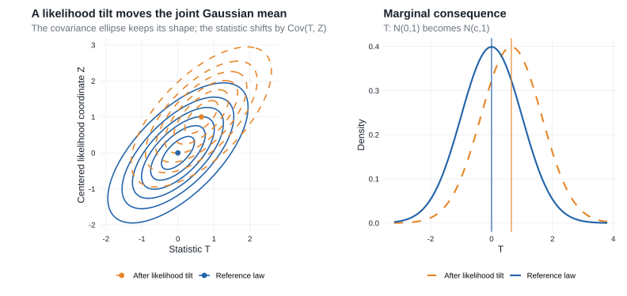

# Chapter 6: Contiguity {#sec-contiguity}

[Contiguity](glossary.qmd#glossary-contiguity) is asymptotic absolute continuity. It allows limiting behavior under a baseline sequence $P_n$ to be transported to a changing sequence $Q_n$, typically a sequence of local alternatives.

::: {.callout-tip title="Why this chapter is here"}
- **Prerequisites:** weak convergence, Portmanteau, continuous mapping, and stochastic remainders from [Chapter 2](chapter-2.qmd#sec-convergence).
- **Purpose:** determine when $P_n$-negligible events remain negligible under $Q_n$, and obtain a $Q_n$-limit from a joint $P_n$-limit with the likelihood ratio.
- **Chapter 25 payoff:** this argument drives the regular-estimator expansion in [Lemma 25.23](chapter-25.qmd#lemma-25-23) and the local-power bounds in [§25.6](chapter-25.qmd#sec-testing), after first appearing for [local alternatives in §7.5](chapter-7.qmd#sec-limit-distributions-alternatives).

The reusable chain is

$$
\text{likelihood-ratio limit}
\ \longrightarrow\
\text{contiguity}
\ \longrightarrow\
\text{joint change of measure}
\ \longrightarrow\
\text{limit under a local alternative}.
$$
:::

::: {.callout-note title="Companion readings"}

For a parallel development of likelihood ratios, contiguity, and Le Cam's lemmas, see §§10.2.1–10.2.3 and §§11.1–11.2 of @bailie2021.

:::

::: {.callout-note title="Reading guide"}

- **Core — §6.1 and Lemma 6.2:** likelihood ratios and the decomposition needed when the two measures are not absolutely continuous.
- **Core — §6.2, Lemma 6.4, and Theorem 6.6:** contiguity and the abstract change-of-measure theorem.
- **Core — Example 6.7:** Le Cam's third lemma and the covariance-driven shift under local alternatives.
- **Compressed — Example 6.5:** the lognormal likelihood-ratio limit as a diagnostic for contiguity.
- **Omitted/deferred:** none; both source sections are on the direct route.

:::

## 6.1 Likelihood Ratios

For probability measures $P$ and $Q$ on the same measurable space:

- $Q\ll P$ means that $P(A)=0$ implies $Q(A)=0$;
- $Q\perp P$ means that the two measures concentrate on disjoint measurable sets.

Suppose $P$ and $Q$ have densities $p$ and $q$ with respect to a common dominating measure $\mu$. Define

$$
(6.1)\qquad
Q^a(A)=Q\{A\cap(p>0)\},
\qquad
Q^\perp(A)=Q\{A\cap(p=0)\}.
$$

The first measure is the part of $Q$ visible from $P$; the second is the part placed where $P$ has no mass.

::: {.callout-important title="Lemma"}
### Lemma 6.2: Lebesgue decomposition {#lemma-6-2}

Let $P$ and $Q$ have densities $p$ and $q$ with respect to $\mu$. The measures in [(6.1)](#eq-lebesgue-decomposition) satisfy:

1. $Q=Q^a+Q^\perp$, with $Q^a\ll P$ and $Q^\perp\perp P$;
2. for every measurable $A$,

   $$
   Q^a(A)=\int_A\frac qp\,dP;
   $$

3. $Q\ll P$ if and only if $Q(p=0)=0$, and this is equivalent to

   $$
   \int\frac qp\,dP=1.
   $$
:::

**Proof roadmap.**

Split the space into the regions $p>0$ and $p=0$. On the first region, substitution of $dP=p\,d\mu$ identifies $q/p$ as the density of $Q^a$ with respect to $P$. The mass of this absolutely continuous part equals one exactly when the singular part vanishes.

Complete proof

The definitions immediately give $Q=Q^a+Q^\perp$. If $P(A)=0$, then $p=0$ for $\mu$-almost every point of $A$, so

$$
Q^a(A)=\int_{A\cap\{p>0\}}q\,d\mu=0.
$$

Thus $Q^a\ll P$. Moreover, $P(p=0)=0$ while $Q^\perp$ is concentrated on $\{p=0\}$, so $Q^\perp\perp P$. This proves part 1.

For every measurable $A$,

$$
Q^a(A)
=\int_{A\cap\{p>0\}}q\,d\mu
=\int_{A\cap\{p>0\}}\frac qp\,p\,d\mu
=\int_A\frac qp\,dP,
$$

where the quotient may be assigned any value on $\{p=0\}$ because that set has $P$-probability zero. This proves part 2.

Finally, $Q\ll P$ if and only if its singular part vanishes, which holds if and only if $Q(p=0)=0$. By part 2,

$$
\int\frac qp\,dP=Q^a(\Omega)=Q(p>0)=1-Q(p=0).
$$

This proves both equivalences in part 3.

::: {.callout-warning title="Radon--Nikodym notation in this chapter"}

Van der Vaart writes

$$
\frac{dQ}{dP}=\frac qp
\qquad P\text{-almost surely}
$$

even when $Q\not\ll P$. In that case this is the density of the absolutely continuous part $Q^a$, not of all of $Q$. Consequently,

$$
E_P\frac{dQ}{dP}\leq1,
$$

and equality holds exactly when $Q\ll P$. The identity $dQ=(dQ/dP)dP$ is therefore valid only under absolute continuity. Without it, for nonnegative measurable $f$ one has only

$$
\int f\,dQ
\geq\int f\frac{dQ}{dP}\,dP,
$$

because the right side omits the $Q^\perp$ contribution.

:::

## 6.2 Contiguity

When $Q\ll P$, the likelihood ratio reweights the $P$-law into the $Q$-law:

$$
E_Qf(X)=E_P\left\{f(X)\frac{dQ}{dP}\right\}.
$$

Contiguity is the sequence-level condition that prevents probability mass from disappearing in the limit.

::: {.callout-note title="Definition"}
### Definition 6.3: contiguity {#definition-6-3}

The sequence $Q_n$ is **contiguous with respect to** $P_n$, written $Q_n\triangleleft P_n$, if

$$
P_n(A_n)\to0
\quad\Longrightarrow\quad
Q_n(A_n)\to0
$$

for every sequence of measurable events $A_n$. The sequences are **mutually contiguous**, written $P_n\triangleleft\triangleright Q_n$, if contiguity holds in both directions.
:::

Absolute continuity is an exact statement about one pair of measures. Contiguity is an asymptotic statement about sequences, and it does not require their total-variation distance to vanish.

::: {.callout-important title="Lemma"}
### Lemma 6.4: Le Cam's first lemma {#lemma-le-cam-first}

Let $P_n$ and $Q_n$ be probability measures on measurable spaces $(\Omega_n,\mathcal A_n)$. The following statements are equivalent:

1. $Q_n\triangleleft P_n$.
2. If, along a subsequence,

   $$
   \frac{dP_n}{dQ_n}\overset{Q_n}{\rightsquigarrow}U,
   $$

   then $P(U>0)=1$.
3. If, along a subsequence,

   $$
   \frac{dQ_n}{dP_n}\overset{P_n}{\rightsquigarrow}V,
   $$

   then $EV=1$.
4. For every sequence of statistics $T_n$, $T_n\overset{P_n}\to0$ implies $T_n\overset{Q_n}\to0$.
:::

**Proof roadmap.**

Statements 1 and 4 are the same eventwise condition written for indicator statistics. Contiguity rules out limiting mass at zero for the inverse likelihood ratio. Conversely, a mean-one limit for the forward likelihood ratio prevents $Q_n$-mass from hiding on $P_n$-negligible events. A bounded likelihood ratio relative to the midpoint measure $(P_n+Q_n)/2$ links the two likelihood-ratio characterizations.

Complete proof

**(1) $\Leftrightarrow$ (4).** If $T_n\overset{P_n}\to0$, apply contiguity to $A_n=\{\|T_n\|>\epsilon\}$ for each $\epsilon>0$. Conversely, given events $A_n$ with $P_n(A_n)\to0$, use $T_n=\mathbf 1_{A_n}$.

**(1) $\Rightarrow$ (2).** Work along a subsequence on which

$$
L_n=\frac{dP_n}{dQ_n}\overset{Q_n}{\rightsquigarrow}U.
$$

Choose $\epsilon_n\downarrow0$ sufficiently slowly that

$$
Q_n(L_n\leq\epsilon_n)\to P(U=0);
$$

such a diagonal choice follows from weak convergence at continuity points of the law of $U$. Because the part of $P_n$ on which $L_n=0$ has probability zero,

$$
P_n(L_n\leq\epsilon_n)
=\int_{\{0<L_n\leq\epsilon_n\}}L_n\,dQ_n
\leq\epsilon_n.
$$

Contiguity makes $Q_n(L_n\leq\epsilon_n)\to0$. Hence $P(U=0)=0$.

**(3) $\Rightarrow$ (1).** Suppose $P_n(A_n)\to0$. Along any subsequence, pass to a further subsequence on which

$$
\left(\frac{dQ_n}{dP_n},\mathbf 1_{A_n^c}\right)
\overset{P_n}{\rightsquigarrow}(V,1).
$$

The likelihood ratios are tight under $P_n$ because their expectations are at most one. By the likelihood-ratio inequality and Portmanteau,

$$
\liminf_n Q_n(A_n^c)
\geq
\liminf_nE_{P_n}\left\{\mathbf 1_{A_n^c}\frac{dQ_n}{dP_n}\right\}
\geq EV=1.
$$

Thus $Q_n(A_n)\to0$. Since every subsequence has a further subsequence with this conclusion, it holds for the full sequence.

**(2) $\Rightarrow$ (3).** Set $\mu_n=(P_n+Q_n)/2$ and

$$
W_n=\frac{dP_n}{d\mu_n},
\qquad
\frac{dQ_n}{d\mu_n}=2-W_n.
$$

The variables $W_n$ lie in $[0,2]$. Along any subsequence under consideration, pass to a further subsequence for which $W_n\rightsquigarrow W$ under $\mu_n$. Boundedness gives $EW=1$. Under $Q_n$ and $P_n$, respectively, the relevant ratios are the transformations

$$
\frac{dP_n}{dQ_n}=\frac{W_n}{2-W_n},
\qquad
\frac{dQ_n}{dP_n}=\frac{2-W_n}{W_n},
$$

with the endpoint conventions dictated by the absolutely continuous parts. Bounded continuous approximation at the endpoints and monotone convergence identify the corresponding limits $U$ and $V$ and give

$$
P(U=0)=2P(W=0),
$$

and

$$
EV
=E\{(2-W)\mathbf 1_{\{W>0\}}\}
=1-2P(W=0).
$$

Therefore $P(U=0)+EV=1$. Statement 2 makes the first term zero, so $EV=1$, proving statement 3.

In applications, condition 3 usually establishes contiguity from a likelihood-ratio limit, and condition 4 then transfers $o_{P_n}(1)$ remainders to $o_{Q_n}(1)$ remainders.

::: {.callout-tip title="Example"}
### Example 6.5: asymptotic lognormality {#example-asymptotic-log-normality}

Suppose that, under $Q_n$,

$$
\frac{dP_n}{dQ_n}\overset{Q_n}{\rightsquigarrow}e^{N(\mu,\sigma^2)}.
$$

The limit is strictly positive, so Lemma 6.4 gives $Q_n\triangleleft P_n$. The sequences are mutually contiguous exactly when

$$
Ee^{N(\mu,\sigma^2)}
=e^{\mu+\sigma^2/2}=1,
$$

or $\mu=-\sigma^2/2$. This mean-equals-minus-one-half-variance form recurs in LAN likelihood ratios.
:::

::: {.callout-note title="Theorem"}
### Theorem 6.6: abstract change of measure {#theorem-change-of-measure}

Suppose $Q_n\triangleleft P_n$ and, under $P_n$,

$$
\left(X_n,\frac{dQ_n}{dP_n}\right)
\overset{P_n}{\rightsquigarrow}(X,V).
$$

Then

$$
L(B)=E\{\mathbf 1_B(X)V\}
$$

defines a probability measure, and $X_n\overset{Q_n}{\rightsquigarrow}L$.
:::

**Proof roadmap.**

Le Cam's first lemma supplies $EV=1$, so weighting by $V$ defines a probability measure. The finite-sample likelihood-ratio inequality and Portmanteau then give the nonnegative-test-function characterization of weak convergence under $Q_n$.

Complete proof

Because every likelihood ratio is nonnegative, its weak limit satisfies $V\geq0$. Contiguity and [Lemma 6.4](#lemma-le-cam-first) give $EV=1$. Hence $B\mapsto E\{\mathbf 1_B(X)V\}$ is a probability measure.

For every nonnegative continuous $f$, the likelihood-ratio inequality from §6.1 gives

$$
E_{Q_n}f(X_n)
\geq E_{P_n}\left\{f(X_n)\frac{dQ_n}{dP_n}\right\}.
$$

The map $(x,v)\mapsto f(x)v$ is nonnegative and continuous. Portmanteau applied to the assumed joint convergence therefore yields

$$
\liminf_nE_{Q_n}f(X_n)
\geq E\{f(X)V\}
=\int f\,dL.
$$

The nonnegative-continuous-function characterization in [Lemma 2.2](chapter-2.qmd#lemma-portmanteau), now applied in the converse direction, gives $X_n\overset{Q_n}{\rightsquigarrow}L$.

The theorem reduces a change of asymptotic law to a joint limit under the baseline measure. The weighting variable $V$ is the limiting likelihood ratio.

::: {.callout-tip title="Example"}
### Example 6.7: Le Cam's third lemma {#lemma-le-cam-third}

Suppose that, under $P_n$,

$$
\left(X_n,\log\frac{dQ_n}{dP_n}\right)
\overset{P_n}{\rightsquigarrow}
N_{k+1}\left(
\begin{pmatrix}\mu\\-\frac12\sigma^2\end{pmatrix},
\begin{pmatrix}\Sigma&\tau\\\tau^T&\sigma^2\end{pmatrix}
\right).
$$

Then, under $Q_n$,

$$
X_n\overset{Q_n}{\rightsquigarrow}N_k(\mu+\tau,\Sigma).
$$
:::

**Proof roadmap.**

Exponentiate the Gaussian log-likelihood-ratio limit, use Le Cam's first lemma to establish contiguity, and apply Theorem 6.6. The characteristic function of the exponentially tilted joint normal identifies the new mean $\mu+\tau$ and unchanged covariance $\Sigma$.

Complete proof

Write the limiting vector as $(X,W)$. By continuous mapping,

$$
\left(X_n,\frac{dQ_n}{dP_n}\right)
\overset{P_n}{\rightsquigarrow}(X,e^W),
\qquad
W\sim N(-\sigma^2/2,\sigma^2).
$$

Because $Ee^W=1$, Lemma 6.4 gives $Q_n\triangleleft P_n$. Because $e^W>0$ almost surely, the reverse likelihood-ratio condition in the same lemma also gives $P_n\triangleleft Q_n$.

Theorem 6.6 says that the limiting characteristic function under $Q_n$ is

$$
E\exp(i t^TX)e^W.
$$

For the stated joint normal law, evaluate its moment-generating function at the complex vector $(it,1)$:

$$
\begin{aligned}
E\exp(i t^TX+W)
&=\exp\left\{
i t^T\mu-\frac12\sigma^2
+\frac12\left(-t^T\Sigma t+2it^T\tau+\sigma^2\right)
\right\}\\
&=\exp\left\{it^T(\mu+\tau)-\frac12t^T\Sigma t\right\}.
\end{aligned}
$$

This is the characteristic function of $N_k(\mu+\tau,\Sigma)$.

The cross-covariance $\tau=\operatorname{Cov}(X,W)$ determines the mean shift under the alternative. Exponential tilting changes the center but not the covariance, as Figure @sixfig-ch6-exponential-tilt illustrates.

::: {#sixfig-ch6-exponential-tilt}

{fig-alt="Contours of a joint Gaussian in the statistic T and centered likelihood coordinate Z retain the same elliptical shape after exponential tilting but have shifted centers. Marginal normal densities show the corresponding mean shift of T."}

Le Cam's third lemma as exponential tilting: weighting by the Gaussian likelihood coordinate shifts the statistic's mean by its covariance with that coordinate while preserving covariance.

:::

### Normal location under a local alternative {#example-6-normal-location}

Let $P_n$ be the joint law of $n$ independent $N(0,1)$ observations and $Q_n$ the joint law of $n$ independent $N(h/\sqrt n,1)$ observations, for fixed $h\in\mathbb R$. Set

$$
Z_n=\sqrt n\,\overline X_n.
$$

The log likelihood ratio is exact:

$$
\begin{aligned}
\log\frac{dQ_n}{dP_n}
&=\sum_{i=1}^n\left\{-\frac12(X_i-h/\sqrt n)^2+\frac12X_i^2\right\}\\
&=hZ_n-\frac12h^2.
\end{aligned}
$$

Under $P_n$, $Z_n\sim N(0,1)$ exactly. Therefore

$$
\left(Z_n,\log\frac{dQ_n}{dP_n}\right)
\overset{P_n}{\rightsquigarrow}
\left(Z,hZ-\frac12h^2\right),
\qquad Z\sim N(0,1).
$$

This is Example 6.7 with

$$
\mu=0,\qquad \Sigma=1,\qquad \sigma^2=h^2,\qquad
\tau=\operatorname{Cov}(Z,hZ)=h.
$$

Thus $P_n$ and $Q_n$ are mutually contiguous and, under $Q_n$,

$$
Z_n\rightsquigarrow N(h,1).
$$

The conclusion is also exact here: under $Q_n$, $\sqrt n\,\overline X_n$ has mean $h$ and variance one for every $n$. The calculation isolates the general mechanism used after [LAN in §7.5](chapter-7.qmd#sec-limit-distributions-alternatives): a local parameter shift becomes a covariance-driven shift in a Gaussian limit experiment.

::: {.callout-tip title="Chapter takeaway"}

[Theorem 7.2](chapter-7.qmd#theorem-lan-iid) supplies the likelihood-ratio expansion, [Example 6.5](#example-asymptotic-log-normality) establishes contiguity, and [Example 6.7](#lemma-le-cam-third) supplies the shifted limit under $P_{\theta+h/\sqrt n}^n$. Chapter 25 repeats this argument along a tangent direction $g$: see [Lemma 25.23](chapter-25.qmd#lemma-25-23) for estimation and [§25.6](chapter-25.qmd#sec-testing) for testing.

:::
