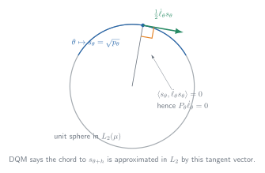
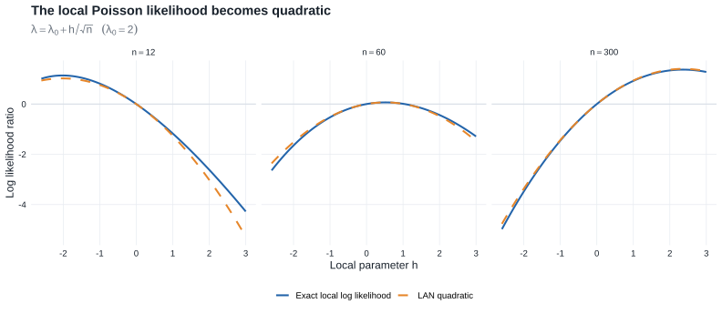

# Chapter 7: Local Asymptotic Normality {#sec-lan}

This chapter shows how a smooth model, viewed on an $n^{-1/2}$ neighborhood of a fixed parameter, becomes a [Gaussian shift experiment](glossary.qmd#glossary-limit-experiment).

::: {.callout-tip title="Why this chapter is here"}
- **Prerequisites:** [stochastic order and Slutsky](chapter-2.qmd#sec-stochastic-order), together with [contiguity and change of measure](chapter-6.qmd#sec-contiguity).
- **Purpose:** use [DQM](glossary.qmd#glossary-dqm) and [LAN](glossary.qmd#glossary-lan) to replace a smooth statistical model, in a shrinking neighborhood of the truth, by a Gaussian location experiment.
- **Chapter 25 payoff:** [Lemma 25.14](chapter-25.qmd#lemma-25.14-local-asymptotic-normality-along-a-path) applies the same LAN expansion one path at a time. Along the way, LAN supplies the Gaussian reductions in [Theorem 8.3](chapter-8.qmd#theorem-limit-experiment-reduction) and Chapter 15.
:::

::: {.callout-note title="Companion readings"}
For complementary treatments of differentiability in quadratic mean, LAN, and convergence of experiments, see §6.2 and §§12.1–12.3 of @bailie2021 and §2.4 of @tsybakov2009.
:::

::: {.callout-note title="Reading guide"}

- **Core — §§7.2–7.3:** Theorem 7.2 turns DQM into LAN, and Theorem 7.10 transfers limiting procedures to the Gaussian experiment.
- **Core — §7.5:** contiguity and Le Cam's third lemma determine behavior under local alternatives.
- **Supporting — §§7.4 and 7.6:** likelihood maximization, parameter-space boundaries, and the abstraction of LAN beyond the i.i.d. setting.
- **Compressed — Examples 7.7–7.9:** representative DQM verifications and the failure caused by moving support.
- **Omitted/deferred — Examples 7.16–7.18 and the exercises:** dependent and other non-i.i.d. models not needed for the pathwise Chapter 25 argument.

:::

## 7.1 Introduction

::: {.callout-note title="Chapter roadmap"}
1. Reparameterize locally using $\theta+h/\sqrt n$.
2. Assume differentiability in quadratic mean.
3. Obtain the quadratic likelihood expansion $h^T\Delta_{n,\theta}-\frac12h^TI_\theta h+o_{P_\theta}(1)$.
4. Recognize this as the likelihood-ratio form of a Gaussian location experiment.
5. Match limiting procedures in the original experiments to procedures in the Gaussian experiment.
6. Use the Gaussian experiment to understand maximum likelihood, local alternatives, testing, estimation, and asymptotic efficiency.
7. Abstract the likelihood expansion into the general definition of LAN for non-i.i.d. and dependent models.

The central sequence $\Delta_{n,\theta}$ and Fisher information $I_\theta$ summarize the local behavior of a regular model. In the limit, the original experiment behaves like observing $X\sim N(h,I_\theta^{-1})$.

:::

### Parametric-to-semiparametric dictionary

Chapter 25 keeps the structure developed here but allows infinitely many local directions. The correspondence is conceptual, not a literal change of notation:

| Chapter 7: smooth parametric model | Chapter 25: semiparametric model |
|---|---|
| local vector $h$ selects a direction and magnitude | score $g$ selects a tangent direction; a scalar $h$ controls its magnitude |
| DQM of $\theta\mapsto P_\theta$ along parameter vectors | DQM of a path $t\mapsto P_{t,g}$ with score $g$ |
| local law $P_{\theta+h/\sqrt n}^n$ | local law $P_{h/\sqrt n,g}^n$ along a chosen path |
| Fisher information $I_\theta$ | efficient information after projecting away nuisance directions |
| $I_\theta^{-1}\dot\ell_\theta$ for $\theta$ itself (and $\dot\psi_\theta I_\theta^{-1}\dot\ell_\theta$ for a smooth scalar target, using the book's row-gradient convention) | efficient influence function $\widetilde\psi_P$ |

The key move is therefore $h\leftrightarrow g$: Chapter 7 studies finitely many parameter directions at once, while [§25.3](chapter-25.qmd#tangent-spaces-and-information) collects the scores of all admissible paths into a tangent space.

::: {.callout-note title="Statistical experiments"}

Let $X_1,\ldots,X_n$ be an i.i.d. sample from $P_\theta$ on $(\mathcal X,\mathcal A)$, where $\theta$ ranges over an open subset $\Theta\subset\mathbb R^k$. The full observation has law $P_\theta^n$ on $(\mathcal X^n,\mathcal A^n)$, and the statistical experiment is the family $\{P_\theta^n:\theta\in\Theta\}$. A single $P_\theta^n$ describes the data law at one parameter value; the experiment retains the full family of possible laws.

:::

::: {.callout-note title="Local asymptotic normality, informally"}
A sequence of statistical experiments is **locally asymptotically normal** when, after an appropriate local reparameterization, its likelihood-ratio process has the same asymptotic quadratic form as the likelihood-ratio process of a Gaussian location experiment.

:::

The approximation to be established is

$$
\{P_{\theta_0+h/\sqrt n}^n:h\in\mathbb R^k\} \approx \{N(h,I_{\theta_0}^{-1}):h\in\mathbb R^k\}
$$

when $n$ is large and $\theta\mapsto P_\theta$ is smooth in the parameter.

---

## 7.2 Expanding the Likelihood

### Local reparameterization

Fix $\theta_0$ and define the **local parameter** $h=\sqrt n(\theta-\theta_0)$. Equivalently, write nearby parameter values as $\theta=\theta_0+h/\sqrt n$ and the corresponding data law as $P_{\theta_0+h/\sqrt n}^n$. If $\theta_0$ is an interior point of $\Theta$, every fixed $h\in\mathbb R^k$ gives a valid parameter for all sufficiently large $n$.

---

### Heuristic likelihood expansion

Let $p_\theta$ be a density of $P_\theta$ with respect to $\mu$, and write $\ell_\theta(x)=\log p_\theta(x)$. The score is $\dot\ell_\theta(x)=\partial\ell_\theta(x)/\partial\theta$, and the second derivative is $\ddot\ell_\theta(x)=\partial\dot\ell_\theta(x)/\partial\theta$.

**Heuristic Taylor expansion:**

For a one-dimensional parameter, suppose $\ell_\theta(x)$ is twice differentiable in $\theta$. Expanding $\ell_{\theta+h}(x)-\ell_\theta(x)$ gives

$$
\log\dfrac{p_{\theta+h}}{p_\theta}(x)=h\dot\ell_\theta(x)+\frac12h^2\ddot\ell_\theta(x)+o_x(h^2).
$$

Summing the expansion over the sample and substituting the local shift $h/\sqrt n$ gives, under suitable regularity conditions,

$$
\begin{aligned}
\log\prod_{i=1}^n\frac{p_{\theta+h/\sqrt n}}{p_\theta}(X_i)
&=\frac{h}{\sqrt n}\sum_{i=1}^n\dot\ell_\theta(X_i)
+\frac{h^2}{2n}\sum_{i=1}^n\ddot\ell_\theta(X_i)
+o_{P_\theta}(1)\\
&=h\Delta_{n,\theta}-\frac12h^2I_\theta+o_{P_\theta}(1).
\end{aligned}
$$

Under standard regularity conditions, the score has mean zero, $P_\theta\dot\ell_\theta=0$, and the Fisher information is

$$
I_\theta=P_\theta\dot\ell_\theta\dot\ell_\theta^T=-P_\theta\ddot\ell_\theta.
$$

The first term is random and asymptotically normal:

$$
\Delta_{n,\theta}=n^{-1/2}\sum_{i=1}^n\dot\ell_\theta(X_i)\rightsquigarrow N(0,I_\theta)
$$

by the central limit theorem. The second term converges by the law of large numbers to the deterministic quadratic penalty $-\frac12h^2I_\theta$.

### Differentiability in quadratic mean {#sec-differentiability-quadratic-mean}

The model $\{P_\theta:\theta\in\Theta\}$ is differentiable in quadratic mean at $\theta$ if there exists a measurable vector function $\dot\ell_\theta$ such that

::: {.callout-note title="Definition"}

$$
(7.1) \qquad \int\left[\sqrt{p_{\theta+h}}-\sqrt{p_\theta}-\frac12h^T\dot\ell_\theta\sqrt{p_\theta}\right]^2\,d\mu=o(\|h\|^2), \qquad h\to0.
$$

:::

Thus, when the parameter moves from $\theta$ to $\theta+h$, the **square-root density** changes approximately linearly in $h$.

When pointwise differentiation is valid, $\dot\ell_\theta(x)=\frac{2}{\sqrt{p_\theta(x)}}\frac{\partial}{\partial\theta}\sqrt{p_\theta(x)}=\frac{\partial}{\partial\theta}\log p_\theta(x)$.

::: {#sevenfig-ch7-dqm-geometry}

{fig-alt="A blue arc lies on a circle representing the unit sphere in L2. At one square-root density, a green tangent arrow is perpendicular to the gray radius from the origin."}

DQM treats square-root densities as a curve on the unit sphere of $L_2(\mu)$; the score determines its tangent, which is orthogonal to the radial direction because scores have mean zero.

:::

Chapter 25 extends this one-curve picture to all regular paths through $P$; compare @sevenfig-ch7-dqm-geometry with [the tangent-space construction in §25.3](chapter-25.qmd#tangent-spaces-and-information).

::: {.callout-note title="Theorem"}
### Theorem 7.2: DQM implies LAN for i.i.d. experiments {#theorem-lan-iid}

Suppose $\Theta$ is open and the model is differentiable in quadratic mean at $\theta$. Then

- $P_\theta\dot\ell_\theta=0$,
- the Fisher information matrix $I_\theta=P_\theta\dot\ell_\theta\dot\ell_\theta^T$ exists,
- and, for every sequence $h_n\to h$,

$$
\log\prod_{i=1}^n\frac{p_{\theta+h_n/\sqrt n}(X_i)}{p_\theta(X_i)}
=\frac{1}{\sqrt n}\sum_{i=1}^nh^T\dot\ell_\theta(X_i)-\frac12h^TI_\theta h+o_{P_\theta}(1).
$$

Differentiability in quadratic mean at $\theta$ implies the quadratic likelihood expansion above, and hence the i.i.d. sequence of experiments is LAN at $\theta$.

:::

**Proof roadmap.** Work with square-root likelihood ratios rather than differentiating the log likelihood directly.

1. DQM and normalization of the densities show that the score is centered.
2. The sum of the linearized square-root likelihood ratios equals the central sequence plus a deterministic drift.
3. A logarithmic expansion supplies a second copy of the quadratic drift.
4. DQM also controls the sum of squares and the largest summand, making the Taylor remainder negligible.

Complete proof of Theorem 7.2

Write $p_n=p_{\theta+h_n/\sqrt n}$, $p=p_\theta$, and $g=h^T\dot\ell_\theta$. DQM and $h_n\to h$ give

$$
\sqrt n(\sqrt{p_n}-\sqrt p)\longrightarrow \frac12g\sqrt p
\quad\text{in }L_2(\mu),
\qquad
\sqrt{p_n}\longrightarrow\sqrt p.
$$

Since both $p_n$ and $p$ integrate to one,

$$
P_\theta g
=\lim_{n\to\infty}\int
\sqrt n(\sqrt{p_n}-\sqrt p)(\sqrt{p_n}+\sqrt p)\,d\mu
=0.
$$

Thus the score is centered. DQM also gives $P_\theta g^2=h^TI_\theta h<\infty$.

Define, on the support of $p$,

$$
W_{ni}=2\left\{\sqrt{\frac{p_n}{p}}(X_i)-1\right\}.
$$

The $L_2$ approximation implies

$$
\operatorname{var}_{P_\theta}
\left(\sum_{i=1}^nW_{ni}-\frac1{\sqrt n}\sum_{i=1}^ng(X_i)\right)
\leq P_\theta\{\sqrt nW_{n1}-g\}^2\longrightarrow0.
$$

Normalization gives its mean exactly:

$$
\begin{aligned}
E_{P_\theta}\sum_{i=1}^nW_{ni}
&=2n\left(\int\sqrt{p_np}\,d\mu-1\right)\\
&=-n\int(\sqrt{p_n}-\sqrt p)^2\,d\mu
\longrightarrow-\frac14P_\theta g^2.
\end{aligned}
$$

Consequently,

$$
\sum_{i=1}^nW_{ni}
=\frac1{\sqrt n}\sum_{i=1}^ng(X_i)-\frac14P_\theta g^2+o_{P_\theta}(1).
\tag{7.4}
$$

Use $\log(1+x)=x-x^2/2+x^2R(2x)$, where $R(u)\to0$ as $u\to0$. Then

$$
\log\prod_{i=1}^n\frac{p_n}{p}(X_i)
=\sum_{i=1}^nW_{ni}-\frac14\sum_{i=1}^nW_{ni}^2
+\frac12\sum_{i=1}^nW_{ni}^2R(W_{ni}).
\tag{7.5}
$$

DQM permits the decomposition $nW_{n1}^2=g^2(X_1)+A_{n1}$ with $P_\theta|A_{n1}|\to0$. The law of large numbers therefore yields

$$
\sum_{i=1}^nW_{ni}^2\overset{P_\theta}\longrightarrow P_\theta g^2.
$$

It remains to control the Taylor remainder. For every $\varepsilon>0$, the same decomposition and truncation give

$$
nP_\theta(|W_{n1}|>\varepsilon)
\leq 2\varepsilon^{-2}P_\theta\!\left[g^2
\mathbf 1\{g^2>n\varepsilon^2/2\}\right]
+2\varepsilon^{-2}P_\theta|A_{n1}|\longrightarrow0.
$$

Hence $\max_{i\leq n}|W_{ni}|\to0$ in probability. It follows that

$$
\left|\sum_{i=1}^nW_{ni}^2R(W_{ni})\right|
\leq \sum_{i=1}^nW_{ni}^2
\max_{i\leq n}|R(W_{ni})|
=o_{P_\theta}(1).
$$

Combining (7.4) and (7.5) gives

$$
\log\prod_{i=1}^n\frac{p_n}{p}(X_i)
=\frac1{\sqrt n}\sum_{i=1}^ng(X_i)
-\frac12P_\theta g^2+o_{P_\theta}(1),
$$

which is the claimed expansion because $g=h^T\dot\ell_\theta$ and $P_\theta g^2=h^TI_\theta h$.

The two appearances of $-\tfrac14P_\theta g^2$ are worth remembering: one comes from the mean of the square-root likelihood ratio and one from the logarithm. Together they produce the LAN penalty $-\tfrac12h^TI_\theta h$. Figure @sevenfig-ch7-lan-quadratic shows the resulting approximation in a Poisson model. [Lemma 25.14](chapter-25.qmd#lemma-25.14-local-asymptotic-normality-along-a-path) uses this same mechanism along a single path.

::: {#sevenfig-ch7-lan-quadratic}

{fig-alt="Three panels for increasing sample sizes compare a solid exact Poisson local log-likelihood curve with a dashed quadratic LAN approximation; the curves become nearly indistinguishable."}

For a Poisson model under $\lambda=\lambda_0+h/\sqrt n$, the exact local log likelihood is increasingly well represented by the LAN quadratic on a fixed local-$h$ scale.

:::

::: {.callout-tip title="Forward connection: Lemma 25.14"}
Theorem 7.2 is the finite-dimensional prototype for [Lemma 25.14](chapter-25.qmd#lemma-25.14-local-asymptotic-normality-along-a-path). Fixing a semiparametric score direction $g$ and following one path $P_{t,g}$ produces the same quadratic expansion, with $g$ replacing $h^T\dot\ell_\theta$ and $Pg^2$ replacing $h^TI_\theta h$.
:::

::: {.callout-important title="Lemma"}
### Lemma 7.6: a sufficient condition for DQM {#lemma-7.6}

Suppose $\theta\mapsto s_\theta(x)=\sqrt{p_\theta(x)}$ is continuously differentiable for every $x$, and the elements of

$$
I_\theta=\int(\dot p_\theta/p_\theta)(\dot p_\theta/p_\theta)^Tp_\theta\,d\mu
$$

are well defined and continuous in $\theta$. Then the model is differentiable in quadratic mean as in (7.1), with score $\dot\ell_\theta=\dot p_\theta/p_\theta$.

:::

::: {.callout-tip title="Example"}
### Example 7.7: exponential families {#example-7-7}

Most exponential families are differentiable in quadratic mean when parameterized smoothly away from the boundary of the natural parameter space. For the model

$$
p_\theta(x)=d(\theta)h(x)e^{Q(\theta)^Tt(x)}.
$$

the score is $\dot\ell_\theta(x)=Q'_\theta\{t(x)-E_\theta t(X)\}$ and the Fisher information is $I_\theta=Q'_\theta\operatorname{cov}_\theta\{t(X)\}(Q'_\theta)^T$.
:::

::: {.callout-tip title="Example"}
### Example 7.8: location models {#example-7-8}

Consider the location model $\{f(x-\theta):\theta\in\mathbb R\}$. If $f$ is positive and continuously differentiable and has finite Fisher information for location, then the model is differentiable in quadratic mean. Its score is $\dot\ell_\theta(x)=-\{f'/f\}(x-\theta)$, and its Fisher information is

$$
I_f=\int \left(\frac{f'}{f}\right)^2(x)f(x)\,dx,
$$

which does not depend on $\theta$.

The Laplace location model is also differentiable in quadratic mean, even though the log density is not differentiable at $x=\theta$.

:::

::: {.callout-warning title="Counterexample"}
### Counterexample 7.9: uniform distribution

The family of uniform distributions on $[0,\theta]$ is nowhere differentiable in quadratic mean. Here $P_{\theta+h}(p_\theta=0)=h/(\theta+h)$ is only $O(h)$, whereas differentiability in quadratic mean would require the mass outside the support of $P_\theta$ to be $o(h^2)$.
:::

## 7.3 Convergence to a Normal Experiment

Suppose the limit experiment consists of one observation $X\sim N(h,I_\theta^{-1})$. Its log likelihood ratio relative to $h=0$ is

$$
\log \dfrac{ dN(h,I_\theta^{-1})}{dN(0,I_\theta^{-1})}(X)=h^TI_\theta X-\frac12h^TI_\theta h.
$$

This is the same quadratic form as the LAN expansion $h^T\Delta_{n,\theta}-\frac12h^TI_\theta h$ in §7.2. If a statistic $T_n$ has a limiting distribution under every local parameter $h$, convergence of experiments means that the entire family of limits can be reproduced by a statistic in the Gaussian experiment. A **randomized statistic** has the form $T=T(X,U)$, where $U\sim\operatorname{Unif}[0,1]$ is independent of $X$; the auxiliary randomization represents arbitrary limiting conditional distributions.

::: {.callout-note title="Theorem"}
### Theorem 7.10: representation in the limit experiment {#theorem-normal-limit-experiment}

Assume the model is differentiable in quadratic mean at $\theta$ and $I_\theta$ is nonsingular. Let $T_n$ be statistics in the local experiments $\{P_{\theta+h/\sqrt n}^n:h\in\mathbb R^k\}$, and suppose $T_n$ converges in distribution under every $h$. Then there exists a randomized statistic $T$ in the Gaussian experiment $\{N(h,I_\theta^{-1}):h\in\mathbb R^k\}$ having the same limiting distribution under every $h$.
:::

This representation is the handoff to Chapter 8. [Theorem 8.3](chapter-8.qmd#theorem-limit-experiment-reduction) uses the Gaussian experiment to transfer lower bounds back to the original model; the corresponding semiparametric convolution and minimax results are [Theorems 25.20](chapter-25.qmd#theorem-25-20) and [25.21](chapter-25.qmd#theorem-25-21).

**Proof roadmap.** Couple the procedure to the central sequence, identify its law under every local alternative by change of measure, and then reproduce that joint law from the Gaussian observation.

Complete proof of Theorem 7.10

Write

$$
P_{n,h}=P_{\theta+h/\sqrt n}^n,
\qquad
J=I_\theta,
\qquad
\Delta_n=\frac1{\sqrt n}\sum_{i=1}^n\dot\ell_\theta(X_i).
$$

Under $P_{n,0}$, both $T_n$ and $\Delta_n$ are tight. Along any subsequence, extract a further subsequence such that

$$
(T_n,\Delta_n)\rightsquigarrow(S,\Delta),
\qquad \Delta\sim N(0,J).
$$

Theorem 7.2 and Slutsky's lemma then give, for every fixed $h$,

$$
\left(T_n,\log\frac{dP_{n,h}}{dP_{n,0}}\right)
\rightsquigarrow
\left(S,h^T\Delta-\frac12h^TJh\right)
\quad\text{under }P_{n,0}.
$$

The limiting likelihood ratio is positive and has mean one. The local laws are therefore mutually contiguous, and [Le Cam's third lemma](chapter-6.qmd#lemma-le-cam-third) identifies the limiting law $L_h$ of $T_n$ under $P_{n,h}$ as

$$
L_h(B)
=E\left[\mathbf 1_B(S)
\exp\left\{h^T\Delta-\frac12h^TJh\right\}\right]
$$

for every Borel set $B$.

By Lemma 7.11, on an extension carrying an independent $U\sim\operatorname{Unif}[0,1]$, there is a measurable map $T$ such that

$$
(T(\Delta,U),\Delta)\overset d=(S,\Delta).
$$

Now let $X\sim N(h,J^{-1})$. Under $h=0$, $JX\sim N(0,J)$ and hence has the same law as $\Delta$. The Gaussian likelihood ratio and the preceding display yield

$$
\begin{aligned}
P_h\{T(JX,U)\in B\}
&=E_0\left[\mathbf 1_B\{T(JX,U)\}
e^{h^TJX-h^TJh/2}\right]\\
&=L_h(B).
\end{aligned}
$$

Thus $T(JX,U)$ reproduces the full family of limiting distributions of $T_n$ in the Gaussian experiment.

::: {.callout-note title="Lemma"}
### Lemma 7.11: randomized representation from conditional laws {#lemma-7.11}

Given a joint distribution $(S,\Delta)$, one can construct a measurable randomized function $T(\Delta,U)$ such that $(T(\Delta,U),\Delta)$ has the same distribution as $(S,\Delta)$.

:::

**Proof roadmap.** Disintegrate the joint law to obtain the conditional distribution of $S$ given $\Delta$, then use an independent uniform randomizer and measurable conditional quantiles to realize that distribution as a function of $(\Delta,U)$.

Complete proof of Lemma 7.11

Take a regular conditional distribution of $S$ given $\Delta=\delta$. For a scalar $S$, let $Q(u\mid\delta)$ be its conditional quantile function and set $T(\delta,u)=Q(u\mid\delta)$. The conditional probability integral transform gives the required joint law.

For a vector $S=(S_1,\ldots,S_d)$, split one uniform random variable measurably into $d$ independent uniforms, for example by distributing the digits of its binary expansion. Generate $S_1$ from its conditional law given $\Delta$, then $S_2$ from its conditional law given $(\Delta,S_1)$, and continue recursively. Conditional quantile maps may be chosen jointly measurable, so the resulting map $T(\Delta,U)$ has the same conditional law given $\Delta$ as $S$ and hence the same joint law with $\Delta$.

Randomization is not asserting that a good estimator should add noise. It is the device that represents any residual conditional variation in the limit after the Gaussian central sequence has been observed.

---

## 7.4 Maximum Likelihood

Chapter 5 establishes asymptotic normality for maximum likelihood estimators in smooth parametric models. The Gaussian limit experiment explains the form of that result: the maximum likelihood estimator of $h$ from $X\sim N(h,I_\theta^{-1})$ is $X$ itself, suggesting that the local estimator $\widehat h_n=\sqrt n(\widehat\theta_n-\theta)$ should satisfy

$$
\sqrt n(\widehat\theta_n-\theta)\rightsquigarrow N(0,I_\theta^{-1})
$$

at an interior parameter point. This conclusion does not follow from LAN alone; consistency and uniform control of the likelihood are also required, as in Theorem 5.39.

### Constrained parameter spaces

Let $H_n=\sqrt n(\Theta-\theta_0)$ be the local parameter space. Here $H_n\to H$ has the source's two-sided set-convergence meaning: every convergent sequence $h_n\in H_n$ has its limit in $H$, and every $h\in H$ is the limit of some sequence $h_n\in H_n$. Under this condition, the limiting maximum likelihood estimator maximizes the Gaussian likelihood over $H$. Equivalently, it projects $X$ onto $H$ in the Fisher-information metric

$$
d_{I_{\theta_0}}(x,y)=\bigl[(x-y)^TI_{\theta_0}(x-y)\bigr]^{1/2}.
$$

Van der Vaart writes the corresponding squared form $(x-y)^TI_{\theta_0}(x-y)$ when describing the projection. Minimizing the squared form gives the same closest point, while the square root is the metric itself. If $H=\mathbb R^k$, the projection is simply $X$.

::: {.callout-note title="Theorem"}
### Theorem 7.12: constrained-MLE limits {#theorem-7-12}

- Suppose the model is differentiable in quadratic mean at $\theta_0$,
- $I_{\theta_0}$ is nonsingular,
- the log densities satisfy the stated local Lipschitz condition,
- $\widehat\theta_n$ is consistent,
- and $H_n=\sqrt n(\Theta-\theta_0)$ converges to a nonempty convex set $H$.

Then $I_{\theta_0}^{1/2}\sqrt n(\widehat\theta_n-\theta_0)$ converges in distribution to the projection of a standard normal vector onto $I_{\theta_0}^{1/2}H$.

Thus boundary restrictions can produce nonnormal projected-Gaussian limiting distributions. The proof uses the [portmanteau lemma](chapter-2.qmd#lemma-portmanteau).

:::

::: {.callout-warning title="Notation: the empirical process in this proof"}

Following Chapter 7, the proof writes $G_n=\sqrt n(\mathbb P_n-P_{\theta_0})$. Chapter 19 writes the same empirical-process operator as $\mathbb G_n$. The local definition controls here; the operator has not changed.

:::

**Proof outline.**

Let $G_n=\sqrt n(\mathbb P_n-P_{\theta_0})$ and $\widehat h_n=\sqrt n(\widehat\theta_n-\theta_0)$. The goal is to identify the limit of $I_{\theta_0}^{1/2}\widehat h_n$.

#### Obtain a uniform quadratic approximation

Differentiability in quadratic mean and the local Lipschitz condition yield, for every fixed $M<\infty$,

$$
\sup_{|h|\leq M}
\left|n\mathbb P_n\log\frac{p_{\theta_0+h/\sqrt n}}{p_{\theta_0}}
-h^TG_n\dot\ell_{\theta_0}+\frac12h^TI_{\theta_0}h\right|
\overset{P_{\theta_0}}\longrightarrow0.
$$

Thus the local log likelihood is uniformly approximated by $h\mapsto h^TG_n\dot\ell_{\theta_0}-\frac12h^TI_{\theta_0}h$. Consistency and the regularity assumptions also give $\widehat h_n=O_{P_{\theta_0}}(1)$, so the maximization may be restricted to a slowly expanding bounded subset of $H_n=\sqrt n(\Theta-\theta_0)$.

#### Convert maximization to projection

For a closed set $F$, the event $\widehat h_n\in F$ requires the approximating quadratic to attain at least as large a value over $F\cap H_n$ as over $H_n$. Completing the square gives

$$
\begin{aligned}
h^TG_n\dot\ell_{\theta_0}-\frac12h^TI_{\theta_0}h
&=-\frac12\left\|I_{\theta_0}^{-1/2}G_n\dot\ell_{\theta_0}
-I_{\theta_0}^{1/2}h\right\|^2\\
&\quad+\frac12\left\|I_{\theta_0}^{-1/2}G_n\dot\ell_{\theta_0}\right\|^2.
\end{aligned}
$$

The final term does not depend on $h$, so maximizing the quadratic is equivalent to minimizing distance. In the book's set-distance notation, $\|x-A\|=\inf_{a\in A}\|x-a\|$; expressions such as $I_{\theta_0}^{1/2}(F\cap H_n)$ denote sets.

#### Pass to the limiting set

By Lemma 7.13 and the central limit theorem,

$$
I_{\theta_0}^{-1/2}G_n\dot\ell_{\theta_0}\rightsquigarrow Z,
\qquad Z\sim N(0,I_k),
$$

and distances to $H_n$ converge to distances to $H$. Because $I_{\theta_0}^{1/2}H$ is nonempty, closed, and convex, the projection

$$
\Pi Z=\operatorname*{argmin}_{u\in I_{\theta_0}^{1/2}H}\|Z-u\|
$$

exists and is unique. The closed-set form of the portmanteau lemma then yields

$$
I_{\theta_0}^{1/2}\sqrt n(\widehat\theta_n-\theta_0)\rightsquigarrow\Pi Z.
$$

At an interior point, typically $H=\mathbb R^k$ and $\Pi Z=Z$; at a boundary, the restricted set $H$ can produce a nonnormal projected-Gaussian limit.

::: {.callout-important title="Lemma"}
### Lemma 7.13: distances to moving parameter sets {#lemma-7.13}

If $H_n\to H$ and $X_n\rightsquigarrow X$, then distances from $X_n$ to $H_n$ converge to the corresponding distance from $X$ to $H$. More explicitly,

1. $\|X_n-H_n\|\rightsquigarrow\|X-H\|$;
2. $\|X_n-(H_n\cap F)\|\geq\|X-(H\cap F)\|+o_P(1)$ for every closed set $F$;
3. $\|X_n-(H_n\cap G)\|\leq\|X-(H\cap G)\|+o_P(1)$ for every open set $G$.
:::

**Proof outline.**

For part (i):

1. Since $X_n\rightsquigarrow X$ and the map $x\mapsto\|x-H\|$ is continuous, the [continuous mapping theorem](chapter-2.qmd#theorem-continuous-mapping) gives $\|X_n-H\|\rightsquigarrow\|X-H\|$.
2. The set convergence $H_n\to H$ implies $\|X_n-H_n\|-\|X_n-H\|\overset{P}\to0$.
3. Then Slutsky’s lemma gives (i): $\|X_n-H_n\|\rightsquigarrow \|X-H\|$.

Parts (ii) and (iii) are one-sided approximations reflecting the distinction between closed and open sets. If $F$ is closed and $h_n\in H_n\cap F$ converges to $h$, then $h\in H\cap F$; the distance to $H_n\cap F$ therefore cannot be asymptotically smaller than the distance to $H\cap F$. If $G$ is open and $h\in H\cap G$, set convergence supplies $h_n\in H_n$ with $h_n\to h$, and openness ensures $h_n\in G$ eventually; the distance to $H_n\cap G$ therefore cannot be asymptotically larger than the distance to $H\cap G$.

## 7.5 Limit Distributions Under Alternatives {#sec-limit-distributions-alternatives}

From [Theorem 7.2](#theorem-lan-iid), LAN gives the expansion

$$
\log\frac{dP_{\theta+h/\sqrt n}^n}{dP_\theta^n}=h^T\Delta_{n,\theta}-\frac12h^TI_\theta h+o_{P_\theta}(1).
$$

Under $P_\theta^n$, $\Delta_{n,\theta}\rightsquigarrow N(0,I_\theta)$, so $h^T\Delta_{n,\theta}\rightsquigarrow N(0,h^TI_\theta h)$. Therefore,

$$
\log\frac{dP_{\theta+h/\sqrt n}^n}{dP_\theta^n}\rightsquigarrow N\left(-\frac12h^TI_\theta h,\,h^TI_\theta h\right).
$$

Let $v=h^TI_\theta h$. If $Z\sim N(-v/2,v)$, then $e^Z>0$ almost surely and $E(e^Z)=1$. The limiting likelihood ratio is therefore positive with expectation one. By [Le Cam’s first lemma](chapter-6.qmd#lemma-le-cam-first),

$$
P_{\theta+h/\sqrt n}^n\triangleleft P_\theta^n.
$$

Applying the same argument in the reverse direction gives

$$
P_\theta^n\triangleleft P_{\theta+h/\sqrt n}^n.
$$

Thus $P_{\theta+h/\sqrt n}^n$ and $P_\theta^n$ are mutually contiguous; compare [Example 6.5](chapter-6.qmd#example-asymptotic-log-normality).

### General scheme

Suppose a statistic has the asymptotically linear expansion, with $P_\theta\psi_\theta=0$ and $P_\theta\psi_\theta\psi_\theta^T<\infty$,

$$
\sqrt n(T_n-\mu_\theta)=n^{-1/2}\sum_{i=1}^n\psi_\theta(X_i)+o_{P_\theta}(1).
$$

The statistic and log likelihood ratio have the joint limit under $P_\theta^n$

$$
\begin{pmatrix}
\sqrt n(T_n-\mu_\theta)\\[2pt]
\log(dP_{\theta+h/\sqrt n}^n/dP_\theta^n)
\end{pmatrix}
\rightsquigarrow
N\!\left[
\begin{pmatrix}0\\-\tfrac12h^TI_\theta h\end{pmatrix},
\begin{pmatrix}
P_\theta\psi_\theta\psi_\theta^T & P_\theta\psi_\theta\dot\ell_\theta^Th\\
h^TP_\theta\dot\ell_\theta\psi_\theta^T & h^TI_\theta h
\end{pmatrix}
\right].
$$

[Le Cam's third lemma](chapter-6.qmd#lemma-le-cam-third) therefore gives, under $P_{\theta+h/\sqrt n}^n$,

$$
\sqrt n(T_n-\mu_\theta)
\rightsquigarrow
N\!\left(P_\theta\psi_\theta\dot\ell_\theta^Th,
P_\theta\psi_\theta\psi_\theta^T\right).
$$

The covariance is unchanged, while the mean shifts by the covariance with the limiting log likelihood ratio.

This method is used to study the local asymptotic behavior and efficiency of estimators and tests. Chapter 15 turns the shifted Gaussian limit into local-power bounds. [Lemma 25.23](chapter-25.qmd#lemma-25-23) and [§25.6](chapter-25.qmd#sec-testing) repeat the same change-of-measure argument along each semiparametric tangent direction.

---

## 7.6 Local Asymptotic Normality {#sec-local-asymptotic-normality}

The preceding results begin with i.i.d. observations, but LAN can be defined for general sequences of statistical models.

Let $\{P_{n,\theta}:\theta\in\Theta\}$ be a sequence of models.

::: {.callout-note title="Definition"}
### Definition 7.14 {#definition-7-14}

The sequence $\{P_{n,\theta}:\theta\in\Theta\}$ is locally asymptotically normal at $\theta$ if there exist norming matrices $r_n$, a matrix $I_\theta$, and random vectors $\Delta_{n,\theta}$ such that $\Delta_{n,\theta}\rightsquigarrow N(0,I_\theta)$ under $P_{n,\theta}$, and for every sequence $h_n\to h$,

$$
\log\frac{dP_{n,\theta+r_n^{-1}h_n}}{dP_{n,\theta}}
=h_n^T\Delta_{n,\theta}-\frac12h_n^TI_\theta h_n+o_{P_{n,\theta}}(1).
$$

Here $r_n$ determines the local rate at which parameters approach $\theta$.

:::

::: {.callout-tip title="Example"}
### Example 7.15: the i.i.d. case {#example-7-15}

If $\{P_\theta:\theta\in\Theta\}$ is differentiable in quadratic mean, then $\{P_\theta^n:\theta\in\Theta\}$ is LAN with $r_n=\sqrt n I$.

The local experiments $\{P_{n,\theta+r_n^{-1}h}:h\in\mathbb R^k\}$ converge to $\{N(h,I_\theta^{-1}):h\in\mathbb R^k\}$ in the sense of Theorem 7.10.

:::

::: {.callout-tip title="Chapter takeaway"}

Differentiability in quadratic mean turns an i.i.d. model into a local Gaussian shift experiment. LAN, representation, and change of measure then transport procedures and limit laws under local alternatives; Chapter 25 repeats this argument one tangent path at a time.

:::
