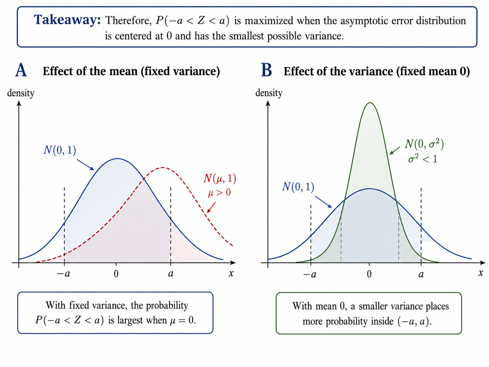
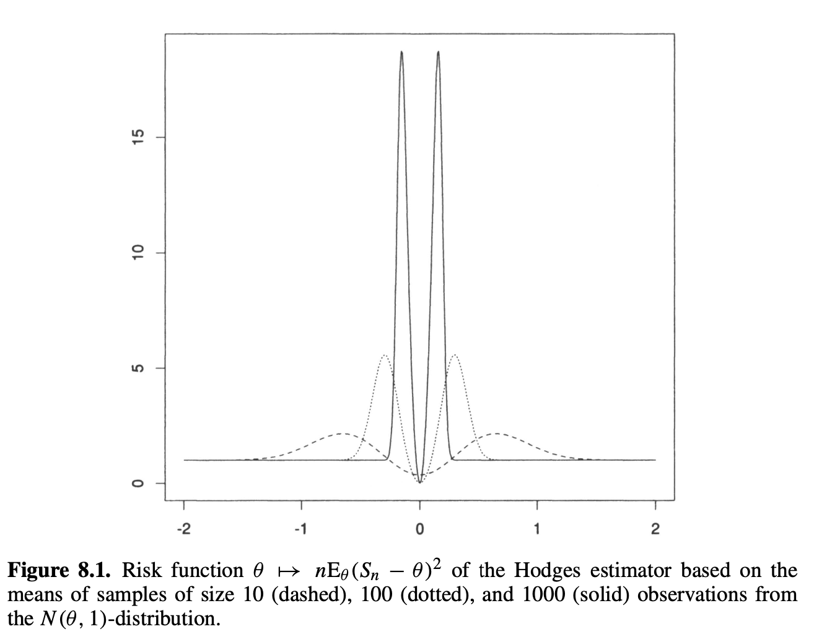
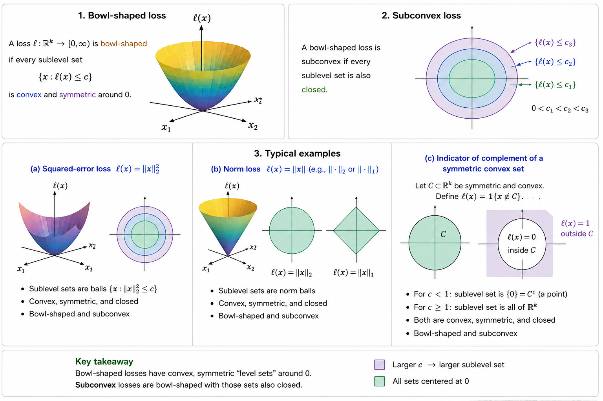

# Chapter 8: Efficiency of Estimators

[Worked problems for Chapter 8](problems.qmd#problems-chapter-8)

How well can estimator can perform asymptotically?

- develops several versions of an asymptotic lower bound.
- estimation in a smooth parametric model is locally equivalent to estimation in a Gaussian shift experiment.

::: {.callout-note title="Definition"}
## Summary {.unnumbered}

Suppose that $T_n$ estimates $\psi(\theta)$ and that $\sqrt{n}\bigl(T_n-\psi(\theta)\bigr)$ has a **limiting distribution**.

1. Study the estimator under nearby parameters $\theta+h/\sqrt{n}$, not only at a fixed $\theta$.
2. Under **differentiability in quadratic mean**, the local experiment converges to the **Gaussian shift experiment** $X\sim N(h,I_\theta^{-1})$.
3. In that experiment, the natural estimator of $\dot\psi_\theta h$ is $\dot\psi_\theta X$.
4. Its **error distribution** is $N\bigl(0,\dot\psi_\theta I_\theta^{-1}\dot\psi_\theta^T\bigr)$.
5. Therefore, this normal distribution is the natural **asymptotic lower bound** for estimating $\psi(\theta)$.

The bound can be expressed through regularity, almost-everywhere results, or local minimax risk. It is not an absolute pointwise bound on every estimator at every parameter.

:::

## 8.1 Asymptotic concentration

- The goal is to compare the concentration near zero of possible limiting distributions of $\sqrt{n}\bigl(T_n-\psi(\theta)\bigr)$.
    - Assume the sequence converges in distribution under every possible value of $\theta$.
    - If the limiting distribution is normal, $N\bigl(\mu(\theta),\sigma^2(\theta)\bigr)$, then the estimator is approximately distributed as $T_n\approx N\left(\psi(\theta)+\frac{\mu(\theta)}{\sqrt{n}},\frac{\sigma^2(\theta)}{n}\right)$.

What is best? Desirable choices are:

- asymptotic bias $\mu(\theta)=0$;
- asymptotic variance $\sigma^2(\theta)$ as small as possible.
- Ensure asymptotic mse is small, limit distribution of the scaled estimator $N\bigl(\mu(\theta),\sigma^2(\theta)\bigr)$ is maximally concentrated near zero.

For example, the probability of the interval $(-a, a)$ is maximized by choosing $\mu(\theta) = 0$ and $\sigma^2(\theta)$ minimal.

- Let $Z\sim N(\mu(\theta),\sigma^2(\theta))$. Then $P(-a<Z<a)$ measures how much of the limiting estimation-error distribution lies close to zero.
- For fixed variance, this probability is largest when $\mu(\theta)=0$ because the normal distribution is then centered on the interval $(-a,a)$. Any nonzero mean shifts probability mass away from zero.
- Once $\mu(\theta)=0$, making $\sigma^2(\theta)$ smaller squeezes more of the distribution into $(-a,a)$. Thus, zero mean and minimal variance make the limiting error most concentrated near zero.

For general, possibly nonnormal limits, concentration is measured through a nonnegative loss function $\ell$. If the limit distribution is $L_\theta$, its asymptotic risk is $\int \ell,dL_\theta$.

Examples include:

- quadratic loss: $\int x^2,dL_\theta(x)$;
- absolute loss: $\int |x|,dL_\theta(x)$;
- tail probability loss: $\int 1_{\{|x|>a\}}\,dL_\theta(x)$.

A distribution is more concentrated near zero (i.e., better) when these risks are smaller.

::: {.callout-note title="Definition"}
### 8.1 Hodges’ estimator

Suppose that $T_n$ is a sequence of estimators for a real parameter $\theta$ with standard root-$n$ behavior,

$$
\sqrt n(T_n-\theta)\rightsquigarrow L_\theta.
$$

E.g., let $T_n$ be the mean of a sample size $n$ from a $N(\theta, 1)$ distribution.

Define $S_n=\begin{cases}T_n&\text{if }|T_n|\geq n^{-1/4},\\ 0&\text{if }|T_n|<n^{-1/4}.\end{cases}$

- For every fixed $\theta\neq 0$, truncation eventually occurs with negligible probability, so $\sqrt{n}(S_n-\theta)\rightsquigarrow L_\theta$.
- At $\theta=0$, however, $S_n$ is set equal to zero with probability tending to one. It therefore converges faster than the usual root-$n$ rate.
- This appears to make $S_n$ better than $T_n$ at $\theta=0$ without making it worse elsewhere. But  pointwise limits hide:
    - the risk has large peaks near zero;
    - the peaks move toward zero as $n$ increases;
    - their widths shrink, but their heights diverge.
- Thus, the estimator’s improvement exactly at $\theta=0$ is purchased through very poor behavior at parameter values that approach zero with $n$.

**Pointwise asymptotic comparisons at fixed parameter values are too weak. Efficiency must account for neighboring parameter values simultaneously.**

:::

## 8.2 Relative efficiency

::: {.callout-note title="Definition"}
####

To choose between two estimators, we can compare the concentration of their limit distributions.

- Suppose that an estimator $T_n$ has the asymptotic distribution $\sqrt{n}\bigl(T_n-\psi(\theta)\bigr)\rightsquigarrow N\bigl(0,\sigma^2(\theta)\bigr)$.
- To obtain a targeted asymptotic variance of $1/\nu$, the required sample size needs to satisfy $\frac{n_\nu}{\nu}\longrightarrow \sigma^2(\theta)$.
    - i.e., we need $n_\nu$ observations such that, as $\nu\to\infty$,

$$
\frac{n_\nu}{\nu}\longrightarrow\sigma^2(\theta).
$$

- For two estimator sequences with asymptotic variances $\sigma_1^2(\theta)$ and $\sigma_2^2(\theta)$, their relative sample-size requirement is $\underset{\nu\to\infty}{\lim}\frac{n_{\nu,2}}{n_{\nu,1}}=\frac{\sigma_2^2(\theta)}{\sigma_1^2(\theta)}$.
- **If this ratio exceeds one, the second estimator needs proportionally more observations than the first to achieve the same asymptotic precision.**
:::

## 8.3 Lower bound for experiments {#sec-lower-bound-experiments}

- Because Hodges’ example defeats pointwise lower bounds, we consider local alternatives of the form $\theta+\frac{h}{\sqrt{n}}$, where $h\in\mathbb{R}^k$ remains fixed.
- Suppose that, for certain limit distributions $L_{\theta,h}$, for every $h$,

$$
(8.2)\qquad  \sqrt{n}\left(T_n-\psi\left(\theta+\frac{h}{\sqrt{n}}\right)\right)\overset{\theta+h/\sqrt{n}}{\rightsquigarrow}L_{\theta,h}.
$$

- The estimator is locally good at $\theta$ if the family of distributions $L_{\theta,h}$ is concentrated near zero for all $h$.
- If the limit distributions are **maximally concentrated**, for every $h$ and some fixed $\theta$, then $T_n$ is **locally optimal** at $\theta$.

For the rest of the chapter, assume:

- $\Theta$ is an open subset of $\mathbb R^k$ and $\psi$ maps $\Theta$ into $\mathbb R^m$.
- The derivative of $\theta \mapsto \psi(\theta)$ is $\dot \psi_\theta$.

- Under differentiability in quadratic mean at $\theta$, the local experiments converge to $\bigl(N(h,I_\theta^{-1}):h\in\mathbb{R}^k\bigr)$ (see the result from the representation in the limit experiment, [Theorem 7.10](chapter-7.qmd#theorem-normal-limit-experiment)).

::: {.callout-note title="Theorem"}
### Theorem 8.3: reduction to the limit experiment {#theorem-limit-experiment-reduction}

- Assume the experiment $\left( P_\theta: \theta \in \Theta\right)$ is differentiable in quadratic mean ([7.1](chapter-7.qmd#eq-differentiability-quadratic-mean)) at $\theta$ with non-singular Fisher information matrix $I_\theta$.
- Let $\psi$ be differentiable at $\theta$.
- Let $T_n$ be estimators in the experiments $(P^n_{\theta + h/\sqrt n}: h \in \mathbb R^k)$ s.t. [(8.2)](#eq-local-regularity) holds for every $h$.
- Then the local limiting behavior of any estimator sequence can be reproduced by a randomized estimator $T$ in the Gaussian shift experiment.
    - That is, there is an estimator $T$ based on $X\sim N(h,I_\theta^{-1})$ such that $T-\dot\psi_\theta h\sim L_{\theta,h}$ for every $h$.

Thus, the original asymptotic estimation problem is reduced to the finite-sample problem:

- observe $X\sim N(h,I_\theta^{-1})$;
- estimate $\dot\psi_\theta h$.
- The natural estimator is $\dot\psi_\theta X$, with error distribution $\dot\psi_\theta X-\dot\psi_\theta h\sim N\bigl(0,\dot\psi_\theta I_\theta^{-1}\dot\psi_\theta^T\bigr)$.
- This covariance matrix is also the parametric Cramér–Rao bound for estimating $\psi(\theta)$.
:::

**Proof:**

$S_n = \sqrt n \left(T_n - \psi(\theta)\right)$.

Add and subtract $\textcolor{teal}{\psi \left( \theta + \frac{h}{\sqrt n} \right)}$:

$$
S_n = \sqrt n \left( T_n \textcolor{teal}{- \psi \left( \theta + \frac{h}{\sqrt n} \right)} \right) + \sqrt n \left(\textcolor{teal}{ \psi \left( \theta + \frac{h}{\sqrt n} \right)}  -\psi(\theta)\right)
$$

- by assumption under [(8.2)](#eq-local-regularity), the first part, $\sqrt n \left( T_n - \psi \left( \theta + \frac{h}{\sqrt n} \right) \right)$,  converges in distribution under $h$ to $L_{\theta,h}$.

$$
\sqrt n\left(T_n-\psi\left(\theta+\frac{h}{\sqrt n}\right)\right)\overset{\theta+h/\sqrt n}{\rightsquigarrow}L_{\theta,h}
$$

- Differentiability gives that the second part converges to a constant $\sqrt n\left(\psi\left(\theta+\frac{h}{\sqrt n}\right)-\psi(\theta)\right)\to\dot\psi_\theta h$.
- Therefore, by [Slutsky’s lemma 2.8](chapter-2.qmd#lemma-slutsky),

$$
S_n\overset{\theta+h/\sqrt n}{\rightsquigarrow}L_{\theta,h}*\delta_{\dot\psi_\theta h}
$$

where $*\delta_{\dot\psi_\theta h}$ is a point mass at $\dot\psi_\theta h$. Convolution with it simply shifts the distribution:

$$
X\sim L_{\theta,h}\quad\Longrightarrow\quad X+\dot\psi_\theta h\sim L_{\theta,h}*\delta_{\dot\psi_\theta h}.
$$

- [Theorem 7.10](chapter-7.qmd#theorem-normal-limit-experiment) (representation theorem in the limit experiment) then produces a statistic $T$ in the Gaussian limit experiment such that

$$
T-\dot\psi_\theta h\sim L_{\theta,h}.
$$

## 8.4 Estimating normal means

Some facts about Gaussian models.

- Consider the general Gaussian experiment $X\sim N(h,\Sigma)$, where $\Sigma$ is known and nonsingular, and suppose the target is $Ah$.
- The natural estimator is $AX$, whose error distribution is $AX-Ah\sim N(0,A\Sigma A^T)$.

::: {.callout-note title="Definition"}
### Equivariance in law

An estimator $T$ is **equivariant in law** if the distribution of $T-Ah$ under $h$ does not depend on $h.$

:::

::: {.callout-note title="Theorem"}
### 8.4 Proposition

The invariant distribution of any randomized equivariant-in-law estimator can be decomposed as $L=N(0,A\Sigma A^T)*M$ for some probability measure $M$.

Thus, every equivariant-in-law estimator behaves like:

- the natural estimator $AX$;
- plus an independent noise term with distribution $M$.

The estimator $AX$ corresponds to the case in which $M$ is degenerate at zero.

:::

- Convolution means the distribution of a sum of independent variables. Thus, we can represent the error in distribution as $T-Ah\overset{d}{=}Z+W,$ where $Z\sim N(0,A\Sigma A^T),\qquad W\sim M,$ and $Z$ and $W$ are independent.
- So every equivariant-in-law estimator has:
    - the unavoidable Gaussian error $Z$ already present in $AX$;
    - possibly some additional noise $W$.
- For example, if $T=AX+U$ for independent noise $U\sim M$, then $T-Ah=A(X-h)+U,$ which has exactly this convolution distribution.
    - If $M=\delta_0$, then $W=0$ with probability one, so $L=N(0,A\Sigma A^T).$
- Every equivariant estimator’s error has the same law as the error of $AX$ plus independent noise.

### Bowl-shaped loss

- A loss function $\ell$ is **bowl-shaped** if every sublevel set ${x:\ell(x)\leq c}$ is convex and symmetric around zero.
- It is **subconvex** if these sublevel sets are also closed.
- Typical examples include squared-error loss, norm loss, and indicators of complements of symmetric convex sets.

::: {.callout-important title="Lemma"}
### 8.5 Lemma (Anderson’s lemma) {#lemma-anderson}

- For a bowl-shaped loss function, adding independent noise cannot improve the normal distribution:

$$
E\ell(Z+W)\geq E\ell(Z),
$$

where $Z\sim N(0,A\Sigma A^T)$ and $W$ is independent of $Z$.

- Therefore, among equivariant-in-law estimators, $AX$ is optimal.
:::

::: {.callout-note title="Definition"}
### Minimaxity

- The maximum risk of an estimator $T$ is

$$
\sup_h R(h,T)=\sup_h E_h\ell(T-Ah).
$$

- For bowl-shaped loss, every randomized estimator satisfies $\sup_h \text E_h\ell(T-Ah)\geq \text E_0\ell(AX)$.
- Because the risk of $AX$ is constant in $h$, it attains this lower bound and is minimax.
:::

::: {.callout-note title="Theorem"}
### 8.6 Proposition

For any bowl-shaped loss function $\ell$, the maximum risk of any randomized estimator $T$ of $Ah$ is bounded below by $\text E_0 \ell (AX)$. Consequently $AX$ is a minimax estimator for $Ah$. If $Ah$ is real and $\text E_0 (AX)^2 \ell (AX) < \infty$ then $AX$ is the only minimax estimator for $Ah$ up to changes on sets of probability zero.

:::

**Proof.**

- Suppose$X\sim N(h,\Sigma),$ and the target is $Ah$. Let $T=T(X,U)$ be any possibly randomized estimator, where $U$ is independent randomization.
- The risk of $T$ at $h$ is $R(h,T)=\text E_h\ell(T-Ah).$
    - Its maximum risk is $\sup_h \text E_h\ell(T-Ah).$
    - The proof shows $\sup_h E_h\ell(T-Ah)\geq E_0\ell(AX).$
1. Step 1: Introduce a normal prior on $h$
    - Let the unknown parameter be represented by a random vector
    - Conditional on $H=h$, let $X\mid H=h\sim N(h,\Sigma).$
    - Thus, the original model is recovered by conditioning on a particular value $H=h$.
    - The average risk under this prior is $\text E\ell(T-AH)=\int \text{E}_h\ell(T-Ah),dN(0,\Lambda)(h).$
        - Because a supremum is at least as large as any average, $\sup_h \text{E}_h\ell(T-Ah)\geq E\ell(T-AH).$
2. Step 2: Find the posterior distribution of $H$
    - Under the normal prior and normal model,$H\mid X\sim N\left((\Sigma^{-1}+\Lambda^{-1})^{-1}\Sigma^{-1}X,;(\Sigma^{-1}+\Lambda^{-1})^{-1}\right).$
    - Define the posterior mean$m_\Lambda(X)=(\Sigma^{-1}+\Lambda^{-1})^{-1}\Sigma^{-1}X.$
    - Then $H-m_\Lambda(X)\mid X\sim N\left(0,(\Sigma^{-1}+\Lambda^{-1})^{-1}\right).$
3. Step 3: Decompose the estimation error
    - Define $W_\Lambda=T-Am_\Lambda(X),$ and $G_\Lambda=-A\bigl(H-m_\Lambda(X)\bigr).$
    - Then $G_\Lambda+W_\Lambda=-A\bigl(H-m_\Lambda(X)\bigr)+T-Am_\Lambda(X)=T-AH.$
    - Therefore, $T-AH=G_\Lambda+W_\Lambda.$
        - The term $W_\Lambda$ is the estimator’s error relative to the posterior mean. The term $G_\Lambda$ is the residual uncertainty about $AH$ after observing $X$.
4. Step 4: Show that the two terms are independent
    - The variable $W_\Lambda$ depends only on $X$ and $U$.
    - Conditional on $X$, $G_\Lambda\mid X\sim N\left(0,A(\Sigma^{-1}+\Lambda^{-1})^{-1}A^T\right).$
    - This conditional distribution does not depend on $X$. Therefore, $G_\Lambda$ is independent of $X$ and hence independent of $W_\Lambda$.
5. Step 5: [Apply Anderson’s lemma](#lemma-anderson)
    - Because $T-AH=G_\Lambda+W_\Lambda,$ we have $\text E\ell(T-AH)=E\ell(G_\Lambda+W_\Lambda).$
        - [Anderson’s lemma 8.5](#lemma-anderson) says that adding independent noise cannot reduce expected bowl-shaped loss. Therefore, $\text E\ell(G_\Lambda+W_\Lambda)\geq \text E\ell(G_\Lambda).$
    - Combining the inequalities, $\sup_h \text{E}_h\ell(T-Ah)\geq \text E\ell(T-AH)\geq \text E\ell(G_\Lambda).$
    - This is true for every prior covariance matrix $\Lambda$.
6. Step 6: Let the prior become diffuse
    - Set $\Lambda=\lambda I$ and let$\lambda\to\infty.$
    - Then $\Lambda^{-1}=\frac{1}{\lambda}I\to 0,$ so $\left(\Sigma^{-1}+\Lambda^{-1}\right)^{-1}\to\Sigma.$
    - Consequently, $G_\Lambda\rightsquigarrow G,$ where $G\sim N(0,A\Sigma A^T).$
    - Because $\ell$ is nonnegative and lower semicontinuous, the [Portmanteau lemma](chapter-2.qmd#lemma-portmanteau) gives $\liminf_{\lambda\to\infty}\text E\ell(G_\Lambda)\geq \text E\ell(G).$
    - Thus, $\sup_h \text{E}_h\ell(T-Ah)\geq \text E\ell(G).$
7. Step 7: Recognize the risk of $AX$
    - Under parameter $h$, $AX-Ah=A(X-h).$
    - Since $X-h\sim N(0,\Sigma),$ we have $AX-Ah\sim N(0,A\Sigma A^T).$
    - This is exactly the distribution of $G$.
    - Therefore, $\text E\ell(G)=\text{E}_h\ell(AX-Ah)=\text{E}_0\ell(AX).$
    - Hence, for every estimator $T$, $\sup_h \text{E}_h\ell(T-Ah)\geq \text{E}_0\ell(AX).$
8. Step 8: Conclude that $AX$ is minimax
    - The risk of $AX$ does not depend on $h$: $\text{E}_h\ell(AX-Ah)=\text{E}_0\ell(AX).$
    - Therefore, $\sup_h \text{E}_h\ell(AX-Ah)=\text{E}_0\ell(AX).$
    - Because every estimator has maximum risk at least this large and $AX$ attains the lower bound, $\boxed{AX\text{ is minimax for estimating }Ah.}$

Uniqueness: The proposition also states that, when $Ah$ is real and $\text{E}_0(AX)^2\ell(AX)<\infty,$ then $AX$ is the unique minimax estimator up to changes on probability-zero sets.

- The chapter does **not** prove this uniqueness result; it refers the reader to other sources.

## 8.5 Convolution theorem {#sec-convolution-theorem}

- An estimator sequence $T_n$ is **regular** at $\theta$ for estimating $\psi(\theta)$ if, for every $h$,

$$
\sqrt n\left(T_n-\psi\left(\theta+\frac{h}{\sqrt n}\right)\right)\overset{\theta+h/\sqrt n}{\rightsquigarrow}L_\theta,
$$

where the same distribution $L_\theta$ appears for every $h$.

- **Regularity** means that a local perturbation of the parameter does not change the limiting error distribution.
- Equivalently, regular estimators are asymptotically equivariant in law.
- According to [Theorem 8.3](#theorem-limit-experiment-reduction), every estimator sequence is matched by an estimator $T$ in the limit experiment $\left( N(h, I_\theta^{-1}): h \in \mathbb R^k\right)$.
    - For a regular estimator, the matching estimator has the property $T - \dot \psi_\theta h \overset{h}{\sim} L_\theta$, for every $h$.
    - A regular estimator sequence is matched by an equivariant-in-law estimator for $\dot \psi_\theta h$.
- A **best regular estimator** has $M_\theta$ degenerate at zero and hence limiting distribution $N\bigl(0,\dot\psi_\theta I_\theta^{-1}\dot\psi_\theta^T\bigr)$.

::: {.callout-note title="Theorem"}
### 8.8 Theorem (Convolution)

- Experiment $(P_\theta : \theta \in \Theta)$ is differentiable in quadratic mean [(7.1)](chapter-7.qmd#eq-differentiability-quadratic-mean) at $\theta$ with non-singular Fisher information $I_\theta$.
- Let $\psi$ be differentiable at $\theta$.
- Let $T_n$ be a regular estimator sequence in the experiments with limit distribution $L_\theta$.
- For every regular estimator sequence, its limiting distribution has the form $L_\theta=N\bigl(0,\dot\psi_\theta I_\theta^{-1}\dot\psi_\theta^T\bigr)*M_\theta$ for some probability measure $M_\theta$.
    - The limiting error is therefore the efficient normal error plus additional independent noise.
    - If $L_\theta$ has covariance matrix $\Sigma_\theta$, then $\Sigma_\theta-\dot\psi_\theta I_\theta^{-1}\dot\psi_\theta^T$ is nonnegative definite.
:::

::: {.callout-note title="Theorem"}
### 8.6 Almost-everywhere convolution theorem

- Regularity is a substantive restriction, and Hodges’ estimator is not regular at the point where it is superefficient.
- The almost-everywhere theorem removes the regularity assumption.

### 8.9 Theorem

- Suppose that $\sqrt{n}\bigl(T_n-\psi(\theta)\bigr)\rightsquigarrow L_\theta$ under every $\theta$.
- Then, for Lebesgue almost every $\theta$, $L_\theta=N\bigl(0,\dot\psi_\theta I_\theta^{-1}\dot\psi_\theta^T\bigr)*M_\theta$.
    - Consequently, an estimator can beat the efficient normal limit only on a Lebesgue null set of parameter values.

This explains Hodges’ estimator:

- it can be superefficient at $\theta=0$;
- it cannot be superefficient on a set of positive Lebesgue measure.

The supporting lemma shows that any estimator sequence possessing pointwise limits is automatically regular at almost every parameter along a suitable subsequence.

:::

::: {.callout-important title="Lemma"}
### 8.10 Lemma

Let $T_n$ be estimators in experiments $\left(P_{n,\theta}:\theta\in\Theta\right),$ where $\Theta$ is a measurable subset of $\mathbb{R}^k$.

Assume:

- For every measurable set $A$ and every $n$, the map $\theta\mapsto P_{n,\theta}(A)$ is measurable.
- The map $\theta\mapsto\psi(\theta)$ is measurable.
- There exist distributions $L_\theta$ such that, for Lebesgue almost every $\theta$, $r_n\left(T_n-\psi(\theta)\right)\overset{\theta}{\rightsquigarrow}L_\theta.$
- Then, for every sequence $\gamma_n\to 0$, there exists a subsequence ${n_j}$ such that, for Lebesgue almost every pair $(\theta,h)$,

$$
r_{n_j}\left(T_{n_j}-\psi\left(\theta+\gamma_{n_j}h\right)\right)\overset{\theta+\gamma_{n_j}h}{\rightsquigarrow}L_\theta.
$$

- If an estimator has a pointwise limit distribution at almost every parameter value, then along some subsequence it is automatically regular under vanishing perturbations $\theta+\gamma_n h$ for almost every $\theta$ and almost every direction $h$. The local limiting distribution remains $L_\theta$.
:::

**Proof.**

- The assumption is that, for Lebesgue almost every fixed parameter value $\theta$, $r_n\bigl(T_n-\psi(\theta)\bigr)\overset{\theta}{\rightsquigarrow}L_\theta.$
- The lemma wants to show that, along a subsequence, this convergence also holds when the true parameter moves toward $\theta$: $r_{n_j}\bigl(T_{n_j}-\psi(\theta+\gamma_{n_j}h)\bigr)\overset{\theta+\gamma_{n_j}h}{\rightsquigarrow}L_\theta$ for Lebesgue almost every pair $(\theta,h)$.
- The central idea is that pointwise convergence of measurable functions can be upgraded, along a subsequence, to convergence after small perturbations of the argument.
1. Step 1: Extend the parameter space to all of $\mathbb{R}^k$
    - The proof assumes without loss of generality that $\Theta=\mathbb{R}^k.$
    - If the original parameter space is only a measurable subset of $\mathbb{R}^k$, choose some fixed $\theta_0\in\Theta$ and define, outside $\Theta$, $P_{n,\theta}=P_{n,\theta_0}.$
    - This extension lets the proof consider every point of the form $\theta+\gamma_n h$ without worrying about whether it lies inside the original parameter space.
2. Step 2: Define the standardized estimator
    - Write $T_{n,\theta}=r_n\bigl(T_n-\psi(\theta)\bigr).$
    - The assumption of the lemma becomes $T_{n,\theta}\overset{\theta}{\rightsquigarrow}L_\theta$ for Lebesgue almost every $\theta$.
    - The desired conclusion is $T_{n_j,\theta+\gamma_{n_j}h}\overset{\theta+\gamma_{n_j}h}{\rightsquigarrow}L_\theta$ for Lebesgue almost every $(\theta,h)$.
3. Step 3: Replace weak convergence by convergence of expectations
    - Choose a countable collection $\mathcal F$ of bounded test functions such that weak convergence is equivalent to convergence of expectations for every $f\in\mathcal F$.
    - Thus, $T_{n,\theta}\overset{\theta}{\rightsquigarrow}L_\theta$ is equivalent to $E_\theta f(T_{n,\theta})\longrightarrow\int f,dL_\theta$ for every $f\in\mathcal F$.
    - The countability of $\mathcal F$ will later allow the proof to choose one subsequence that works for every test function simultaneously.
4. Step 4: Reduce the problem to ordinary functions of $\theta$
    - Fix one test function $f\in\mathcal F$ and define $g_n(\theta)=E_\theta f(T_{n,\theta})$ and $g(\theta)=\int f,dL_\theta.$
    - The original convergence assumption gives $g_n(\theta)\longrightarrow g(\theta)$ for Lebesgue almost every $\theta$.
    - To establish the desired local weak convergence, it is enough to show that there is a subsequence along which $g_n(\theta+\gamma_nh)\longrightarrow g(\theta)$ for Lebesgue almost every $(\theta,h)$.
    - Indeed, $g_n(\theta+\gamma_nh)=E_{\theta+\gamma_nh}f\left(r_n\bigl(T_n-\psi(\theta+\gamma_nh)\bigr)\right).$
    - Thus, this convergence is exactly the convergence of test-function expectations required for the lemma.
5. Step 5: The key analytic claim
    - The proof now reduces to the following statement:

> If bounded measurable functions $g_n$ satisfy $g_n(\theta)\to g(\theta)$ almost everywhere, then for every $\gamma_n\to0$ there is a subsequence such that $g_n(\theta+\gamma_nh)\longrightarrow g(\theta)$ for Lebesgue almost every $(\theta,h)$.
>

- There are two differences to control:
1. the difference between $g_n$ and $g$ at the perturbed point;
2. the difference between $g$ at the perturbed and unperturbed points.
- That is, $g_n(\theta+\gamma_nh)-g(\theta)=\bigl[g_n(\theta+\gamma_nh)-g(\theta+\gamma_nh)\bigr]+\bigl[g(\theta+\gamma_nh)-g(\theta)\bigr].$
1. Step 6: Introduce random Gaussian points
    - Let $\Theta$ and $H$ be independent standard normal vectors: $\Theta,H\sim N(0,I).$
    - Then $\Theta+\gamma_nH\sim N\bigl(0,(1+\gamma_n^2)I\bigr).$
    - Let $p$ be the density of $N(0,I)$ and let $p_n$ be the density of $N\bigl(0,(1+\gamma_n^2)I\bigr).$
    - Because $\gamma_n\to0$, $p_n(u)\longrightarrow p(u).$
    - Scheffé’s lemma gives the stronger conclusion $\int|p_n(u)-p(u)|,du\longrightarrow0.$
    - Thus, the distribution of the perturbed point $\Theta+\gamma_nH$ approaches the distribution of $\Theta$.
2. Step 7: Control the difference between $g_n$ and $g$
    - Consider $E\left|g_n(\Theta+\gamma_nH)-g(\Theta+\gamma_nH)\right|.$
    - Because $\Theta+\gamma_nH$ has density $p_n$, $E\left|g_n(\Theta+\gamma_nH)-g(\Theta+\gamma_nH)\right|=\int|g_n(u)-g(u)|p_n(u),du.$
    - Let $C$ be a uniform bound on $|g_n-g|$. Then $\int|g_n-g|p_n\leq\int|g_n-g|p+C\int|p_n-p|.$
    - The first term converges to zero by dominated convergence, since $g_n(u)\longrightarrow g(u)$ almost everywhere.
    - The second term converges to zero by Scheffé’s lemma. Therefore, $E\left|g_n(\Theta+\gamma_nH)-g(\Theta+\gamma_nH)\right|\longrightarrow0.$
    - This handles the fact that $g_n$ approximates $g$.
3. Step 8: Control the change in $g$ under a small perturbation
    - Next, the proof shows $E\left|g(\Theta+\gamma_nH)-g(\Theta)\right|\longrightarrow0.$
    - This is immediate if $g$ is bounded and continuous, because $\Theta+\gamma_nH\longrightarrow\Theta$ almost surely, and hence $g(\Theta+\gamma_nH)\longrightarrow g(\Theta).$
    - For a general measurable $g$, choose a bounded continuous function $g_\varepsilon$ that approximates $g$ in $L_1$.
    - By the triangle inequality, $E|g(\Theta+\gamma_nH)-g(\Theta)|\leq E|g(\Theta+\gamma_nH)-g_\varepsilon(\Theta+\gamma_nH)|+E|g_\varepsilon(\Theta+\gamma_nH)-g_\varepsilon(\Theta)|+E|g_\varepsilon(\Theta)-g(\Theta)|.$
    - The middle term converges to zero because $g_\varepsilon$ is continuous and bounded.
    - The first and third terms can be written as $\int|g-g_\varepsilon|(u)\bigl(p_n(u)+p(u)\bigr),du.$
    - Since $p_n\to p$ in $L_1$, $\int|g-g_\varepsilon|(u)\bigl(p_n(u)+p(u)\bigr),du=2\int|g-g_\varepsilon|(u)p(u),du+o(1).$
    - The continuous approximation $g_\varepsilon$ can be chosen so that this is arbitrarily small. Therefore, $E\left|g(\Theta+\gamma_nH)-g(\Theta)\right|\longrightarrow0.$
    - This handles the fact that a small change in the argument does not substantially change $g$ on average.
4. Step 9: Combine the two differences
    - By the triangle inequality, $E|g_n(\Theta+\gamma_nH)-g(\Theta)|\leq E|g_n(\Theta+\gamma_nH)-g(\Theta+\gamma_nH)|+E|g(\Theta+\gamma_nH)-g(\Theta)|.$
    - Both terms on the right converge to zero. Hence, $E|g_n(\Theta+\gamma_nH)-g(\Theta)|\longrightarrow0.$
    - Thus, $g_n(\Theta+\gamma_nH)-g(\Theta)\longrightarrow0$ in mean and therefore in probability.
5. Step 10: Extract an almost-surely convergent subsequence
- Every sequence that converges in probability has a subsequence that converges almost surely.
- Therefore, there exists a subsequence ${n_j}$ such that $g_{n_j}(\Theta+\gamma_{n_j}H)\longrightarrow g(\Theta)$ almost surely.
- The joint distribution of $(\Theta,H)$ has a strictly positive density on $\mathbb{R}^{2k}$. Therefore, a set has probability zero under this distribution if and only if it has Lebesgue measure zero.
- Consequently, $g_{n_j}(\theta+\gamma_{n_j}h)\longrightarrow g(\theta)$ for $\lambda^{2k}$almost every $(\theta,h)$.
6. Step 11: Obtain one subsequence for every test function
- So far, the subsequence may depend on the chosen test function $f$.
- Because $\mathcal F={f_1,f_2,\ldots}$ is countable, use diagonalization:
    - choose a subsequence that works for $f_1$;
    - from that subsequence, choose a further subsequence that works for $f_2$;
    - continue for every $f_j$;
    - take the diagonal subsequence.
        - Along the resulting subsequence, for every $f\in\mathcal F$, $E_{\theta+\gamma_{n_j}h}f(T_{n_j,\theta+\gamma_{n_j}h})\longrightarrow\int f,dL_\theta$ for Lebesgue almost every $(\theta,h)$.
        - Because $\mathcal F$ determines weak convergence, $T_{n_j,\theta+\gamma_{n_j}h}\overset{\theta+\gamma_{n_j}h}{\rightsquigarrow}L_\theta.$
        - Equivalently, $r_{n_j}\left(T_{n_j}-\psi(\theta+\gamma_{n_j}h)\right)\overset{\theta+\gamma_{n_j}h}{\rightsquigarrow}L_\theta.$
- The proof starts with pointwise convergence at almost every fixed $\theta$. It then:
1. rewrites weak convergence using test functions;
2. averages over random Gaussian values of $(\theta,h)$;
3. shows that the small perturbation $\theta+\gamma_nh$ is asymptotically negligible;
4. extracts a subsequence with almost-everywhere convergence;
5. diagonalizes over a countable collection of test functions.

Thus, although the estimator was not assumed to be regular, it becomes regular at almost every parameter value along a subsequence.

---

## 8.7 Local asymptotic minimax theorem {#sec-local-asymptotic-minimax}

- The convolution theorem applies only to regular estimators. The almost-everywhere theorem leaves open a null set of parameter values.
- The local asymptotic minimax theorem instead evaluates the worst risk over shrinking neighborhoods.

For any estimator sequence and bowl-shaped loss $\ell$,

$$
\sup_I\liminf_{n\to\infty}\sup_{h\in I}E_{\theta+h/\sqrt{n}}\ell\left(\sqrt{n}\left[T_n-\psi\left(\theta+\frac{h}{\sqrt{n}}\right)\right]\right)\geq\int\ell,dN\bigl(0,\dot\psi_\theta I_\theta^{-1}\dot\psi_\theta^T\bigr),
$$

where the first supremum ranges over finite subsets $I\subset\mathbb{R}^k$.

- The theorem says that no estimator can have uniformly smaller asymptotic risk over all local directions $h$.
- An estimator may perform exceptionally well at one point or along selected directions, but this improvement cannot persist uniformly over a shrinking neighborhood.

---

::: {.callout-note title="Definition"}
### Main points

- Pointwise asymptotics are not enough because of superefficient estimators such as Hodges’ estimator.
- Efficiency is fundamentally local: parameters of the form $\theta+h/\sqrt{n}$ must be considered together.
- A differentiable parametric model is locally approximated by the Gaussian shift experiment $N(h,I_\theta^{-1})$.
- The natural Gaussian estimator yields the covariance bound $\dot\psi_\theta I_\theta^{-1}\dot\psi_\theta^T$.
- Every regular estimator’s limit is the efficient normal distribution convolved with additional noise.
- Without regularity, the same conclusion holds at almost every parameter.
- Without any estimator restriction, the efficient normal risk remains a lower bound in the local asymptotic minimax sense.
- Shrinkage estimators show that “optimality” depends on the loss function and whether the target is scalar or multivariate.
- Best regular estimators are exactly those that are asymptotically linear in the score.
- Under standard conditions, maximum likelihood estimators achieve the bound.
:::
