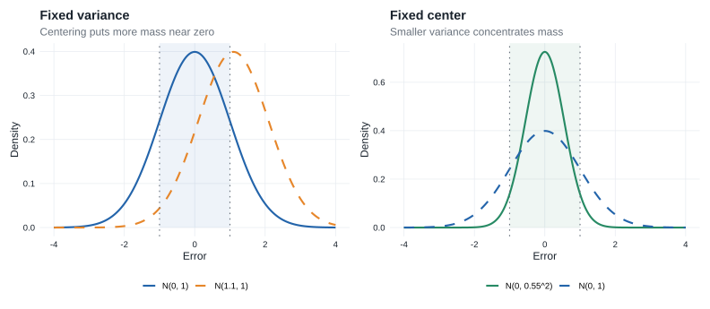
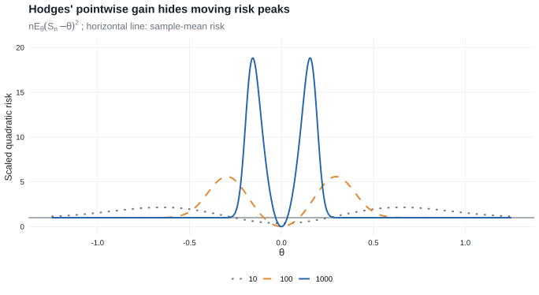
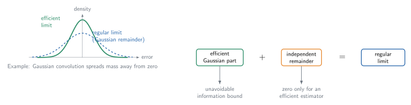
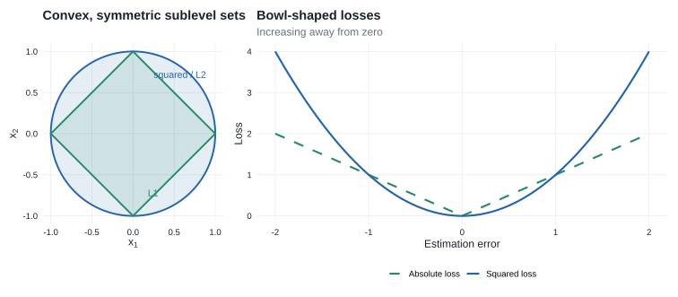

# Chapter 8: Efficiency of Estimators

This chapter asks how well an estimator can perform asymptotically and develops several forms of the lower bound obtained from the [Gaussian shift experiment](glossary.qmd#glossary-limit-experiment).

[Worked problems for Chapter 8](problems.qmd#problems-chapter-8)

::: {.callout-tip title="Why this chapter is here"}

- **Prerequisites:** [LAN in Chapter 7](chapter-7.qmd#theorem-lan-iid) and the [Gaussian limit experiment](chapter-7.qmd#theorem-normal-limit-experiment).
- **Purpose:** replace pointwise comparisons by comparisons that remain valid over $n^{-1/2}$-local alternatives.
- **Chapter 25 payoff:** Chapter 25 replaces the parametric score space by a tangent space. The [semiparametric convolution theorem](chapter-25.qmd#theorem-25-20) and [local asymptotic minimax theorem](chapter-25.qmd#theorem-25-21) are the direct analogues of Sections 8.5 and 8.7.

:::

::: {.callout-note title="Companion readings"}

For alternative treatments of convolution, minimax bounds, and superefficiency, see [@bailie2021, §§13.2--14.2], [@dasgupta2008, §§16.7--16.8], and [@tsybakov2009, §3.4.3]. For the broader limit-experiment perspective behind the chapter, see @leCamYang2000.

:::

## Reading guide

- **Sections 8.3--8.5 and 8.7 are essential:** representation in the Gaussian experiment leads to the convolution and local asymptotic minimax bounds.
- **Section 8.9 is essential for construction:** Lemma 8.14 identifies the asymptotic linear expansion that attains the bound. It is the parametric prototype for [Lemma 25.23](chapter-25.qmd#lemma-25-23).
- **Section 8.1 is essential motivation:** Hodges' estimator explains why efficiency cannot be a pointwise comparison.
- **Sections 8.2 and 8.6 are useful but not needed for the Chapter 25 proofs:** they cover relative efficiency and an almost-everywhere alternative to regularity.
- **Section 8.8 is retained as a caveat:** Stein shrinkage can improve quadratic risk without contradicting the regular convolution bound.
- **Section 8.10 is omitted:** its large-deviation comparison concerns a different asymptotic scale.

::: {.callout-note title="Chapter roadmap"}

Suppose that $T_n$ estimates $\psi(\theta)$ and that $\sqrt{n}\bigl(T_n-\psi(\theta)\bigr)$ has a **limiting distribution**.

1. Study the estimator under nearby parameters $\theta+h/\sqrt{n}$, not only at a fixed $\theta$.
2. Under **differentiability in quadratic mean**, the local experiment converges to the **Gaussian shift experiment** $X\sim N(h,I_\theta^{-1})$.
3. In that experiment, the natural estimator of $\dot\psi_\theta h$ is $\dot\psi_\theta X$.
4. Its **error distribution** is $N\bigl(0,\dot\psi_\theta I_\theta^{-1}\dot\psi_\theta^T\bigr)$.
5. Therefore, this normal distribution is the natural **asymptotic lower bound** for estimating $\psi(\theta)$.

The bound can be expressed through regularity, almost-everywhere results, or local minimax risk. It is not an absolute pointwise bound on every estimator at every parameter.

:::

## 8.1 Asymptotic Concentration

The goal is to compare how tightly possible limiting distributions of $\sqrt n\{T_n-\psi(\theta)\}$ concentrate near zero. If the limit at $\theta$ is $N\bigl(\mu(\theta),\sigma^2(\theta)\bigr)$, then, approximately,

$$
T_n\approx N\left(\psi(\theta)+\frac{\mu(\theta)}{\sqrt n},\frac{\sigma^2(\theta)}{n}\right).
$$

A desirable limit has

- asymptotic bias $\mu(\theta)=0$;
- asymptotic variance $\sigma^2(\theta)$ as small as possible.

Within the normal family, these two choices also minimize asymptotic mean squared error.

For $Z\sim N\bigl(\mu(\theta),\sigma^2(\theta)\bigr)$, the probability $P(-a<Z<a)$ is largest at $\mu(\theta)=0$ for a fixed variance, and then increases as the variance decreases. Figure @eightfig-ch8-normal-concentration shows these two effects.

::: {#eightfig-ch8-normal-concentration}

{fig-alt="Two pairs of normal density curves compare a shifted mean with mean zero and a smaller variance with variance one. The interval from minus one to one is shaded."}

Centering and reducing the variance both increase the mass of a normal estimation-error distribution near zero.

:::

For general, possibly nonnormal limits, concentration is measured through a nonnegative loss function $\ell$. If the limit distribution is $L_\theta$, its asymptotic risk is $\int \ell\,dL_\theta$. The book uses the visually similar symbols $L_\theta$ for the limiting law and $\ell$ for the loss; this chapter retains that convention.

Examples include:

- quadratic loss: $\int x^2\,dL_\theta(x)$;
- absolute loss: $\int |x|\,dL_\theta(x)$;
- tail-probability loss: $\int \mathbf 1\{|x|>a\}\,dL_\theta(x)$.

A distribution is more concentrated near zero when these risks are smaller.

::: {.callout-tip title="Example"}
### Example 8.1: Hodges’ estimator

Suppose that $T_n$ is a sequence of estimators for a real parameter $\theta$ with standard root-$n$ behavior,

$$
\sqrt n(T_n-\theta)\rightsquigarrow L_\theta.
$$

For example, $T_n$ may be the mean of a size-$n$ sample from $N(\theta,1)$.

Define $S_n=\begin{cases}T_n&\text{if }|T_n|\geq n^{-1/4},\\ 0&\text{if }|T_n|<n^{-1/4}.\end{cases}$

- For every fixed $\theta\neq 0$, truncation eventually occurs with negligible probability, so $\sqrt{n}(S_n-\theta)\rightsquigarrow L_\theta$.
- At $\theta=0$, however, $S_n$ is set equal to zero with probability tending to one. It therefore converges faster than the usual root-$n$ rate.
- This appears to make $S_n$ better than $T_n$ at $\theta=0$ without making it worse elsewhere. Pointwise limits, however, hide the fact that
    - the risk has large peaks near zero;
    - the peaks move toward zero as $n$ increases;
    - their widths shrink, but their heights diverge.
- Thus, the estimator’s improvement exactly at $\theta=0$ is purchased through very poor behavior at parameter values that approach zero with $n$.

**Pointwise asymptotic comparisons at fixed parameter values are too weak. Efficiency must account for neighboring parameter values simultaneously.**

::: {#eightfig-ch8-hodges-risk}

{fig-alt="Risk curves for sample sizes 10, 100, and 1000 have symmetric peaks approaching zero; the ordinary sample mean has constant scaled risk one."}

The scaled quadratic risk of Hodges' estimator develops higher, narrower peaks that move toward zero as the sample size grows.

:::

:::

## 8.2 Relative Efficiency

::: {.callout-note title="Relative efficiency"}

Suppose

$$
\sqrt n\{T_n-\psi(\theta)\}\rightsquigarrow N\bigl(0,\sigma^2(\theta)\bigr).
$$

To attain asymptotic variance $1/\nu$, the required sample size $n_\nu$ satisfies

$$
\frac{n_\nu}{\nu}\longrightarrow\sigma^2(\theta).
$$

For two estimator sequences, the relative sample-size requirement is

$$
\lim_{\nu\to\infty}\frac{n_{\nu,2}}{n_{\nu,1}}
=\frac{\sigma_2^2(\theta)}{\sigma_1^2(\theta)}.
$$

If this ratio exceeds one, the second estimator needs proportionally more observations to attain the same asymptotic precision. The [worked problems](problems.qmd#problems-chapter-8) retain this chapter's ordering convention and also give the reciprocal convention commonly called asymptotic relative efficiency.
:::

## 8.3 Lower Bound for Experiments {#sec-lower-bound-experiments}

Because Hodges’ example defeats pointwise lower bounds, consider local alternatives $\theta+h/\sqrt n$, where $h\in\mathbb R^k$ remains fixed. Suppose that, for some limit distributions $L_{\theta,h}$ and every $h$,

$$
(8.2)\qquad  \sqrt{n}\left(T_n-\psi\left(\theta+\frac{h}{\sqrt{n}}\right)\right)\overset{\theta+h/\sqrt{n}}{\rightsquigarrow}L_{\theta,h}.
$$

The estimator is locally good at $\theta$ if the family $\{L_{\theta,h}:h\in\mathbb R^k\}$ is concentrated near zero, and it is **locally optimal** if these limits are maximally concentrated for every $h$.

For the rest of the chapter, assume:

- $\Theta$ is an open subset of $\mathbb R^k$, and $\psi:\Theta\to\mathbb R^m$.
- The derivative $\dot\psi_\theta$ follows the book's row-gradient convention: it is an $m\times k$ matrix, so $\dot\psi_\theta h$ is an $m$-vector.
- The model is differentiable in quadratic mean at $\theta$, so the local experiments converge to $\{N(h,I_\theta^{-1}):h\in\mathbb R^k\}$ by [Theorem 7.10](chapter-7.qmd#theorem-normal-limit-experiment).

::: {.callout-note title="Theorem"}
### Theorem 8.3: Reduction to the limit experiment {#theorem-limit-experiment-reduction}

Assume the experiment $\{P_\theta:\theta\in\Theta\}$ is differentiable in quadratic mean at $\theta$, with nonsingular Fisher information $I_\theta$, and let $\psi$ be differentiable at $\theta$. If $T_n$ satisfies (8.2) for every $h$, then there is a randomized estimator $T$ based on $X\sim N(h,I_\theta^{-1})$ such that

$$
T-\dot\psi_\theta h\sim L_{\theta,h}
$$

for every $h$.

Thus, the original asymptotic estimation problem reduces to observing $X\sim N(h,I_\theta^{-1})$ and estimating $\dot\psi_\theta h$. The natural estimator is $\dot\psi_\theta X$, with error distribution

$$
\dot\psi_\theta X-\dot\psi_\theta h
\sim N\bigl(0,\dot\psi_\theta I_\theta^{-1}\dot\psi_\theta^T\bigr).
$$

This covariance matrix is also the parametric Cramér–Rao bound for estimating $\psi(\theta)$.
:::

::: {.callout-important title="The parametric prototype of an efficient influence function"}

Let $\dot\ell_\theta$ be the score vector and let

$$
\widetilde\psi_\theta
=\dot\psi_\theta I_\theta^{-1}\dot\ell_\theta.
$$

Then

$$
P_\theta\widetilde\psi_\theta\dot\ell_\theta^T=\dot\psi_\theta,
\qquad
P_\theta\widetilde\psi_\theta\widetilde\psi_\theta^T
=\dot\psi_\theta I_\theta^{-1}\dot\psi_\theta^T.
$$

The first identity says that $\widetilde\psi_\theta$ represents the derivative of the target in every parametric score direction; the second recovers the covariance bound. In [Chapter 25](chapter-25.qmd#sec-pathwise-differentiability), score vectors become an infinite-dimensional tangent space, and this normalized score becomes the **efficient influence function**.

:::

**Proof roadmap.** Recenter the estimator at $\psi(\theta)$, use differentiability to identify its translated local limits, and invoke Theorem 7.10 to reproduce those limits in the Gaussian experiment.

Complete proof of Theorem 8.3

Define $S_n=\sqrt n\{T_n-\psi(\theta)\}$ and add and subtract the target at the local alternative:

$$
\begin{aligned}
S_n
&=\sqrt n\left\{T_n-\psi\left(\theta+\frac{h}{\sqrt n}\right)\right\}\\
&\quad+\sqrt n\left\{\psi\left(\theta+\frac{h}{\sqrt n}\right)-\psi(\theta)\right\}.
\end{aligned}
$$

Under $P_{\theta+h/\sqrt n}^n$, the first term converges to $L_{\theta,h}$ by (8.2), while differentiability gives convergence of the second term to $\dot\psi_\theta h$. Hence [Slutsky’s lemma](chapter-2.qmd#lemma-slutsky) yields

$$
S_n\overset{\theta+h/\sqrt n}{\rightsquigarrow}L_{\theta,h}*\delta_{\dot\psi_\theta h}
$$

where $\delta_{\dot\psi_\theta h}$ is the point mass at $\dot\psi_\theta h$. Convolution with this measure shifts the distribution:

$$
X\sim L_{\theta,h}\quad\Longrightarrow\quad X+\dot\psi_\theta h\sim L_{\theta,h}*\delta_{\dot\psi_\theta h}.
$$

[Theorem 7.10](chapter-7.qmd#theorem-normal-limit-experiment) then produces a statistic $T$ in the Gaussian limit experiment such that

$$
T-\dot\psi_\theta h\sim L_{\theta,h}.
$$

The theorem does not itself impose regularity. The family $L_{\theta,h}$ may depend on $h$. Regularity in [Section 8.5](#sec-convolution-theorem) is the additional requirement that this error law be the same for every local direction.

## 8.4 Estimating Normal Means

Consider the Gaussian experiment $X\sim N(h,\Sigma)$, where $\Sigma$ is known and nonsingular, and suppose the target is $Ah$. The natural estimator is $AX$, whose error distribution is $AX-Ah\sim N(0,A\Sigma A^T)$.

::: {.callout-tip title="The Gaussian core of the chapter"}

The results in this section do three distinct jobs.

1. Proposition 8.4 shows that every equivariant error law is the unavoidable Gaussian error convolved with extra noise.
2. Anderson's lemma shows that extra independent noise cannot improve risk for a bowl-shaped loss.
3. Proposition 8.6 removes equivariance by a diffuse-prior argument and proves minimaxity among all estimators.

Theorem 8.8 and Theorem 8.11 transfer these two Gaussian conclusions back to the original local experiments.

:::

::: {.callout-note title="Definition"}
### Equivariance in law

An estimator $T$ is **equivariant in law** if the distribution of $T-Ah$ under $h$ does not depend on $h.$

:::

::: {.callout-note title="Proposition"}
### Proposition 8.4 {#proposition-8-4}

The invariant distribution of any randomized equivariant-in-law estimator can be decomposed as $L=N(0,A\Sigma A^T)*M$ for some probability measure $M$.

Thus, every equivariant-in-law estimator behaves like

- the natural estimator $AX$, plus
- an independent noise term with distribution $M$.

The estimator $AX$ corresponds to the case in which $M$ is degenerate at zero, and it is the only randomized equivariant-in-law estimator with this property, up to changes on null sets.

:::

**Proof roadmap.** Introduce an increasingly diffuse Gaussian prior, separate posterior noise from the estimator's remaining error, and pass to the limit through characteristic functions.

Complete proof of Proposition 8.4

Under a Gaussian prior $H\sim N(0,\Lambda)$, conditionally let $X\mid H=h\sim N(h,\Sigma)$. Write

$$
m_\Lambda(X)=(\Sigma^{-1}+\Lambda^{-1})^{-1}\Sigma^{-1}X
$$

for the posterior mean and decompose

$$
T-AH=\underbrace{T-Am_\Lambda(X)}_{W_\Lambda}
+\underbrace{-A\{H-m_\Lambda(X)\}}_{G_\Lambda}.
$$

The posterior residual is Gaussian and independent of every function of $(X,U)$. Hence $G_\Lambda$ and $W_\Lambda$ are independent and

$$
G_\Lambda\sim
N\!\left(0,A(\Sigma^{-1}+\Lambda^{-1})^{-1}A^T\right).
$$

If $T$ is equivariant in law with invariant law $L$, then $G_\Lambda+W_\Lambda=T-AH$ has law $L$ for every $\Lambda$. Set $\Lambda=\lambda I$ and let $\lambda\to\infty$. Their characteristic functions satisfy

$$
\widehat L(t)=\widehat G_\lambda(t)\widehat W_\lambda(t).
$$

The first factor converges to the everywhere-positive characteristic function of $G\sim N(0,A\Sigma A^T)$. Thus $\widehat W_\lambda(t)$ converges to a function continuous at zero. Lévy's continuity theorem gives $W_\lambda\rightsquigarrow W$ for some law $M$. Independence is preserved in the joint limit, and therefore

$$
L=\mathcal L(G+W)=N(0,A\Sigma A^T)*M.
$$

For uniqueness, let $t(X)=E\{T(X,U)\mid X\}$. Equivariance implies that $E_h\{t(X)-AX\}$ is constant in $h$. Completeness of the normal location family forces $t(X)-AX$ itself to be constant almost surely. If $M=\delta_0$, then $T-Ah$ has the same law as $AX-Ah$; equality of means makes the constant zero. Since conditional expectation cannot increase the second moment, equality of the second moments forces $T=t(X)=AX$ almost surely.

The same diffuse-prior construction, followed by Anderson's lemma, proves Proposition 8.6 below.

Equivalently, $T-Ah\overset d=Z+W$, where $Z\sim N(0,A\Sigma A^T)$, $W\sim M$, and $Z$ and $W$ are independent. The Gaussian component $Z$ is unavoidable; $W$ is any additional noise. When $M=\delta_0$, the additional term vanishes and $L=N(0,A\Sigma A^T)$.

::: {#eightfig-ch8-efficient-noise}

{fig-alt="A narrow efficient density and a wider density produced by adding centered Gaussian noise appear beside the general schematic equation: efficient Gaussian part plus independent remainder equals regular limit."}

A regular limit distribution consists of the efficient Gaussian component plus an independent remainder. The density panel uses a centered Gaussian remainder as one concrete convolution; the theorem does not require the remainder to be Gaussian.

:::

### Bowl-shaped loss

- A loss function $\ell$ is **bowl-shaped** if every sublevel set $\{x:\ell(x)\leq c\}$ is convex and symmetric around zero.
- It is **subconvex** if these sublevel sets are also closed.
- Typical examples include squared-error loss, norm loss, and indicators of complements of symmetric convex sets.

::: {#eightfig-ch8-bowl-shaped-loss}

{fig-alt="A circular and diamond-shaped pair of symmetric convex sublevel sets is shown beside squared and absolute loss curves."}

Squared and absolute losses are bowl-shaped because their sublevel sets are closed, convex, and symmetric about zero.

:::

::: {.callout-important title="Lemma"}
### Lemma 8.5: Anderson’s lemma {#lemma-anderson}

For a bowl-shaped loss function, adding independent noise cannot improve the normal distribution:

$$
E\ell(Z+W)\geq E\ell(Z),
$$

where $Z\sim N(0,A\Sigma A^T)$ and $W$ is independent of $Z$.

Therefore, among equivariant-in-law estimators, $AX$ is optimal.
:::

::: {.callout-note title="Definition"}
### Minimaxity

The maximum risk of an estimator $T$ is

$$
\sup_h R(h,T)=\sup_h E_h\ell(T-Ah).
$$

For bowl-shaped loss, every randomized estimator satisfies $\sup_h E_h\ell(T-Ah)\geq E_0\ell(AX)$. Because the risk of $AX$ is constant in $h$, it attains this lower bound and is minimax.
:::

::: {.callout-note title="Proposition"}
### Proposition 8.6 {#proposition-8-6}

For any bowl-shaped loss function $\ell$, the maximum risk of any randomized estimator $T$ of $Ah$ is bounded below by $E_0\ell(AX)$. Consequently, $AX$ is a minimax estimator for $Ah$. If $Ah$ is real and $E_0\{(AX)^2\ell(AX)\}<\infty$, then $AX$ is the only minimax estimator for $Ah$ up to changes on sets of probability zero.

:::

::: {.callout-warning title="Caveat about the printed uniqueness clause"}

The printed proposition does not exclude a loss that is constant up to null sets or a degenerate scalar target. Taken literally, its uniqueness clause is then false: under a constant loss every estimator is minimax. The qualified uniqueness argument below therefore makes explicit what that clause needs: $A\Sigma A^T>0$ and a scalar bowl-shaped loss whose Gaussian concentration inequality is strict away from zero (equivalently here, the loss is not Lebesgue-almost-everywhere constant). The lower bound and minimaxity assertions do not need these qualifications.

:::

**Proof roadmap.** Average the risk under an increasingly diffuse Gaussian prior, use the normal posterior to split the estimation error into posterior Gaussian noise and an independent remainder, and apply Anderson's lemma. As the prior becomes diffuse, the Gaussian term approaches the error of $AX$; because $AX$ has constant risk, the lower bound is attained. For qualified uniqueness, reduce to a one-dimensional least-favorable normal submodel and use the rate of convergence of diffuse-prior Bayes risks together with strict Anderson concentration.

Complete proof of the minimax bound in Proposition 8.6

Let $T=T(X,U)$ be any possibly randomized estimator, with $U$ independent of $X$. The proof compares maximum risk with a sequence of Bayes risks. Van der Vaart writes the limiting step for subconvex losses; the radial argument below also covers the stated bowl-shaped case.

#### Introduce a Gaussian prior

Let $H\sim N(0,\Lambda)$ and, conditionally on $H=h$, let $X\sim N(h,\Sigma)$. Since a supremum is at least any average,

$$
\sup_h E_h\ell(T-Ah)\geq E\ell(T-AH).
$$

The posterior distribution is

$$
H\mid X\sim N\left((\Sigma^{-1}+\Lambda^{-1})^{-1}\Sigma^{-1}X,
(\Sigma^{-1}+\Lambda^{-1})^{-1}\right).
$$

Write its mean as $m_\Lambda(X)$ and define

$$
W_\Lambda=T-Am_\Lambda(X),
\qquad
G_\Lambda=-A\{H-m_\Lambda(X)\}.
$$

Then $T-AH=G_\Lambda+W_\Lambda$. The conditional distribution of $G_\Lambda$ does not depend on $X$, so $G_\Lambda$ is independent of $W_\Lambda$ and

$$
G_\Lambda\sim N\left(0,A(\Sigma^{-1}+\Lambda^{-1})^{-1}A^T\right).
$$

#### Apply Anderson’s lemma and diffuse the prior

By [Anderson’s lemma](#lemma-anderson),

$$
\sup_h E_h\ell(T-Ah)
\geq E\ell(G_\Lambda+W_\Lambda)
\geq E\ell(G_\Lambda).
$$

Set $\Lambda=\lambda\Sigma$. The posterior covariance is then

$$
(\Sigma^{-1}+\Lambda^{-1})^{-1}
=\frac{\lambda}{\lambda+1}\Sigma,
$$

so $G_\Lambda$ has the same distribution as $a_\lambda G$, where $G\sim N(0,A\Sigma A^T)$ and $a_\lambda=\{\lambda/(\lambda+1)\}^{1/2}\uparrow1$. Bowl-shapedness makes $r\mapsto\ell(rx)$ nondecreasing for $r\geq0$ along every ray. Such a one-dimensional monotone function has only countably many discontinuities, while the Gaussian radial distribution is continuous on the range of $A$. Thus $\ell(a_\lambda G)\uparrow\ell(G)$ almost surely. The monotone convergence theorem gives

$$
\sup_h E_h\ell(T-Ah)\geq E\ell(G)=E_0\ell(AX).
$$

Because $AX-Ah=A(X-h)$ has the same distribution as $G$ for every $h$, the risk of $AX$ is constant and attains this lower bound. Thus $AX$ is minimax for estimating $Ah$.

**Derivation in these notes.** Van der Vaart refers elsewhere for uniqueness. The following argument proves the corrected, nondegenerate version needed when uniqueness is invoked later.

Complete proof of the qualified uniqueness clause

Assume that $Ah$ is real, write $\sigma^2=A\Sigma A^T>0$, and suppose that $\ell$ is not Lebesgue-almost-everywhere constant and

$$
E\{Z^2\ell(Z)\}<\infty,
\qquad Z\sim N(0,\sigma^2).
$$

Let $T$ be any minimax estimator. Because $AX$ has constant risk $R_0=E\ell(Z)$ and is minimax, necessarily

$$
E_h\ell(T-Ah)\leq R_0,
\qquad h\in\mathbb R^k.
$$

#### Reduce to one normal location coordinate

Choose $v=\Sigma A^T/\sigma^2$, so $Av=1$, and restrict to the submodel $h=tv$. Then

$$
Y=AX\sim N(t,\sigma^2).
$$

Moreover, $Y$ is independent of $X-vY$, whose distribution does not depend on $t$. Thus the residual and the original randomization variable together act only as an auxiliary randomizer. It is enough to prove that every randomized estimator $\delta(Y,U)$ satisfying

$$
\sup_t E_t\ell\{\delta(Y,U)-t\}\leq R_0
$$

must equal $Y$ almost surely.

#### Compare with diffuse normal Bayes problems

Give $t$ the prior $N(0,\tau^2)$. If $c_\tau=\tau^2/(\tau^2+\sigma^2)$, then the posterior mean is $c_\tau Y$ and the posterior residual has variance

$$
v_\tau=\frac{\sigma^2\tau^2}{\sigma^2+\tau^2}.
$$

Let $Z_\tau\sim N(0,v_\tau)$ be independent of $(Y,U)$ and put $W_\tau=\delta(Y,U)-c_\tau Y$. Averaging the maximum-risk bound over the prior and applying Anderson's lemma conditionally on $(Y,U)$ gives

$$
0\leq E\!\left[
E\{\ell(Z_\tau+W_\tau)\mid W_\tau\}-E\ell(Z_\tau)
\right]
\leq R_0-E\ell(Z_\tau).
\tag{8.6a}
$$

The density of $Z_\tau$ differs from the density of $Z$ by

$$
O(\tau^{-2})(1+z^2)
$$

times a fixed Gaussian density. The displayed integrability assumption therefore yields

$$
R_0-E\ell(Z_\tau)=O(\tau^{-2}).
\tag{8.6b}
$$

#### Strict concentration forces zero remainder

For a scalar bowl-shaped loss that is not almost everywhere constant, strict Anderson concentration says

$$
d(w):=E\ell(Z+w)-E\ell(Z)>0
\qquad(w\neq0).
$$

Gaussian convolution makes this gap lower semicontinuous; consequently it is bounded away from zero on every compact set $\{w:\varepsilon\leq |w|\leq M\}$. The same lower bound, reduced if necessary, holds with $Z_\tau$ for all sufficiently large $\tau$.

Suppose that $\delta(y,u)\neq y$ on a set of positive Lebesgue-times-randomization measure. For some $K,M<\infty$ and $\varepsilon>0$, the set

$$
S=\{(y,u):|y|\leq K,\ \varepsilon\leq|\delta(y,u)-y|\leq M\}
$$

then has positive measure. Because $c_\tau y\to y$ uniformly on $[-K,K]$, $W_\tau$ remains in a compact set bounded away from zero on $S$. The marginal density of $Y\sim N(0,\tau^2+\sigma^2)$ is bounded below by a positive multiple of $\tau^{-1}$ on $[-K,K]$. Hence the left side of (8.6a) is bounded below by $C/\tau$ for some $C>0$. This contradicts the $O(\tau^{-2})$ upper bound in (8.6b).

Therefore $\delta(Y,U)=Y$ for Lebesgue-almost every $(y,u)$. Every normal location law has a positive density, so the equality holds almost surely under every $t$. Returning to the least-favorable submodel gives $T=AX$ almost surely there; because its normal laws have positive densities on the original sample space, the equality holds up to a common probability-zero set. This proves qualified uniqueness.

## 8.5 Convolution Theorem {#sec-convolution-theorem}

An estimator sequence $T_n$ is **regular** at $\theta$ for estimating $\psi(\theta)$ if, for every $h$,

$$
\sqrt n\left(T_n-\psi\left(\theta+\frac{h}{\sqrt n}\right)\right)\overset{\theta+h/\sqrt n}{\rightsquigarrow}L_\theta,
$$

where the same distribution $L_\theta$ appears for every $h$. Thus local perturbations do not change the limiting error law. By [Theorem 8.3](#theorem-limit-experiment-reduction), the matching estimator in the Gaussian limit experiment is equivariant in law for $\dot\psi_\theta h$. A **best regular estimator** has no additional convolution noise and hence has limiting distribution $N\bigl(0,\dot\psi_\theta I_\theta^{-1}\dot\psi_\theta^T\bigr)$.

::: {.callout-note title="Theorem"}
### Theorem 8.8: Convolution {#theorem-8-8}

Suppose $\{P_\theta:\theta\in\Theta\}$ is differentiable in quadratic mean at $\theta$, with nonsingular Fisher information $I_\theta$, and $\psi$ is differentiable at $\theta$. For every regular estimator sequence with limiting distribution $L_\theta$,

$$
L_\theta=N\bigl(0,\dot\psi_\theta I_\theta^{-1}\dot\psi_\theta^T\bigr)*M_\theta
$$

for some probability measure $M_\theta$. Thus the limiting error is the efficient normal error plus additional independent noise. If $L_\theta$ has covariance matrix $\Sigma_\theta$, then $\Sigma_\theta-\dot\psi_\theta I_\theta^{-1}\dot\psi_\theta^T$ is nonnegative definite.

This result becomes [Theorem 25.20](chapter-25.qmd#theorem-25-20) after finite-dimensional score directions are replaced by tangent directions and the normalized score is replaced by the efficient influence function.
:::

**Proof roadmap.** Regularity makes the local error law independent of $h$. Theorem 8.3 therefore represents it by an equivariant-in-law estimator in the Gaussian experiment, and Proposition 8.4 decomposes that invariant law into the efficient Gaussian component and independent noise. Covariances then add.

Complete proof of Theorem 8.8

Regularity says that (8.2) holds with $L_{\theta,h}=L_\theta$ for every $h$. By [Theorem 8.3](#theorem-limit-experiment-reduction), there is a randomized estimator $T$ in the Gaussian experiment

$$
X\sim N(h,I_\theta^{-1})
$$

such that

$$
T-\dot\psi_\theta h\sim L_\theta,
\qquad h\in\mathbb R^k.
$$

Because the error distribution is the same for every $h$, $T$ is equivariant in law for estimating $\dot\psi_\theta h$. Apply [Proposition 8.4](#proposition-8-4) with $A=\dot\psi_\theta$ and $\Sigma=I_\theta^{-1}$. It gives a probability measure $M_\theta$ for which

$$
L_\theta
=N\bigl(0,\dot\psi_\theta I_\theta^{-1}\dot\psi_\theta^T\bigr)*M_\theta.
$$

Equivalently, on a product probability space the limiting error has the distribution of $Z+W$, where

$$
Z\sim N\bigl(0,\dot\psi_\theta I_\theta^{-1}\dot\psi_\theta^T\bigr),
\qquad W\sim M_\theta,
$$

and $Z$ and $W$ are independent. If $L_\theta$ has covariance matrix $\Sigma_\theta$, then $W=(Z+W)-Z$ has finite second moments as well. Independence gives

$$
\Sigma_\theta
=\dot\psi_\theta I_\theta^{-1}\dot\psi_\theta^T
+\operatorname{Cov}(W).
$$

Hence

$$
\Sigma_\theta-\dot\psi_\theta I_\theta^{-1}\dot\psi_\theta^T
=\operatorname{Cov}(W)
$$

is nonnegative definite.

The convolution remainder is the parametric version of the orthogonal noise that appears in the [semiparametric convolution theorem](chapter-25.qmd#theorem-25-20).

## 8.6 Almost-Everywhere Convolution Theorem

Regularity is a substantive restriction, and Hodges’ estimator is not regular at the point where it is superefficient. The almost-everywhere theorem removes that assumption.

::: {.callout-note title="Theorem"}

### Theorem 8.9: Almost-everywhere convolution {#theorem-8-9-almost-everywhere-convolution}

Suppose the model is differentiable in quadratic mean at every $\theta$, with nonsingular information matrix $I_\theta$, and $\psi$ is differentiable at every $\theta$. If $\sqrt n\{T_n-\psi(\theta)\}\rightsquigarrow L_\theta$ under every $\theta$, then, for Lebesgue-almost every $\theta$,

$$
L_\theta=N\bigl(0,\dot\psi_\theta I_\theta^{-1}\dot\psi_\theta^T\bigr)*M_\theta.
$$

If $L_\theta$ has covariance matrix $\Sigma_\theta$, then

$$
\Sigma_\theta-\dot\psi_\theta I_\theta^{-1}\dot\psi_\theta^T
$$

is nonnegative definite for Lebesgue-almost every $\theta$.

Consequently, an estimator can beat the efficient normal limit only on a Lebesgue null set of parameter values.

This explains Hodges’ estimator:

- it can be superefficient at $\theta=0$;
- it cannot be superefficient on a set of positive Lebesgue measure.

The supporting lemma shows that any estimator sequence possessing pointwise limits is automatically regular at almost every parameter along a suitable subsequence.

:::

**Supporting-result dependency.** Van der Vaart obtains Theorem 8.9 by combining the convolution theorem with Lemma 8.10. This almost-everywhere route explains superefficiency but is not needed for the Chapter 25 proof chain, so the notes retain the exact result and its supporting lemma without adding a second full convolution argument.

::: {.callout-important title="Lemma"}
### Lemma 8.10: Almost-everywhere local regularity {#lemma-8-10}

Let $T_n$ be estimators in experiments $\left(P_{n,\theta}:\theta\in\Theta\right),$ where $\Theta$ is a measurable subset of $\mathbb{R}^k$.

Assume:

- For every measurable set $A$ and every $n$, the map $\theta\mapsto P_{n,\theta}(A)$ is measurable.
- The map $\theta\mapsto\psi(\theta)$ is measurable.
- There exist distributions $L_\theta$ such that, for Lebesgue almost every $\theta$, $r_n\left(T_n-\psi(\theta)\right)\overset{\theta}{\rightsquigarrow}L_\theta.$

Then, for every sequence $\gamma_n\to0$, there exists a subsequence $\{n_j\}$ such that, for Lebesgue-almost every pair $(\theta,h)$,

$$
r_{n_j}\left(T_{n_j}-\psi\left(\theta+\gamma_{n_j}h\right)\right)\overset{\theta+\gamma_{n_j}h}{\rightsquigarrow}L_\theta.
$$

Thus an estimator with pointwise limits at almost every parameter is, along a subsequence, automatically regular under vanishing perturbations $\theta+\gamma_nh$ for almost every $(\theta,h)$. Its local limiting distribution remains $L_\theta$.
:::

**Supporting-proof roadmap.** Express weak convergence through a countable determining class, reduce the problem to bounded measurable functions evaluated at perturbed arguments, prove convergence in mean under an auxiliary Gaussian law, and extract one subsequence by diagonalization.

Supporting proof of Lemma 8.10

The proof upgrades pointwise convergence of measurable functions to convergence after small perturbations of their arguments.

#### Reduce weak convergence to measurable functions

Extend the model to $\mathbb R^k$ if necessary, and write $T_{n,\theta}=r_n\{T_n-\psi(\theta)\}$. Choose a countable convergence-determining class $\mathcal F$ of bounded test functions. For fixed $f\in\mathcal F$, define

$$
g_n(\theta)=E_\theta f(T_{n,\theta}),
\qquad
g(\theta)=\int f\,dL_\theta.
$$

The assumption gives $g_n(\theta)\to g(\theta)$ almost everywhere. It remains to find a subsequence for which $g_n(\theta+\gamma_nh)\to g(\theta)$ for almost every $(\theta,h)$.

#### Control a randomly perturbed argument

Let $\Theta$ and $H$ be independent $N(0,I)$ vectors. If $p$ is the density of $\Theta$ and $p_n$ is the density of $\Theta+\gamma_nH$, then Scheffé’s lemma gives $\int|p_n-p|\to0$. For bounded $g_n$,

$$
\begin{aligned}
E|g_n(\Theta+\gamma_nH)-g(\Theta)|
&\leq E|g_n(\Theta+\gamma_nH)-g(\Theta+\gamma_nH)|\\
&\quad+E|g(\Theta+\gamma_nH)-g(\Theta)|.
\end{aligned}
$$

The first term tends to zero by dominated convergence and $\int|p_n-p|\to0$. For the second, approximate the bounded measurable function $g$ in $L_1(p)$ by a bounded continuous function. Continuity controls the perturbation, and the $L_1$ approximation controls the remaining terms. Hence

$$
g_n(\Theta+\gamma_nH)-g(\Theta)\longrightarrow0
$$

in probability.

#### Extract and diagonalize

Choose an almost-surely convergent subsequence. Because $(\Theta,H)$ has a strictly positive density on $\mathbb R^{2k}$, its null sets are exactly the Lebesgue null sets. Thus, for the chosen $f$,

$$
g_{n_j}(\theta+\gamma_{n_j}h)\longrightarrow g(\theta)
$$

for Lebesgue-almost every $(\theta,h)$. Diagonalizing over the countable class $\mathcal F$ gives one subsequence for which

$$
r_{n_j}\left\{T_{n_j}-\psi(\theta+\gamma_{n_j}h)\right\}
\overset{\theta+\gamma_{n_j}h}{\rightsquigarrow}L_\theta
$$

for Lebesgue-almost every $(\theta,h)$, which is the required almost-everywhere local regularity.

---

## 8.7 Local Asymptotic Minimax Theorem {#sec-local-asymptotic-minimax}

The convolution theorem applies only to regular estimators, while the almost-everywhere theorem leaves open a null set of parameter values. The local asymptotic minimax theorem instead evaluates the worst risk over shrinking neighborhoods.

::: {.callout-note title="Theorem"}
### Theorem 8.11: Local asymptotic minimax bound {#theorem-8-11}

Suppose the model is differentiable in quadratic mean at $\theta$, with nonsingular Fisher information $I_\theta$, and $\psi$ is differentiable at $\theta$. For every estimator sequence $T_n$ and every bowl-shaped loss $\ell$,

$$
\sup_I\liminf_{n\to\infty}\sup_{h\in I}E_{\theta+h/\sqrt{n}}\ell\left(\sqrt{n}\left[T_n-\psi\left(\theta+\frac{h}{\sqrt{n}}\right)\right]\right)\geq\int\ell\,dN\bigl(0,\dot\psi_\theta I_\theta^{-1}\dot\psi_\theta^T\bigr),
$$

where the first supremum ranges over finite subsets $I\subset\mathbb{R}^k$.

:::

No estimator can have uniformly smaller asymptotic risk over all local directions $h$. Exceptional performance at one point or along selected directions cannot persist uniformly over a shrinking neighborhood. [Theorem 25.21](chapter-25.qmd#theorem-25-21) uses the same argument after replacing $h\in\mathbb R^k$ by finitely many directions from the semiparametric tangent set.

**Proof roadmap.** First approximate the loss from below by bounded continuous bowl-shaped losses. For one such loss, compactify the estimator through all loss profiles at rational local directions; this forces tightness without restricting the estimator. LAN then produces a randomized compact-action rule in the Gaussian experiment. Finite-prior Bayes risks show that boundary actions cannot improve the problem, and diffuse Gaussian priors recover the normal lower bound. Finally remove the loss approximation.

**Derivation in these notes.** Van der Vaart proves the result under auxiliary tightness and lower-semicontinuity conditions and points to [@vanDerVaartWellner1996, §3.11] for the general compactification argument. The reconstruction below exposes that argument for the present finite-dimensional setting.

Complete proof of Theorem 8.11

Write

$$
A=\dot\psi_\theta,
\qquad
V=AI_\theta^{-1}A^T,
\qquad
Z\sim N(0,V),
$$

and let $R(\ell)$ denote the left side of the theorem.

#### Approximate the loss from below

For $q\geq0$, let

$$
C_q=\operatorname{cl}\{x:\ell(x)\leq q\}.
$$

These sets are nested, closed, convex, and symmetric. For integers $j\geq1$, take the nested dyadic grids

$$
G_j=\left\{\frac r{2^j}:r=0,1,\ldots,j2^j\right\}
\subset[0,j]
$$

and define

$$
\ell_j(x)
=\max_{q\in G_j}
q\min\{1,j\,\operatorname{dist}(x,C_q)\},
\tag{8.11a}
$$

with the convention $\operatorname{dist}(x,\varnothing)=\infty$. For fixed $q>0$ and $0\leq c<q$, the $c$-sublevel set of the corresponding term is

$$
C_q+\overline B\!\left(0,\frac{c}{qj}\right);
$$

for $c\geq q$ it is all of $\mathbb R^m$. Thus each term is bounded, continuous, and bowl-shaped. A sublevel set of their maximum is the intersection of the corresponding sublevel sets, so $\ell_j$ is also bounded, continuous, and bowl-shaped.

If $\ell(x)\leq q$, then $x\in C_q$ and the $q$-term vanishes; if $q<\ell(x)$, that term is at most $q$. Hence $\ell_j\leq\ell$. Moreover, $G_j\subset G_{j+1}$ and the distance multiplier increases from $j$ to $j+1$, so $\ell_j\leq\ell_{j+1}$.

Let $\ell_*$ be the lower-semicontinuous envelope of $\ell$. Every $\ell_j$ is a continuous minorant, so $\ell_j\leq\ell_*$. Conversely, if $q<\ell_*(x)$ is dyadic, then $x\notin C_q$; once $j$ is large enough that $q\in G_j$ and $j\operatorname{dist}(x,C_q)\geq1$, the $q$-term equals $q$. Density of the dyadic rationals therefore gives $\ell_j(x)\uparrow\ell_*(x)$.

Finally, a point at which $\ell_*<\ell$ lies on the relative boundary, in the linear support of $Z$, of $C_q$ for some rational $q$. Boundaries of proper convex sets have Gaussian measure zero, and there are only countably many rational $q$. Therefore

$$
\ell_j(Z)\uparrow\ell(Z)
\quad\text{almost surely}.
\tag{8.11b}
$$

Because $R(\ell)\geq R(\ell_j)$, it is enough to prove

$$
R(\ell_j)\geq E\ell_j(Z)
\tag{8.11c}
$$

for every $j$ and then use monotone convergence. Fix one $j$ and abbreviate $l=\ell_j$. Let $B<\infty$ bound $l$, and let $L<\infty$ be a Lipschitz constant.

#### Compactify the action by its rational loss profile

Enumerate $\mathbb Q^k$ as $h_1,h_2,\ldots$, and put

$$
a(h)=Ah,
\qquad
a_n(h)=\sqrt n\left\{\psi\left(\theta+\frac h{\sqrt n}\right)-\psi(\theta)\right\}.
$$

Differentiability of $\psi$ gives $a_n(h)\to a(h)$. Embed an action $t\in\mathbb R^m$ into the compact product cube by

$$
e(t)=\bigl(l\{t-a(h_1)\},l\{t-a(h_2)\},\ldots\bigr)
\in[0,B]^{\mathbb N},
$$

and let $K$ be the closure of $e(\mathbb R^m)$. The space $K$ is compact and metrizable. Its $i$th coordinate map $L_i:K\to[0,B]$ is the continuous extension of $t\mapsto l\{t-a(h_i)\}$.

Set

$$
Y_n=\sqrt n\{T_n-\psi(\theta)\},
\qquad
D_n=e(Y_n).
$$

This transformation is the compactification step: $D_n$ is automatically tight even if $Y_n$ is not.

Let $I_s=\{h_1,\ldots,h_s\}$. If $R(l)=\infty$, there is nothing to prove. Otherwise, the definition of the liminf permits a sequence $n_s\uparrow\infty$ such that

$$
\max_{i\leq s}
E_{\theta+h_i/\sqrt{n_s}}
l\{Y_{n_s}-a_{n_s}(h_i)\}
\leq R(l)+s^{-1}.
\tag{8.11d}
$$

#### Extract the Gaussian kernel

Let

$$
\Delta_n=\frac1{\sqrt n}\sum_{r=1}^n\dot\ell_\theta(X_r)
$$

be the central sequence. Under $P_\theta^n$, $\Delta_n\rightsquigarrow N(0,I_\theta)$. Compactness of $K$ makes the joint laws of $(D_{n_s},\Delta_{n_s})$ tight, so a further subsequence converges to some $(D,\Delta)$ with $D\in K$ and $\Delta\sim N(0,I_\theta)$.

For every fixed rational direction $h_i$, LAN and Le Cam's third lemma tilt this joint limit by

$$
\exp\left(h_i^T\Delta-\frac12h_i^TI_\theta h_i\right).
$$

Because $l$ is Lipschitz and $a_n(h_i)\to a(h_i)$,

$$
\left|l\{Y_n-a_n(h_i)\}-L_i(D_n)\right|
\leq L\|a_n(h_i)-a(h_i)\|\longrightarrow0.
$$

The coordinate $L_i$ is bounded and continuous. Combining this observation with (8.11d) gives, under the tilted limit law,

$$
E_{h_i}L_i(D)\leq R(l),
\qquad i=1,2,\ldots.
\tag{8.11e}
$$

Disintegrate the null-limit law of $D$ given $\Delta$. The resulting Markov kernel is unchanged by each tilt, because the likelihood ratio depends only on $\Delta$. With $X=I_\theta^{-1}\Delta$, it is therefore a randomized $K$-valued decision rule in the Gaussian experiment

$$
X\sim N(h,I_\theta^{-1}).
$$

Equation (8.11e) bounds this rule's risk at every rational $h_i$.

#### Boundary actions do not reduce finite-prior Bayes risk

Let $\pi$ be any prior with finite support among the rational directions. Given the Gaussian observation $x$, let $w_i(x)$ be its posterior weights. The posterior loss of an action $z\in K$ is

$$
z\longmapsto\sum_iw_i(x)L_i(z).
$$

This function is continuous on $K$. Since $e(\mathbb R^m)$ is dense in $K$, its infimum over $K$ equals its infimum over ordinary actions $t\in\mathbb R^m$. A countable dense subset of ordinary actions supplies measurable $\varepsilon$-minimizers, so the compactified and ordinary Gaussian decision problems have the same Bayes risk $b(\pi)$. Averaging (8.11e) over $\pi$ now yields

$$
R(l)\geq b(\pi)
\tag{8.11f}
$$

for every finite rational prior.

#### Pass from finite priors to a diffuse normal prior

Fix $\lambda>0$ and let $\Pi_\lambda=N(0,\lambda I_k)$. Finite rational priors can approximate $\Pi_\lambda$ by first truncating to a large compact set and then quantizing on a fine rational grid. This approximation also preserves Bayes risks. Indeed, uniformly over all decision rules $d$,

$$
\begin{aligned}
|R_h(d)-R_{h'}(d)|
&\leq L\|A(h-h')\|\\
&\quad+B\left\|N(h,I_\theta^{-1})-N(h',I_\theta^{-1})\right\|_{\mathrm{TV}},
\end{aligned}
\tag{8.11g}
$$

and the right side tends to zero with $\|h-h'\|$. The bounded loss controls the discarded prior tail. Hence (8.11f) passes to $\Pi_\lambda$.

Under this normal prior, the posterior covariance of $h$ is

$$
C_\lambda=(I_\theta+\lambda^{-1}I_k)^{-1}.
$$

Conditionally on $X$, Anderson's lemma shows that the posterior mean is Bayes for estimating $Ah$. Its posterior error is $N(0,AC_\lambda A^T)$, so

$$
R(l)\geq b(\Pi_\lambda)
=\int l\,dN(0,AC_\lambda A^T).
$$

Letting $\lambda\to\infty$ and using bounded continuity of $l$ gives

$$
R(l)\geq\int l\,dN(0,AI_\theta^{-1}A^T),
$$

which proves (8.11c). Finally, (8.11b) and monotone convergence give

$$
R(\ell)\geq E\ell(Z).
$$

This is the exact bound in Theorem 8.11, with neither tightness of the original estimator sequence nor lower semicontinuity or boundedness of the original loss imposed.

The finite-set formulation is deliberate: it avoids assuming that risk converges uniformly over a continuum of directions. The proof only needs to defeat each finite collection, then lets those collections exhaust the local parameter space.

## 8.8* Shrinkage Estimators

Stein's phenomenon is an important qualification, not a contradiction. For $k\geq3$, let $\bar X_n$ be the mean of a sample from $N_k(\theta,I_k)$ and define

$$
T_n=\bar X_n-(k-2)\frac{\bar X_n}{n\|\bar X_n\|^2}.
$$

At every fixed $\theta\neq0$, the correction is $O_{P_\theta}(n^{-1})$, so $T_n$ has the same regular first-order limit as $\bar X_n$. At $\theta=0$ and under local alternatives $\theta=h/\sqrt n$, however,

$$
\sqrt nT_n
=X-(k-2)\frac{X}{\|X\|^2},
\qquad X\sim N_k(h,I_k),
$$

whose centered distribution depends on $h$. The estimator is therefore not regular at the origin, even though it improves joint quadratic risk throughout the local Gaussian experiment. This does not contradict the convolution theorem, which assumes regularity, or the local asymptotic minimax theorem, which controls worst risk over local directions rather than risk at a single point.

Indeed, for the joint quadratic loss, the Stein estimator satisfies

$$
E_h\left\|X-(k-2)\frac X{\|X\|^2}-h\right\|^2<k
=E_h\|X-h\|^2
$$

for every $h$. The gain is loss-specific and is accompanied by nonregular local behavior.

::: {.callout-note title="Coverage note"}
Lemma 8.13, which shows for a real-valued target that local asymptotic minimaxity under a suitable bowl-shaped loss forces best regularity, is omitted from the main route. It refines the caveat but is not used by Chapter 25.
:::

## 8.9* Achieving the Bound {#sec-achieving-efficiency-bound}

The lower bound becomes operational once an estimator's first-order expansion is identified.

::: {.callout-important title="Lemma"}
### Lemma 8.14: Characterization of best regular estimators {#lemma-8-14}

Suppose the model is differentiable in quadratic mean at $\theta$, $I_\theta$ is nonsingular, and $\psi$ is differentiable at $\theta$. If

$$
\sqrt n\{T_n-\psi(\theta)\}
=\frac1{\sqrt n}\sum_{i=1}^n
\dot\psi_\theta I_\theta^{-1}\dot\ell_\theta(X_i)
+o_{P_\theta}(1),
$$

then $T_n$ is best regular for estimating $\psi(\theta)$ at $\theta$. Conversely, every best regular estimator satisfies this expansion.

:::

**Proof roadmap.** Joint asymptotic normality with the log likelihood ratio proves regularity and efficiency in the forward direction. For the converse, compare any best regular estimator with the canonical score-based estimator and use uniqueness in the Gaussian experiment.

Complete proof of Lemma 8.14

Let

$$
\Delta_n=\frac1{\sqrt n}\sum_{i=1}^n\dot\ell_\theta(X_i),
\qquad
\Delta_n\rightsquigarrow\Delta\sim N(0,I_\theta).
$$

Under $P_\theta^n$, the assumed expansion and LAN give the joint limit

$$
\left(
\sqrt n\{T_n-\psi(\theta)\},
\log\frac{dP_{\theta+h/\sqrt n}^n}{dP_\theta^n}
\right)
\rightsquigarrow
\left(
\dot\psi_\theta I_\theta^{-1}\Delta,
h^T\Delta-\frac12h^TI_\theta h
\right).
$$

This is jointly Gaussian. Its first component has covariance $\dot\psi_\theta I_\theta^{-1}\dot\psi_\theta^T$, and its covariance with the second component is $\dot\psi_\theta h$. Le Cam's third lemma therefore shifts the first-component mean to $\dot\psi_\theta h$ under $P_{\theta+h/\sqrt n}^n$ without changing its covariance. Since

$$
\sqrt n\left\{\psi\left(\theta+\frac h{\sqrt n}\right)-\psi(\theta)\right\}
\longrightarrow\dot\psi_\theta h,
$$

the locally centered error converges for every $h$ to

$$
N\bigl(0,\dot\psi_\theta I_\theta^{-1}\dot\psi_\theta^T\bigr).
$$

Hence $T_n$ is regular and attains the convolution bound.

Conversely, let $T_n$ be any best regular estimator and define the canonical score-based sequence

$$
S_n=\psi(\theta)+\frac1{\sqrt n}
\dot\psi_\theta I_\theta^{-1}\Delta_n.
$$

The first part shows that $S_n$ is best regular. To justify comparison of the two estimators, begin with an arbitrary subsequence. Regularity of each estimator makes the pair

$$
\bigl(\sqrt n\{T_n-\psi(\theta)\},
      \sqrt n\{S_n-\psi(\theta)\}\bigr)
$$

tight under $P_\theta^n$, so a further subsequence has a joint weak limit. Apply the representation argument to that joint limit. In the Gaussian limit experiment, both coordinates estimate $\dot\psi_\theta h$ equivariantly in law and both have error distribution

$$
N\bigl(0,\dot\psi_\theta I_\theta^{-1}\dot\psi_\theta^T\bigr).
$$

[Proposition 8.4](#proposition-8-4) decomposes each such coordinate as the efficient Gaussian estimator $\dot\psi_\theta X$ plus independent extra noise. Equality with the efficient covariance forces that extra noise to be zero almost surely. Thus both coordinates of every joint subsequential limit equal $\dot\psi_\theta X$ almost surely, and their difference is zero. Since every subsequence has a further subsequence with this property, the subsequence criterion gives

$$
\sqrt n(T_n-S_n)\overset{P_\theta}\longrightarrow0,
$$

which is exactly the asserted asymptotic linear expansion.

The summand

$$
\widetilde\psi_\theta(X)
=\dot\psi_\theta I_\theta^{-1}\dot\ell_\theta(X)
$$

is the parametric efficient influence function introduced in [Section 8.3](#theorem-limit-experiment-reduction). Chapter 25 keeps this characterization but replaces the finite-dimensional normalized score by the efficient influence function in the tangent space; see [Lemma 25.23](chapter-25.qmd#lemma-25-23).

---

::: {.callout-tip title="Chapter takeaway"}
### Main points

- Pointwise asymptotics are not enough because of superefficient estimators such as Hodges’ estimator.
- Efficiency is fundamentally local: parameters of the form $\theta+h/\sqrt{n}$ must be considered together.
- A differentiable parametric model is locally approximated by the Gaussian shift experiment $N(h,I_\theta^{-1})$.
- The natural Gaussian estimator yields the covariance bound $\dot\psi_\theta I_\theta^{-1}\dot\psi_\theta^T$.
- Every regular estimator’s limit is the efficient normal distribution convolved with additional noise.
- Without regularity, the same conclusion holds at almost every parameter.
- Without any estimator restriction, the efficient normal risk remains a lower bound in the local asymptotic minimax sense.
:::
