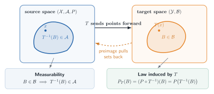

# Glossary {.unnumbered}

This glossary is a map, not a replacement for the formal definitions. Each entry links to the chapter where the idea is developed and, when useful, to the place where it reappears in Chapter 25.

::: {.callout-warning title="The source deliberately reuses notation"}

These notes follow van der Vaart's notation section by section. A symbol can therefore acquire a different local meaning later in the book. In particular, $P_n$ may denote a sequence of probability laws while $\mathbb P_n$ denotes the empirical measure; $F$ may denote a distribution function even though a Portmanteau proof may use $F$ for a closed set; and letters such as $A$, $B$, $\Phi$, $\Psi$, and $\psi$ are reused for locally defined maps or parameters. Use the definition nearest the display. The notes flag the most consequential collisions rather than replacing the source notation.

:::

## Global notation

| Notation | Meaning in these notes |
|---|---|
| $P,Q$ | Probability laws. For a measurable $f$, $Pf=\int f\,dP$ and $Pfg=\int fg\,dP$. |
| $P_n,Q_n$ | Usually sequences of probability laws or experiments. These are not automatically empirical measures. |
| $\mathbb P_n$ | The empirical measure: $\mathbb P_nf=n^{-1}\sum_{i=1}^n f(X_i)$. |
| $\mathbb G_n$ | The empirical process: $\mathbb G_nf=\sqrt n(\mathbb P_n-P)f$. |
| $P_0$ | The true law when a model is indexed around a distinguished truth. |
| $P_{t,g}$ | In Chapter 25, a path through $P$ with score $g$, evaluated at path time $t$. Thus $P_{1/\sqrt n,g}$ and $P_{h/\sqrt n,g}$ are local laws along that path. In Chapter 7, by contrast, $h$ is usually a parameter vector. |
| $\langle f,g\rangle_P$ and $|f|_P$ | The $L_2(P)$ inner product $Pfg$ and norm $(Pf^2)^{1/2}$. Other texts often write $\|f\|_{P,2}$ for $|f|_P$. |
| $L_2^0(P)$ | The mean-zero subspace $\{g\in L_2(P):Pg=0\}$. Scores live here. |
| $d(x,y)$ | A metric or semimetric, determined by context. |
| $x\wedge y$ | $\min(x,y)$. |
| $X_n\rightsquigarrow X$ | Weak convergence, convergence in distribution, or convergence in law. |
| $\dot{\ }$ | A derivative or score. Its meaning is local: for example, $\dot\ell$ is a score and $\dot\psi_P$ is a derivative map. |
| $\widetilde{\ }$ | An efficient object in Chapter 25: $\widetilde\psi_P$, $\widetilde\ell_{\theta,\eta}$, and $\widetilde I_{\theta,\eta}$. |
| $\dagger$ | A generic, not necessarily efficient, influence function in parts of Chapter 25. |

In Portmanteau arguments, $G$ conventionally denotes an open set and $F$ or $C$ may denote a closed set. That convention is local: elsewhere $F$ and $G$ often denote distribution functions.

### Measurability and induced laws {#glossary-measurability}

A map $T:(\mathcal X,\mathcal A)\to(\mathcal Y,\mathcal B)$ is measurable when $T^{-1}(B)\in\mathcal A$ for every $B\in\mathcal B$. A real-valued $f$ is Borel measurable when the target sigma-field is $\mathcal B(\mathbb R)$; equivalently, it is enough to check sets such as $\{x:f(x)>t\}$. The same preimage operation defines the law induced by $T$; @glossaryfig-measurability keeps the two directions visually separate.

::: {#glossaryfig-measurability}

{fig-alt="Two measurable spaces are connected by a function T. A target set B has a highlighted preimage in the source space. One box states the measurability condition and another states that the induced law assigns B the probability of its preimage."}

Measurability pulls target sets back to the source sigma-field; the pushforward law then assigns a target set the probability of that preimage. Original diagram based on the treatment of measurable functions and image measures in @pollard2002, §§2.2 and 2.9.

:::

See [random elements in §18.1](chapter-18.qmd#sec-random-elements) for the infinite-dimensional version.

## Convergence and local experiments

### Modes of stochastic convergence {#glossary-convergence-modes}

Almost-sure convergence implies convergence in probability, which implies convergence in distribution. $L_1$ convergence also implies convergence in probability. The reverse implications require additional hypotheses or couplings. See [§2.1](chapter-2.qmd#sec-convergence).

### Stochastic order: $O_P$ and $o_P$ {#glossary-stochastic-order}

$X_n=O_P(a_n)$ means that $X_n/a_n$ is bounded in probability; $X_n=o_P(a_n)$ means that $X_n/a_n\overset P\to0$. These symbols control the remainders in likelihood expansions, estimator linearizations, and nuisance-product errors. See [stochastic order in Chapter 2](chapter-2.qmd#sec-stochastic-order).

### Tightness {#glossary-tightness}

A sequence of laws is tight if, for every $\epsilon>0$, one compact set contains at least $1-\epsilon$ of every law in the sequence. In function spaces, tightness is what upgrades finite-dimensional convergence to convergence of the whole random function. See [§18.2](chapter-18.qmd#sec-tightness) and [weak convergence of stochastic processes](chapter-18.qmd#theorem-weak-convergence-processes).

### Outer expectation and outer probability {#glossary-outer-expectation}

For a possibly nonmeasurable real map $Z$, outer expectation is

$$
E^*Z=\inf\{EY:Y\text{ is measurable and }Y\geq Z\},
$$

with the usual integrability qualification; outer probability is $P^*(A)=E^*\mathbf1_A$. These envelopes let empirical-process statements remain meaningful when a supremum over an uncountable class is not known to be measurable. See [the formal definitions in §18.2](chapter-18.qmd#sec-outer-expectation) and their rate-theorem use in [Theorem 25.81](chapter-25.qmd#theorem-25-81).

### Uniform integrability {#glossary-uniform-integrability}

A family $(X_n)$ is uniformly integrable when

$$
\lim_{M\to\infty}\sup_n
E\{|X_n|\mathbf 1\{|X_n|>M\}\}=0.
$$

It is the tail condition that can upgrade convergence in distribution to convergence of first moments. See the [optional Chapter 2 bridge](chapter-2.qmd#sec-uniform-integrability).

### Contiguity {#glossary-contiguity}

$Q_n\mathrel{\triangleleft}P_n$ means that every sequence of events with $P_n$-probability tending to zero also has $Q_n$-probability tending to zero. It is the sequence-level analogue of absolute continuity and lets $o_{P_n}(1)$ conclusions survive under local alternatives. See [§6.2](chapter-6.qmd#sec-contiguity).

### Differentiability in quadratic mean (DQM) {#glossary-dqm}

DQM requires square-root densities to have an $L_2$ linear approximation. Its derivative determines a mean-zero score and yields the local quadratic likelihood expansion. See [DQM in Chapter 7](chapter-7.qmd#sec-differentiability-quadratic-mean) and its [pathwise form in §25.3](chapter-25.qmd#sec-dqm).

### Local asymptotic normality (LAN) {#glossary-lan}

In the source's general formulation, a sequence of experiments is LAN at $\theta$ when there are norming matrices $r_n$, information $I_\theta$, and central sequences $\Delta_{n,\theta}$ such that

$$
\log\frac{dP_{n,\theta+r_n^{-1}h_n}}{dP_{n,\theta}}
=h_n^T\Delta_{n,\theta}-\frac12h_n^TI_\theta h_n+o_{P_{n,\theta}}(1).
$$

For i.i.d. DQM models, $r_n=\sqrt nI$, where the un-subscripted $I$ in this expression is the identity matrix, not the information $I_\theta$. LAN makes a regular model locally resemble a Gaussian shift experiment. See [§7.6](chapter-7.qmd#sec-local-asymptotic-normality).

### Central sequence {#glossary-central-sequence}

$\Delta_{n,\theta}$ is the random linear term in the source's LAN expansion. In an i.i.d. DQM model it is a normalized sum of scores. Under a local alternative, contiguity and Le Cam's third lemma shift its limiting mean. See [Theorem 7.2](chapter-7.qmd#theorem-lan-iid) and [Le Cam's third lemma](chapter-6.qmd#lemma-le-cam-third).

### Limit experiment and Gaussian shift {#glossary-limit-experiment}

A limit experiment is the asymptotic statistical experiment obtained after localization. For regular finite-dimensional models it is typically a Gaussian observation whose mean is shifted by the local parameter. [Theorem 8.3](chapter-8.qmd#theorem-limit-experiment-reduction) transfers lower-bound questions to this simpler experiment; [Theorem 25.20](chapter-25.qmd#theorem-25-20) and [Theorem 25.21](chapter-25.qmd#theorem-25-21) repeat that reduction along semiparametric tangent directions.

### Regular estimator {#glossary-regular-estimator}

A root-$n$ estimator is regular when its centered limiting distribution is stable along every admissible $n^{-1/2}$ local alternative. This rules out pointwise gains such as Hodges' estimator that break nearby. See [the Chapter 8 convolution framework](chapter-8.qmd#sec-convolution-theorem) and [regular estimators in §25.3](chapter-25.qmd#sec-regular-estimator).

## Empirical-process machinery

### Empirical measure {#glossary-empirical-measure}

$\mathbb P_n=n^{-1}\sum_{i=1}^n\delta_{X_i}$ is the empirical distribution, and $\mathbb P_nf$ is the sample average of $f(X)$. See [§19.2](chapter-19.qmd#empirical-measure-notation).

### Empirical process {#glossary-empirical-process}

$\mathbb G_n=\sqrt n(\mathbb P_n-P)$ is the centered, scaled empirical measure. Indexing $\mathbb G_nf$ by $f\in\mathcal F$ turns one central limit theorem into a random-function problem. See [empirical-process notation](chapter-19.qmd#empirical-process-notation).

### Glivenko–Cantelli class {#glossary-glivenko-cantelli}

$\mathcal F$ is $P$-Glivenko–Cantelli when $\sup_{f\in\mathcal F}|\mathbb P_nf-Pf|\to0$ in the stated mode. It is a uniform law of large numbers. See [Glivenko–Cantelli classes](chapter-19.qmd#glivenko-cantelli-classes).

### Donsker class {#glossary-donsker}

$\mathcal F$ is $P$-Donsker when $\mathbb G_n$, viewed in $\ell^\infty(\mathcal F)$, converges weakly to a tight Gaussian process. Donsker control supports plug-in empirical-process arguments in §§25.8 and 25.12. See [Donsker classes](chapter-19.qmd#donsker-classes).

### Asymptotic equicontinuity {#glossary-asymptotic-equicontinuity}

Asymptotic equicontinuity says that the oscillation of a stochastic process over increasingly close index points becomes negligible. Together with finite-dimensional convergence, it supplies process convergence; in Chapter 25 it controls scores evaluated at estimated nuisance parameters. See [Theorem 18.14](chapter-18.qmd#theorem-weak-convergence-processes) and [Lemma 19.24](chapter-19.qmd#lemma-19.24).

### M-estimator and near maximizer {#glossary-m-estimator}

An M-estimator maximizes, or nearly maximizes, a sample criterion $M_n(\theta)$. A near maximizer satisfies $M_n(\widehat\theta_n)\geq\sup_\theta M_n(\theta)-o_P(1)$, with a sharper remainder when the rate theorem requires one. Uniform convergence and a well-separated population maximizer yield consistency; a local quadratic expansion yields the limiting distribution. See [M- and Z-estimators in Chapter 5](chapter-5.qmd#sec-m-z-estimators).

### Z-estimator and approximate root {#glossary-z-estimator}

A Z-estimator solves, or approximately solves, an empirical equation $\Psi_n(\widehat\theta)=0$. An approximate root only requires the residual $\|\Psi_n(\widehat\theta_n)\|$ to be negligible at the scale of the expansion. Differentiating the population map and controlling the empirical-process remainder yields an asymptotic-linear representation. See [Theorem 5.21](chapter-5.qmd#theorem-5-21), [Theorem 19.26](chapter-19.qmd#theorem-19.26-infinite-dimensional-z-estimation), and the [Banach-valued likelihood-equation use in §25.12](chapter-25.qmd#theorem-25-90).

### Sensitivity and sandwich covariance {#glossary-sandwich}

For an estimating function $\psi_\theta$, the sensitivity matrix is the derivative of the population equation, commonly $V_{\theta_0}=\partial_\theta P\psi_\theta|_{\theta_0}$ in Chapter 5. If the empirical fluctuation has covariance $P\psi_{\theta_0}\psi_{\theta_0}^T$, then the estimator's asymptotic covariance is the sandwich

$$
V_{\theta_0}^{-1}
\{P\psi_{\theta_0}\psi_{\theta_0}^T\}
(V_{\theta_0}^{-1})^T.
$$

See [the Z-estimator expansion in Chapter 5](chapter-5.qmd#theorem-5-21). Section 25.9 uses the local symbol $J_{\theta,\tau}$ for the analogous derivative normalization to avoid collision with Chapter 25's score-operator notation.

### $L_2$ projection {#glossary-l2-projection}

The orthogonal projection of $X\in L_2(P)$ onto a closed linear subspace $S$ is the unique element $\Pi_SX\in S$ such that $X-\Pi_SX$ is orthogonal to every element of $S$. The Pythagorean identity makes it the minimum-mean-square approximation. See [Theorem 11.1](chapter-11.qmd#theorem-11-1) and its score-space use in [§25.4](chapter-25.qmd#efficient-score-functions).

### Conditional expectation as projection {#glossary-conditional-expectation}

$E(X\mid Y)$ is the orthogonal projection of $X\in L_2(P)$ onto the closed subspace of square-integrable functions of $Y$. Consequently, $X-E(X\mid Y)$ is orthogonal to every such function. This identity drives residualization, information-loss score operators, and many missing-data calculations. See [§11.2](chapter-11.qmd#sec-conditional-expectation).

### Hájek projection {#glossary-hajek-projection}

The Hájek projection replaces a statistic based on independent observations by its orthogonal projection onto sums of one-observation functions. When the remainder is negligible, the projected summands give its asymptotic influence representation. See [Lemma 11.10](chapter-11.qmd#lemma-11-10) and the Wilcoxon return in [Example 25.46](chapter-25.qmd#example-25-46).

## Semiparametric geometry

### Semiparametric model {#glossary-semiparametric-model}

A semiparametric model contains a finite-dimensional target together with an infinite-dimensional nuisance component, or more generally asks for a low-dimensional functional of a large model. See [§25.1](chapter-25.qmd#semiparametric-models).

### Regular parametric submodel {#glossary-regular-submodel}

A regular parametric submodel is a smooth finite-dimensional path through the true law. Restricting the full model to such a path creates an ordinary parametric problem and hence a lower bound. Chapter 25 compares these bounds across all admissible paths. See [§25.3](chapter-25.qmd#tangent-spaces-and-information).

### Tangent set and tangent space {#glossary-tangent-space}

The tangent set $\dot{\mathcal P}_P$ collects scores of selected DQM paths through $P$. Its closed linear span is the space on which semiparametric projection geometry operates. The source sometimes calls the set itself a tangent space when it is already linear. See [the tangent-set construction](chapter-25.qmd#sec-tangent-space).

### Nuisance tangent space {#glossary-nuisance-tangent-space}

The nuisance tangent space contains scores of paths that vary the nuisance parameter while leaving the target fixed to first order. Projecting an ordinary target score onto this space identifies the information absorbed by nuisance variation. See [§25.4](chapter-25.qmd#efficient-score-functions).

### Pathwise derivative {#glossary-pathwise-derivative}

$\dot\psi_P$ is one continuous linear map that gives the derivative of $\psi(P_t)$ along every admissible score direction. Existence of separate directional derivatives is not enough unless they fit this common linear map. See [pathwise differentiability](chapter-25.qmd#sec-pathwise-differentiability).

### Influence function {#glossary-influence-function}

An influence function $\psi_P^\dagger\in L_2(P)$ represents the pathwise derivative through $\dot\psi_Pg=P\psi_P^\dagger g$ for every score $g$ under consideration. It need not be unique outside the tangent space. @kennedy2022 calls this target-derivative representative an *influence curve*. Keep it conceptually separate from both an estimator's asymptotic influence function—its first-order summand—and the Hampel contamination sensitivity used in robust statistics. [Lemma 25.23](chapter-25.qmd#lemma-25-23) characterizes regular efficient estimators by the appearance of the efficient target influence function as their asymptotic summand; bounded contamination sensitivity is a separate robustness property [@fisherKennedy2021, §5.3]. See [influence functions and their construction](chapter-25.qmd#sec-if-construction).

### Efficient influence function {#glossary-efficient-influence-function}

$\widetilde\psi_P$ is the projection of any influence function onto the closed linear span of the tangent set. It is the unique representative with minimum $L_2(P)$ norm and gives the semiparametric covariance lower bound. See [the efficient influence function](chapter-25.qmd#efficient-influence-function).

### Efficient score {#glossary-efficient-score}

$\widetilde\ell_{\theta,\eta}$ is the ordinary score for the target parameter after subtracting its orthogonal projection onto the nuisance tangent space. See [efficient score functions](chapter-25.qmd#efficient-score-functions).

### Efficient information {#glossary-efficient-information}

$\widetilde I_{\theta,\eta}=P_{\theta,\eta}\widetilde\ell_{\theta,\eta}\widetilde\ell_{\theta,\eta}^T$ is the information remaining after nuisance projection. When nonsingular, $\widetilde I_{\theta,\eta}^{-1}\widetilde\ell_{\theta,\eta}$ is the efficient influence function for the finite-dimensional target. See [§25.4](chapter-25.qmd#efficient-score-functions).

### Score operator and adjoint {#glossary-score-operator}

For Hilbert spaces $\mathbb H_1$ and $\mathbb H_2$, the adjoint of a continuous linear operator $A:\mathbb H_1\to\mathbb H_2$ is the operator $A^*:\mathbb H_2\to\mathbb H_1$ characterized by

$$
\langle Ah_1,h_2\rangle_{\mathbb H_2}
=\langle h_1,A^*h_2\rangle_{\mathbb H_1}.
$$

Thus the adjoint reverses the direction of the map; in Euclidean spaces it is the matrix transpose. In §25.5, $A_\eta$ maps a parameter-space direction $b$ to its observable score $A_\eta b$, and the equation $A_\eta^*\widetilde\psi_{P_\eta}=\widetilde\chi_\eta$ identifies observed-data influence functions. See [score and information operators](chapter-25.qmd#score-and-information-operators).

### Information operator {#glossary-information-operator}

$A_\eta^*A_\eta$ is the infinite-dimensional analogue of a Fisher information matrix. Failure of stable invertibility signals local nonidentification or ill-posedness. See [the information-operator discussion](chapter-25.qmd#information-operator).

## Estimator construction and modern connections

### Asymptotic linearity {#glossary-asymptotic-linearity}

An estimator is asymptotically linear when its root-$n$ error equals an average of a mean-zero influence function plus $o_P(1)$. This representation turns estimation into a central-limit problem and makes asymptotic variance explicit. See [§25.9](chapter-25.qmd#sec-general-estimating-equations).

### Hadamard and Fréchet differentiation {#glossary-functional-derivatives}

Hadamard differentiability is the uniform directional differentiability used by the functional delta method. Fréchet differentiability is a norm-uniform linear approximation and is stronger. See [§20.2 and Theorem 20.8](chapter-20.qmd#sec-hadamard-differentiability), the [Banach-space delta-method guide in §25.7](chapter-25.qmd#sec-efficiency-delta-banach), and [the likelihood-equation linearization in §25.12](chapter-25.qmd#theorem-25-90).

### Von Mises expansion {#glossary-von-mises}

A von Mises expansion is a Taylor expansion of a functional of a probability law. Choose the derivative representative at each law to be centered under that law. In the reverse convention used by @kennedy2022 and in Chapter 25's one-step discussion,

$$
\psi(Q)-\psi(P)=(Q-P)\psi_Q^\dagger+R_2(Q,P),
$$

the centered influence function evaluated at $Q$ supplies the linear term and $R_2$ records the nonlinear remainder. A forward expansion instead evaluates the derivative at $P$ and defines its remainder accordingly. This is the bridge from pathwise derivatives to plug-in bias correction and nuisance-rate conditions. See [the Chapter 25 expansion](chapter-25.qmd#sec-von-mises-expansion).

### Gâteaux derivative and point-mass contamination {#glossary-gateaux-contamination}

A Gâteaux derivative differentiates $\psi(P_t)$ along a chosen direction. The contamination path $P_t=(1-t)P+t\delta_z$ is a useful shortcut for generating an influence-function candidate, especially in discrete or unrestricted nonparametric calculations. It may, however, fail to be dominated, DQM, or admissible in the stated model. The candidate must therefore be centered and verified against every allowed score through $\dot\psi_Pg=P\psi_P^\dagger g$. See [von Mises calculus in §20.1](chapter-20.qmd#sec-von-mises-calculus) and [the influence-function construction recipe](chapter-25.qmd#sec-if-construction).

### One-step estimator {#glossary-one-step}

A one-step estimator adds an estimated, centered influence-function correction to a plug-in estimate,

$$
\widehat\psi_{\mathrm{1step}}
=\psi(\widehat P)+\mathbb P_n\psi_{\widehat P}^\dagger.
$$

Here the representative is chosen so that $\widehat P\psi_{\widehat P}^\dagger=0$. The plug-in or machine-learning fit supplies $\widehat P$; semiparametric theory supplies the correction, the efficiency benchmark, and the remainder conditions under which the result is asymptotically linear. With sample splitting or cross-fitting, the nuisance fit used in a summand is learned away from that observation, providing conditional independence; $L_2$ convergence, integrability, and target-specific remainder control are still required. See the [finite-dimensional Newton prototype in Theorem 5.45](chapter-5.qmd#theorem-5-45) and [the influence-function route in §25.8](chapter-25.qmd#sec-25-8-one-step).

### Neyman orthogonality {#glossary-neyman-orthogonality}

A moment is Neyman-orthogonal when its population derivative with respect to the nuisance parameter vanishes at the truth. In regular likelihood constructions, coherently extending a projected score often yields such a moment. Under appropriate differentiability and remainder conditions, this removes first-order nuisance error and can leave a second-order or product remainder; orthogonality alone does not determine that remainder. See [the no-bias condition in §25.8](chapter-25.qmd#sec-25-8-no-bias) and [the partially linear example](chapter-25.qmd#sec-25-11-partially-linear-regression).

### No-bias condition {#glossary-no-bias}

When an efficient score or influence function is estimated, its population mean under the true data-generating law must be negligible on the root-$n$ scale. This requirement is separate from $L_2$ consistency: a small mean drift can survive in the estimator's limiting distribution. Neyman orthogonality often makes the drift second order, but the target-specific remainder still has to be verified. See [the two score-estimation requirements in §25.8](chapter-25.qmd#sec-25-8-two-requirements).

### Sample splitting and cross-fitting {#glossary-cross-fitting}

Sample splitting estimates nuisance functions on one sample and evaluates the target moment on another. Cross-fitting rotates the held-out fold so that every observation contributes to target estimation. It provides conditional independence that can replace same-sample stochastic-equicontinuity arguments, but negligibility still requires $L_2$ convergence, integrability, and the relevant remainder conditions. See [the one-step route in §25.8](chapter-25.qmd#sec-25-8-one-step).

### Double robustness {#glossary-double-robustness}

An estimating equation is doubly robust when its population mean remains zero if either of two nuisance components is correctly specified. This is distinct from Neyman orthogonality: double robustness concerns consistency under two model branches, while orthogonality concerns local insensitivity and rates near the intersection. See [Example 25.67](chapter-25.qmd#example-25-67).

### Profile likelihood {#glossary-profile-likelihood}

For each fixed target value, profile likelihood maximizes over the nuisance parameter and then optimizes the resulting target-only criterion. See [§25.10](chapter-25.qmd#sec-25-10-profile-likelihood).

### Least-favorable submodel {#glossary-least-favorable-submodel}

A least-favorable submodel has a target score equal to the efficient score and therefore reproduces the semiparametric information bound inside a parametric path. An approximately least-favorable path matches this behavior to the order needed for estimation. See [§25.11](chapter-25.qmd#sec-approximately-least-favorable-submodels).

[Return to the route through the book](index.qmd#route-to-chapter-25) or continue to the [worked problems](problems.qmd).
