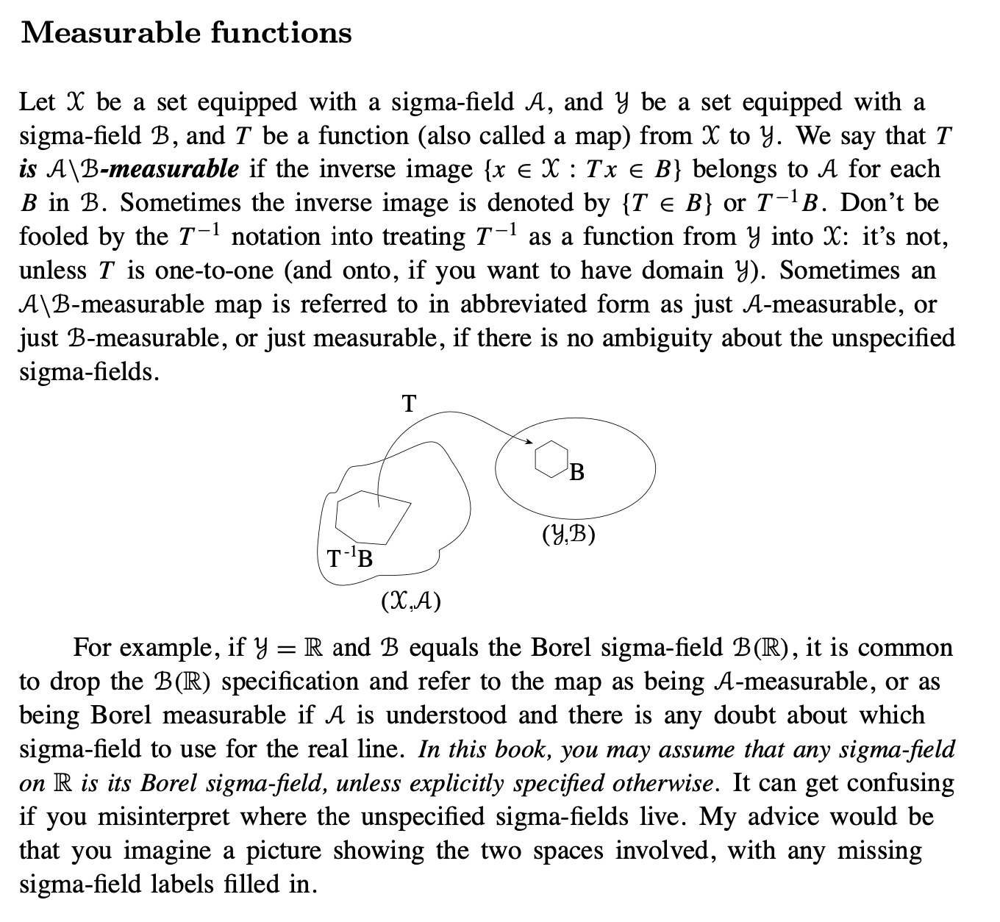
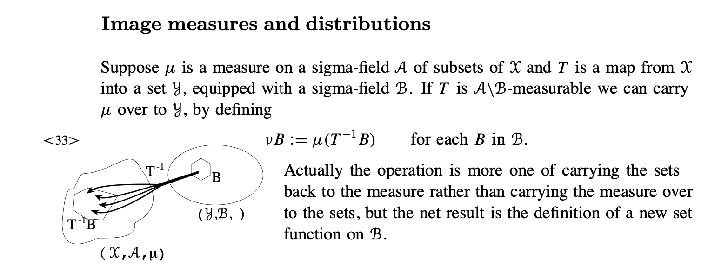

# Glossary {.unnumbered}

## Notation

- distance function: $d(x,y)$
- wedge: $x \wedge y$ : the minimum of $x$ and $y$
- $G$ generally OPEN sets, $F$ generally CLOSED sets
- Assume measurable maps on defined probability spaces.
    - For example, a real-valued function $f : (\mathcal X, \mathcal A )\to \mathbb{R}$ is **Borel measurable** if
    $\{x \in \mathcal X : f(x) > t\} \in \mathcal{A}$ for each real $t$.
    - More generally, $f^{-1}(B)\in \mathcal A$ for every Borel set $B\subseteq \mathbb R$.
    - From User’s Guide to Measure Theoretic Probability (UGMTP):

    

- For a measurable function $f$, write $Pf=\int f\,dP$.
- The inner product and norm on $L_2(P)$ are $\langle f,g\rangle_P=Pfg$ and $|f|_P=(Pf^2)^{1/2}$.
- The mean-zero subspace of $L_2(P)$ is $L_2^0(P)=\{g\in L_2(P):Pg=0\}$.
- The tangent set at $P$ is denoted by $\dot{\mathcal P}_P$.
- The derivative of $\psi$ at $P$ is denoted by $\dot\psi_P$.
- The efficient influence function is denoted by $\widetilde\psi_P$.
- In a model indexed by $\theta$ and $\eta$:
    - $\dot\ell_{\theta,\eta}$ is the ordinary score for $\theta$ when $\eta$ is fixed.
    - $\widetilde\ell_{\theta,\eta}$ is the efficient score for $\theta$.
    - $\widetilde I_{\theta,\eta}$ is the efficient information matrix.

[Problems](problems.qmd)
